# B² Network — DEX 协议调研

> **链**：B² Network（OP 架构 Bitcoin L2）｜ chainId **223** ｜ 浏览器 https://explorer.bsquared.network ｜ RPC `https://rpc.bsquared.network`
> **调研日期**：2026-09-29 ｜ hash 均为链上公开交易（非本人钱包），已逐条确认成功

## 协议总览

| # | 协议 | 类型 | 入选理由 | 前端 | hash |
|---|---|---|---|:-:|:-:|
| 1 | GlowSwap | PancakeSwap V3 式 CLMM | OKX 支持，交易量 ~100% | ✅ | ✅ |
| 2 | MagicSwap | Uniswap V2 式 | OKX 支持 | 🔴 域名失效 | ✅ |
| 3 | DYORSwap | Uniswap V2 式 | OKX 支持 | 🔴 前端已不支持 B² | ✅ |

3 个协议合计覆盖 100% 交易量，实际量几乎全在 GlowSwap。

---

## 1. GlowSwap（V3 / CLMM）

| 项 | 值 |
|---|---|
| 前端 | https://glowswap.io/swap ｜ 流动性 https://glowswap.io/pools |
| Factory | `0x02eAFbE9dE030f69aF02B7D3F2f69B28016f3C83` |
| SwapRouter | `0x96C565B2285842921beD78c8f3a1403a9E277070` |
| NonfungiblePositionManager | `0x00e1C41497B8F2df3Ec32143Cd675F0af8Cf00F9` |
| 示例池 | `0x7655b5ec615131d3fb56f9470a79f3499ea4a8f2`（WBTC/USDT）｜ `0x3838bc0de097bc8553d8270eeb3fff0f5e35e9cc`（WBTC/USDT 另一费率档）｜ `0xc1ae36ba0c671f4ebb4cc94f6aa0d5d127deda70`（加流动性样本池） |
| LP 凭证 | NFT `Glow V3 Positions NFT-V1`（`PCS-V3-POS`） |

| 行为 | tx hash | 截图 |
|---|---|---|
| 买（USDT→WBTC） | [0x3dc8c8eea8947bc35897b8a0667331ba94cf94e9ed2a2f62feed90fa1097e3ee](https://explorer.bsquared.network/tx/0x3dc8c8eea8947bc35897b8a0667331ba94cf94e9ed2a2f62feed90fa1097e3ee) | |
| 买（USDT→WBTC） | [0x2731be97a14122d7e5ff18ab27808168194aeb78e1d2722dbf3b1f737a1d021a](https://explorer.bsquared.network/tx/0x2731be97a14122d7e5ff18ab27808168194aeb78e1d2722dbf3b1f737a1d021a) | |
| 卖（WBTC→USDT） | [0x183c326e955ee017e4b19d8996e9ae6755762f1325639e34d4bb5ab171225381](https://explorer.bsquared.network/tx/0x183c326e955ee017e4b19d8996e9ae6755762f1325639e34d4bb5ab171225381) | 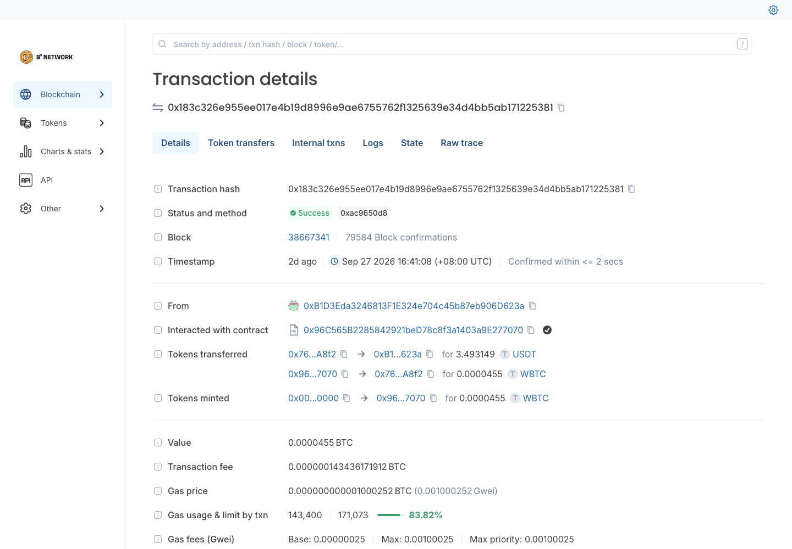 |
| 卖（WBTC→USDT） | [0xb42cd98e8a17b86bddf03043c47e0cd0e075685c53446a34599f079a7c408fd7](https://explorer.bsquared.network/tx/0xb42cd98e8a17b86bddf03043c47e0cd0e075685c53446a34599f079a7c408fd7) | |
| 加流动性 | [0xc4f6e6282a5c17ecacd6d543dc9932ed002cbe638f15cfa0bbef3566a3247170](https://explorer.bsquared.network/tx/0xc4f6e6282a5c17ecacd6d543dc9932ed002cbe638f15cfa0bbef3566a3247170) | 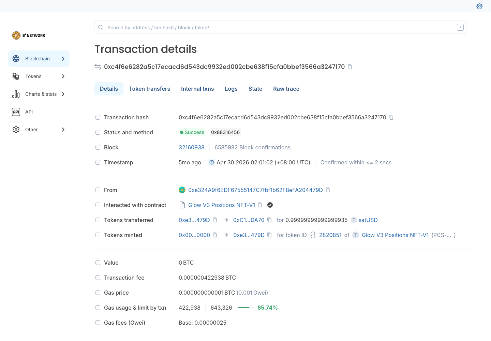 |
| 减流动性 | [0x8b13091fab3013faae163926a41f0fab79ed4e41578884a7b71072a329f0f32e](https://explorer.bsquared.network/tx/0x8b13091fab3013faae163926a41f0fab79ed4e41578884a7b71072a329f0f32e) | 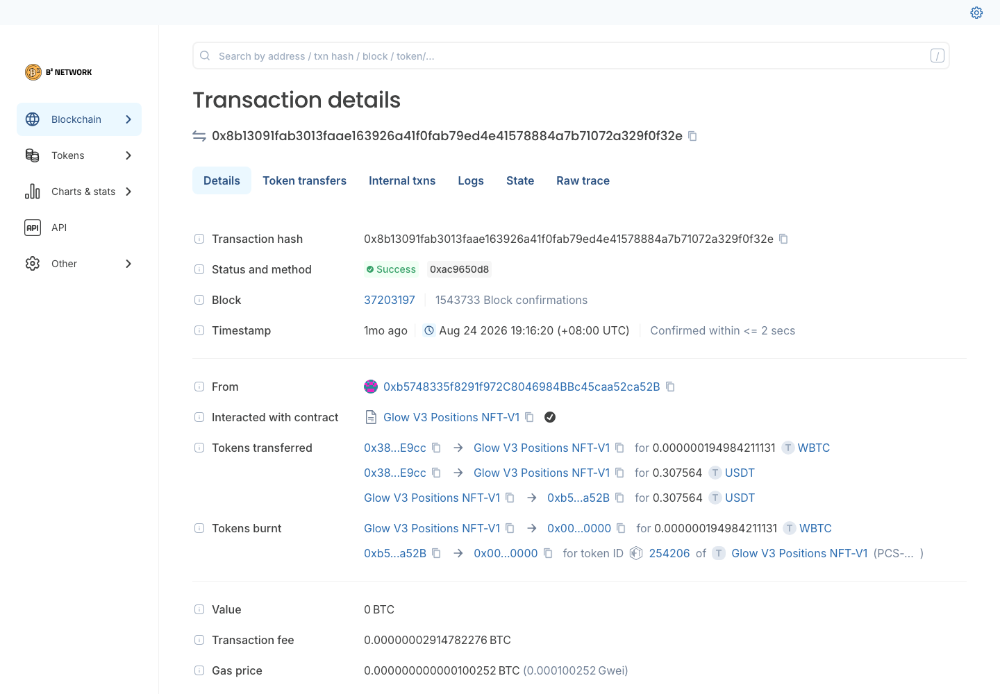 |

前端截图：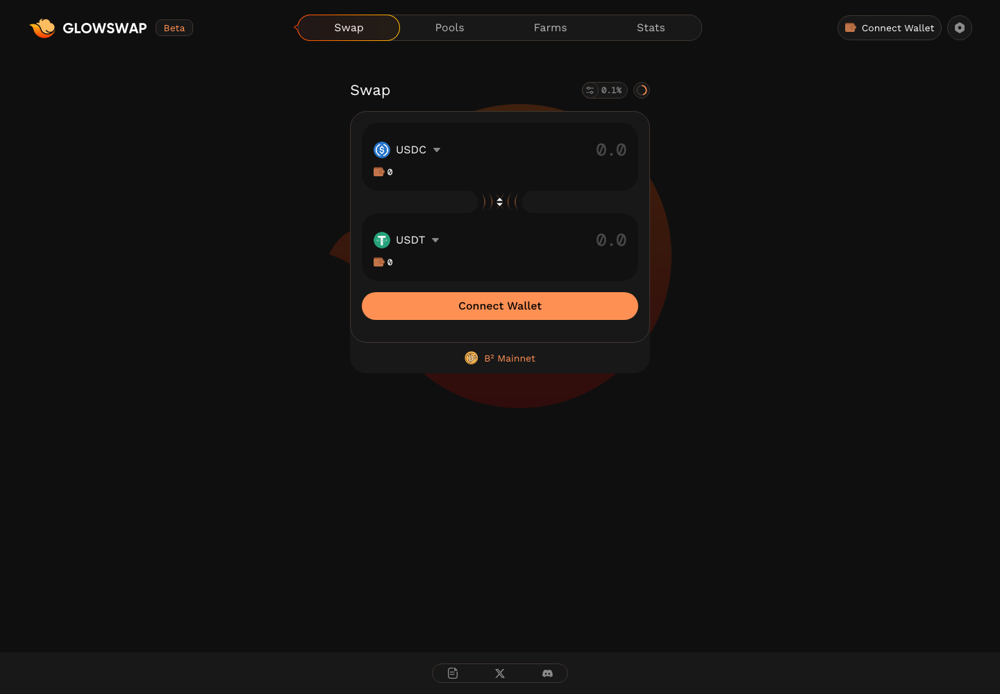 ｜ 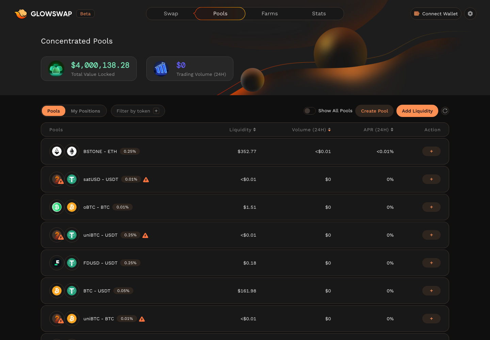

⚠️ 开发注意：PancakeSwap V3 分叉，Swap 事件带 protocolFees 字段，按 PCS V3 事件签名解析；池子里部分 swap 来自非官方合约 `0x00000000001220099542D41a8c31C80DaB68EbDB`（疑似机器人），**解析以池子事件为准**。

---

## 2. MagicSwap（V2）

| 项 | 值 |
|---|---|
| 前端 | 🔴 `swap.magicswap.cc` / `magicswap.cc` DNS 无法解析 |
| Factory | `0xdb8d3e993fa1d3085e99c3c20a4f844a6c6866df` |
| Router | `0xF80fFcf0C54a1A3e62010b1428913721260af2B6` |
| 示例池 | `0x3d5ACB96122bd133fe7d1bD6e674854F8d32Ba16`（B2Baby/WBTC，swap）｜ `0x1567A5153048509792c9aDBa30eaBC728928D89c`（B2BTC/WBTC，加/减流动性） |
| LP 凭证 | ERC-20 `Magicswap LP Token`（`MLP`） |

| 行为 | tx hash | 截图 |
|---|---|---|
| 买（WBTC→B2Baby） | [0xd2e781b47772b8464001f2dec115822176394de7a274c3fa88d8c636d78171f9](https://explorer.bsquared.network/tx/0xd2e781b47772b8464001f2dec115822176394de7a274c3fa88d8c636d78171f9) | |
| 买（WBTC→B2Baby） | [0xc73502c7fb8297ecfb60ad9cddc72536dc354d182e099c69adb61802fa4be468](https://explorer.bsquared.network/tx/0xc73502c7fb8297ecfb60ad9cddc72536dc354d182e099c69adb61802fa4be468) | |
| 卖（B2Baby→WBTC） | [0xf41e6c8f4a98b27ff6b542175b3e21bcd8e9476a6aa874010fe1f2cce51d7f6f](https://explorer.bsquared.network/tx/0xf41e6c8f4a98b27ff6b542175b3e21bcd8e9476a6aa874010fe1f2cce51d7f6f) | 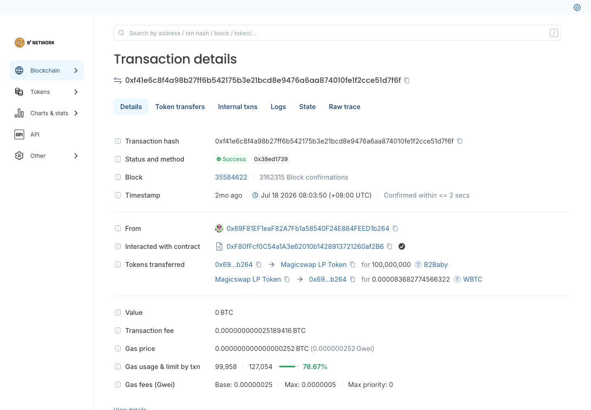 |
| 卖（B2Baby→WBTC） | [0x8ee073f04f376fb938860e114d04b8adc9f8bbe03def028751fb76b81c67c18d](https://explorer.bsquared.network/tx/0x8ee073f04f376fb938860e114d04b8adc9f8bbe03def028751fb76b81c67c18d) | |
| 加流动性 | [0xbd925cdece770614841baae1205a3763dfb9fc9face10be28d6bb7ac14d92341](https://explorer.bsquared.network/tx/0xbd925cdece770614841baae1205a3763dfb9fc9face10be28d6bb7ac14d92341) | 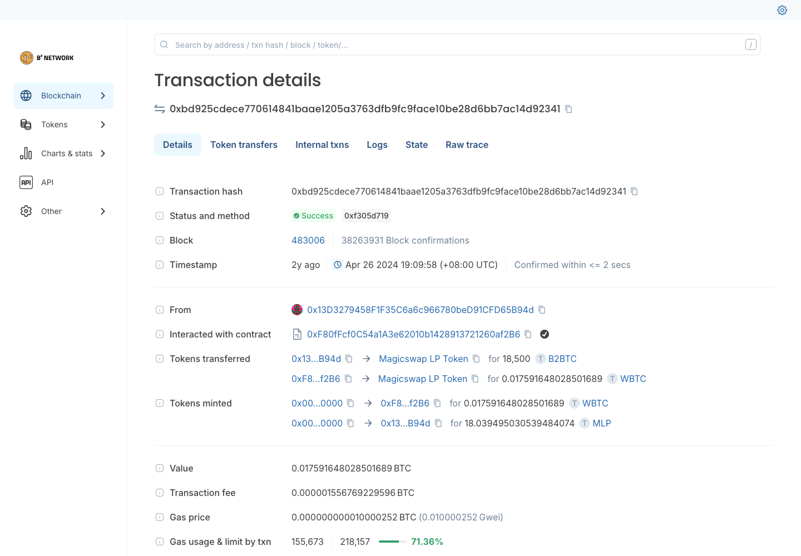 |
| 减流动性 | [0x0389cbbf589174162982908843d9852f8cd104337a897e00566bc9cbbbc7853a](https://explorer.bsquared.network/tx/0x0389cbbf589174162982908843d9852f8cd104337a897e00566bc9cbbbc7853a) | 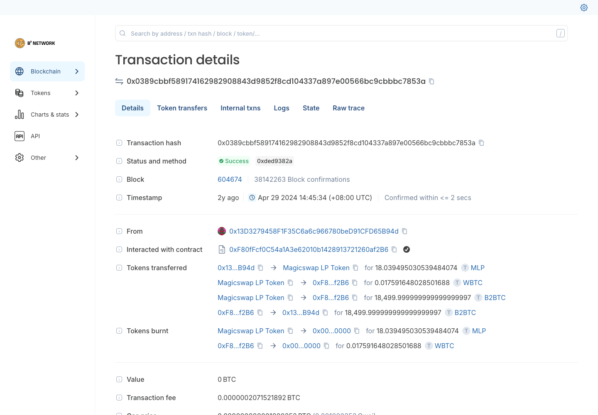 |

前端截图：无（域名 DNS 无法解析）

⚠️ 开发注意：两条买入经未识别合约 `0x0bf56B5d21036B2F9345F3e59AfE3c6359BCBb96`（方法 `0x7a3082c9`，疑似聚合器）而非 Router，**解析以池子事件为准**。

---

## 3. DYORSwap（V2）

| 项 | 值 |
|---|---|
| 前端 | 🔴 前端已不支持 B²（`?chainId=223` 被自动改写为 X Layer） |
| Factory | `0x2ccadb1e437aa9cdc741574bda154686b1f04c09` |
| Router | `0x5F6cC7a76c15eEb976c60abdc71A7D349e02D763` |
| 示例池 | `0xAa282723ca21776F427A5f2c8A4FdcE0027E4c7F`（Bitleaf/WBTC，swap + 减流动性）｜ `0xD35366F95D309a2ED7C66CF63E4A262E67d560a8`（加流动性） |
| LP 凭证 | ERC-20 `DYOR LPs`（`DYOR-LP`） |

| 行为 | tx hash | 截图 |
|---|---|---|
| 买（BTC→Bitleaf） | [0x43757adb7135a52bb14de7265f5351c016759e2654c7e4073f622e288ea7206f](https://explorer.bsquared.network/tx/0x43757adb7135a52bb14de7265f5351c016759e2654c7e4073f622e288ea7206f) | 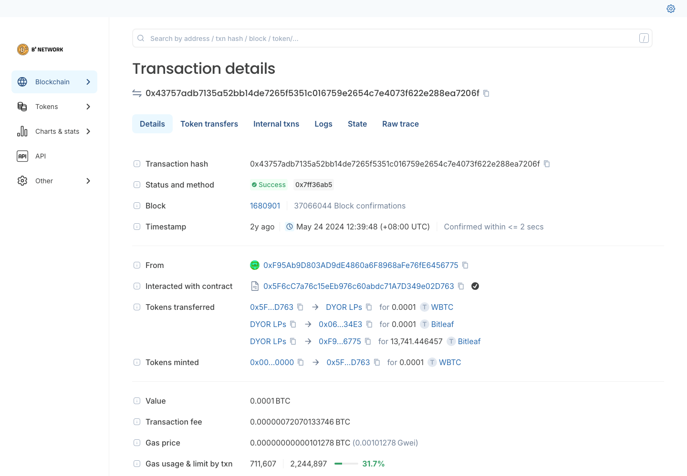 |
| 买（BTC→Bitleaf） | [0xc0c6e8e22b901c2676caf55acc39d67a73c5ac84bcfa376901aac09825d4c612](https://explorer.bsquared.network/tx/0xc0c6e8e22b901c2676caf55acc39d67a73c5ac84bcfa376901aac09825d4c612) | |
| 卖（Bitleaf→BTC） | [0x8d5dd46e17a2765f84177c41c48925da8c63ba3c28e426715626ad77674aeeed](https://explorer.bsquared.network/tx/0x8d5dd46e17a2765f84177c41c48925da8c63ba3c28e426715626ad77674aeeed) | |
| 卖（Bitleaf→BTC） | [0x98755f8b4dfd852ade72ab672c0fec694323ab3d7e21c749fab5a8b5606f7ad1](https://explorer.bsquared.network/tx/0x98755f8b4dfd852ade72ab672c0fec694323ab3d7e21c749fab5a8b5606f7ad1) | |
| 加流动性 | [0x46cd4fbf6bcefccd0195e961617f1d13ab3cd4796ab8979d27320aff6ff45f78](https://explorer.bsquared.network/tx/0x46cd4fbf6bcefccd0195e961617f1d13ab3cd4796ab8979d27320aff6ff45f78) | 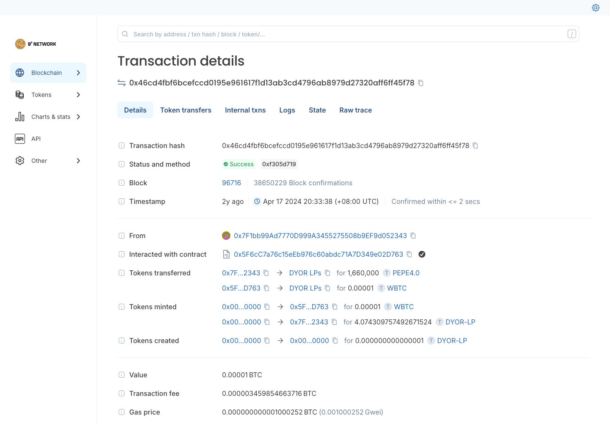 |
| 减流动性 | [0xdd8cc59647fc90320da4d1f3657f7de0686d9f4f5ce4c4daf47920a1a60847ef](https://explorer.bsquared.network/tx/0xdd8cc59647fc90320da4d1f3657f7de0686d9f4f5ce4c4daf47920a1a60847ef) | 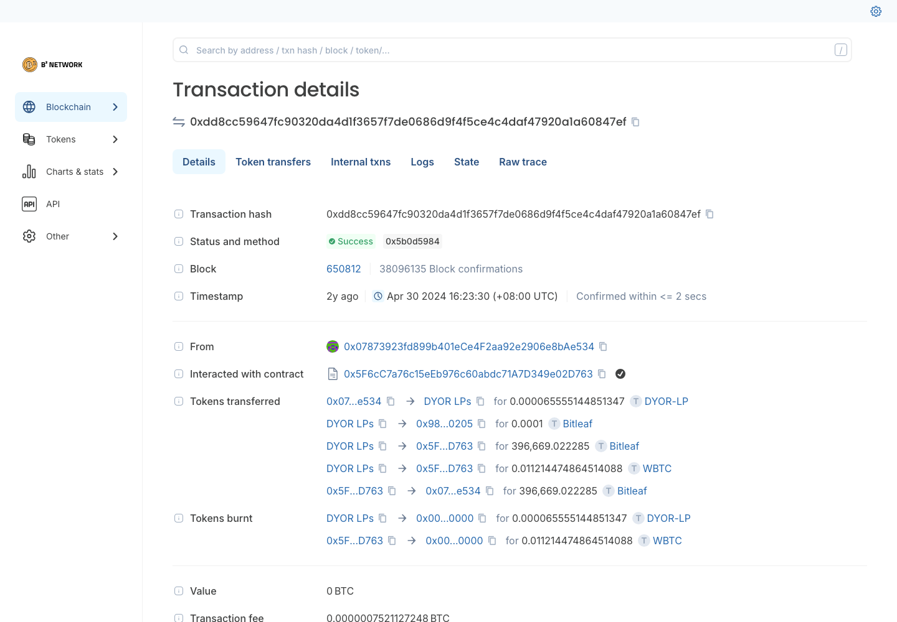 |

前端截图：无（前端已移除 B²；存证： ｜ ）

⚠️ 开发注意：Bitleaf 是带税代币，卖出（`swapExactTokensForETHSupportingFeeOnTransferTokens`）时池子会自动产生 Mint，**这类 Mint 不是用户加流动性**；B² 部署 2024-06 后基本无交易。

---

## 待确认

- MagicSwap（域名失效、链上 2 个多月无交易）是否还接
- DYORSwap（前端已不支持 B²、2024-06 后无交易）是否还接
