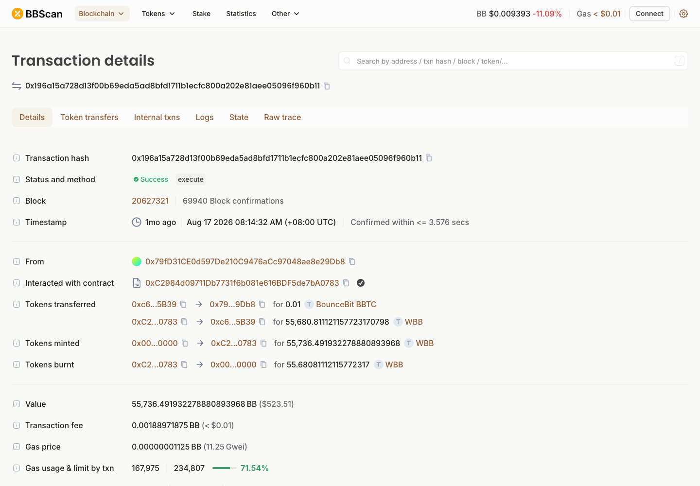
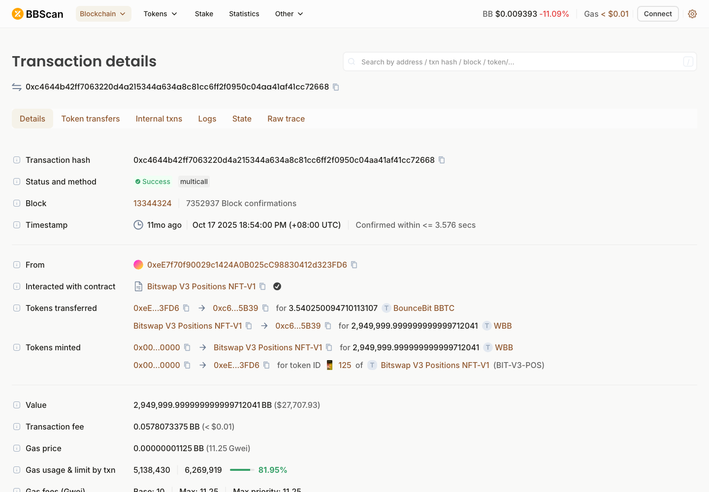
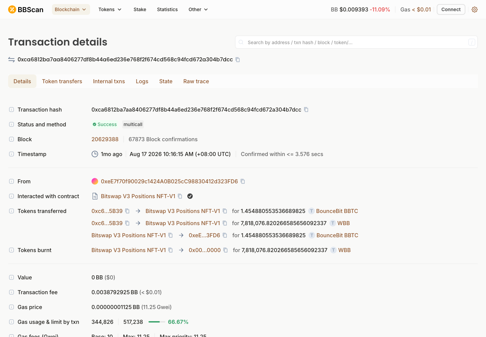
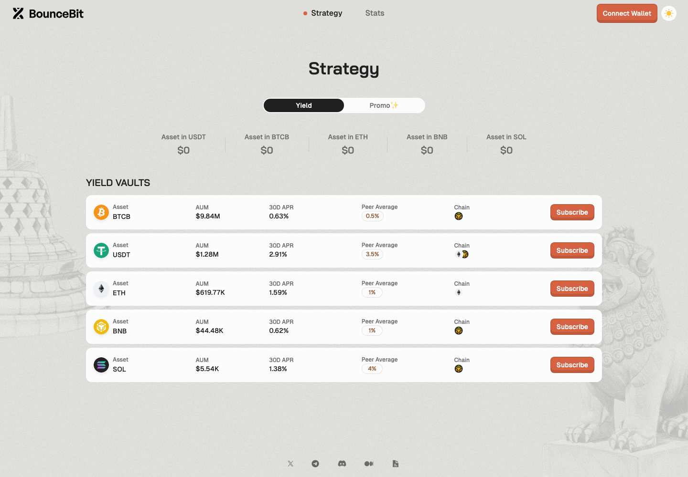
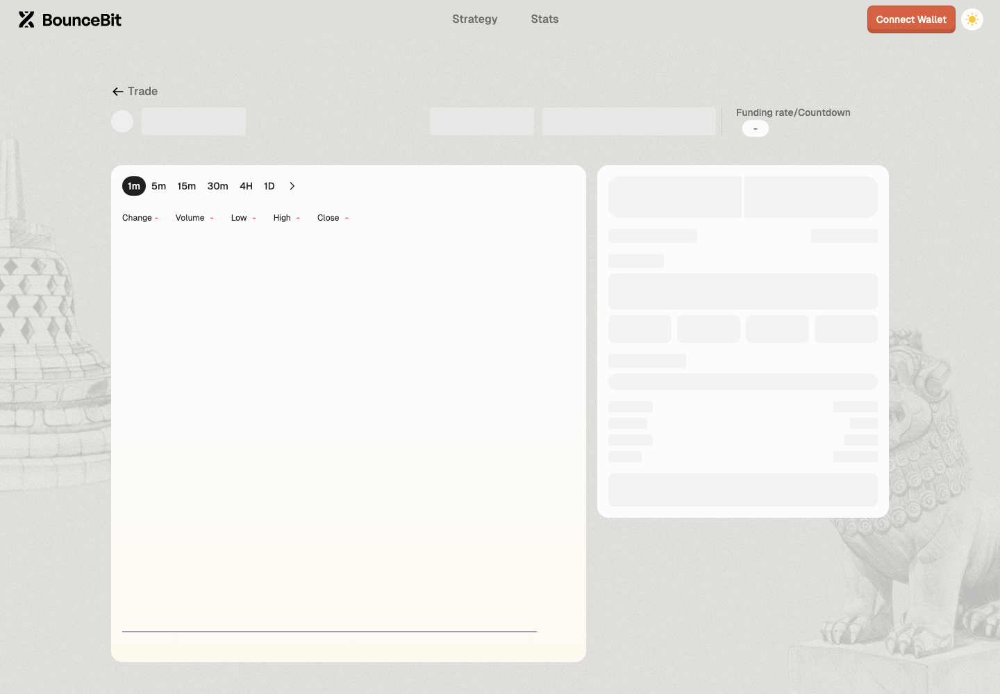
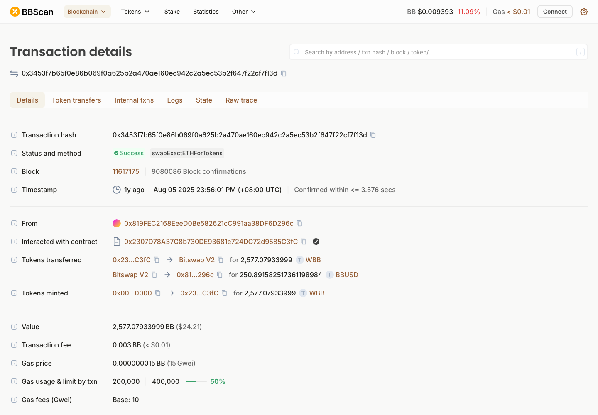
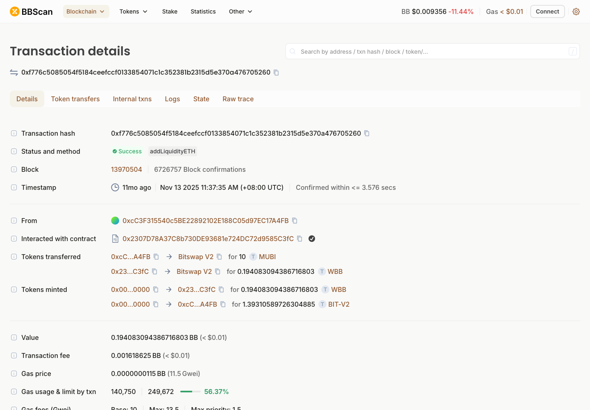
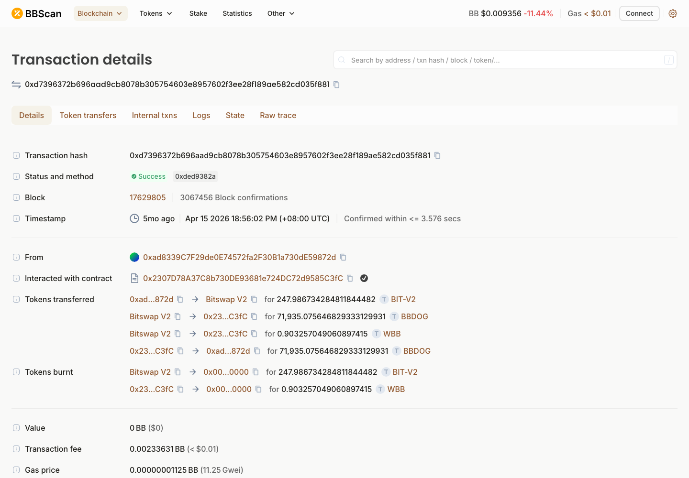

# BounceBit — DEX 协议调研

> **链**：BounceBit ｜ chainId **6001** ｜ 浏览器 https://bbscan.io ｜ RPC `https://fullnode-mainnet.bouncebitapi.com/`（停链后已无可用公开 RPC）
> **调研日期**：2026-09-29 ｜ hash 均为链上公开交易（非本人钱包），已逐条确认成功

🔴 **本链已于 2026-08-19 被攻击后停链（迁至 BNB Chain），建议不接入；以下为历史样本存档。**

## 协议总览

| # | 协议 | 类型 | 入选理由 | 前端 | hash |
|---|---|---|---|:-:|:-:|
| 1 | BitSwap V3 | Uniswap V3 式 CLMM | Ave 支持，交易量 100%（停链前） | 🔴 已下线 | ✅ |
| 2 | BitSwap V2 | Uniswap V2 式 | Ave 支持 | 🔴 已下线 | ✅ |

两个协议合计覆盖 100% 交易量（停链前口径）。

---

## 1. BitSwap V3（CLMM）

| 项 | 值 |
|---|---|
| 前端 | 🔴 https://portal.bouncebit.io/trade/swap ｜ 流动性 https://portal.bouncebit.io/trade/liquidity（DEX 入口已移除，跳转到 Strategy 理财页） |
| Factory | `0x30a326d09E01d7960a0A2639c8F13362e6cd304A` |
| NonfungiblePositionManager | `0xC2f43eA9684cf24772193218043CDF4BC1428066` |
| SwapRouter | `0x6155A20d309d7Bba3106e8F572CeFfb2828355DD`；另有 `0xC2984d09711Db7731f6b081e616BDF5de7bA0783`（`execute`，疑似 Universal Router） |
| 示例池 | `0xc6f18fb0938812aba99df851f9d25c5c58395b39`（BBTC/WBB，fee 1%，tickSpacing 200） |
| LP 凭证 | NFT `BIT-V3-POS` |

| 行为 | tx hash | 截图 |
|---|---|---|
| Swap 买（WBB→BBTC） | [0x196a15a728d13f00b69eda5ad8bfd1711b1ecfc800a202e81aee05096f960b11](https://bbscan.io/tx/0x196a15a728d13f00b69eda5ad8bfd1711b1ecfc800a202e81aee05096f960b11) |  |
| Swap 买（WBB→BBTC） | [0x4c9a456ef0c9190eb11e52a93838cfac53929a7ea29680d826d9139b23e30c23](https://bbscan.io/tx/0x4c9a456ef0c9190eb11e52a93838cfac53929a7ea29680d826d9139b23e30c23) | |
| Swap 卖（BBTC→WBB） | [0xa5996a4995eaf0bf40501a17efcc3575c243742e3c0e7f4b745d0c9d61fc0177](https://bbscan.io/tx/0xa5996a4995eaf0bf40501a17efcc3575c243742e3c0e7f4b745d0c9d61fc0177) | |
| Swap 卖（BBTC→WBB） | [0x8ec352e0de4eb72dbe7a044ba487ab0a93c71ee06e04b22d7771c762733223b7](https://bbscan.io/tx/0x8ec352e0de4eb72dbe7a044ba487ab0a93c71ee06e04b22d7771c762733223b7) | |
| 加流动性（建池 + 首次 Mint） | [0xc4644b42ff7063220d4a215344a634a8c81cc6ff2f0950c04aa41af41cc72668](https://bbscan.io/tx/0xc4644b42ff7063220d4a215344a634a8c81cc6ff2f0950c04aa41af41cc72668) |  |
| 加流动性（IncreaseLiquidity，所属池未确认） | [0x061de6fa9557e820f9d929fee6fe1f523cb611c4091f58795103178a814ff329](https://bbscan.io/tx/0x061de6fa9557e820f9d929fee6fe1f523cb611c4091f58795103178a814ff329) | |
| 减流动性 | [0xca6812ba7aa8406277df8b44a6ed236e768f2f674cd568c94fcd672a304b7dcc](https://bbscan.io/tx/0xca6812ba7aa8406277df8b44a6ed236e768f2f674cd568c94fcd672a304b7dcc) |  |

前端截图： ｜ （存证：DEX 入口已下线）

⚠️ 开发注意：Swap 同时经 SwapRouter 和 `0xC2984d09…`（execute）两个入口，按池子事件解析；token0 = BBTC、token1 = WBB。

---

## 2. BitSwap V2

| 项 | 值 |
|---|---|
| 前端 | 🔴 与 V3 共用 portal.bouncebit.io，已随 DEX 入口一起下线 |
| Factory | `0x6d2Ae8505Ab39c9cF94abf69d75acc6115C2E3c0` |
| Router | `0x2307D78A37C8b730DE93681e724DC72d9585C3fC` |
| 示例池 | `0xfFF0E046F1b36Cb84520c2C9773067587B491E63`（WBB/BBUSD，swap）｜ `0xc3963736958EA1A7ab0A06dE618c9e12E0cD91CC`（MUBI/WBB，加流动性）｜ `0xdE3419e177395a16A274ae8C566b53F3694a4290`（BBDOG/WBB，减流动性） |
| LP 凭证 | ERC-20 `BIT-V2` |

| 行为 | tx hash | 截图 |
|---|---|---|
| Swap 买（BB→BBUSD） | [0x3453f7b65f0e86b069f0a625b2a470ae160ec942c2a5ec53b2f647f22cf7f13d](https://bbscan.io/tx/0x3453f7b65f0e86b069f0a625b2a470ae160ec942c2a5ec53b2f647f22cf7f13d) |  |
| Swap 买（BB→BBUSD） | [0xc83b5e4eca93a1a7b07e8fa1b81077d72cc6ef42588b3417138e7c4ad39d0dbb](https://bbscan.io/tx/0xc83b5e4eca93a1a7b07e8fa1b81077d72cc6ef42588b3417138e7c4ad39d0dbb) | |
| Swap 卖（BBUSD→BB） | [0x9a935cd22739e89df4ce5056e6161d84a25fdad474d8cea1cabfbe5a00e61ff8](https://bbscan.io/tx/0x9a935cd22739e89df4ce5056e6161d84a25fdad474d8cea1cabfbe5a00e61ff8) | |
| Swap 卖（BBUSD→BB） | [0x032b479140b4823661c8645fdafca985f3f41d9769ada8749b9c18be3353e046](https://bbscan.io/tx/0x032b479140b4823661c8645fdafca985f3f41d9769ada8749b9c18be3353e046) | |
| 加流动性 | [0xf776c5085054f5184ceefccf0133854071c1c352381b2315d5e370a476705260](https://bbscan.io/tx/0xf776c5085054f5184ceefccf0133854071c1c352381b2315d5e370a476705260) |  |
| 减流动性 | [0xd7396372b696aad9cb8078b305754603e8957602f3ee28f189ae582cd035f881](https://bbscan.io/tx/0xd7396372b696aad9cb8078b305754603e8957602f3ee28f189ae582cd035f881) |  |

前端截图：无（与 V3 共用前端，已下线，见 §1 存证图）

⚠️ 开发注意：V2 pair 上近期 swap 多为套利机器人 `0x00000000000A111F…` 的跨池交易（一笔同时打 V3 和 V2 池）。

---

## 待确认

- 业务确认 BounceBit（6001）整条链标「已停运，不接入」（同 Dogechain 处理）
- BB 已迁至 BNB Chain（BEP-20），如仍需覆盖 BB，是否改在 BSC 侧跟进
