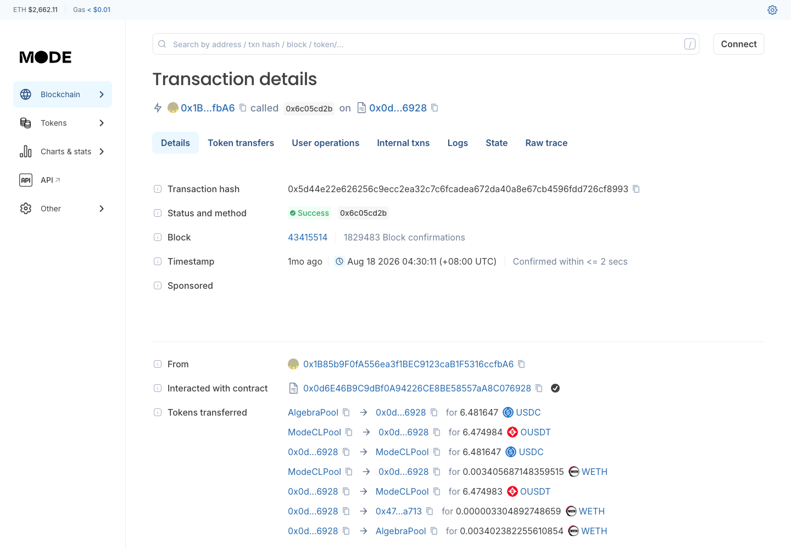
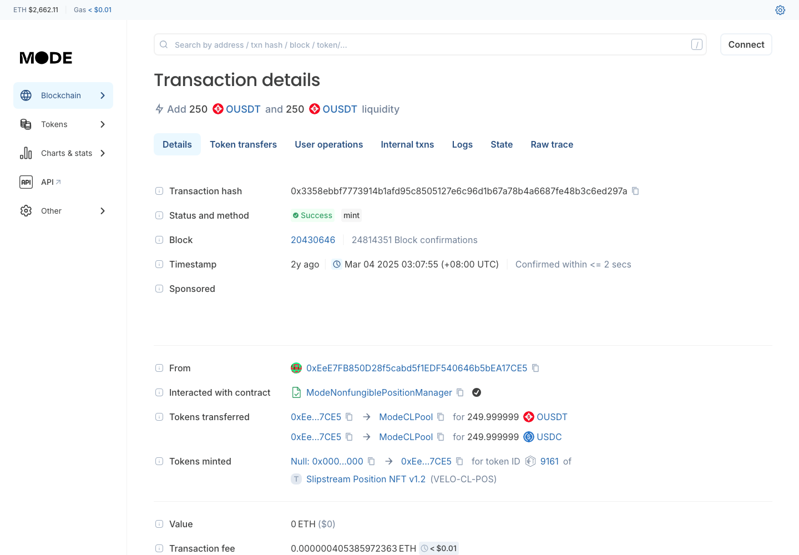
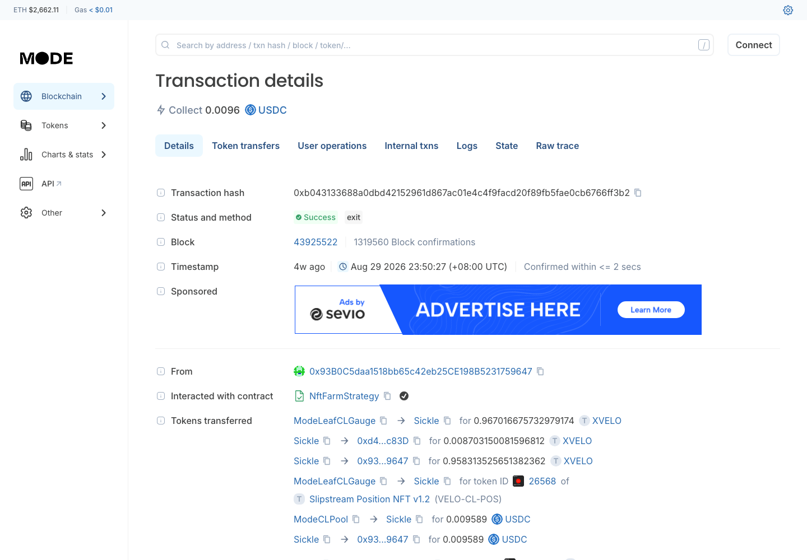
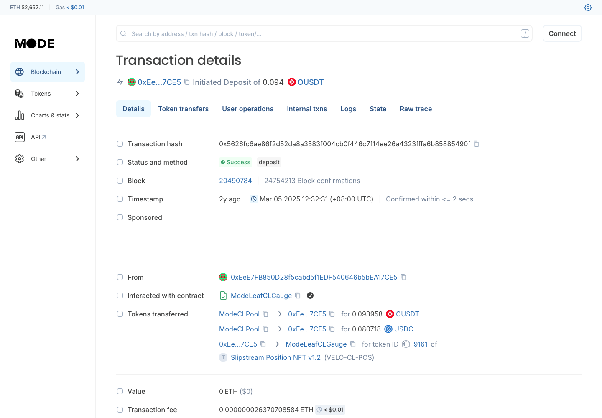
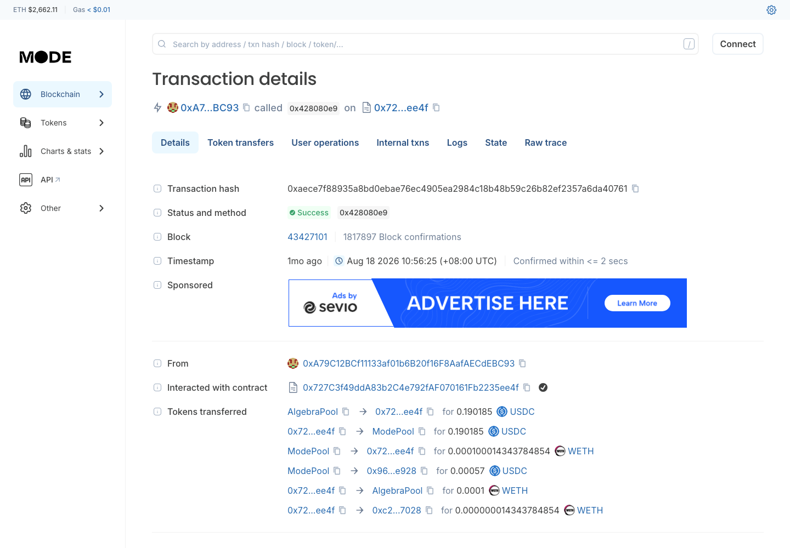
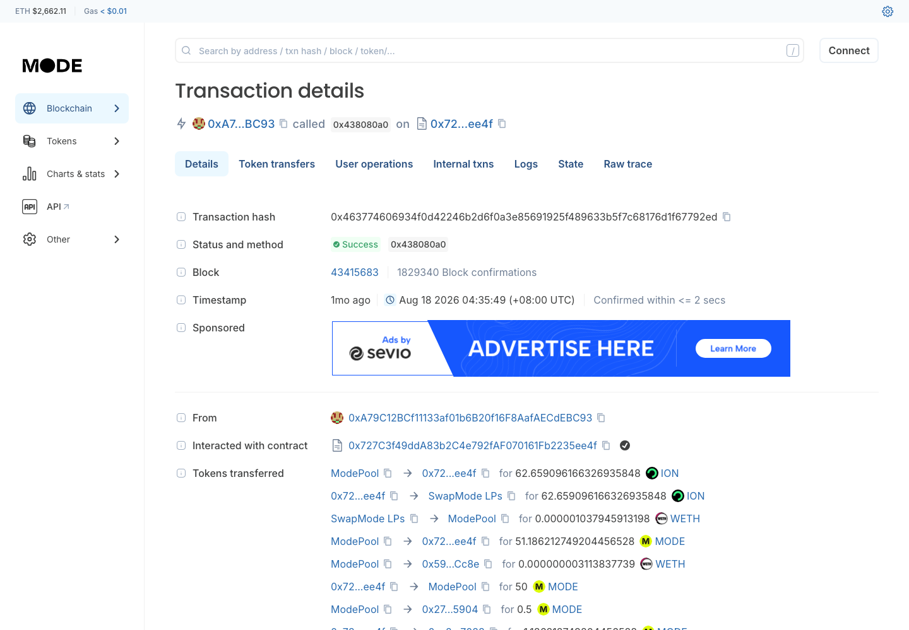
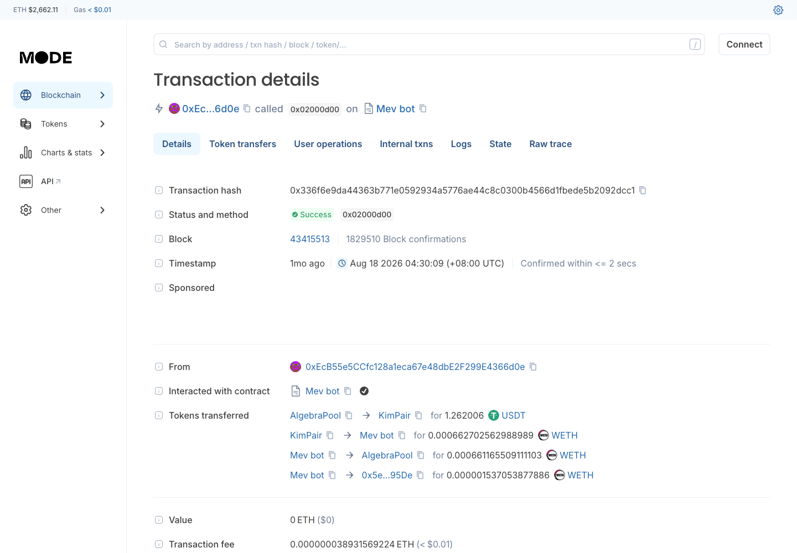
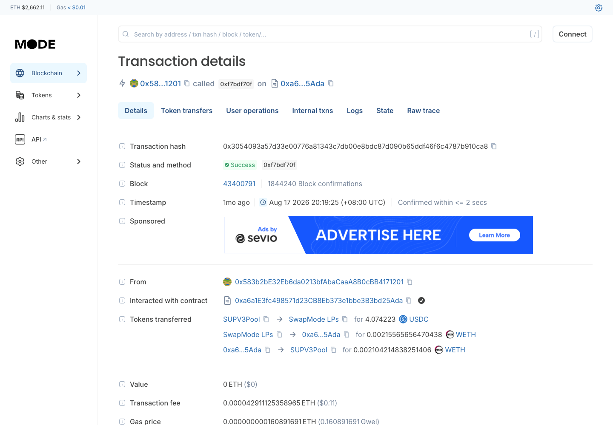
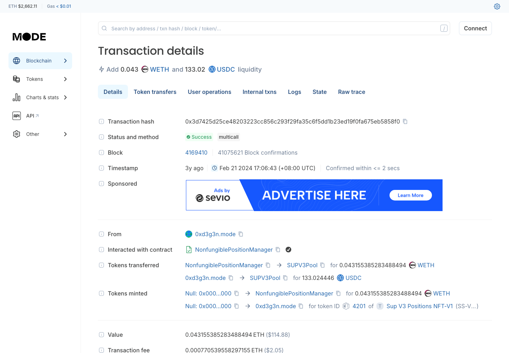

# Mode — DEX 协议调研

> **链**：Mode（OP Stack L2）｜ chainId **34443** ｜ 浏览器 https://explorer.mode.network ｜ RPC `https://mainnet.mode.network`
> **调研日期**：2026-09-29 ｜ hash 均为链上公开交易（非本人钱包），已逐条确认成功

## 协议总览

| # | 协议 | 类型 | 入选理由 | 前端 | hash |
|---|---|---|---|:-:|:-:|
| 1 | Velodrome Finance Slipstream | CL 集中流动性（Uniswap V3 式 + gauge） | 交易量 47.8% | ✅ | ✅ |
| 2 | Kim V4 | Algebra 集中流动性 | Ave + OKX 支持，交易量 33.4% | ✅ | ✅ |
| 3 | SwapMode | Uniswap V2 式（Pancake V2 分叉） | OKX 支持，交易量 5.4% | 🔴 522 宕机 | ✅ |
| 4 | Velodrome Finance V2 | Solidly 式 V2（volatile / stable） | 交易量 5.3% | ✅ | ✅ |
| 5 | Kim | Uniswap V2 式 | Ave + OKX 支持 | ✅ | ✅ |
| 6 | SupSwap | Uniswap V3 式（Pancake V3 分叉） | OKX 支持 | ✅ | ✅ |

6 个协议合计覆盖 99.7% 交易量（Confluence 610323213 快照）。

---

## 1. Velodrome Finance Slipstream（CL）

| 项 | 值 |
|---|---|
| 前端 | https://velodrome.finance/swap?chain0=34443&chain1=34443 ｜ 流动性 https://velodrome.finance/liquidity?filters=Mode%2Cunknown（与 Velodrome V2 共用前端：池型标签 **"Concentrated N"** = Slipstream，"Basic Volatile / Stable" = V2；不加 `unknown` 不显示 Mode 池） |
| Factory | `ModeCLFactory` `0x04625b046c69577efc40e6c0bb83cdbafab5a55f` |
| NonfungiblePositionManager | `0x991d5546c4b442b4c5fdc4c8b8b8d131deb24702` |
| Gauge（示例） | `ModeLeafCLGauge` `0x60e31aceac0953d972479659d4a0863af343ba1b` |
| 示例池 | `0xefe134dc2be0943a51c52bb2b2bac09ab1152f95`（oUSDT/USDC，tickSpacing 1，fee 0.02%） |
| LP 凭证 | NFT `VELO-CL-POS` |

| 行为 | tx hash | 截图 |
|---|---|---|
| Swap | [0x5d44e22e626256c9ecc2ea32c7c6fcadea672da40a8e67cb4596fdd726cf8993](https://explorer.mode.network/tx/0x5d44e22e626256c9ecc2ea32c7c6fcadea672da40a8e67cb4596fdd726cf8993) |  |
| Swap | [0x5fe7d8fe5637ed83131df957669fcc714df0c0626cc8f1ead353a26976abc36c](https://explorer.mode.network/tx/0x5fe7d8fe5637ed83131df957669fcc714df0c0626cc8f1ead353a26976abc36c) | |
| Swap | [0xc572c640fa4c1afaf11f246a0db504f4b83d1d9c7c0c36eb4641c4014feb6754](https://explorer.mode.network/tx/0xc572c640fa4c1afaf11f246a0db504f4b83d1d9c7c0c36eb4641c4014feb6754) | |
| Swap | [0x5125ce467bcf8a9db0de03db30cba04e88fe0a665d323945d4de2eb6294303c5](https://explorer.mode.network/tx/0x5125ce467bcf8a9db0de03db30cba04e88fe0a665d323945d4de2eb6294303c5) | |
| 加流动性 | [0x3358ebbf7773914b1afd95c8505127e6c96d1b67a78b4a6687fe48b3c6ed297a](https://explorer.mode.network/tx/0x3358ebbf7773914b1afd95c8505127e6c96d1b67a78b4a6687fe48b3c6ed297a) |  |
| 减流动性 | [0xb043133688a0dbd42152961d867ac01e4c4f9facd20f89fb5fae0cb6766ff3b2](https://explorer.mode.network/tx/0xb043133688a0dbd42152961d867ac01e4c4f9facd20f89fb5fae0cb6766ff3b2) |  |
| （Confluence 原登记为减流动性，实为 gauge 质押，勿用） | [0x5626fc6ae86f2d52da8a3583f004cb0f446c7f14ee26a4323fffa6b85885490f](https://explorer.mode.network/tx/0x5626fc6ae86f2d52da8a3583f004cb0f446c7f14ee26a4323fffa6b85885490f) |  |

前端截图： ｜ 

⚠️ 开发注意：
- `0x5626fc6a…` 调用的是 `ModeLeafCLGauge.deposit`，Pool 上 `Burn` amount=0 只是结算手续费，**不能当减流动性**；真实减流动性看 `Burn` amount 非零。
- Swap 多经未验证合约 `0x727c3f49…ee4f`（Kim V4 / Velodrome V2 也共用，疑为聚合器）路由，**解析以池子事件为准，不要按 Router 白名单过滤**。

---

## 2. Kim V4（Algebra CL）

| 项 | 值 |
|---|---|
| 前端 | https://app.kim.exchange/swap ｜ 流动性 https://app.kim.exchange/liquidity/router（与 Kim V2 共用前端：右上 **V4 / V2** 页签切换池型） |
| Factory | `AlgebraFactory` `0xb5f00c2c5f8821155d8ed27e31932cfd9db3c5d5` |
| NonfungiblePositionManager | `Position Manager v4` `0x2e8614625226d26180adf6530c3b1677d3d7cf10` |
| 示例池 | `0x468cc91df6f669cae6cdce766995bd7874052fbc`（WETH/USDC，tickSpacing 60，动态费） |
| LP 凭证 | NFT `Algebra Positions NFT-V2` |

| 行为 | tx hash | 截图 |
|---|---|---|
| Swap | [0xaece7f88935a8bd0ebae76ec4905ea2984c18b48b59c26b82ef2357a6da40761](https://explorer.mode.network/tx/0xaece7f88935a8bd0ebae76ec4905ea2984c18b48b59c26b82ef2357a6da40761) |  |
| Swap | [0xf72b29bddd63d893e828dec6a3a918fc9d3382c763b51ad504b608743f6cf878](https://explorer.mode.network/tx/0xf72b29bddd63d893e828dec6a3a918fc9d3382c763b51ad504b608743f6cf878) | |
| Swap | [0x4c07563bd7bdf48cb0702bfbd080fb5bdb30b05dcce15e71bd7b0f53bee4ffef](https://explorer.mode.network/tx/0x4c07563bd7bdf48cb0702bfbd080fb5bdb30b05dcce15e71bd7b0f53bee4ffef) | |
| Swap | [0xefd23dc566d3f860e9fdb07907e8d070b0b51d31ebfc319ee409297e5e527dac](https://explorer.mode.network/tx/0xefd23dc566d3f860e9fdb07907e8d070b0b51d31ebfc319ee409297e5e527dac) | |
| 加流动性 | [0x1700f04a0d21e2b114b6b18188084972902d9bec1ca35108cc3497724b277eb1](https://explorer.mode.network/tx/0x1700f04a0d21e2b114b6b18188084972902d9bec1ca35108cc3497724b277eb1) |  |
| 减流动性 | [0xc55cc0c794b7c93e341b4a839cbf692444b595b9eb43cecc5d7492ad1967503e](https://explorer.mode.network/tx/0xc55cc0c794b7c93e341b4a839cbf692444b595b9eb43cecc5d7492ad1967503e) |  |

前端截图： ｜ （与 Kim V2 共用）

⚠️ 开发注意：Algebra 池为动态费率（费率不在池子地址/参数里固定）；样本 swap 均经 `0x727c3f49…ee4f` 路由，按池子事件解析。

---

## 3. SwapMode（V2）

| 项 | 值 |
|---|---|
| 前端 | 🔴 https://swapmode.fi/swap ｜ 流动性 https://swapmode.fi/liquidity（2026-09-29 返回 Cloudflare 522，不可用） |
| Factory | `PancakeFactory` `0xfb926356baf861c93c3557d7327dbe8734a71891` |
| Router | `PancakeRouter` `0xc1e624c810d297fd70ef53b0e08f44fabe468591` |
| 示例池 | `0x50273860341bb80de359cd391bef9b2eb228753c`（WETH/USDC） |
| LP 凭证 | ERC-20 |

| 行为 | tx hash | 截图 |
|---|---|---|
| Swap | [0xd81c6cff407fb719ac5f85b01607819fdc4cdc8d72fc46382ed9a6109d69949b](https://explorer.mode.network/tx/0xd81c6cff407fb719ac5f85b01607819fdc4cdc8d72fc46382ed9a6109d69949b) |  |
| Swap | [0xfe63ff170435210f254e6fb986c76ab7dd597eb9c7ed7435224859ad3e458f35](https://explorer.mode.network/tx/0xfe63ff170435210f254e6fb986c76ab7dd597eb9c7ed7435224859ad3e458f35) | |
| Swap | [0xb6b285dc78264b778a4d0c8e71ed49c87ed0555f7e0429e90f15dfb324f631db](https://explorer.mode.network/tx/0xb6b285dc78264b778a4d0c8e71ed49c87ed0555f7e0429e90f15dfb324f631db) | |
| Swap | [0xa1e1d930e00b28fc28ba5cd8f2e3abca88874ff043a837e757d08c7448c49762](https://explorer.mode.network/tx/0xa1e1d930e00b28fc28ba5cd8f2e3abca88874ff043a837e757d08c7448c49762) | |
| 加流动性 | [0xd7cce9ec0329045e1bfdc1360c143963038202eb2878132b4d707d3078a2c355](https://explorer.mode.network/tx/0xd7cce9ec0329045e1bfdc1360c143963038202eb2878132b4d707d3078a2c355) |  |
| 减流动性 | [0xd27f87987c6bab1ad237f3d84eb1d3d4a44c2f112f675851f4cd0f6e00489e0c](https://explorer.mode.network/tx/0xd27f87987c6bab1ad237f3d84eb1d3d4a44c2f112f675851f4cd0f6e00489e0c) |  |

前端截图：无（前端 522 宕机）

⚠️ 开发注意：Swap 样本多经 LiFi Diamond `0x1231deb6…` 等聚合器路由，按池子事件解析。

---

## 4. Velodrome Finance V2（sAMM / vAMM）

| 项 | 值 |
|---|---|
| 前端 | https://velodrome.finance/swap?chain0=34443&chain1=34443 ｜ 流动性 https://velodrome.finance/liquidity?filters=Mode%2Cunknown（与 Slipstream 共用前端：池型标签 **"Basic Volatile / Basic Stable"** = V2，"Concentrated" = Slipstream） |
| Factory | `ModePoolFactory` `0x31832f2a97fd20664d76cc421207669b55ce4bc0` |
| Router | `ModeRouter` `0x3a63171dd9bebf4d07bc782fecc7eb0b890c2a45` |
| 示例池 | `0x0fba984c97539b3fb49acda6973288d0efa903db`（WETH/MODE，volatile） |
| LP 凭证 | ERC-20 |

| 行为 | tx hash | 截图 |
|---|---|---|
| Swap | [0x463774606934f0d42246b2d6f0a3e85691925f489633b5f7c68176d1f67792ed](https://explorer.mode.network/tx/0x463774606934f0d42246b2d6f0a3e85691925f489633b5f7c68176d1f67792ed) |  |
| Swap | [0x875a35e181fd2a6c69d4958eedbfb8f81b5c8ff6dc1d07dd85a8523ceef324e2](https://explorer.mode.network/tx/0x875a35e181fd2a6c69d4958eedbfb8f81b5c8ff6dc1d07dd85a8523ceef324e2) | |
| Swap | [0x92be47ba1ef7eae9833858d1f338a96019626b070007b329283270b50baab952](https://explorer.mode.network/tx/0x92be47ba1ef7eae9833858d1f338a96019626b070007b329283270b50baab952) | |
| Swap | [0x6957c8790c086a51f692342cafc7243f373273ac8de95d6bf2827e7b1abc5ef1](https://explorer.mode.network/tx/0x6957c8790c086a51f692342cafc7243f373273ac8de95d6bf2827e7b1abc5ef1) | |
| 加流动性 | [0x1d2d08a4aa44ba7e2550095257eec26bb7aee1dfc6a46c04cfc4f381a3922623](https://explorer.mode.network/tx/0x1d2d08a4aa44ba7e2550095257eec26bb7aee1dfc6a46c04cfc4f381a3922623) |  |
| 减流动性 | [0xab4ec09071cbefb4d5f90f4d3388ec233aace65a3fbae0dcc5e0543bd6ca4e52](https://explorer.mode.network/tx/0xab4ec09071cbefb4d5f90f4d3388ec233aace65a3fbae0dcc5e0543bd6ca4e52) |  |

前端截图： ｜ （与 Slipstream 共用）

⚠️ 开发注意：同一 Factory 下有 volatile（恒定乘积）和 stable（稳定曲线）两种池，解析价格时需按池子 `stable` 标志区分曲线。

---

## 5. Kim（V2）

| 项 | 值 |
|---|---|
| 前端 | https://app.kim.exchange/swap ｜ 流动性 https://app.kim.exchange/liquidity/router（与 Kim V4 共用前端：切 **V2** 页签） |
| Factory | `KimFactory` `0xc02155946dd8c89d3d3238a6c8a64d04e2cd4500` |
| Router | `KimRouter` `0x5d61c537393cf21893be619e36fc94cd73c77dd3` |
| 示例池 | `0xf4c85269240c1d447309fa602a90ac23f1cb0dc0`（WETH/USDT） |
| LP 凭证 | ERC-20 |

| 行为 | tx hash | 截图 |
|---|---|---|
| Swap | [0x336f6e9da44363b771e0592934a5776ae44c8c0300b4566d1fbede5b2092dcc1](https://explorer.mode.network/tx/0x336f6e9da44363b771e0592934a5776ae44c8c0300b4566d1fbede5b2092dcc1) |  |
| Swap | [0x242de31cb9f2f03a8e3667652044a39fd91f41cc52c1c86ffa06aaaa12876e62](https://explorer.mode.network/tx/0x242de31cb9f2f03a8e3667652044a39fd91f41cc52c1c86ffa06aaaa12876e62) | |
| Swap | [0x8d7b5263445dbe4d49f79c1a809c9c21f327c19afbc5be766dba1466470535da](https://explorer.mode.network/tx/0x8d7b5263445dbe4d49f79c1a809c9c21f327c19afbc5be766dba1466470535da) | |
| Swap | [0xd10b598322d6083fe65cc87854330586b59a4aa010c70613320419ebc455cb17](https://explorer.mode.network/tx/0xd10b598322d6083fe65cc87854330586b59a4aa010c70613320419ebc455cb17) | |
| 加流动性 | [0xd3ee643ac6e687959663b6e7b10c6abf56dfb2af1e032c14aebc002854c6c0e4](https://explorer.mode.network/tx/0xd3ee643ac6e687959663b6e7b10c6abf56dfb2af1e032c14aebc002854c6c0e4) |  |
| 减流动性 | [0x7bb967dbb6851396ff26e17d891825c77355d2753e5ccc7bb0258963d2e59d96](https://explorer.mode.network/tx/0x7bb967dbb6851396ff26e17d891825c77355d2753e5ccc7bb0258963d2e59d96) |  |

前端截图： ｜ 

---

## 6. SupSwap（V3）

| 项 | 值 |
|---|---|
| 前端 | https://supswap.xyz/swap ｜ 流动性 https://supswap.xyz/liquidity（All / V3 / V2 页签） |
| Factory | `SupV3Factory` `0xa0b018fe0d00ed075fb9b0eee26d25cf72e1f693` |
| NonfungiblePositionManager | `0x1189180050ce260451d802a7b648134d85883b29` |
| 示例池 | `0xf2e9c024f1c0b7a2a4ea11243c2d86a7b38dd72f`（WETH/USDC，fee 0.05%，tickSpacing 10） |
| LP 凭证 | NFT（ERC-721） |

| 行为 | tx hash | 截图 |
|---|---|---|
| Swap | [0x3054093a57d33e00776a81343c7db00e8bdc87d090b65ddf46f6c4787b910ca8](https://explorer.mode.network/tx/0x3054093a57d33e00776a81343c7db00e8bdc87d090b65ddf46f6c4787b910ca8) |  |
| Swap | [0xa0975b525d549db13e924cad94d9f48c343d3abaff1982004557311397bfc4f8](https://explorer.mode.network/tx/0xa0975b525d549db13e924cad94d9f48c343d3abaff1982004557311397bfc4f8) | |
| Swap | [0x3d59d1fcfc06fb0371119c92f7f243804962c6bb33dc6d6e5670d737160b0c71](https://explorer.mode.network/tx/0x3d59d1fcfc06fb0371119c92f7f243804962c6bb33dc6d6e5670d737160b0c71) | |
| Swap | [0xd691bb939bbb89b9abd6b373d0bfc740a1341e0f6ad56d90c6f36e705c68c095](https://explorer.mode.network/tx/0xd691bb939bbb89b9abd6b373d0bfc740a1341e0f6ad56d90c6f36e705c68c095) | |
| 加流动性 | [0x3d7425d25ce48203223cc856c293f29fa35c6f5dd1b23ed19f0fa675eb5858f0](https://explorer.mode.network/tx/0x3d7425d25ce48203223cc856c293f29fa35c6f5dd1b23ed19f0fa675eb5858f0) |  |
| 减流动性 | [0x1d8cc5668a692d31fee8f0f2842b839737b135042399208595de10027e2446f9](https://explorer.mode.network/tx/0x1d8cc5668a692d31fee8f0f2842b839737b135042399208595de10027e2446f9) |  |

前端截图： ｜ 

⚠️ 开发注意：Pancake V3 分叉，Swap 事件比 Uniswap V3 多 `protocolFeesToken0/1` 字段；Swap 样本经 `0xa6a1e3fc…5ada`（未验证）和 Relay `RelayApprovalProxyV3` 路由，按池子事件解析。

---

## 待确认

- SwapMode 前端持续 522，是否已停运、是否仍接入
- Confluence 610323213 中 Slipstream 那条"减流动性" hash 是否替换为 `0xb0431336…`
