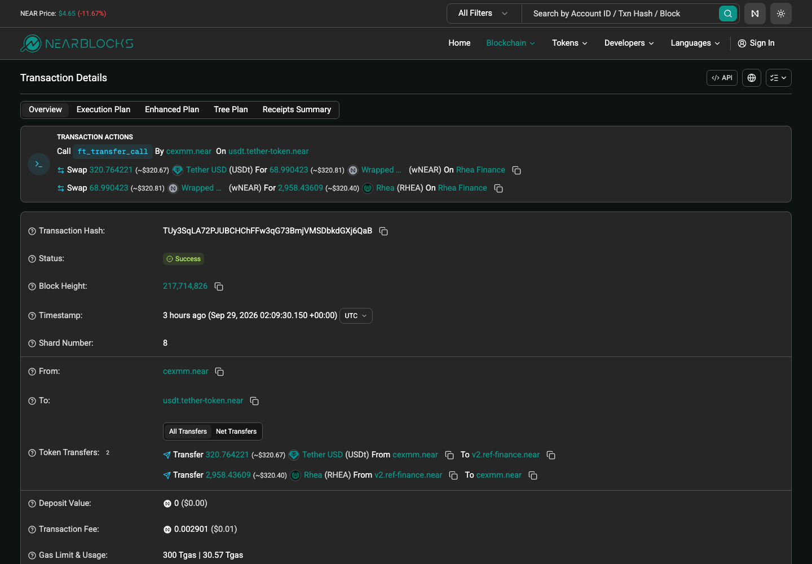
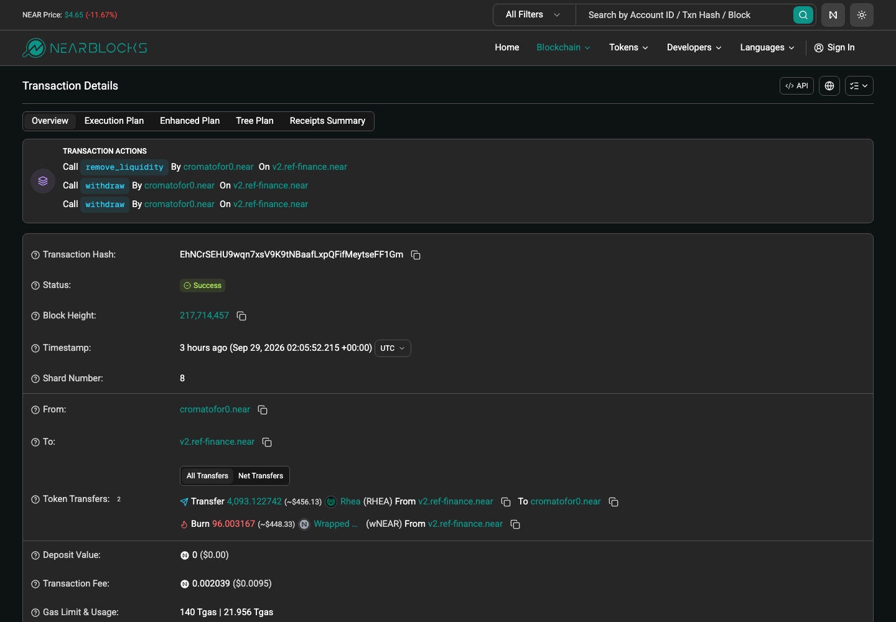
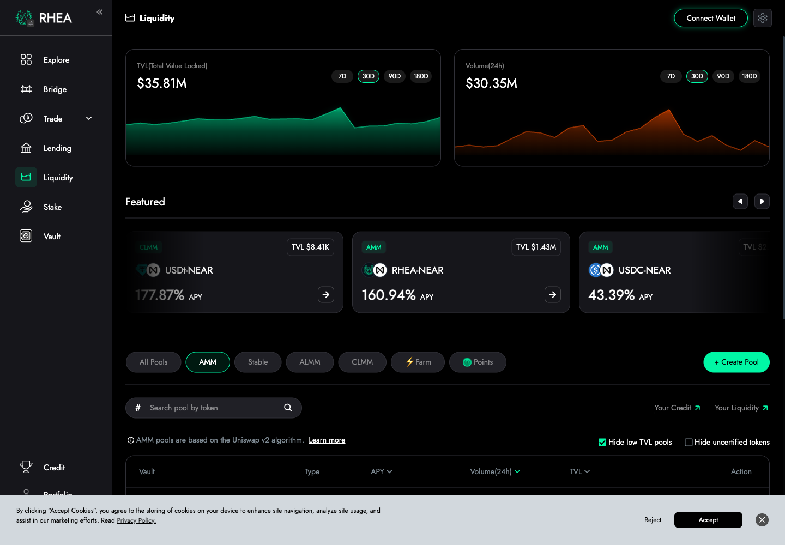
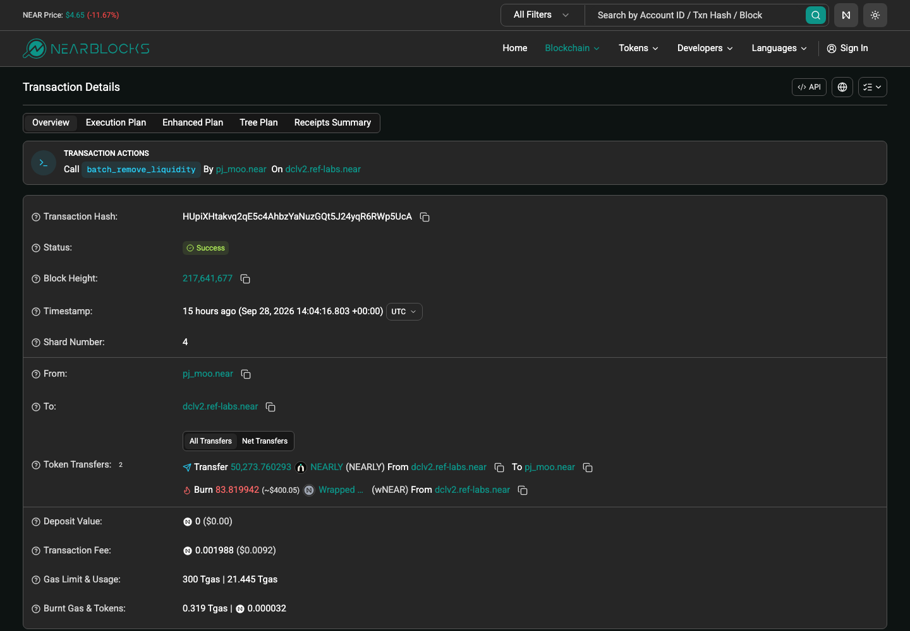
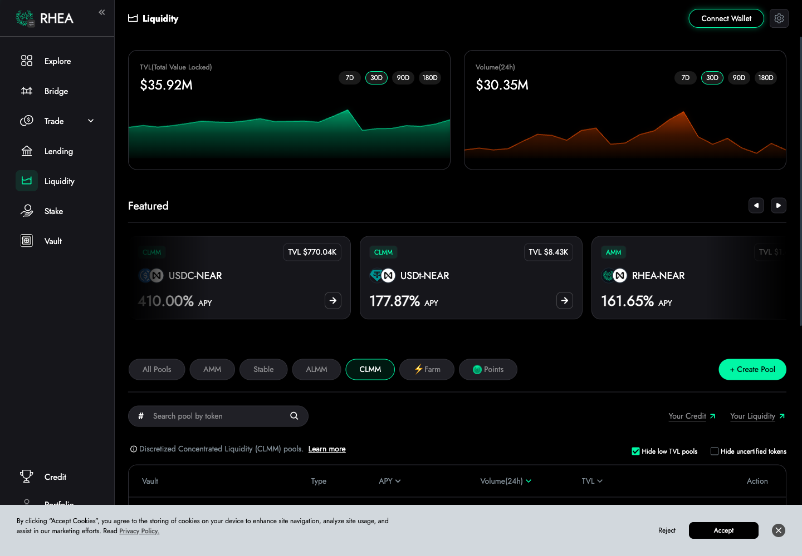
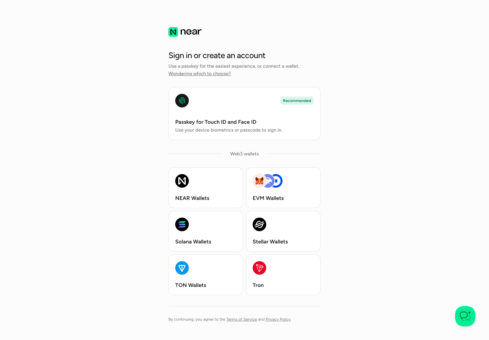

# NEAR — DEX 协议调研

> **链**：NEAR（非 EVM，账户模型）｜ 浏览器 https://nearblocks.io ｜ RPC `https://rpc.mainnet.near.org`
> **调研日期**：2026-09-29 ｜ hash 均为链上公开交易（非本人钱包），已逐条确认成功

## 协议总览

| # | 协议 | 类型 | 入选理由 | 前端 | hash |
|---|---|---|---|:-:|:-:|
| 1 | Rhea Dex 经典池 | AMM（Simple / Degen / Stable 池） | Ave 支持，Rhea 主力（约占 Rhea 量 65%） | ✅ | ✅ |
| 2 | Rhea Dex DCL | 集中流动性（类 V3） | Ave 支持，约占 Rhea 量 35%（不收则覆盖率 <90%） | ✅ | ✅ |
| 3 | NEAR Intents | 意图结算（无池子、无 LP） | 🟡 待上会：是否计入覆盖率 | ✅ | ✅ |

不含 Intents 时 Rhea 两套合计覆盖 ≥90%；含 Intents 则 Intents 占约 77%，只收 Rhea 不达标。

---

## 1. Rhea Dex 经典池

| 项 | 值 |
|---|---|
| 前端 | https://app.rhea.finance/swap ｜ 流动性 https://app.rhea.finance/pools（AMM / Stable / ALMM 页签） |
| 合约账户 | `v2.ref-finance.near` |
| 示例池 | #6458 RHEA/wNEAR（Simple 池）；#5515 wNEAR/USDC、#6063 wNEAR/USDt（Degen 池） |
| LP 凭证 | 合约内记账的 shares（非独立代币、非 NFT） |

| 行为 | tx hash | 截图 |
|---|---|---|
| Swap 买 RHEA | [TUy3SqLA72PJUBCHChFFw3qG73BmjVMSDbkdGXj6QaB](https://nearblocks.io/txns/TUy3SqLA72PJUBCHChFFw3qG73BmjVMSDbkdGXj6QaB) |  |
| Swap 买 RHEA | [2DCqJMtq1LFXaw3C4BZ2yVVvm5CoNXZdKYzJ7GaenBhd](https://nearblocks.io/txns/2DCqJMtq1LFXaw3C4BZ2yVVvm5CoNXZdKYzJ7GaenBhd) | |
| Swap 卖 RHEA | [CyRK37wxSW965A9bPE629dpEC94Lk7F6rimguh4qujjS](https://nearblocks.io/txns/CyRK37wxSW965A9bPE629dpEC94Lk7F6rimguh4qujjS) | |
| Swap 卖 RHEA | [CBcDa22hnNA8rGoyq3siu62SibmUBBsX3Q6bPJN9fVt1](https://nearblocks.io/txns/CBcDa22hnNA8rGoyq3siu62SibmUBBsX3Q6bPJN9fVt1) | |
| Swap（Degen 池 #6063） | [4B2j3qkkXos6n8KRg7hRK4tZpDff86tTxEeJzNpEzEar](https://nearblocks.io/txns/4B2j3qkkXos6n8KRg7hRK4tZpDff86tTxEeJzNpEzEar) | |
| Swap（Degen 池 #6063） | [Av4Ke65HL9LdSJbmJdBguZsTA6zbp85cCWgqHwRUwB6E](https://nearblocks.io/txns/Av4Ke65HL9LdSJbmJdBguZsTA6zbp85cCWgqHwRUwB6E) | |
| 加流动性（Simple 池 #6458） | [FJnWbmirghvP7PwBiKeZXnWXpQ7LcUw2MwuVsKS7rHVb](https://nearblocks.io/txns/FJnWbmirghvP7PwBiKeZXnWXpQ7LcUw2MwuVsKS7rHVb) |  |
| 加流动性（Degen 池 #5515） | [5MrvKzs5x79q5LNqqfyi23EzdiYTgemewpSLvurP39vD](https://nearblocks.io/txns/5MrvKzs5x79q5LNqqfyi23EzdiYTgemewpSLvurP39vD) | |
| 减流动性（Simple 池 #6458） | [EhNCrSEHU9wqn7xsV9K9tNBaafLxpQFifMeytseFF1Gm](https://nearblocks.io/txns/EhNCrSEHU9wqn7xsV9K9tNBaafLxpQFifMeytseFF1Gm) |  |
| 减流动性（Degen 池 #5515，gas 代付） | [6JnsfhrrQeXaG6vDGvr4L6Hu2jaG3K6CUcD61RiVW5Ew](https://nearblocks.io/txns/6JnsfhrrQeXaG6vDGvr4L6Hu2jaG3K6CUcD61RiVW5Ew) | |

前端截图： ｜ 

⚠️ 开发注意：
- 经典池合约内有多种池型，加流动性方法不同：Simple 池用 `add_liquidity`，Degen / Stable 池用 `add_stable_liquidity`。
- 有 gas 代付交易（如上表最后一笔），签名方是 `rheagasrelayer.near`（`Delegate` 元交易），不是真实用户，真实 LP 在内层动作里。

---

## 2. Rhea Dex DCL

| 项 | 值 |
|---|---|
| 前端 | https://app.rhea.finance/swap（与经典池共用，路由自动选池）｜ 流动性 https://app.rhea.finance/pools（CLMM 页签） |
| 合约账户 | `dclv2.ref-labs.near` |
| 示例池 | `USDC\|wrap.near\|100`（USDC/wNEAR，0.01%）；`NEARLY\|wrap.near\|10000`（1%） |
| LP 凭证 | 区间仓位 `lpt_id`（形如 `<pool_id>#<序号>`，类 V3 NFT 仓位） |

| 行为 | tx hash | 截图 |
|---|---|---|
| Swap（wNEAR→USDC） | [98tN1o9i86xr133kL67GPK3jhG5c5YY2Tm7pJj7CrF6h](https://nearblocks.io/txns/98tN1o9i86xr133kL67GPK3jhG5c5YY2Tm7pJj7CrF6h) |  |
| Swap（wNEAR→USDC） | [hPXJDeTvC9Yjnw9AU6gwjqbWowyTyvUFSKHhQu5id1Z](https://nearblocks.io/txns/hPXJDeTvC9Yjnw9AU6gwjqbWowyTyvUFSKHhQu5id1Z) | |
| Swap（USDC→wNEAR） | [FdkQRfjrcFHWFiYZS9r5UJZQQP7znDDwiSF41HP7htGk](https://nearblocks.io/txns/FdkQRfjrcFHWFiYZS9r5UJZQQP7znDDwiSF41HP7htGk) | |
| Swap（USDC→wNEAR，经典池 + DCL 混合路由） | [3c9XKjVQGy75UhjHzf6b4D1ansMK5FQp3um6aEsxJspe](https://nearblocks.io/txns/3c9XKjVQGy75UhjHzf6b4D1ansMK5FQp3um6aEsxJspe) | |
| 加流动性 | [3NB9bWcw7T2h4n4yRJM3hyB6yPkLEUmfC9ZL9gsHqfpZ](https://nearblocks.io/txns/3NB9bWcw7T2h4n4yRJM3hyB6yPkLEUmfC9ZL9gsHqfpZ) |  |
| 加流动性 | [8FT9p9a1nCUVj3BJqaqynapJ5AtMLmm3xfrGDuMXjUzR](https://nearblocks.io/txns/8FT9p9a1nCUVj3BJqaqynapJ5AtMLmm3xfrGDuMXjUzR) | |
| 减流动性 | [HUpiXHtakvq2qE5c4AhbzYaNuzGQt5J24yqR6RWp5UcA](https://nearblocks.io/txns/HUpiXHtakvq2qE5c4AhbzYaNuzGQt5J24yqR6RWp5UcA) |  |
| 减流动性 | [6iPbZSTCxJBhbtMnCkSzRi8a7UNtvuHzzpMiSYoYcEge](https://nearblocks.io/txns/6iPbZSTCxJBhbtMnCkSzRi8a7UNtvuHzzpMiSYoYcEge) | |

前端截图： ｜ 

⚠️ 开发注意：
- 一笔交易可能同时经过经典池和 DCL（如上表第 4 笔），两套合约都要解析。
- 减流动性（`batch_remove_liquidity`）会顺带领手续费，日志里同时带 `claim_fee_token_x/y`。

---

## 3. NEAR Intents

| 项 | 值 |
|---|---|
| 前端 | https://near.com/swap（需登录）｜ 无流动性页（架构无 LP） |
| 合约账户 | `intents.near`（Verifier，方法 `execute_intents`） |
| 示例池 | 无池子，由 solver（如 `solver-priv-liq.near`）报价撮合 |
| LP 凭证 | 无 |

| 行为 | tx hash | 截图 |
|---|---|---|
| Swap（意图结算） | [fCrnoBZjyi5KpFw3eQXNcByYMSPmZdVt3RN6rHxGXb5](https://nearblocks.io/txns/fCrnoBZjyi5KpFw3eQXNcByYMSPmZdVt3RN6rHxGXb5) |  |
| Swap（意图结算） | [4FRqqUbtX8DoF5hzeMjQaAzKj8R9fYFpkvaBDaK9fun7](https://nearblocks.io/txns/4FRqqUbtX8DoF5hzeMjQaAzKj8R9fYFpkvaBDaK9fun7) | |

前端截图：

⚠️ 开发注意：一笔 `execute_intents` 会打包多个用户意图（样本第 1 笔含 3 条），不能按"一笔交易 = 一次 swap"计数；结算记录在 `token_diff` 等 NEP-297 事件里。

---

## 待确认

- NEAR Intents 是否计入覆盖率（计入则必须支持 Intents 才能过 90%）
- Rhea 经典池几种池型（Simple / Degen / Stable）开发是否都支持
- Ave 是否支持 NEAR Intents
