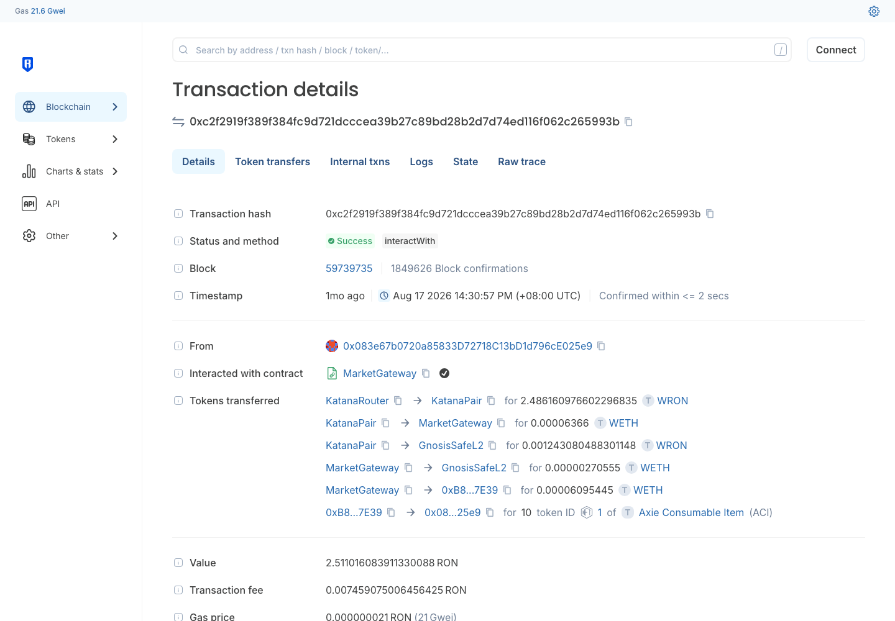
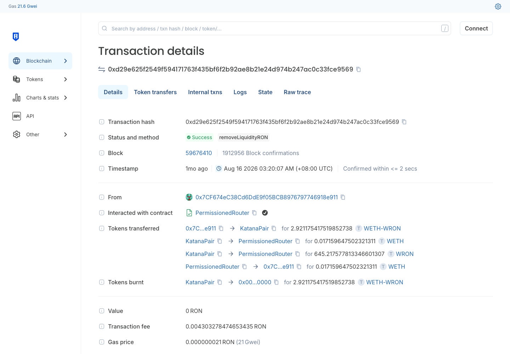
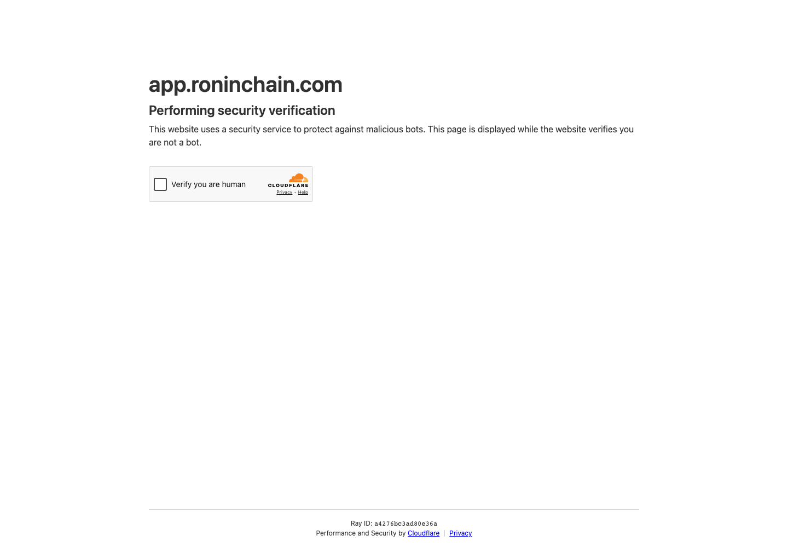

# Ronin — DEX 协议调研

> **链**：Ronin ｜ chainId **2020** ｜ 浏览器 https://explorer.roninchain.com（`app.roninchain.com` 有 Cloudflare 拦截） ｜ RPC `https://api.roninchain.com/rpc`
> **调研日期**：2026-09-29 ｜ hash 均为链上公开交易（非本人钱包），已逐条确认成功

## 协议总览

| # | 协议 | 类型 | 入选理由 | 前端 | hash |
|---|---|---|---|:-:|:-:|
| 1 | Katana | Uniswap V2 式 | Ave 支持，交易量 67.1% | 🔴 CF 拦截 | ✅ |
| 2 | Katana V3 | Uniswap V3 式 CLMM | Ave 支持，交易量 32.9% | 🔴 CF 拦截 | ✅ |

两个协议合计覆盖 100% 交易量（链上仅此 2 个 DEX）。

---

## 1. Katana（V2）

| 项 | 值 |
|---|---|
| 前端 | https://app.roninchain.com/swap ｜ 流动性 🔴 Cloudflare 人机验证拦截，URL 未确认 |
| Factory | `0xb255d6a720bb7c39fee173ce22113397119cb930` |
| Router | `0xc05afc8c9353c1dd5f872eccfacd60fd5a2a9ac7`（PermissionedRouter，`addLiquidityRON` / `removeLiquidityRON`） |
| 示例池 | `0x2ecb08f87f075b5769fe543d0e52e40140575ea7`（WETH/WRON） |
| LP 凭证 | ERC-20（如 `WETH-WRON` LP） |

| 行为 | tx hash | 截图 |
|---|---|---|
| Swap | [0xc2f2919f389f384fc9d721dcccea39b27c89bd28b2d7d74ed116f062c265993b](https://explorer.roninchain.com/tx/0xc2f2919f389f384fc9d721dcccea39b27c89bd28b2d7d74ed116f062c265993b) |  |
| Swap | [0x15b9f72966e427a0e06db7f88090140107ff500affdb40832260f2c24d01ba8f](https://explorer.roninchain.com/tx/0x15b9f72966e427a0e06db7f88090140107ff500affdb40832260f2c24d01ba8f) | |
| Swap | [0x79604df938bc65e333e11150a06fb30da725a37145b00724645575d2d28c96f2](https://explorer.roninchain.com/tx/0x79604df938bc65e333e11150a06fb30da725a37145b00724645575d2d28c96f2) | |
| Swap | [0x079283290029bd028ac3f6ab15cf4023a2015aa938c8fbc8e7f364ca453e36a7](https://explorer.roninchain.com/tx/0x079283290029bd028ac3f6ab15cf4023a2015aa938c8fbc8e7f364ca453e36a7) | |
| 加流动性 | [0x3dc55d7b79d4c535b9dd1a68bdf1a25719552a02a8baa037a4b5f4c549ae2541](https://explorer.roninchain.com/tx/0x3dc55d7b79d4c535b9dd1a68bdf1a25719552a02a8baa037a4b5f4c549ae2541) |  |
| 减流动性 | [0xd29e625f2549f594171763f435bf6f2b92ae8b21e24d974b247ac0c33fce9569](https://explorer.roninchain.com/tx/0xd29e625f2549f594171763f435bf6f2b92ae8b21e24d974b247ac0c33fce9569) |  |

前端截图：无（Cloudflare 人机验证拦截，存证见 ）

⚠️ 开发注意：Swap 样本多由 MarketGateway（`0x3b3adf14…3fe3`）等游戏/市场合约发起，不走 Katana Router，**解析请以池子事件为准，不要按 Router 白名单过滤**。

---

## 2. Katana V3（CLMM）

| 项 | 值 |
|---|---|
| 前端 | 与 V2 共用 https://app.roninchain.com/swap ｜ 流动性 🔴 Cloudflare 拦截，V3 仓位入口未确认 |
| Factory | `0x1f0b70d9a137e3caef0ceacd312bc5f81da0cc0c` |
| NonfungiblePositionManager | `0x7cf0fb64d72b733695d77d197c664e90d07cf45a`（方法 `multicall`） |
| 示例池 | `0xe8f17a4c9f9c5bef3b807e6e69801ead0be41e67`（POWER/WRON，fee 0.3%） |
| LP 凭证 | NFT（NonfungiblePositionManager） |

| 行为 | tx hash | 截图 |
|---|---|---|
| Swap | [0x42cc12aa352cf86940f11275cfd245c0edc1af71b6227be0c0ae1ca0679f4919](https://explorer.roninchain.com/tx/0x42cc12aa352cf86940f11275cfd245c0edc1af71b6227be0c0ae1ca0679f4919) |  |
| Swap | [0xe2eb39a1f25d63dee3c3ceeb23c253d7ff3215ef45792ba719fe856cd72dc10a](https://explorer.roninchain.com/tx/0xe2eb39a1f25d63dee3c3ceeb23c253d7ff3215ef45792ba719fe856cd72dc10a) | |
| Swap | [0x18cde454076f73f4ddc1dcae59227477d0157e5908d9299c7371c7cb95ddfe9f](https://explorer.roninchain.com/tx/0x18cde454076f73f4ddc1dcae59227477d0157e5908d9299c7371c7cb95ddfe9f) | |
| Swap | [0xc29c7306897f2ad91bb138750f17db6c400c57ab3b500ed5026714eef1f93b8c](https://explorer.roninchain.com/tx/0xc29c7306897f2ad91bb138750f17db6c400c57ab3b500ed5026714eef1f93b8c) | |
| 加流动性 | [0x073002b0b146336f559e51419602dec6c29d8358f1155019e8c2ff06581ba1eb](https://explorer.roninchain.com/tx/0x073002b0b146336f559e51419602dec6c29d8358f1155019e8c2ff06581ba1eb) |  |
| 减流动性 | [0xd4e09904dc203847fb440fd38df9062ae76c3ec56a1aeb1e55caa096f829e237](https://explorer.roninchain.com/tx/0xd4e09904dc203847fb440fd38df9062ae76c3ec56a1aeb1e55caa096f829e237) |  |

前端截图：无（Cloudflare 人机验证拦截）

⚠️ 开发注意：Swap 样本经 LiFiDiamond（`0x452cf1b8…d8d1`）等聚合器路由进来，**解析请以 KatanaV3Pool 事件为准**。

---

## 待确认

- 前端 swap / 流动性页截图（V2、V3 共 4 张）需人工通过 Cloudflare 验证后补截，是否需要补
