# ZetaChain — DEX 协议调研

> **链**：ZetaChain ｜ chainId **7000** ｜ 浏览器 https://zetascan.com ｜ RPC `https://zetachain-evm.blockpi.network/v1/rpc/public`
> **调研日期**：2026-09-29，2026-10-08 补全交易类型 ｜ hash 均为链上公开交易（非本人钱包），已逐条确认成功

## 协议总览

| # | 协议 | 类型 | 入选理由 | 前端 | 交易类型覆盖 |
|---|---|---|---|:-:|:-:|
| 1 | Zuno | Uniswap V3 式 CLMM | 交易量 64.1% | 🔴 域名失效 | 6 / 7 有样本 |
| 2 | EddyFinance | Uniswap V2 式 | OKX 支持，交易量 33.8% | 🔴 域名失效 | 3 / 3 有样本 |
| 3 | iZiSwap | DL-AMM（iZUMi 自研，点位 CLMM + 限价单） | OKX 支持 | ✅ | 15 / 16 有样本 |
| 4 | DYORSwap | Uniswap V2 式 | OKX 支持 | ✅ | 7 / 7 有样本 |
| 5 | Zedaswap | Uniswap V2 式 | OKX 支持 | 🔴 域名待售 | 3 / 3 有样本 |

5 个协议合计覆盖 99.7% 交易量（链日交易量仅约 $5.5K）。

**交易类型怎么找全的**：① 前端能打开的（iZiSwap、DYORSwap）逐页点（Swap / Limit Order / Pools / Farm / Positions / Lock / IDO / Launch 等）；② 链上把各协议 Router、仓位管理、限价单、Farm、Lock、IDO 合约的历史交易按方法名归类（multicall 拆到子调用），补上需连钱包才看得到的操作；前端失效的协议只按链上方法补。

---

## 1. Zuno（V3 / CLMM）

| 项 | 值 |
|---|---|
| 前端 | 🔴 `app.zunodex.xyz` 无 DNS 解析（旧域名 app.zetaswap.com 跳转过去同样打不开） |
| Factory | `0x9f48ddad075e569cdc70d657d3ac171e23846009` |
| SwapRouter | `0x3341f3c517a25128d660f9d00bd3f4d991de4c1a`（Uniswap V3 SwapRouter，构造参数 factory = 上面的 Zuno Factory） |
| NonfungiblePositionManager | `0xaf2403dd44b3c589f12680e715a8bbeb5b4b8471` |
| 示例池 | `0x999a3e9a2cb64f359f581afa0335bf4343622d1f`（USDC.ETH/WZETA，fee 0.3%） |
| LP 凭证 | NFT `Uniswap V3 Positions NFT-V1` |

### 交易类型覆盖

| # | 交易类型 | 前端入口 | 合约 · 方法 | tx hash |
|---|---|---|---|---|
| 1 | Swap（官方路由） | —（前端失效） | SwapRouter · `multicall`(`exactInputSingle`) | [0xf3eee5145d0d099b832b4a1b035c1624d1c4a0b29814ba92bbe2918b0c57b788](https://zetascan.com/tx/0xf3eee5145d0d099b832b4a1b035c1624d1c4a0b29814ba92bbe2918b0c57b788) |
| | Swap（套利合约直调池子） | | 套利合约 `0x00000000002587bc…` | [0x27d0f04c26241d0d19843a95ff0bc6a5c8c55d0f18122e45a6bf687faa43754b](https://zetascan.com/tx/0x27d0f04c26241d0d19843a95ff0bc6a5c8c55d0f18122e45a6bf687faa43754b) |
| | Swap（同上） | | | [0x6f12badd7457e71f3f54dde24aeb05b179214e2f243145824cfaa7a2adc658d7](https://zetascan.com/tx/0x6f12badd7457e71f3f54dde24aeb05b179214e2f243145824cfaa7a2adc658d7) |
| | Swap（同上） | | | [0xb2fcb6fa896c534f4346acc10ae8da6d7de1d3230202e48534b42a68d7c84d52](https://zetascan.com/tx/0xb2fcb6fa896c534f4346acc10ae8da6d7de1d3230202e48534b42a68d7c84d52) |
| | Swap（同上） | | | [0x32ea0172d6f54f540ab2147d701e1272ab68cf08c009047f442a021953523129](https://zetascan.com/tx/0x32ea0172d6f54f540ab2147d701e1272ab68cf08c009047f442a021953523129) |
| 2 | 加流动性（开新仓位） | —（前端失效） | NPM · `mint` | [0xef7be47db89166c819d47bef999861c1637a0cfd10fce858b793b2828d9a06a8](https://zetascan.com/tx/0xef7be47db89166c819d47bef999861c1637a0cfd10fce858b793b2828d9a06a8) |
| | 加流动性（带原生 ZETA） | | NPM · `multicall`(`mint` + `refundETH`) | [0xef0e6a88a083f57132a18447e5e1e0a6baf4f0c2162a274250904cd98f4b67a5](https://zetascan.com/tx/0xef0e6a88a083f57132a18447e5e1e0a6baf4f0c2162a274250904cd98f4b67a5) |
| 3 | 建池并加流动性 | —（前端失效） | NPM · `multicall`(`createAndInitializePoolIfNecessary` + `mint`) | [0x41c235930e58a5cccd4dc20f125faaad0b672c526b98ac3255f8698a167f4020](https://zetascan.com/tx/0x41c235930e58a5cccd4dc20f125faaad0b672c526b98ac3255f8698a167f4020) |
| 4 | 追加流动性（已有仓位） | —（前端失效） | NPM · `increaseLiquidity` | [0xdb47393a7fa9424c279eadd14c3c48e48fb96642cda07f52ba09171f0defc7aa](https://zetascan.com/tx/0xdb47393a7fa9424c279eadd14c3c48e48fb96642cda07f52ba09171f0defc7aa) |
| 5 | 减流动性 | —（前端失效） | NPM · `multicall`(`decreaseLiquidity` + `collect`) | [0x8445e13529fe14a12e92a88bd736b620f2e56cfe227f2c7389c8fe4b2e59fa83](https://zetascan.com/tx/0x8445e13529fe14a12e92a88bd736b620f2e56cfe227f2c7389c8fe4b2e59fa83) |
| 6 | 只领手续费 | —（前端失效） | NPM · `collect` | [0x7e47053b9ae8dc310fe7142a9044fdc483b200a097e5e0a2989337a366b3ccd2](https://zetascan.com/tx/0x7e47053b9ae8dc310fe7142a9044fdc483b200a097e5e0a2989337a366b3ccd2) |
| 7 | 关闭仓位（销毁 LP NFT） | —（前端失效） | NPM · `burn` | ⬜ NPM 近 542 笔成功交易（含 multicall 子调用）均无 `burn`，用户减仓后不销毁 NFT |

### 截图

前端页面：无（域名无解析）

**交易详情（每类一张，均为 zetascan）**

| 1 Swap 官方路由（`0xf3eee5…`） | 1 Swap 套利合约（`0x27d0f0…`） |
|:-:|:-:|
| 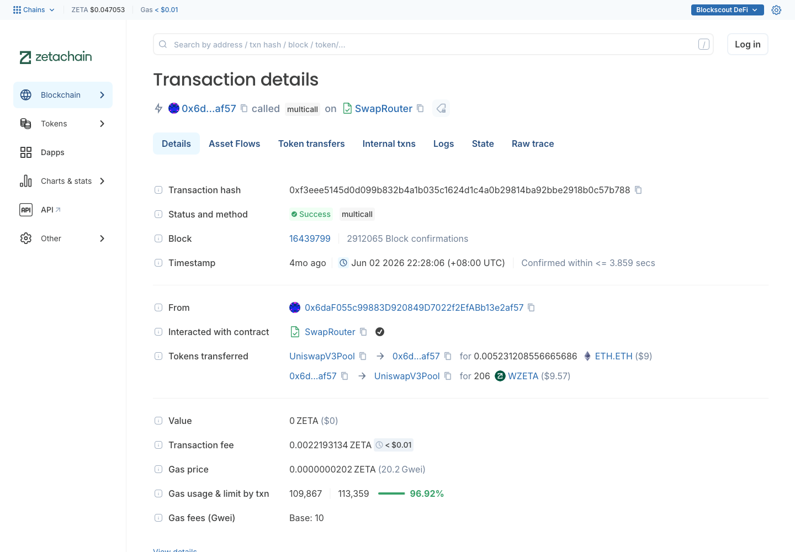 |  |
| **2 加流动性（`0xef7be4…`）** | **3 建池并加流动性（`0x41c235…`）** |
|  | 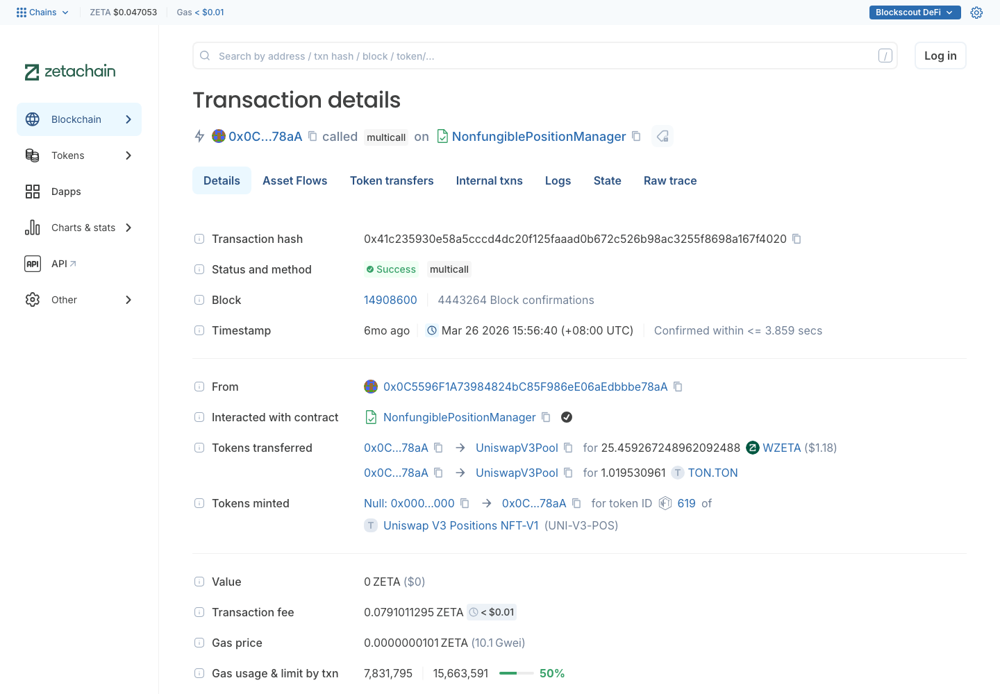 |
| **4 追加流动性（`0xdb4739…`）** | **5 减流动性（`0x8445e1…`）** |
| 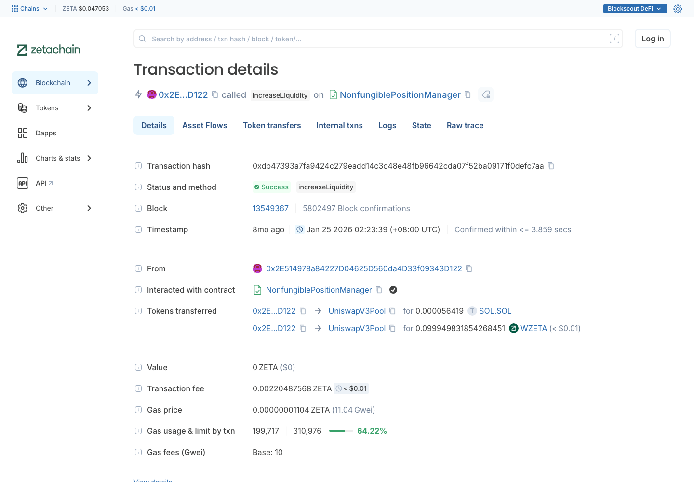 |  |
| **6 只领手续费（`0x7e4705…`）** | |
| 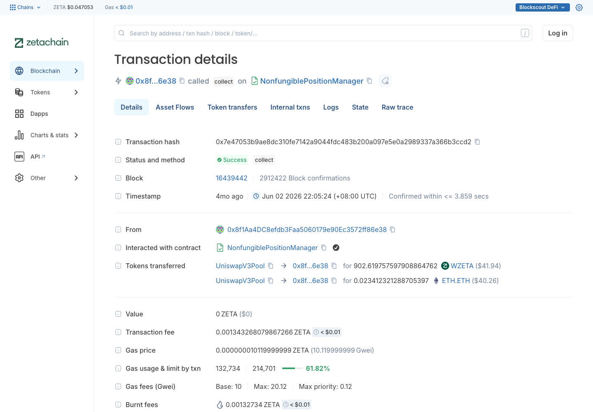 | |

⚠️ 开发注意：
- 官方 SwapRouter 近 792 笔全是 `multicall` 包 `exactInputSingle`，但池子 swap 里还有大量套利合约 / 聚合器直调，**解析请以池子事件为准，不要按 Router 过滤**。
- `collect`（#6）同笔会先触发池子 `Burn`（liquidity = 0，只结算手续费），不能算减流动性。

---

## 2. EddyFinance（V2）

| 项 | 值 |
|---|---|
| 前端 | 🔴 `eddy.finance` 整个域名 NXDOMAIN |
| Factory | `0x9fd96203f7b22bcf72d9dcb40ff98302376ce09c` |
| Router | `0x2ca7d64a7efe2d62a725e2b35cf7230d6677ffee` |
| 示例池 | `0x16ef1b018026e389fda93c1e993e987cf6e852e7`（WZETA/ETH.ETH） |
| LP 凭证 | ERC-20（UniswapV2Pair） |

### 交易类型覆盖

| # | 交易类型 | 前端入口 | 合约 · 方法 | tx hash |
|---|---|---|---|---|
| 1 | Swap（经 Sushi RedSnwapper） | —（前端失效） | RedSnwapper · `snwapMultiple` | [0xd148d9b58599babb1911ad94da90e4882fef94734cbed8e9c90da474dcac9d20](https://zetascan.com/tx/0xd148d9b58599babb1911ad94da90e4882fef94734cbed8e9c90da474dcac9d20) |
| | Swap（经 OKX DexRouter） | | DexRouter · `unxswapTo` | [0x48cab76b2f9cf93701c9bee9fb8cf242a2679122fdedb6422cabf80d79cd8a58](https://zetascan.com/tx/0x48cab76b2f9cf93701c9bee9fb8cf242a2679122fdedb6422cabf80d79cd8a58) |
| | Swap（同上） | | | [0x624344ada412a980b12eb9e87f7ba43ff3eedb05966ef0fed0b06be083a8b163](https://zetascan.com/tx/0x624344ada412a980b12eb9e87f7ba43ff3eedb05966ef0fed0b06be083a8b163) |
| | Swap（经其他聚合合约） | | `0x9201cd65…` | [0xe5ba85d248413bef3bed664cbffb6f7ca2bc583c13544bd502dd42be358e83a9](https://zetascan.com/tx/0xe5ba85d248413bef3bed664cbffb6f7ca2bc583c13544bd502dd42be358e83a9) |
| 2 | 加流动性 | —（前端失效） | Router · `addLiquidityETH` | [0x87370cce497389b6c08b1f4658ebe81fa7d80929e2502027c0cf7c1971326759](https://zetascan.com/tx/0x87370cce497389b6c08b1f4658ebe81fa7d80929e2502027c0cf7c1971326759) |
| 3 | 减流动性 | —（前端失效） | Router · `removeLiquidity` | [0xe6c2a69c3ddf6c92c42821c4096e586f883cbb90a861943e58626568328d53d8](https://zetascan.com/tx/0xe6c2a69c3ddf6c92c42821c4096e586f883cbb90a861943e58626568328d53d8) |

### 截图

前端页面：无（域名 NXDOMAIN）

| 1 Swap（`0xd148d9…`） | 2 加流动性（`0x87370c…`） |
|:-:|:-:|
|  |  |
| **3 减流动性（`0xe6c2a6…`）** | |
|  | |

⚠️ 开发注意：swap 全部经聚合器路由，**解析请以池子事件为准，不要按 Router 白名单过滤**。

---

## 3. iZiSwap（DL-AMM）

| 项 | 值 |
|---|---|
| 前端 | https://izumi.finance/trade/swap ｜ 限价单 https://izumi.finance/trade/limit ｜ 流动性 https://izumi.finance/trade/pools ｜ Farm https://izumi.finance/farm/iZi/dynamic （需在右上角切链到 Zeta，URL 参数无效） |
| Factory | `0x8c7d3063579bdb0b90997e18a770eae32e1ebb08` |
| Swap 路由 | `0x34bc1b87f60e0a30c0e24fd7abada70436c71406` |
| Liquidity NFT（仓位管理） | `0x2db0afd0045f3518c77ec6591a542e326befd3d7` |
| 限价单合约（LimitOrderManager） | `0x3ef68d3f7664b2805d4e88381b64868a56f88bc4`（iZUMi 官方文档 Zeta 部署表，已开源） |
| Farm 合约（7 个，前端配置） | stZETA/ZETA `0xbe138ad5d41fdc392ae0b61b09421987c1966cc3` ｜ USDT.ETH/USDT.BSC `0x5264f77f8af8550cda8e81fee0360c0de6b52432` ｜ USDT.ETH/ZETA `0xfa798633b2f6363cca2a3d735b74ba8ebab31f61` ｜ ZETA/ETH.ETH `0x057f8d4d260408b31e275a30c4521f1e80f799fa` ｜ USDT.BSC/ETH.ETH `0x8981c60ff02cdbbf2a6ac1a9f150814f9cf68f62` ｜ PufETH/ETH.ETH `0x99eb21f41addd67d9df7b9bc02bb20be1a0f1563` ｜ ZETA/RB `0x570347ad160c37e1b80702eafee46f3f1153c15d` |
| 示例池 | `0x244D9FA157FA84eE1aF3c10e279c42578a4B1a4a`（fee 1%） |
| LP 凭证 | NFT `iZiSwap Liquidity NFT` |

### 交易类型覆盖

| # | 交易类型 | 前端入口 | 合约 · 方法 | tx hash |
|---|---|---|---|---|
| 1 | Swap（按路径，原生 ZETA 买入） | Swap | 路由 · `multicall`(`swapAmount` + `refundETH`) | [0xace2e48aec8e06dd5b25610b5a0e63980518d4b74407db08336b9915d3bed1dc](https://zetascan.com/tx/0xace2e48aec8e06dd5b25610b5a0e63980518d4b74407db08336b9915d3bed1dc) |
| | Swap（同上） | | | [0xf65dd89d21b3bbef010745e44008be3259be9ca0d919c144f36fe7c8ab4e8441](https://zetascan.com/tx/0xf65dd89d21b3bbef010745e44008be3259be9ca0d919c144f36fe7c8ab4e8441) |
| | Swap（按路径，代币间） | | 路由 · `swapAmount` | [0xfe015b7d9b9711ca3042fb6eed5adb1a5956494228e9a7f0cf334fd1ce017791](https://zetascan.com/tx/0xfe015b7d9b9711ca3042fb6eed5adb1a5956494228e9a7f0cf334fd1ce017791) |
| | Swap（经聚合合约） | | `0xca5021bf…` | [0x99268dbf3af1ea10ce48ced8657234908dd621521d156a6da78feb927bbc97e9](https://zetascan.com/tx/0x99268dbf3af1ea10ce48ced8657234908dd621521d156a6da78feb927bbc97e9) |
| | Swap（经聚合合约） | | `0x3b5865b4…` | [0x7b0435cad73dfa10ad7b1d44b48dd01a8726dc53eb4223c7f71761c16c8ddb03](https://zetascan.com/tx/0x7b0435cad73dfa10ad7b1d44b48dd01a8726dc53eb4223c7f71761c16c8ddb03) |
| | Swap（同上） | | | [0xb6fe9ede6b219ac6476ab9ad847efe64cd9c86b8ac12fcab6f0e03a29a8b0c3d](https://zetascan.com/tx/0xb6fe9ede6b219ac6476ab9ad847efe64cd9c86b8ac12fcab6f0e03a29a8b0c3d) |
| 2 | Swap 单池直连（X→Y，卖出得原生 ZETA） | Swap | 路由 · `multicall`(`swapX2Y` + `unwrapWETH9`) | [0xe647138b6ebce6df8d60a599735b666b388b321bb076cbfbea1ed4d7d641564b](https://zetascan.com/tx/0xe647138b6ebce6df8d60a599735b666b388b321bb076cbfbea1ed4d7d641564b) |
| | Swap 单池直连（Y→X） | | 路由 · `multicall`(`swapY2X` + `unwrapWETH9`) | [0xe9b58b7821268b894e13239b973209853ca83c6e403e0e78ef5f3967b1202f8d](https://zetascan.com/tx/0xe9b58b7821268b894e13239b973209853ca83c6e403e0e78ef5f3967b1202f8d) |
| 3 | Swap 指定输出金额 | Swap（输入目标数量） | 路由 · `swapDesire` | ⬜ 路由近 1150 笔成功交易无 `swapDesire` / `swapX2YDesireY` / `swapY2XDesireX` |
| 4 | 加流动性（开新仓位） | Pools → Add Liquidity | Liquidity NFT · `mint` | [0xa0b589d2e35879fd0c216952bfe04a90f171110b1c3dc028a84da5d01144c317](https://zetascan.com/tx/0xa0b589d2e35879fd0c216952bfe04a90f171110b1c3dc028a84da5d01144c317) |
| | 加流动性（带原生 ZETA） | | Liquidity NFT · `multicall`(`mint` + `refundETH`) | [0xd4895aae30bde98d2c22da2d5702f009054486c44713101ef0b972860eef9f20](https://zetascan.com/tx/0xd4895aae30bde98d2c22da2d5702f009054486c44713101ef0b972860eef9f20) |
| 5 | 追加流动性（已有仓位） | Pools → Manage Liquidity（需连钱包） | Liquidity NFT · `multicall`(`addLiquidity` + `refundETH`) | [0xd41cdce49dc867c4cd55de8d84cfc6ea3a592263739d5c90f377883b62967c0e](https://zetascan.com/tx/0xd41cdce49dc867c4cd55de8d84cfc6ea3a592263739d5c90f377883b62967c0e) |
| | 追加流动性（代币间） | | Liquidity NFT · `addLiquidity` | [0x633d9b6ec266d279bbe8b5a81304e001ae811f2a48f0d93fb6e30aafd644d66b](https://zetascan.com/tx/0x633d9b6ec266d279bbe8b5a81304e001ae811f2a48f0d93fb6e30aafd644d66b) |
| 6 | 减流动性 | Manage Liquidity（需连钱包） | Liquidity NFT · `multicall`(`decLiquidity` + `collect` + `unwrapWETH9` + `sweepToken`) | [0x4c71b13fc02cccebcc2c29afe38c27a62a0f842af8a9d896585d1fc9ffeb47ba](https://zetascan.com/tx/0x4c71b13fc02cccebcc2c29afe38c27a62a0f842af8a9d896585d1fc9ffeb47ba) |
| | 减流动性 | | 同上 | [0xd35956c9edecc54fb76cd37a204b1c6eecb1ba7fbe9927a23ef706a5c7f116ed](https://zetascan.com/tx/0xd35956c9edecc54fb76cd37a204b1c6eecb1ba7fbe9927a23ef706a5c7f116ed) |
| 7 | 只领手续费 | Manage Liquidity（需连钱包） | Liquidity NFT · `multicall`(`collect` + `sweepToken`×2) | [0xddde8f714a6f2844883eddfebf21c6d4e324558dab42aaca2aaff815b88be047](https://zetascan.com/tx/0xddde8f714a6f2844883eddfebf21c6d4e324558dab42aaca2aaff815b88be047) |
| 8 | 关闭仓位（销毁 LP NFT） | Manage Liquidity（需连钱包） | Liquidity NFT · `burn` | [0x6bfb977e4a44e82708103f800da402a3058399f2bae7d049016720ba71ac7cc5](https://zetascan.com/tx/0x6bfb977e4a44e82708103f800da402a3058399f2bae7d049016720ba71ac7cc5) |
| 9 | 限价单挂单 | Swap → Limit Order | 限价单合约 · `newLimOrder` | [0x24f9b321dae6963f5bed8da791d6c32427d881baa6858b1ce783093c255df61f](https://zetascan.com/tx/0x24f9b321dae6963f5bed8da791d6c32427d881baa6858b1ce783093c255df61f) |
| | 限价单挂单（原生 ZETA） | | 限价单合约 · `multicall`(`newLimOrder` + `refundETH`) | [0x67bbb61c090c3c67ebc2b22f652a4b9049c9ad15528fea9a4b39847d1b437713](https://zetascan.com/tx/0x67bbb61c090c3c67ebc2b22f652a4b9049c9ad15528fea9a4b39847d1b437713) |
| 10 | 限价单撤单 | Limit Order → My Orders（需连钱包） | 限价单合约 · `multicall`(`decLimOrder` + `collectLimOrder` + …) | [0x513f81e17f8419e29cb665ae8c9668b5a927f88b795571b36f6fd03766cbdca0](https://zetascan.com/tx/0x513f81e17f8419e29cb665ae8c9668b5a927f88b795571b36f6fd03766cbdca0) |
| 11 | 限价单成交后领取 | Limit Order → My Orders（需连钱包） | 限价单合约 · `multicall`(`collectLimOrder` + `unwrapWETH9` + `sweepToken`) | [0xe7d0a63be7cea10798f62b4b4a6eeef1aa9fe8341aa77428174d3b10beff1122](https://zetascan.com/tx/0xe7d0a63be7cea10798f62b4b4a6eeef1aa9fe8341aa77428174d3b10beff1122) |
| | 限价单成交后领取 | | 限价单合约 · `collectLimOrder` | [0xa80b327e4008d768863faf1fbcea00e9e946cf5eb08d2b3ea39691bc3d3538e4](https://zetascan.com/tx/0xa80b327e4008d768863faf1fbcea00e9e946cf5eb08d2b3ea39691bc3d3538e4) |
| 12 | Farm 质押 | Farm → stZETA/ZETA 等（需连钱包） | Farm · `deposit` | [0x77764526e769f4750ec262ad0f26ed2f97f44ff3f3d236cae8d373887c28002a](https://zetascan.com/tx/0x77764526e769f4750ec262ad0f26ed2f97f44ff3f3d236cae8d373887c28002a) |
| 13 | Farm 解押 | Farm（需连钱包） | Farm · `withdraw` | [0x8708c2852d6026bf7ef1d22424f7861a21894a8c99a14ccdadd0fd6f4a8760d9](https://zetascan.com/tx/0x8708c2852d6026bf7ef1d22424f7861a21894a8c99a14ccdadd0fd6f4a8760d9) |
| 14 | Farm 领全部奖励 | Farm（需连钱包） | Farm · `collectAllTokens` | [0x42cfbe06d0acd0089886c9c9554717e6dc0747ce8d40a3a4f92001f3affe3f30](https://zetascan.com/tx/0x42cfbe06d0acd0089886c9c9554717e6dc0747ce8d40a3a4f92001f3affe3f30) |
| 15 | Farm 领单个仓位奖励 | Farm（需连钱包） | Farm · `collect` | [0xecb4851711900fdeb74ae13119d6dc870600301db0a99ca9dc60aa2c41566f2b](https://zetascan.com/tx/0xecb4851711900fdeb74ae13119d6dc870600301db0a99ca9dc60aa2c41566f2b) |
| 16 | Farm iZi Boost（质押 iZi 加速） | Farm → iZi Boost（需连钱包） | Farm · `depositIZI` | [0x52e7722ff8179032ae3d480e047d98c3d052aa820f849be3bf86961f83f88443](https://zetascan.com/tx/0x52e7722ff8179032ae3d480e047d98c3d052aa820f849be3bf86961f83f88443) |

页面有入口但**不产生 iZiSwap 交易**：Pump（切到 Zeta 后提示"当前链不支持"）。

### 截图

**前端页面**

| Swap | Limit Order |
|:-:|:-:|
|  | 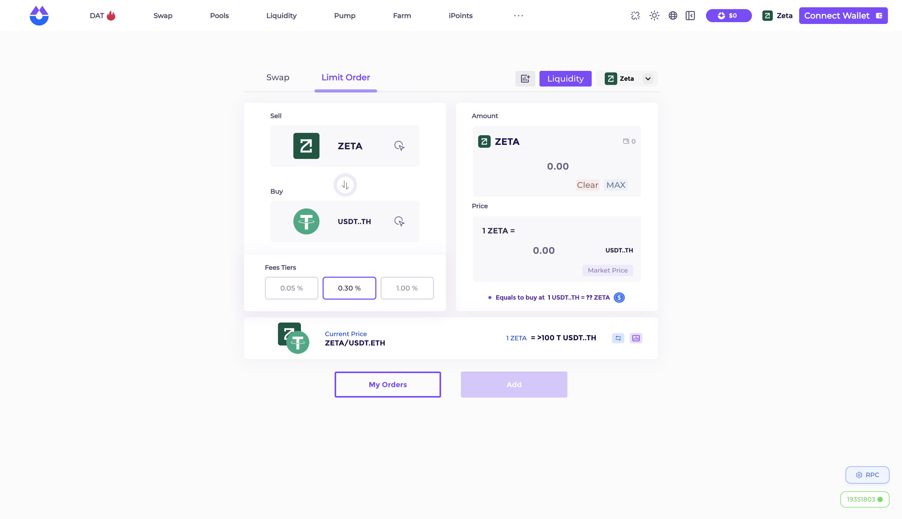 |
| **Liquidity（未连钱包）** | **Farm** |
|  | 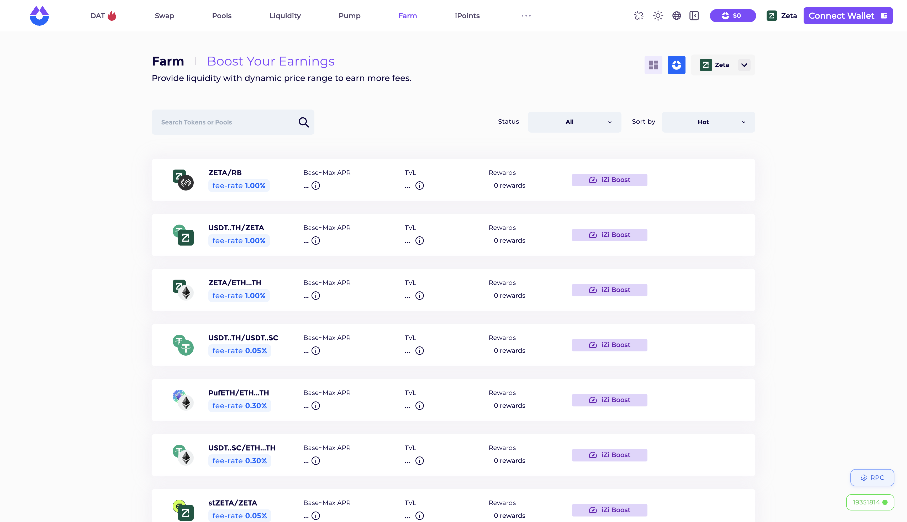 |
| **Pump（Zeta 不支持，无链上交易）** | |
| 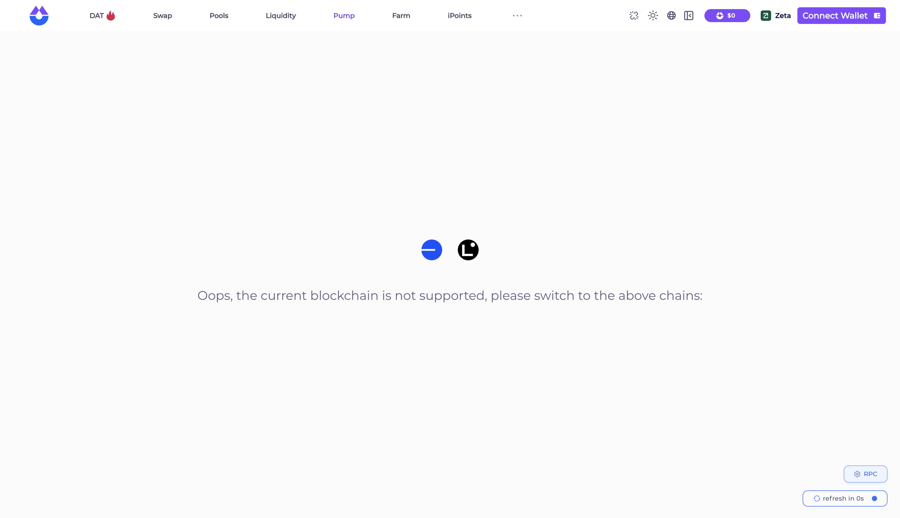 | |

**交易详情（每类一张，均为 zetascan）**

| 1 Swap 按路径（`0x99268d…`） | 2 Swap 单池直连（`0xe64713…`） |
|:-:|:-:|
|  | 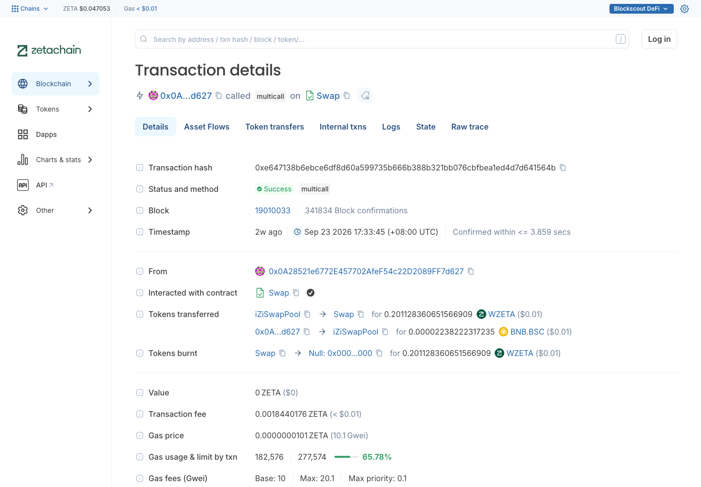 |
| **4 加流动性 开新仓位（`0xa0b589…`）** | **5 追加流动性（`0xd41cdc…`）** |
| 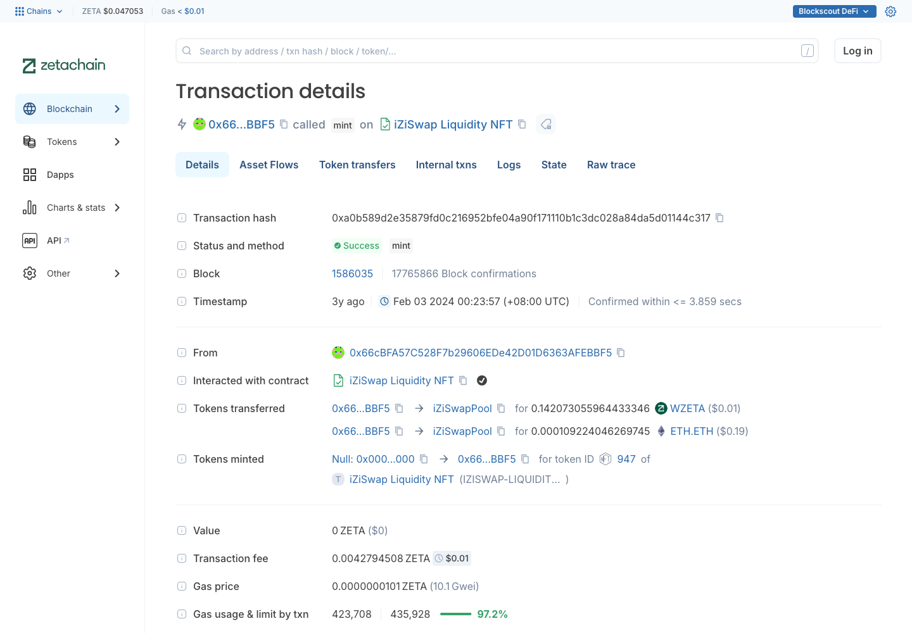 |  |
| **6 减流动性（`0x4c71b1…`）** | **7 只领手续费（`0xddde8f…`）** |
|  | 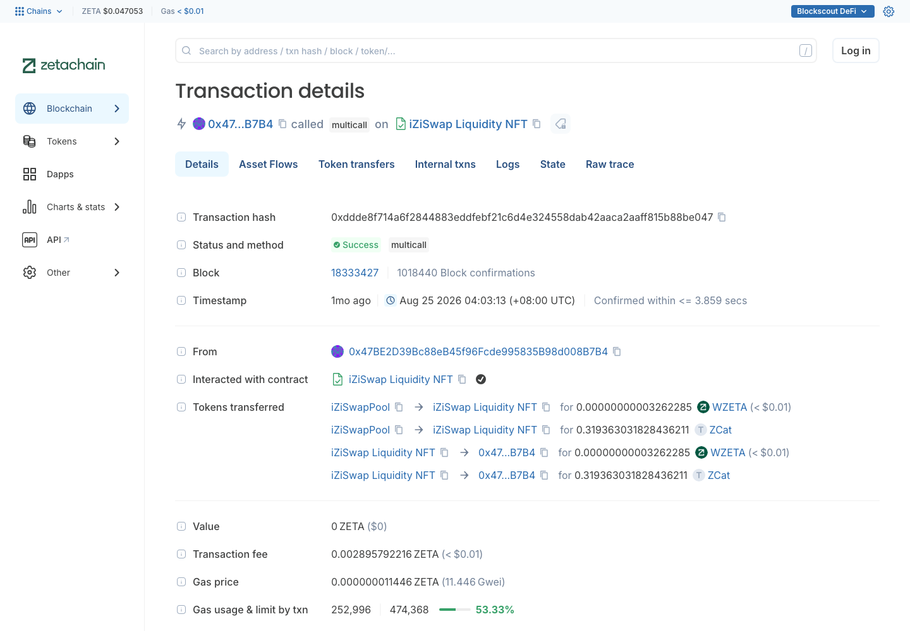 |
| **8 关闭仓位（`0x6bfb97…`）** | **9 限价挂单（`0x24f9b3…`）** |
| 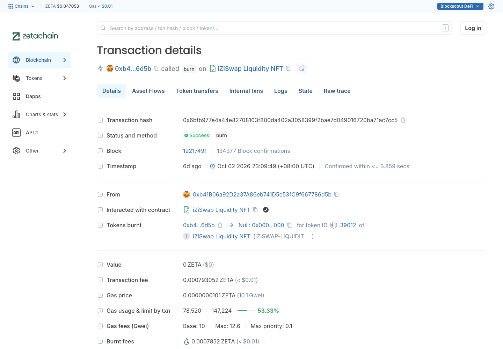 | 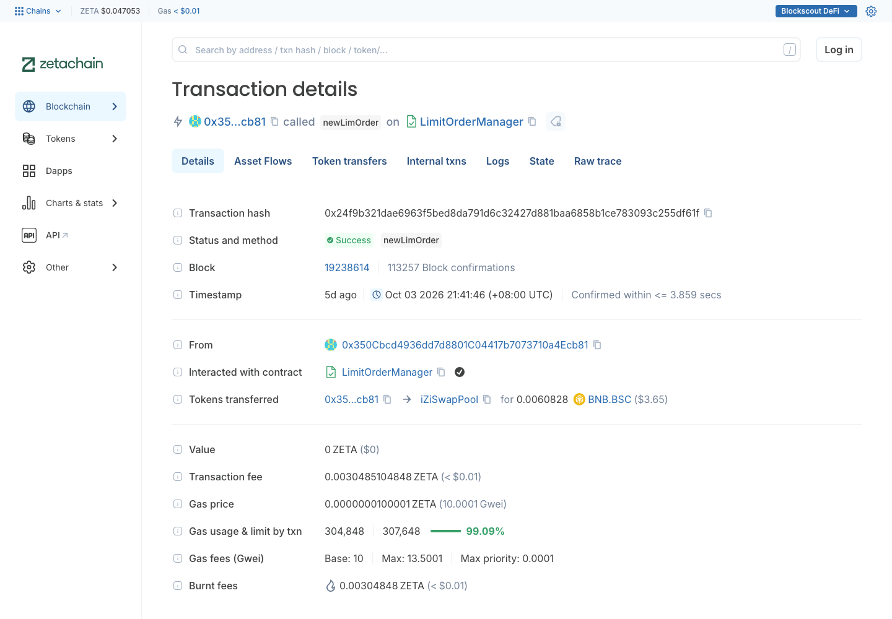 |
| **10 限价撤单（`0x513f81…`）** | **11 限价领取（`0xe7d0a6…`）** |
| 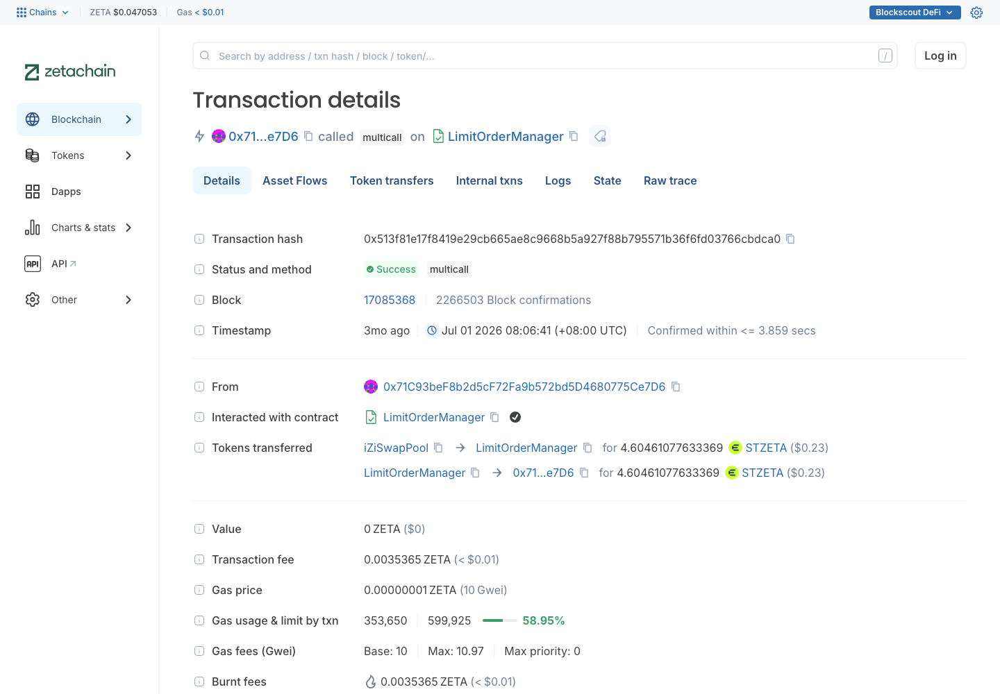 | 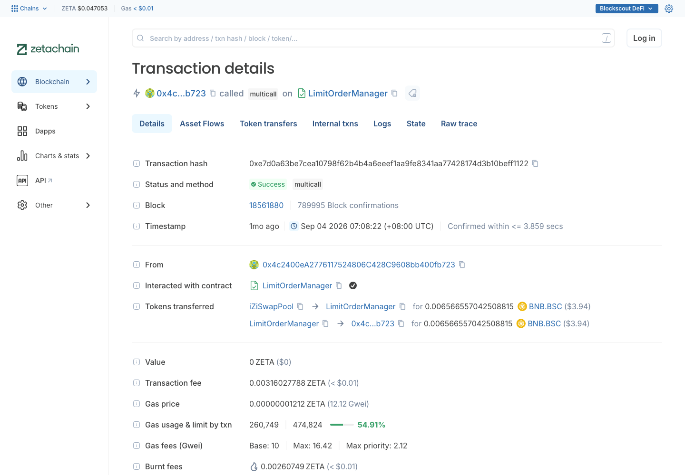 |
| **12 Farm 质押（`0x777645…`）** | **13 Farm 解押（`0x8708c2…`）** |
| 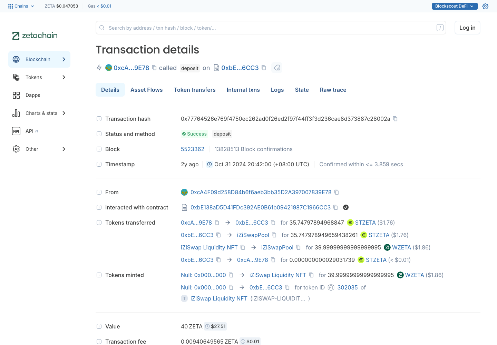 | 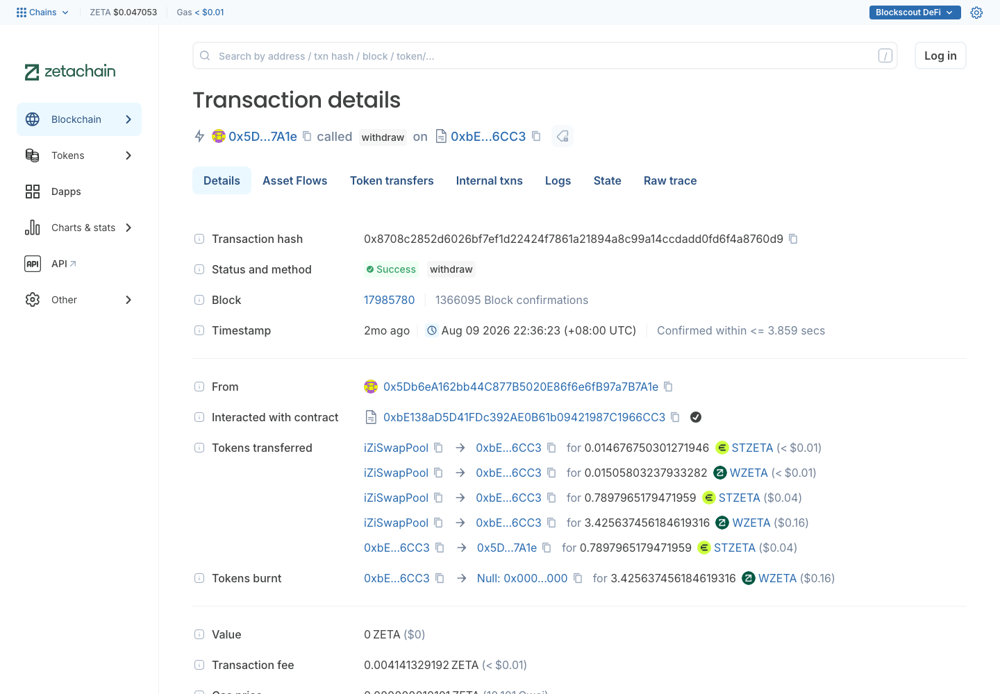 |
| **14 Farm 领全部奖励（`0x42cfbe…`）** | **15 Farm 领单仓位奖励（`0xecb485…`）** |
| 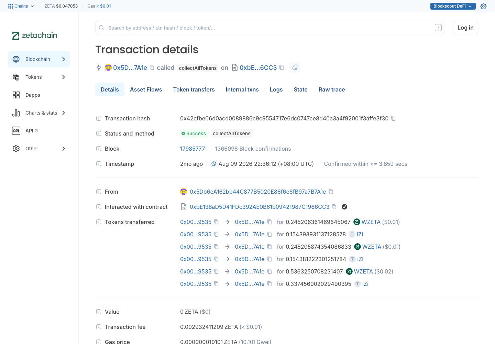 | 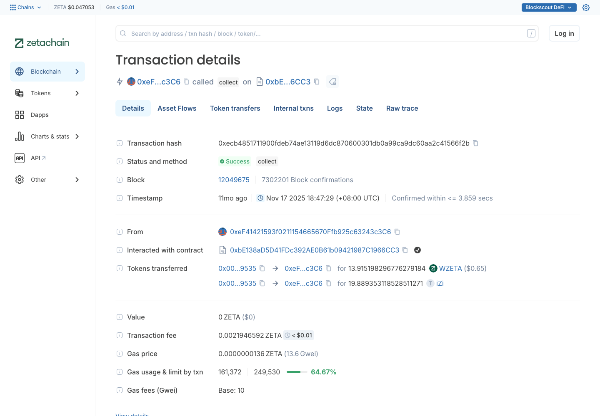 |
| **16 Farm iZi Boost（`0x52e772…`）** | |
| 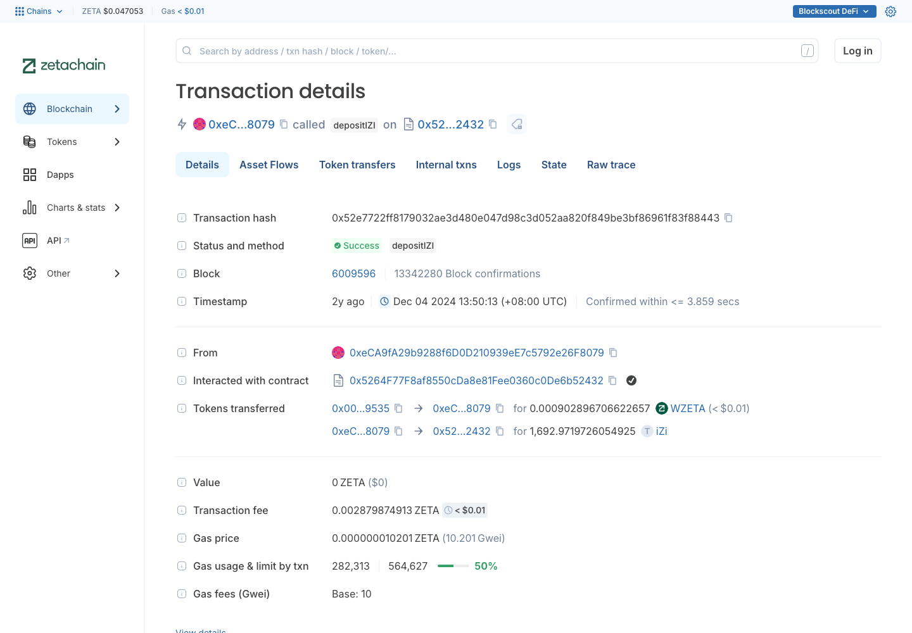 | |

⚠️ 开发注意：
- **非 Uniswap 分叉**，事件是 iZi 自有签名（`AddLiquidity` / `DecLiquidity` / `CollectLiquidity`，限价单 `AddLimitOrder` / `DecLimitOrder` / `CollectLimitOrder`），需单独写解析，不能套 V3 模板；池子里 liquidity = 0 的 `Burn`（只领手续费、Farm 领奖）不能算减流动性。
- Farm 质押时用户直接把两种代币转给 Farm 合约，由 Farm 代为 `mint` LP NFT 并托管（见 #12，NFT 归 Farm 不归用户）；7 个 Farm 合约版本不同，解押方法有 `withdraw(uint256,bool)` 和 `withdraw(uint256,bool,bool)` 两种签名。2024 年早期交易公共 RPC 查 receipt 返回 null，需用 zetascan API 取数。

---

## 4. DYORSwap（V2）

| 项 | 值 |
|---|---|
| 前端 | https://dyorswap.finance/swap?chainId=7000 ｜ 流动性 https://dyorswap.finance/liquidity?chainId=7000 ｜ Lock https://dyorswap.finance/lock/?chainId=7000 ｜ IDO https://dyorswap.finance/presale/?chainId=7000 |
| Factory | `0xa1da7a7eb5a858da410de8fbc5092c2079b58413` |
| Router | `0xcf9dc9afb93bd3ef4fb3cc4df7843abc3c9e169a` |
| LP 锁仓合约（PinkLock02） | `0x74883d282203e81b10dced24faa140aa3bba8e05`（前端配置中 Zeta 对应地址） |
| IDO 合约（currentPresale） | `0x9a292fbbf825c8e00f21c29c04e20f51be868541`（前端配置中 Zeta 对应地址） |
| 示例池 | `0x8536CB49c858DCA1Dd9f7de434B6D63B524984D3`（$ZHIB/WZETA） |
| LP 凭证 | ERC-20 `DYOR LPs` |

### 交易类型覆盖

| # | 交易类型 | 前端入口 | 合约 · 方法 | tx hash |
|---|---|---|---|---|
| 1 | Swap 卖（代币→ZETA，带税代币） | Swap | Router · `swapExactTokensForETHSupportingFeeOnTransferTokens` | [0x54f3d13ce5cf0bd401055e90f6bd6fddd8dad8639fafc45c43fc80d064091bfc](https://zetascan.com/tx/0x54f3d13ce5cf0bd401055e90f6bd6fddd8dad8639fafc45c43fc80d064091bfc) |
| | Swap（代币→代币，带税代币） | | Router · `swapExactTokensForTokensSupportingFeeOnTransferTokens` | [0x590210b68a2d186d45c7acc8ac01765035dd93a2fd3208129bdcc503e130a888](https://zetascan.com/tx/0x590210b68a2d186d45c7acc8ac01765035dd93a2fd3208129bdcc503e130a888) |
| | Swap 卖（同 #1） | | | [0xb3e9ebf8f958d528224fa8e8a891404d3476a504fd07f0a49472c1a4d0dff210](https://zetascan.com/tx/0xb3e9ebf8f958d528224fa8e8a891404d3476a504fd07f0a49472c1a4d0dff210) |
| | Swap 卖（同 #1） | | | [0x614fb9f6f8c95bd1d3340eebe0ddef3189788975f334140bb1c9bebe73c81ba6](https://zetascan.com/tx/0x614fb9f6f8c95bd1d3340eebe0ddef3189788975f334140bb1c9bebe73c81ba6) |
| 2 | 加流动性 | V2 → Add Liquidity | Router · `addLiquidityETH` | [0xb4561cb05983fdc89707c93c7edab59e4b508e5d5fc56349b894b88ccdb52123](https://zetascan.com/tx/0xb4561cb05983fdc89707c93c7edab59e4b508e5d5fc56349b894b88ccdb52123) |
| 3 | 减流动性 | V2 → Remove（需连钱包） | Router · `removeLiquidityETHWithPermit` | [0xa6cc25d1cf3109ddf3af7de9e600e5aa353b359beb9da9bc663ee324af5993ed](https://zetascan.com/tx/0xa6cc25d1cf3109ddf3af7de9e600e5aa353b359beb9da9bc663ee324af5993ed) |
| 4 | LP 锁仓 | Lock → Create your lock | PinkLock02 · `lock` | [0xbbc69dc8e9dca1365a6dfc05f8cbafed428f98b2bc5b8c6245e03c582c60fec8](https://zetascan.com/tx/0xbbc69dc8e9dca1365a6dfc05f8cbafed428f98b2bc5b8c6245e03c582c60fec8) |
| 5 | LP 解锁 | Lock → My LP Lock（需连钱包） | PinkLock02 · `unlock` | [0x1c9c5d3f87ccb0d223379a8bb06d6e72fefed677e2c3e681c2a1dac3bb755110](https://zetascan.com/tx/0x1c9c5d3f87ccb0d223379a8bb06d6e72fefed677e2c3e681c2a1dac3bb755110) |
| 6 | IDO 认购（付 ZETA） | IDO（需连钱包） | Presale · `stake` | [0x679a780c58430aa138192433958ce2d2cab9f657a52648e425d7a7c7c008cb0a](https://zetascan.com/tx/0x679a780c58430aa138192433958ce2d2cab9f657a52648e425d7a7c7c008cb0a) |
| 7 | IDO 领取代币 | IDO（需连钱包） | Presale · `claim` | [0x06e6fe8f6d4dfd57f1a35b8402cbee5475c2dd91abd43ba32f53f998fcc74c97](https://zetascan.com/tx/0x06e6fe8f6d4dfd57f1a35b8402cbee5475c2dd91abd43ba32f53f998fcc74c97) |

页面有入口但**不产生 DYORSwap 在 Zeta 上的交易**：Positions（V3 集中流动性页签，未连钱包直接报错；Zeta 上 DYOR 部署者只部署了 V2 Factory/Router、Lock、IDO，无 V3 合约）、Farms（Zeta 下 404，前端 MasterChef 的 Zeta 地址只是 DYOR 代币占位）、Bridge（跳转外部 Owlto）、Launch（跳转 dyorswap.org，X Layer 发射台，传 chainId=7000 会被重定向回 196）。

### 截图

**前端页面**

| Swap | Liquidity（V2） |
|:-:|:-:|
|  |  |
| **Lock** | **IDO** |
| 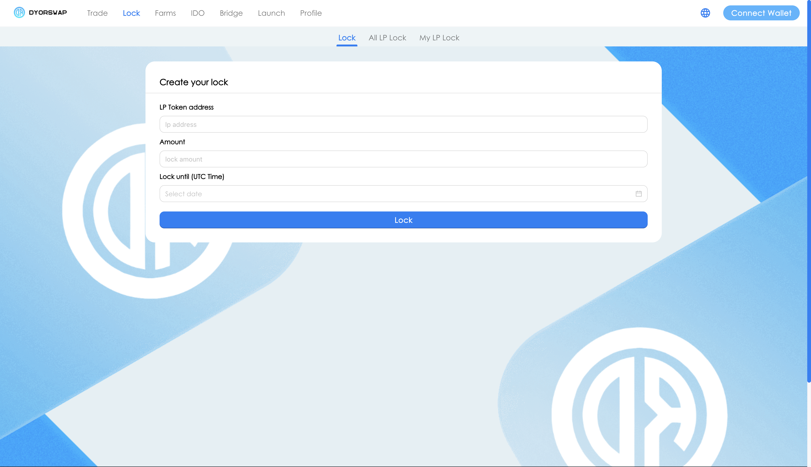 | 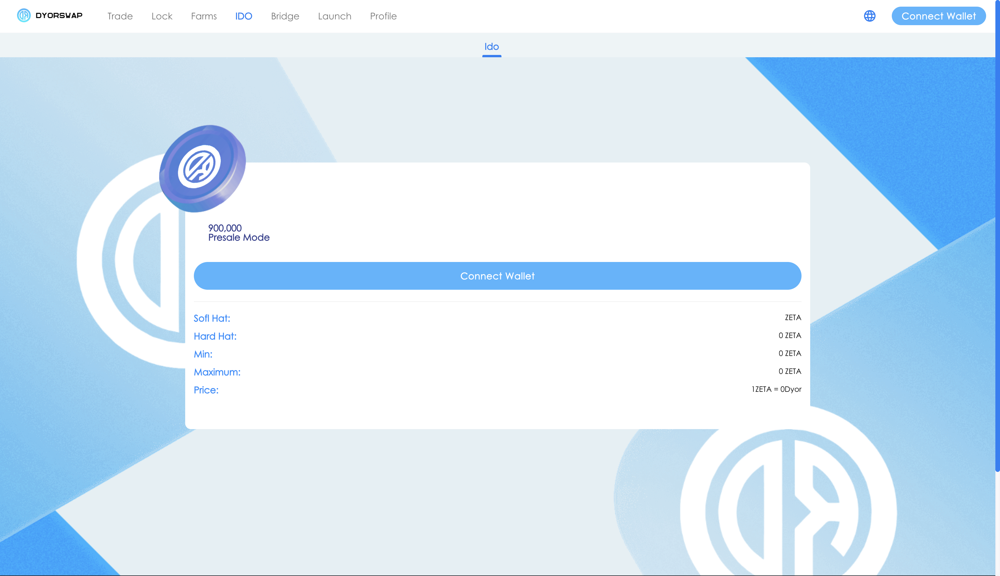 |
| **Positions（报错）/ Farms（404）** | **Launch（X Layer，无 Zeta 交易）** |
| 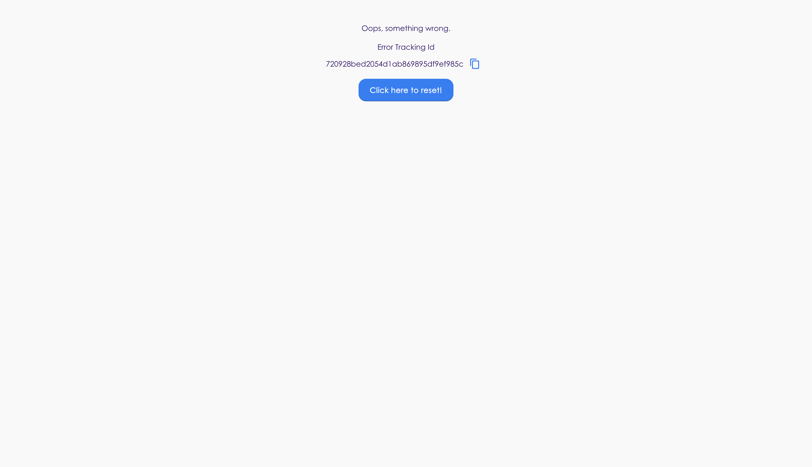 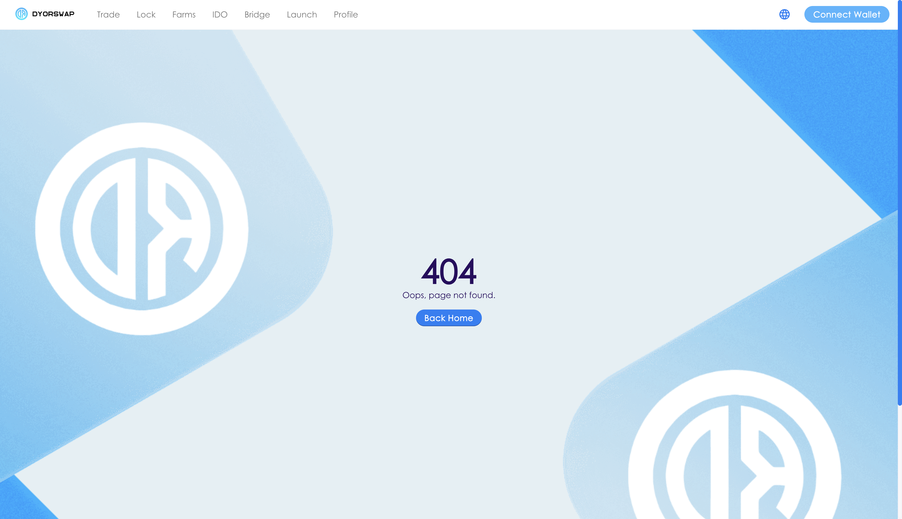 | 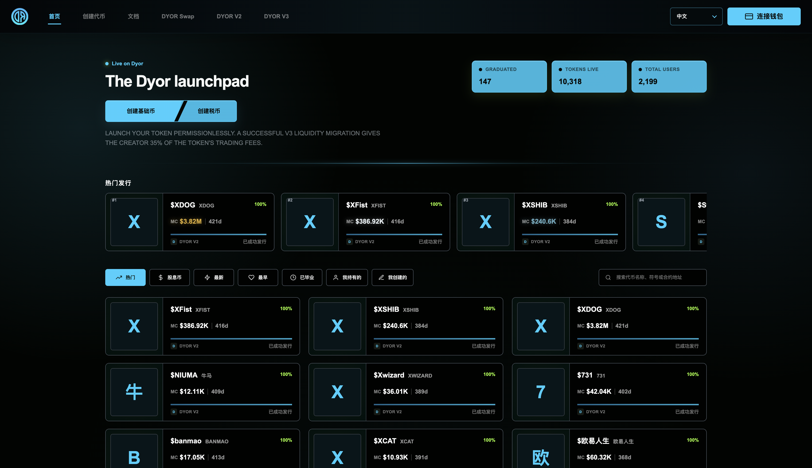 |
| **无头浏览器 CF 拦截存证** | |
|  | |

**交易详情（每类一张，均为 zetascan）**

| 1 Swap（`0x54f3d1…`） | 2 加流动性（`0xb4561c…`） |
|:-:|:-:|
|  |  |
| **3 减流动性（`0xa6cc25…`）** | **4 LP 锁仓（`0xbbc69d…`）** |
|  | 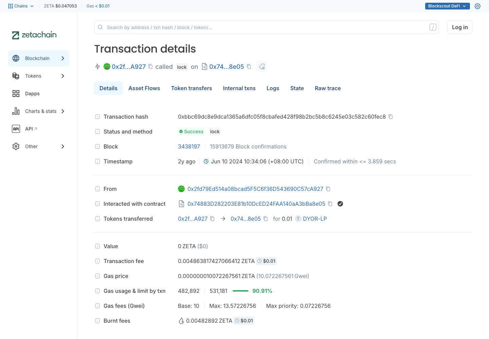 |
| **5 LP 解锁（`0x1c9c5d…`）** | **6 IDO 认购（`0x679a78…`）** |
| 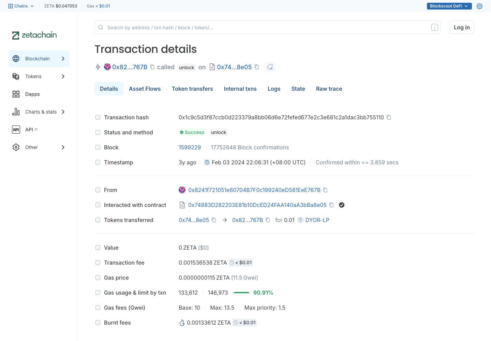 | 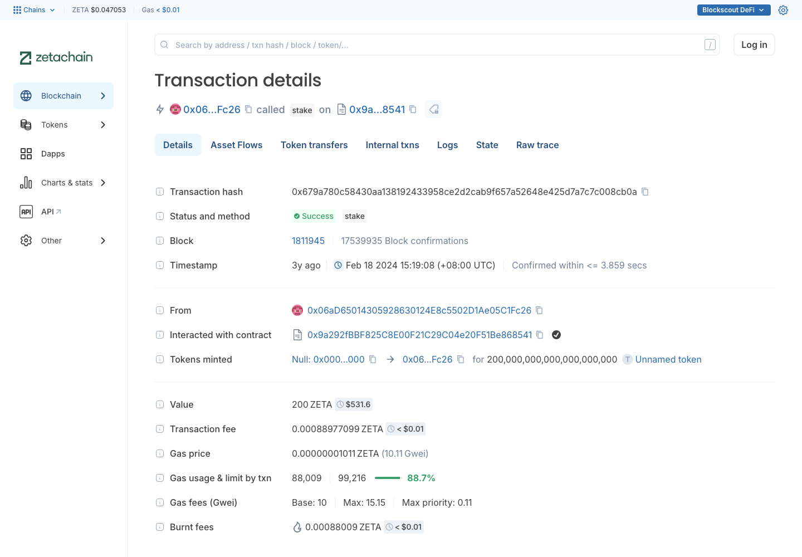 |
| **7 IDO 领取（`0x06e6fe…`）** | |
| 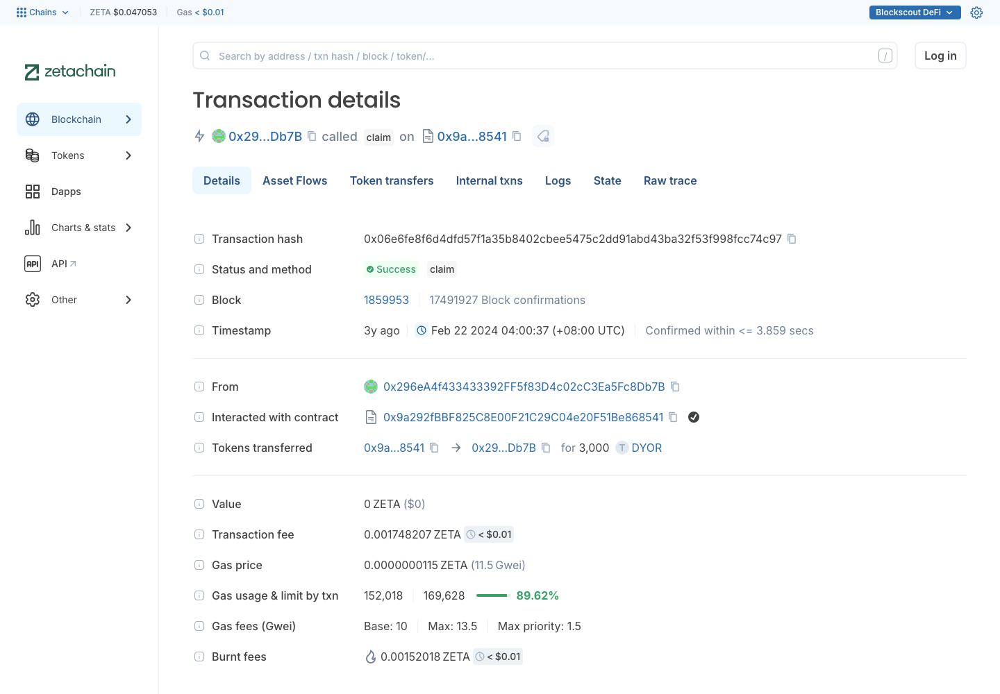 | |

⚠️ 开发注意：
- swap 样本多为 `…SupportingFeeOnTransferTokens`，池子里有转账带税代币，解析金额以池子事件的实际数量为准。
- Lock（#4～5）只是把 LP 代币转入/转出锁仓合约（`LockAdded` / `LockRemoved`），IDO（#6～7）是认购/领币，都不经过池子；两者最后一笔交易分别在 2024-06、2024-02，已基本停用。

---

## 5. Zedaswap（V2）

| 项 | 值 |
|---|---|
| 前端 | 🔴 `zedaswap.xyz` 跳转 GoDaddy 域名待售页 |
| Factory | `0x61db4eecb460b88aa7dcbc9384152bfa2d24f306` |
| Router | `0xb377769689f81b5c82be44a75c55bb50337c11a9` |
| 示例池 | `0x0276d2322cb1bfef7a6a2176c15ba2cf051ab5dc`（WZETA/ZEDA） |
| LP 凭证 | ERC-20（Uniswap V2） |

### 交易类型覆盖

| # | 交易类型 | 前端入口 | 合约 · 方法 | tx hash |
|---|---|---|---|---|
| 1 | Swap 卖（代币→ZETA） | —（前端失效） | Router · `swapExactTokensForETHSupportingFeeOnTransferTokens` | [0x43d891158b41c5174b7999f21d0e5d44fcd6b01377f227ebd80375f7959075c2](https://zetascan.com/tx/0x43d891158b41c5174b7999f21d0e5d44fcd6b01377f227ebd80375f7959075c2) |
| | Swap 买（ZETA→代币） | | Router · `swapExactETHForTokens` | [0x11368cbbfc337b93d90492b96ff9fd02850aa6dd43e0f6ff43237d69772e51c5](https://zetascan.com/tx/0x11368cbbfc337b93d90492b96ff9fd02850aa6dd43e0f6ff43237d69772e51c5) |
| | Swap（经 OKX DEX 代理合约） | | `0x0dab5a52…` · `unxswapByOrderId` | [0x6841183cd594de1885435e48d62161fd4eb3b57a48523c7f5dfabaed56562b2a](https://zetascan.com/tx/0x6841183cd594de1885435e48d62161fd4eb3b57a48523c7f5dfabaed56562b2a) |
| | Swap（同上） | | | [0xd8bf10d50cd943974b4334298f2973ca4ae5834d52d6c783026e03c1944ac487](https://zetascan.com/tx/0xd8bf10d50cd943974b4334298f2973ca4ae5834d52d6c783026e03c1944ac487) |
| 2 | 加流动性 | —（前端失效） | Router · `addLiquidityETH` | [0x24884ff6d702ceeb812028bd037201796cd35eaf3c868847680f3d665dd391b8](https://zetascan.com/tx/0x24884ff6d702ceeb812028bd037201796cd35eaf3c868847680f3d665dd391b8) |
| 3 | 减流动性 | —（前端失效） | Router · `removeLiquidityWithPermit` | [0x4463c42e9bb18d7c595eb9dbdffbee3691560ede166cc3f423bfb6120c18d860](https://zetascan.com/tx/0x4463c42e9bb18d7c595eb9dbdffbee3691560ede166cc3f423bfb6120c18d860) |

### 截图

| 域名待售（前端失效存证） | 1 Swap（`0x43d891…`） |
|:-:|:-:|
|  |  |
| **2 加流动性（`0x24884f…`）** | **3 减流动性（`0x4463c4…`）** |
|  |  |

⚠️ 开发注意：部分 swap 经 OKX DEX 代理合约路由，**解析请以池子事件为准**。

---

## 待确认

- Zuno（占 64%）前端失效，需确认是否有新域名；EddyFinance（NXDOMAIN）、Zedaswap（域名待售）疑似停运，是否还接（均不影响按合约接入）
- iZiSwap 限价单（#9～11）、Farm（#12～16）以及 DYORSwap Lock / IDO（#4～7）是否纳入解析范围
- Zuno `burn`、iZiSwap 指定输出 swap 链上暂无样本，是否按标准 ABI 预留解析
