# ZetaChain — DEX 协议调研

> **链**：ZetaChain ｜ chainId **7000** ｜ 浏览器 https://zetascan.com ｜ RPC `https://zetachain-evm.blockpi.network/v1/rpc/public`
> **调研日期**：2026-09-29 ｜ hash 均为链上公开交易（非本人钱包），已逐条确认成功

## 协议总览

| # | 协议 | 类型 | 入选理由 | 前端 | hash |
|---|---|---|---|:-:|:-:|
| 1 | Zuno | Uniswap V3 式 CLMM | 交易量 64.1% | 🔴 域名失效 | ✅ |
| 2 | EddyFinance | Uniswap V2 式 | OKX 支持，交易量 33.8% | 🔴 域名失效 | ✅ |
| 3 | iZiSwap | DL-AMM（iZUMi 自研） | OKX 支持 | ✅ | ✅ |
| 4 | DYORSwap | Uniswap V2 式 | OKX 支持 | ✅ | ✅ |
| 5 | Zedaswap | Uniswap V2 式 | OKX 支持 | 🔴 域名待售 | ✅ |

5 个协议合计覆盖 99.7% 交易量（链日交易量仅约 $5.5K）。

---

## 1. Zuno（V3 / CLMM）

| 项 | 值 |
|---|---|
| 前端 | 🔴 `app.zunodex.xyz` 无 DNS 解析（旧域名 app.zetaswap.com 跳转过去同样打不开） |
| Factory | `0x9f48ddad075e569cdc70d657d3ac171e23846009` |
| NonfungiblePositionManager | `0xaf2403dd44b3c589f12680e715a8bbeb5b4b8471` |
| 示例池 | `0x999a3e9a2cb64f359f581afa0335bf4343622d1f`（USDC.ETH/WZETA，fee 0.3%） |
| LP 凭证 | NFT `Uniswap V3 Positions NFT-V1` |

| 行为 | tx hash | 截图 |
|---|---|---|
| Swap | [0x27d0f04c26241d0d19843a95ff0bc6a5c8c55d0f18122e45a6bf687faa43754b](https://zetascan.com/tx/0x27d0f04c26241d0d19843a95ff0bc6a5c8c55d0f18122e45a6bf687faa43754b) | 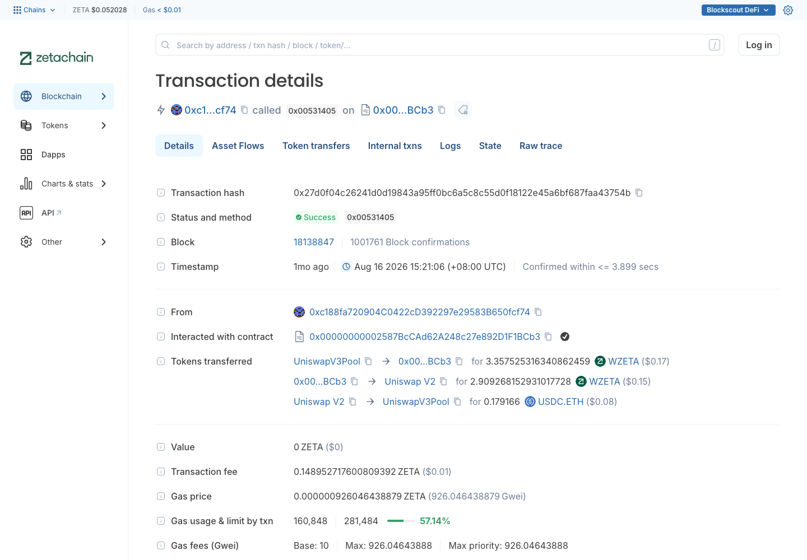 |
| Swap | [0x6f12badd7457e71f3f54dde24aeb05b179214e2f243145824cfaa7a2adc658d7](https://zetascan.com/tx/0x6f12badd7457e71f3f54dde24aeb05b179214e2f243145824cfaa7a2adc658d7) | |
| Swap | [0xb2fcb6fa896c534f4346acc10ae8da6d7de1d3230202e48534b42a68d7c84d52](https://zetascan.com/tx/0xb2fcb6fa896c534f4346acc10ae8da6d7de1d3230202e48534b42a68d7c84d52) | |
| Swap | [0x32ea0172d6f54f540ab2147d701e1272ab68cf08c009047f442a021953523129](https://zetascan.com/tx/0x32ea0172d6f54f540ab2147d701e1272ab68cf08c009047f442a021953523129) | |
| 加流动性 | [0xef7be47db89166c819d47bef999861c1637a0cfd10fce858b793b2828d9a06a8](https://zetascan.com/tx/0xef7be47db89166c819d47bef999861c1637a0cfd10fce858b793b2828d9a06a8) | 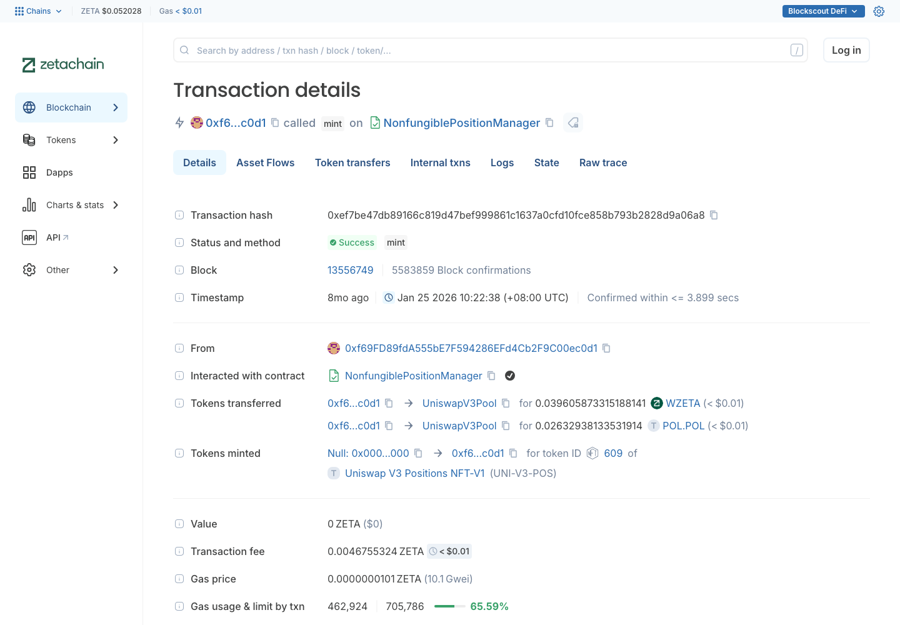 |
| 减流动性 | [0x8445e13529fe14a12e92a88bd736b620f2e56cfe227f2c7389c8fe4b2e59fa83](https://zetascan.com/tx/0x8445e13529fe14a12e92a88bd736b620f2e56cfe227f2c7389c8fe4b2e59fa83) | 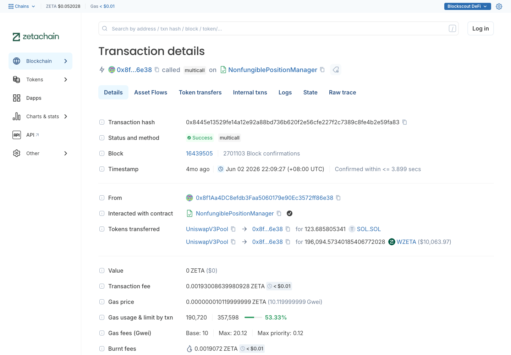 |

前端截图：无（域名无解析）

⚠️ 开发注意：Router 未确认，4 条 swap 都由套利合约 `0x00000000002587bccad62a248c27e892d1f1bcb3` 发起，**解析请以池子事件为准**。

---

## 2. EddyFinance（V2）

| 项 | 值 |
|---|---|
| 前端 | 🔴 `eddy.finance` 整个域名 NXDOMAIN |
| Factory | `0x9fd96203f7b22bcf72d9dcb40ff98302376ce09c` |
| Router | `0x2ca7d64a7efe2d62a725e2b35cf7230d6677ffee` |
| 示例池 | `0x16ef1b018026e389fda93c1e993e987cf6e852e7`（WZETA/ETH.ETH） |
| LP 凭证 | ERC-20（UniswapV2Pair） |

| 行为 | tx hash | 截图 |
|---|---|---|
| Swap | [0xd148d9b58599babb1911ad94da90e4882fef94734cbed8e9c90da474dcac9d20](https://zetascan.com/tx/0xd148d9b58599babb1911ad94da90e4882fef94734cbed8e9c90da474dcac9d20) | 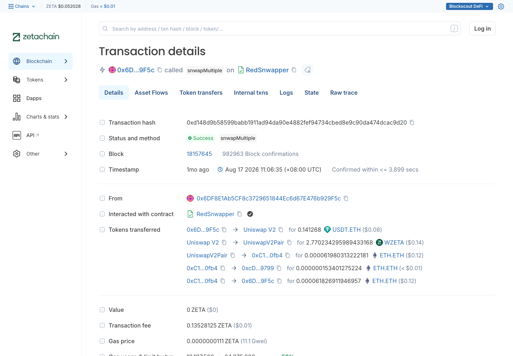 |
| Swap | [0x48cab76b2f9cf93701c9bee9fb8cf242a2679122fdedb6422cabf80d79cd8a58](https://zetascan.com/tx/0x48cab76b2f9cf93701c9bee9fb8cf242a2679122fdedb6422cabf80d79cd8a58) | |
| Swap | [0x624344ada412a980b12eb9e87f7ba43ff3eedb05966ef0fed0b06be083a8b163](https://zetascan.com/tx/0x624344ada412a980b12eb9e87f7ba43ff3eedb05966ef0fed0b06be083a8b163) | |
| Swap | [0xe5ba85d248413bef3bed664cbffb6f7ca2bc583c13544bd502dd42be358e83a9](https://zetascan.com/tx/0xe5ba85d248413bef3bed664cbffb6f7ca2bc583c13544bd502dd42be358e83a9) | |
| 加流动性 | [0x87370cce497389b6c08b1f4658ebe81fa7d80929e2502027c0cf7c1971326759](https://zetascan.com/tx/0x87370cce497389b6c08b1f4658ebe81fa7d80929e2502027c0cf7c1971326759) | 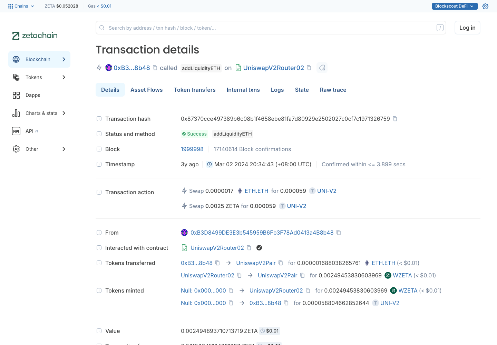 |
| 减流动性 | [0xe6c2a69c3ddf6c92c42821c4096e586f883cbb90a861943e58626568328d53d8](https://zetascan.com/tx/0xe6c2a69c3ddf6c92c42821c4096e586f883cbb90a861943e58626568328d53d8) | 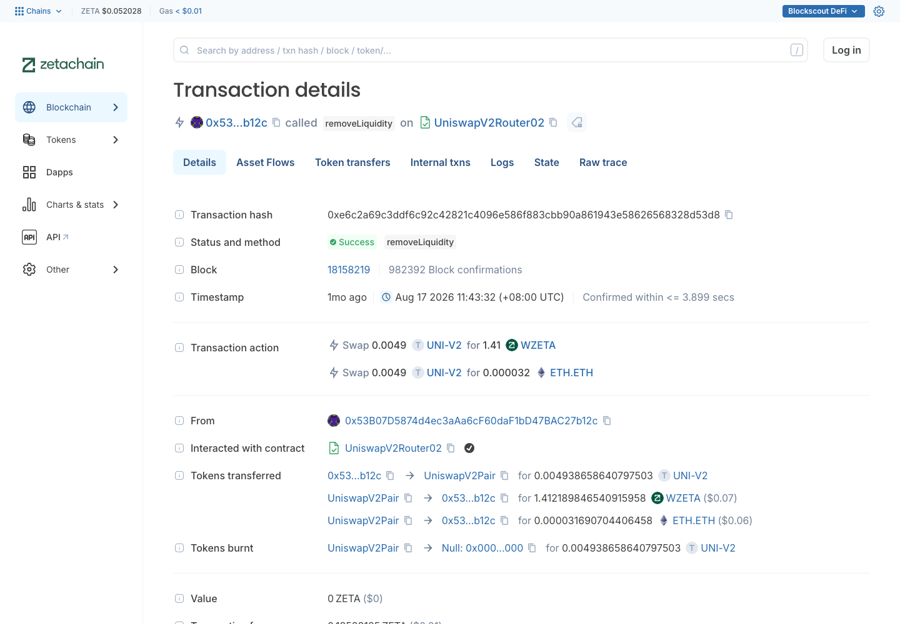 |

前端截图：无（域名 NXDOMAIN）

⚠️ 开发注意：4 条 swap 全部经聚合器（Sushi RedSnwapper、OKX DexRouter 等）路由，**解析请以池子事件为准，不要按 Router 白名单过滤**。

---

## 3. iZiSwap（DL-AMM）

| 项 | 值 |
|---|---|
| 前端 | https://izumi.finance/trade/swap ｜ 流动性 https://izumi.finance/trade/pools （需手动切链到 Zeta，URL 参数无效） |
| Factory | `0x8c7d3063579bdb0b90997e18a770eae32e1ebb08` |
| Swap Router | `0x34bc1b87f60e0a30c0e24fd7abada70436c71406` |
| Liquidity NFT（仓位管理） | `0x2db0afd0045f3518c77ec6591a542e326befd3d7` |
| 示例池 | `0x244D9FA157FA84eE1aF3c10e279c42578a4B1a4a`（fee 1%） |
| LP 凭证 | NFT `iZiSwap Liquidity NFT` |

| 行为 | tx hash | 截图 |
|---|---|---|
| Swap | [0x99268dbf3af1ea10ce48ced8657234908dd621521d156a6da78feb927bbc97e9](https://zetascan.com/tx/0x99268dbf3af1ea10ce48ced8657234908dd621521d156a6da78feb927bbc97e9) | 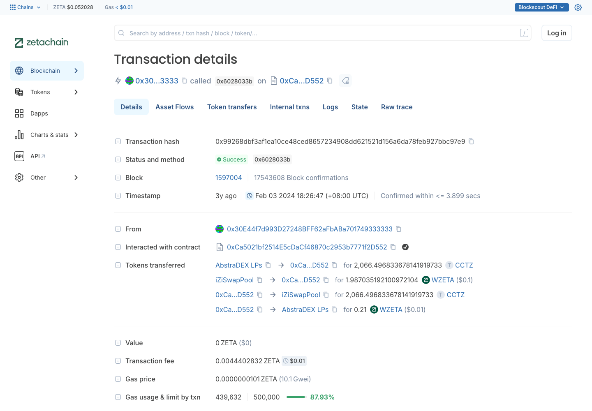 |
| Swap | [0xf65dd89d21b3bbef010745e44008be3259be9ca0d919c144f36fe7c8ab4e8441](https://zetascan.com/tx/0xf65dd89d21b3bbef010745e44008be3259be9ca0d919c144f36fe7c8ab4e8441) | |
| Swap | [0x7b0435cad73dfa10ad7b1d44b48dd01a8726dc53eb4223c7f71761c16c8ddb03](https://zetascan.com/tx/0x7b0435cad73dfa10ad7b1d44b48dd01a8726dc53eb4223c7f71761c16c8ddb03) | |
| Swap | [0xb6fe9ede6b219ac6476ab9ad847efe64cd9c86b8ac12fcab6f0e03a29a8b0c3d](https://zetascan.com/tx/0xb6fe9ede6b219ac6476ab9ad847efe64cd9c86b8ac12fcab6f0e03a29a8b0c3d) | |
| 加流动性 | [0xd41cdce49dc867c4cd55de8d84cfc6ea3a592263739d5c90f377883b62967c0e](https://zetascan.com/tx/0xd41cdce49dc867c4cd55de8d84cfc6ea3a592263739d5c90f377883b62967c0e) | 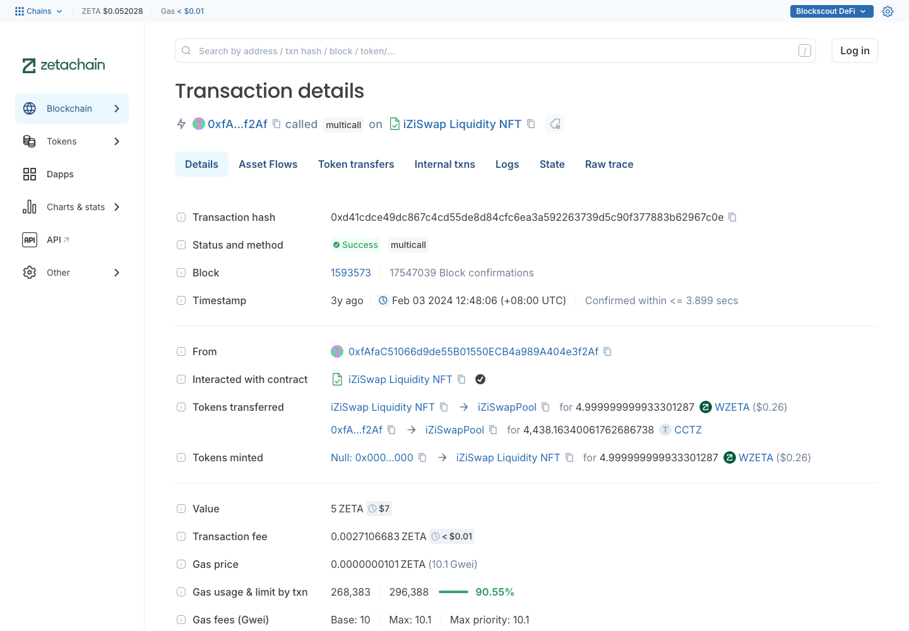 |
| 减流动性 | [0x4c71b13fc02cccebcc2c29afe38c27a62a0f842af8a9d896585d1fc9ffeb47ba](https://zetascan.com/tx/0x4c71b13fc02cccebcc2c29afe38c27a62a0f842af8a9d896585d1fc9ffeb47ba) | 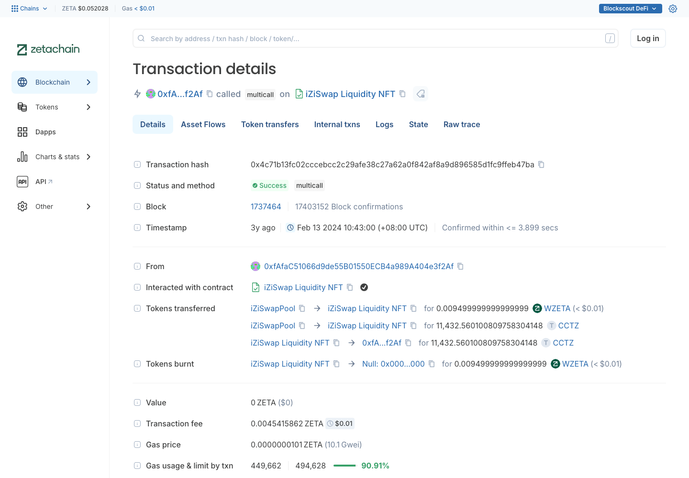 |

前端截图：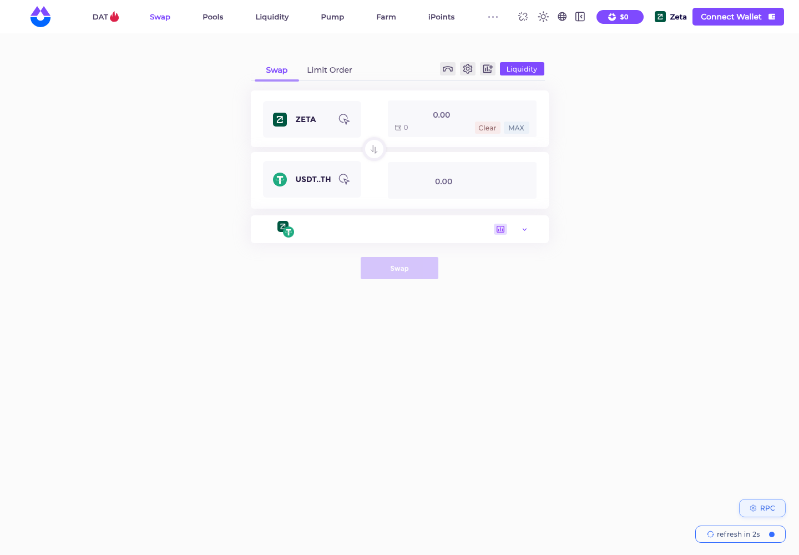 ｜ 

⚠️ 开发注意：非 Uniswap 分叉，事件是 iZi 自有签名（如 `Burn` + `DecLiquidity` + `CollectLiquidity`），**需单独写解析，不能套 V3 模板**；2024 年早期交易公共 RPC 查 receipt 返回 null，需用 zetascan API 取数。

---

## 4. DYORSwap（V2）

| 项 | 值 |
|---|---|
| 前端 | https://dyorswap.finance/swap?chainId=7000 ｜ 流动性 https://dyorswap.finance/liquidity?chainId=7000 |
| Factory | `0xa1da7a7eb5a858da410de8fbc5092c2079b58413` |
| Router | `0xcf9dc9afb93bd3ef4fb3cc4df7843abc3c9e169a` |
| 示例池 | `0x8536CB49c858DCA1Dd9f7de434B6D63B524984D3`（$ZHIB/WZETA） |
| LP 凭证 | ERC-20 `DYOR LPs` |

| 行为 | tx hash | 截图 |
|---|---|---|
| Swap | [0x54f3d13ce5cf0bd401055e90f6bd6fddd8dad8639fafc45c43fc80d064091bfc](https://zetascan.com/tx/0x54f3d13ce5cf0bd401055e90f6bd6fddd8dad8639fafc45c43fc80d064091bfc) | 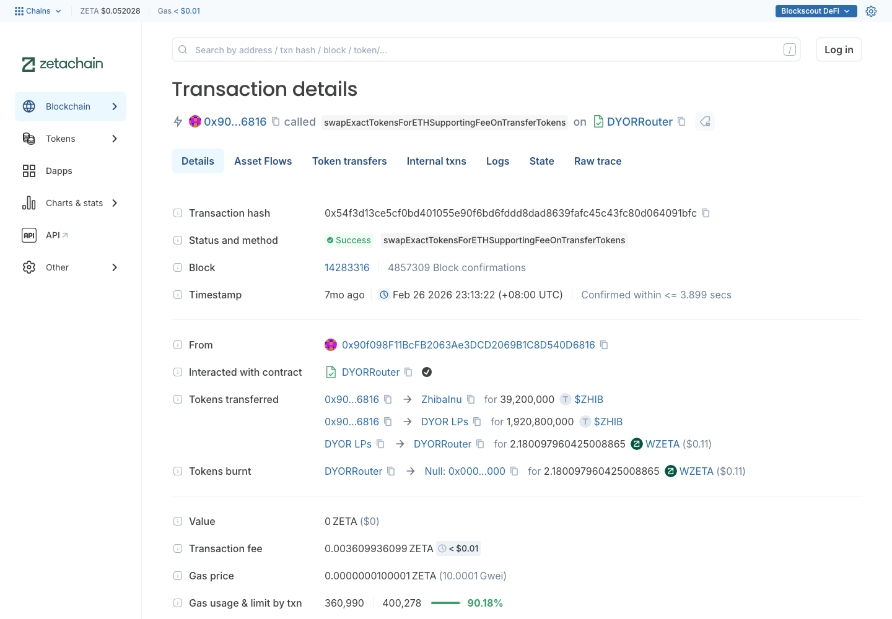 |
| Swap | [0x590210b68a2d186d45c7acc8ac01765035dd93a2fd3208129bdcc503e130a888](https://zetascan.com/tx/0x590210b68a2d186d45c7acc8ac01765035dd93a2fd3208129bdcc503e130a888) | |
| Swap | [0xb3e9ebf8f958d528224fa8e8a891404d3476a504fd07f0a49472c1a4d0dff210](https://zetascan.com/tx/0xb3e9ebf8f958d528224fa8e8a891404d3476a504fd07f0a49472c1a4d0dff210) | |
| Swap | [0x614fb9f6f8c95bd1d3340eebe0ddef3189788975f334140bb1c9bebe73c81ba6](https://zetascan.com/tx/0x614fb9f6f8c95bd1d3340eebe0ddef3189788975f334140bb1c9bebe73c81ba6) | |
| 加流动性 | [0xb4561cb05983fdc89707c93c7edab59e4b508e5d5fc56349b894b88ccdb52123](https://zetascan.com/tx/0xb4561cb05983fdc89707c93c7edab59e4b508e5d5fc56349b894b88ccdb52123) | 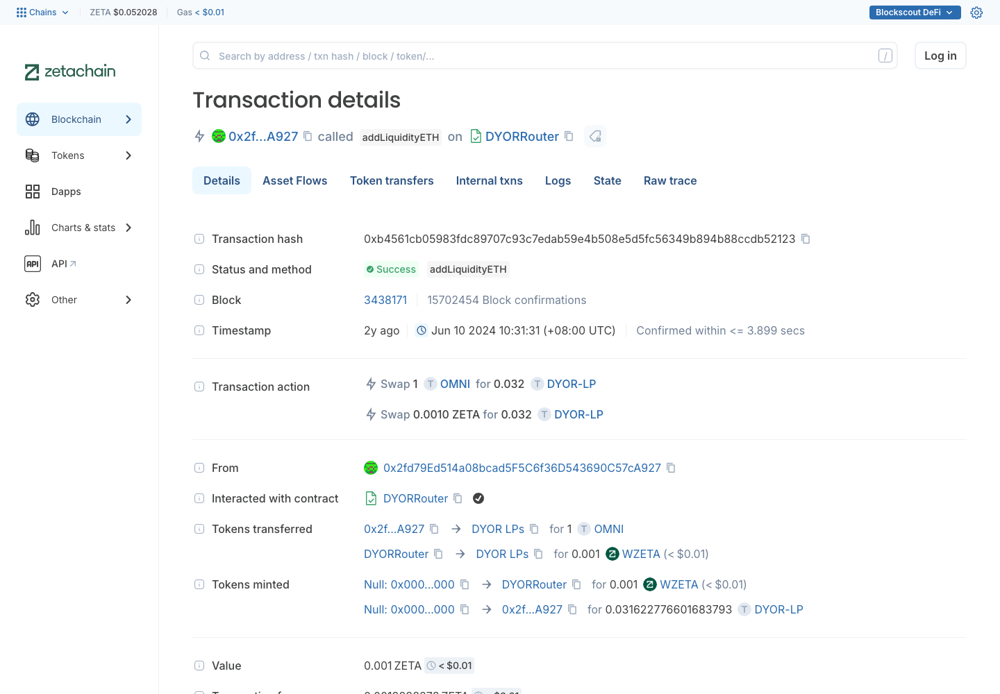 |
| 减流动性 | [0xa6cc25d1cf3109ddf3af7de9e600e5aa353b359beb9da9bc663ee324af5993ed](https://zetascan.com/tx/0xa6cc25d1cf3109ddf3af7de9e600e5aa353b359beb9da9bc663ee324af5993ed) | 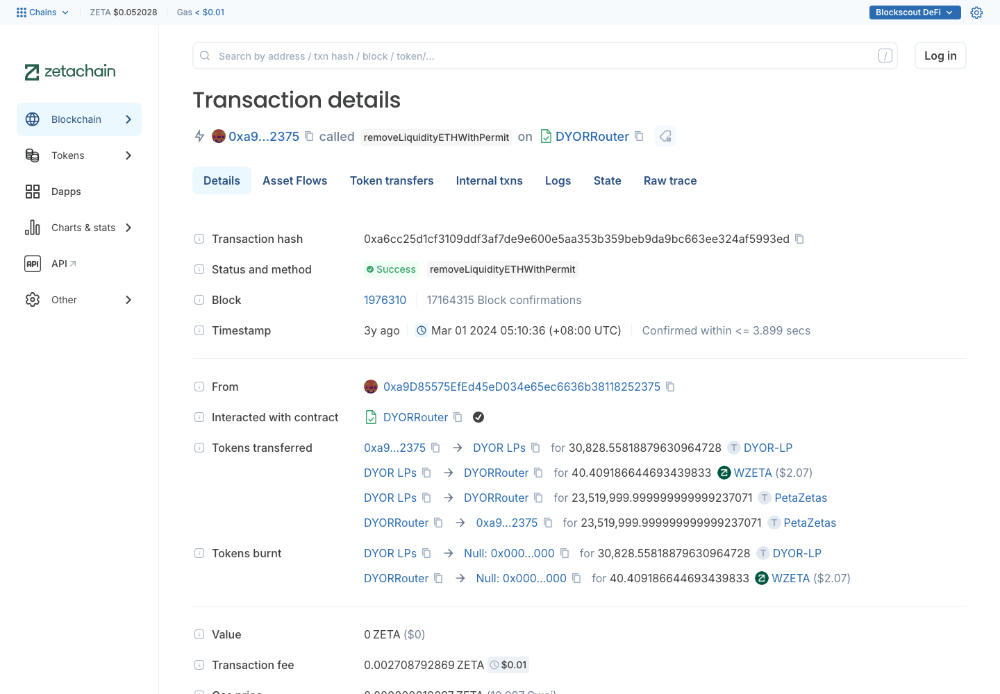 |

前端截图：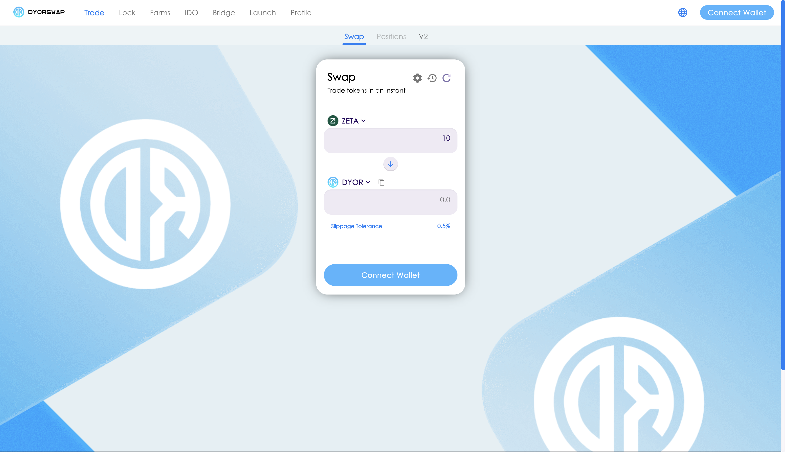 ｜ 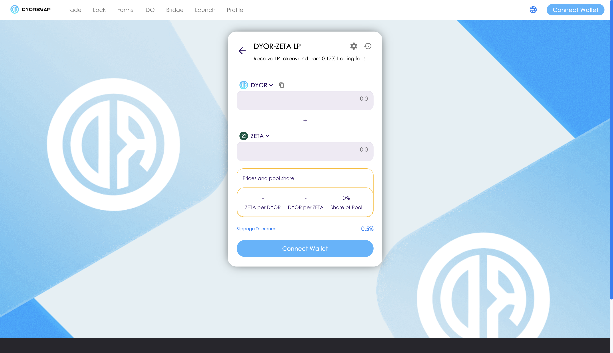 ｜ 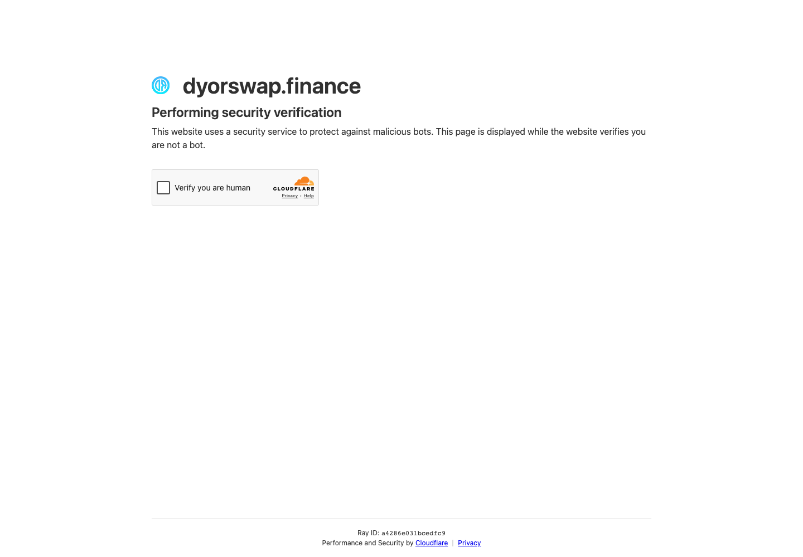

⚠️ 开发注意：swap 样本里有 `swapExactTokensForETHSupportingFeeOnTransferTokens`，说明池子里有转账带税代币，解析金额时以池子事件的实际数量为准。

---

## 5. Zedaswap（V2）

| 项 | 值 |
|---|---|
| 前端 | 🔴 `zedaswap.xyz` 跳转 GoDaddy 域名待售页 |
| Factory | `0x61db4eecb460b88aa7dcbc9384152bfa2d24f306` |
| Router | `0xb377769689f81b5c82be44a75c55bb50337c11a9` |
| 示例池 | `0x0276d2322cb1bfef7a6a2176c15ba2cf051ab5dc`（WZETA/ZEDA） |
| LP 凭证 | ERC-20（Uniswap V2） |

| 行为 | tx hash | 截图 |
|---|---|---|
| Swap | [0x43d891158b41c5174b7999f21d0e5d44fcd6b01377f227ebd80375f7959075c2](https://zetascan.com/tx/0x43d891158b41c5174b7999f21d0e5d44fcd6b01377f227ebd80375f7959075c2) | 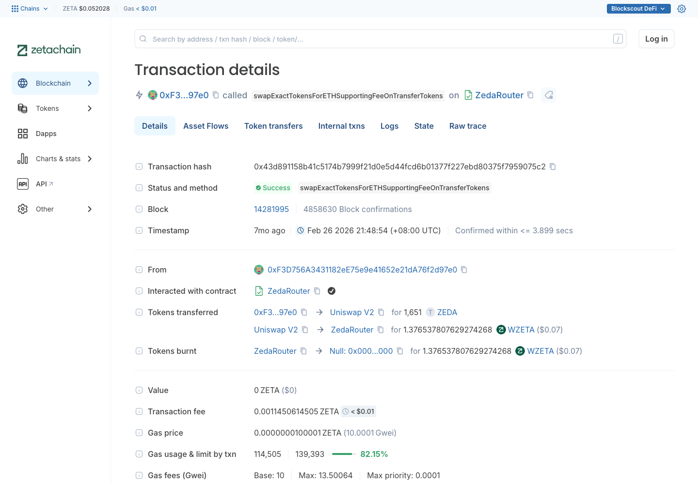 |
| Swap | [0x11368cbbfc337b93d90492b96ff9fd02850aa6dd43e0f6ff43237d69772e51c5](https://zetascan.com/tx/0x11368cbbfc337b93d90492b96ff9fd02850aa6dd43e0f6ff43237d69772e51c5) | |
| Swap | [0x6841183cd594de1885435e48d62161fd4eb3b57a48523c7f5dfabaed56562b2a](https://zetascan.com/tx/0x6841183cd594de1885435e48d62161fd4eb3b57a48523c7f5dfabaed56562b2a) | |
| Swap | [0xd8bf10d50cd943974b4334298f2973ca4ae5834d52d6c783026e03c1944ac487](https://zetascan.com/tx/0xd8bf10d50cd943974b4334298f2973ca4ae5834d52d6c783026e03c1944ac487) | |
| 加流动性 | [0x24884ff6d702ceeb812028bd037201796cd35eaf3c868847680f3d665dd391b8](https://zetascan.com/tx/0x24884ff6d702ceeb812028bd037201796cd35eaf3c868847680f3d665dd391b8) | 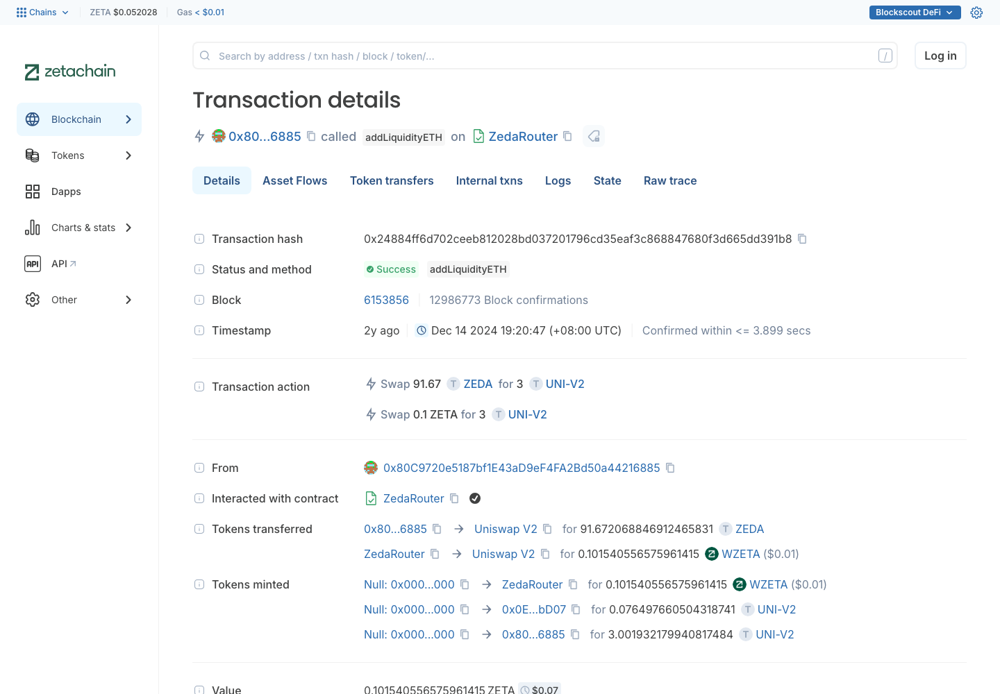 |
| 减流动性 | [0x4463c42e9bb18d7c595eb9dbdffbee3691560ede166cc3f423bfb6120c18d860](https://zetascan.com/tx/0x4463c42e9bb18d7c595eb9dbdffbee3691560ede166cc3f423bfb6120c18d860) | 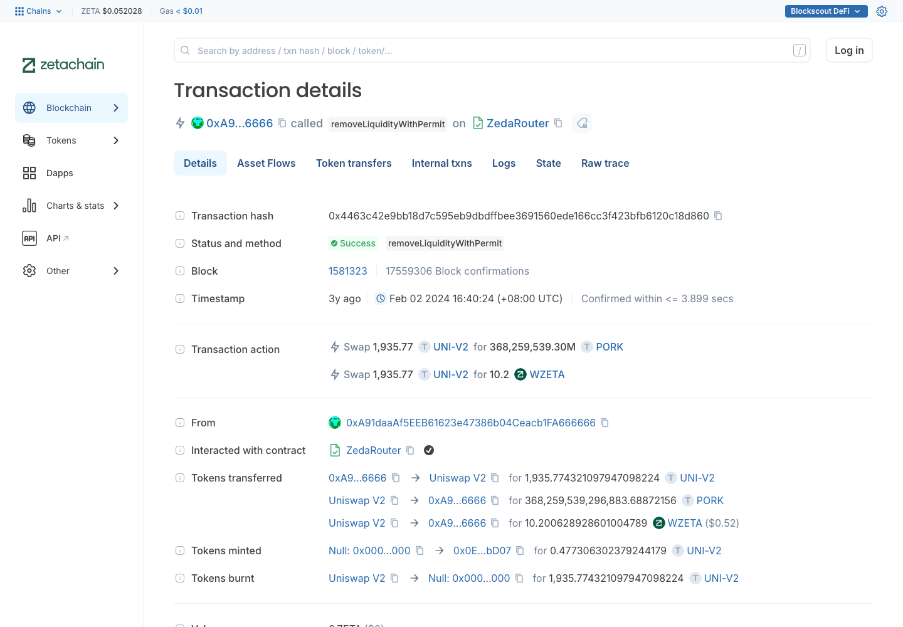 |

前端截图：无（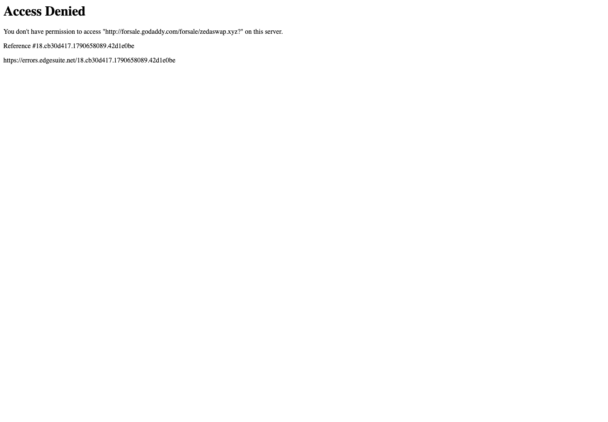）

⚠️ 开发注意：`0x6841…` / `0xd8bf…` 两条 swap 经 OKX DEX 代理合约路由，**解析请以池子事件为准**。

---

## 待确认

- Zuno（占 64%）前端失效，需确认是否有新域名；不影响按合约接入
- EddyFinance（域名 NXDOMAIN）、Zedaswap（域名待售）疑似停运，是否还接
