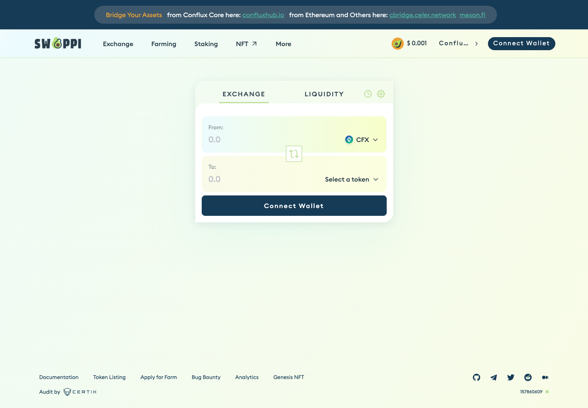
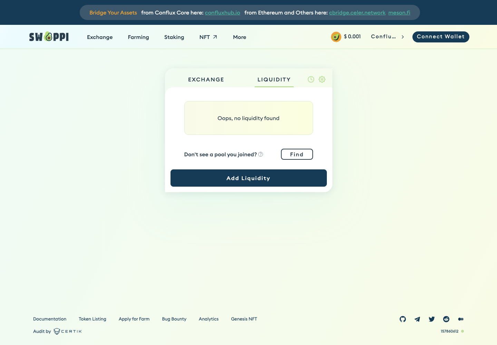
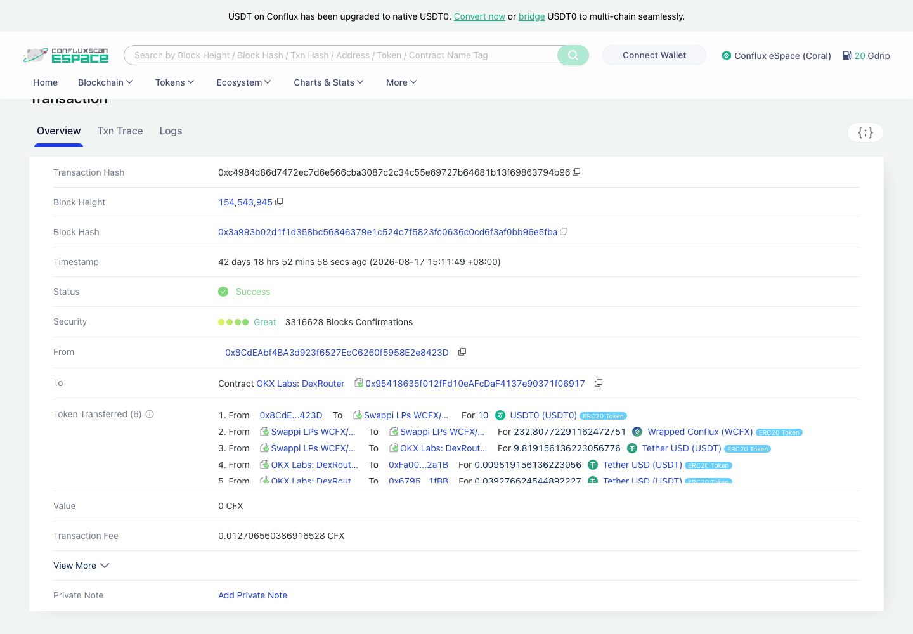
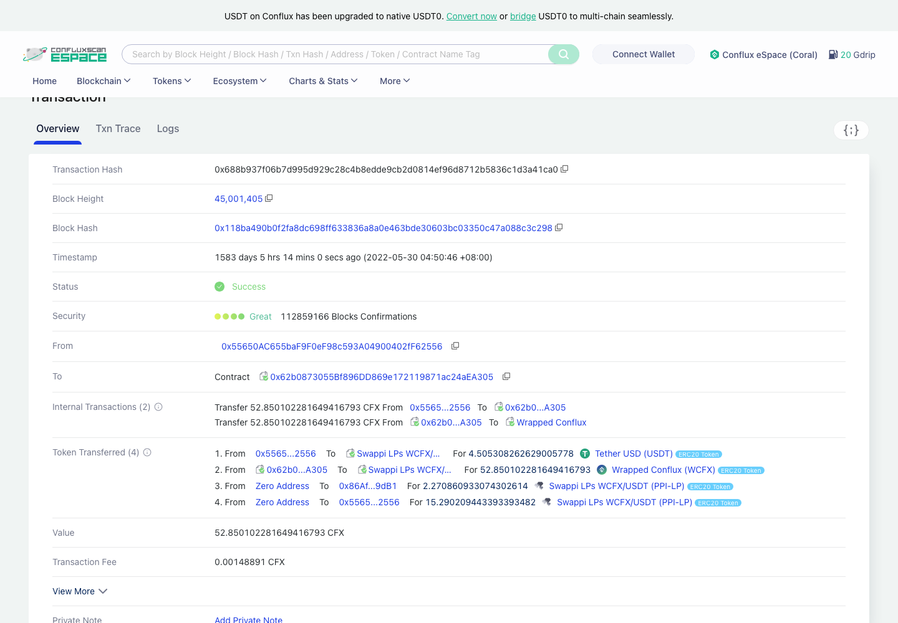
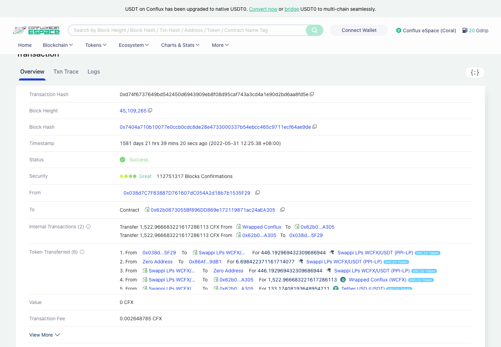
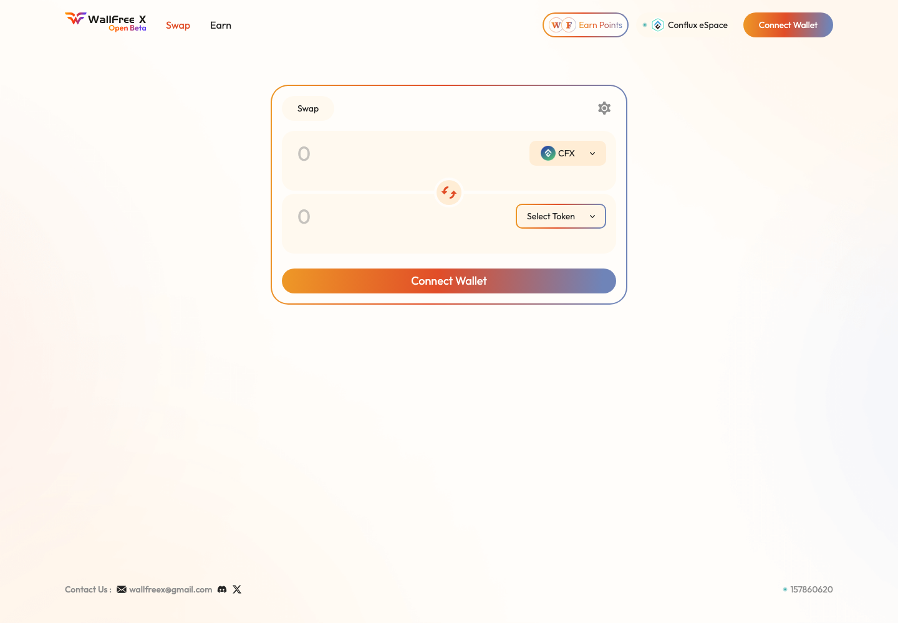
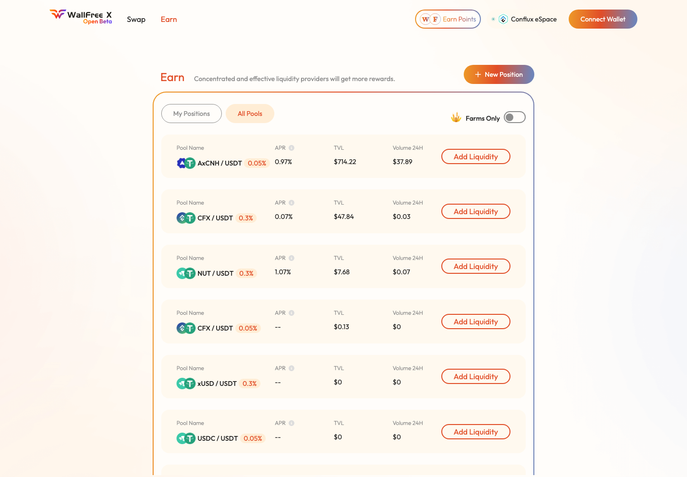
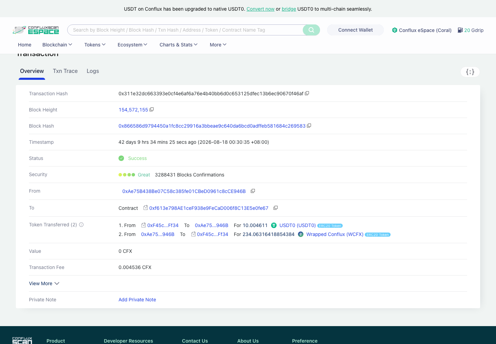
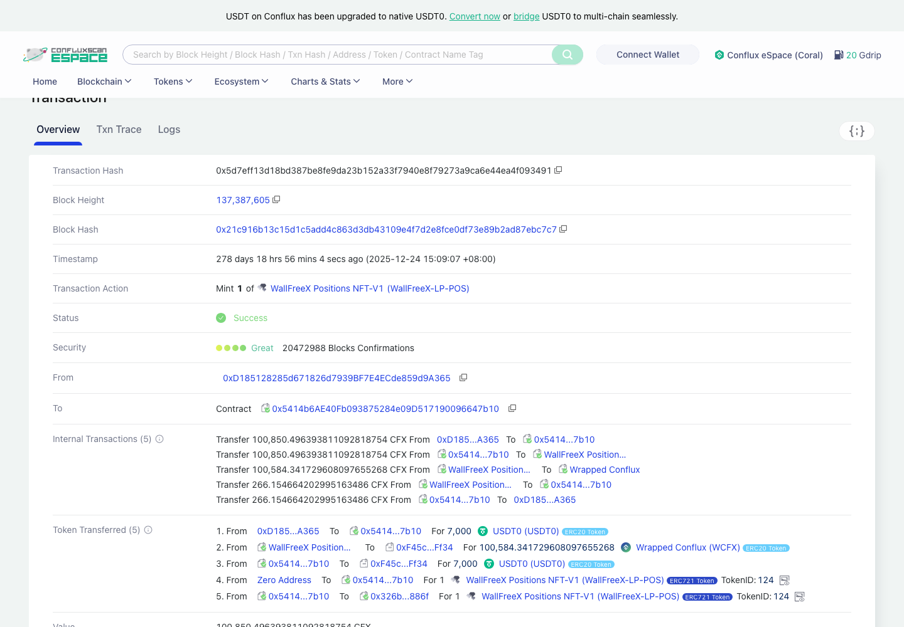
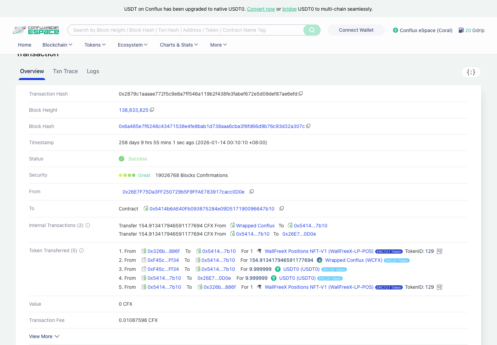

# Conflux eSpace DEX 协议汇总（Swappi / WallFreeX）

> **状态**：🟡 两个入选协议的 Swap / 加流动性 / 减流动性公开样本 hash 已齐（12 条，全部链上复核 status=1），前端页 + 浏览器交易页截图已齐；本人实测 ⬜ 未做
> **调研时间**：2026-09-29
> **交付口径**：覆盖页面可点击的交易类型 + 交易哈希 + 截图 + 背景信息；**不做链上深度解析（解析由解析同学做）**
> **链**：**Conflux eSpace**，chainId **1030**
> **样本来源**：⚠️ 全部 hash 来自**链上公开交易，非本人钱包**
> **来源**：Confluence「各链协议调研」Conflux 子页 pageId=**609479856**（hash 与覆盖率数据照搬该页，快照日期 2026-08-18）；另参考本地核查报告 `Conflux-2026-08-18.md`

## 0. 一句话结论

Conflux 入选 **2 / 4** 个协议：**Swappi**（Uniswap V2 式，交易量占比 84.1%）+ **WallFreeX**（Uniswap V3 式 CLMM，15.9%），入选交易量覆盖率 **100.0%**（DexScreener 全部 WCFX 池按 factory 归并，2026-08-18 快照）。链级 **OKX 支持、Ave 支持**；但 Ave 在 Conflux 上只覆盖 Swappi，WallFreeX 的 Ave = 否、OKX = 待核。两个协议前端都能直接落到 Conflux eSpace，不用切链。

## 1. 链基础信息

| 字段 | 值 |
|------|-----|
| 链 | Conflux eSpace（Conflux 的 EVM 兼容空间） |
| chainId | **1030** |
| 原生币 | **CFX**（18 位）；包装币 WCFX `0x14b2d3bc65e74dae1030eafd8ac30c533c976a9b` |
| 公共 RPC | `https://evm.confluxrpc.com`（2026-09-29 实测 `eth_chainId`=0x406 ✅，支持宽区间 `eth_getLogs`） |
| 区块浏览器 | https://evm.confluxscan.io （也可用 https://evm.confluxscan.org ） |
| 链 TVL | **$7,560,382**（DefiLlama `/v2/chains`，2026-09-29 快照） |
| 链总日交易量 | $34,348（Confluence 快照 2026-08-18） |
| DexScreener / GeckoTerminal | 是（slug=conflux）/ 是（slug=cfx），⚠️ GeckoTerminal **没有索引 WallFreeX 的池子** |
| OKX / Ave 链级支持 | 是 / 是 |

### 1.1 协议覆盖率（照搬 Confluence，2026-08-18 快照）

选择规则：OKX 支持的全收 + Ave 支持的全收 + 按交易量降序累计覆盖 ≥90%。

| 协议 | 日交易量(USD) | 占比 | 累计 | 是否入选 | 理由 |
|------|------|------|------|:---:|------|
| Swappi | 20,273 | 84.1% | 84.1% | ✅ | Ave 支持 + OKX 支持 + 交易量覆盖 |
| WallFreeX | 3,829 | 15.9% | 100.0% | ✅ | 交易量覆盖（不收则只有 84.1%，不达标） |
| Ginseng Swap | 129 | 0.5% | 100.0% | ❌ | 占比 <1%，TVL 仅 $1,629 |
| NTFD | 0 | 0.0% | 100.0% | ❌ | 僵尸协议（TVL $37，无交易） |

---

## 2. Swappi

### 2.1 基础信息

| 字段 | 值 |
|------|-----|
| 协议类型 | **V2**（Uniswap V2 式恒定乘积 AMM，LP 凭证为 ERC-20 `PPI-LP`） |
| 官网 | https://app.swappi.io |
| **操作入口** | https://app.swappi.io/#/swap ｜ https://app.swappi.io/#/pool/v2 ｜ https://app.swappi.io/#/staking （导航另有 Farming、NFT、Genesis） |
| 前端链 | ✅ 前端只服务 Conflux eSpace，打开即是目标链（截图右上角网络显示 `Conflu…`） |
| 文档 | https://docs.swappi.io/ ｜ 数据 https://info.swappi.io/ |
| Factory | `0xe2a6f7c0ce4d5d300f97aa7e125455f5cd3342f5`（示例池 `factory()` 链上读出） |
| Router（LP 交易的 to） | `0x62b0873055bf896dd869e172119871ac24aea305`（加 / 减流动性样本的 `to` 都是它） |
| 示例 pool | `0x8fcf9c586d45ce7fcf6d714cb8b6b21a13111e0b`（WCFX/USDT） |
| Ave / OKX | 是 / 是 |
| 交易量占比 | 84.1%（DexScreener 口径，日量 $20,273）；Confluence 协议表 GT 口径日量 $34,347.84 / 日交易 2,027 笔 / TVL $889,258.99 |
| DefiLlama | slug `swappi`，TVL **$1,971,318**（2026-09-29） |

### 2.2 协议背景

Swappi 是部署在 Conflux eSpace 上的 AMM 式 DEX，DefiLlama 于 2022-04 收录，样本里最早的一笔加流动性发生在 2022-05，是 Conflux 上运行时间最长、交易量最大的 DEX。前端底部标注「Audit by CertiK」，DefiLlama 记录有 2 份审计，并挂了 Immunefi 漏洞赏金。产品线除 Swap / 流动性外还有 Farming（LP 挖矿）、Staking（PPI 质押）和 NFT。

### 2.3 操作清单（页面可点击）

| # | 交易类型 | 入口 |
|---|---------|------|
| 1 | **Swap** | https://app.swappi.io/#/swap → EXCHANGE 页签 |
| 2 | **加流动性** | https://app.swappi.io/#/pool/v2 → LIQUIDITY 页签 → Add Liquidity |
| 3 | **减流动性** | 同上 → 已有仓位 → Remove |
| 4 | Farming（LP 质押挖矿） | 导航 Farming（页面有，本次未取样） |
| 5 | Staking（PPI 质押） | https://app.swappi.io/#/staking （页面有，本次未取样） |

### 2.4 公开样本交易（⚠️ 非本人钱包）

| 交易类型 | tx hash | 截图 |
|---------|---------|------|
| Swap | [0xc4984d86d7472ec7d6e566cba3087c2c34c55e69727b64681b13f69863794b96](https://evm.confluxscan.io/tx/0xc4984d86d7472ec7d6e566cba3087c2c34c55e69727b64681b13f69863794b96) | `Swappi-Conflux-swap交易-20260929.png` |
| Swap | [0xa69fbf57d3d11d8d9238a99302553ca1326004c57a1b6383d15701de44c3fa51](https://evm.confluxscan.io/tx/0xa69fbf57d3d11d8d9238a99302553ca1326004c57a1b6383d15701de44c3fa51) | — |
| Swap | [0x67d2337cbfcbb8dec14949e62f6b474a1285f8cf16b22b6ffaf67c18418ed20b](https://evm.confluxscan.io/tx/0x67d2337cbfcbb8dec14949e62f6b474a1285f8cf16b22b6ffaf67c18418ed20b) | — |
| Swap | [0x53208770bea29fda5c76442638f85048e6ea9e042540bfa5629006e5d7f96866](https://evm.confluxscan.io/tx/0x53208770bea29fda5c76442638f85048e6ea9e042540bfa5629006e5d7f96866) | — |
| 加流动性 | [0x688b937f06b7d995d929c28c4b8edde9cb2d0814ef96d8712b5836c1d3a41ca0](https://evm.confluxscan.io/tx/0x688b937f06b7d995d929c28c4b8edde9cb2d0814ef96d8712b5836c1d3a41ca0) | `Swappi-Conflux-加流动性交易-20260929.png` |
| 减流动性 | [0xd74f6737649bd542450d6943909eb8f08d95caf743a3cd4a1e90d2bd6aa8fd5e](https://evm.confluxscan.io/tx/0xd74f6737649bd542450d6943909eb8f08d95caf743a3cd4a1e90d2bd6aa8fd5e) | `Swappi-Conflux-减流动性交易-20260929.png` |

📌 样本备注（只登记，不解析）：4 笔 Swap 都在 2026-08-17，其中 3 笔的 `to` 是 **OKX Labs: DexRouter** `0x95418635…6917`（浏览器标签），1 笔是 `0xefb8f5a7…64d6`，说明样本多数是**聚合器路由**进来的，不是 Swappi 自己的 Router。加 / 减流动性样本是 2022-05 的老交易（`to` = Router `0x62b08730…a305`）。

### 2.5 操作覆盖

| 交易类型 | 公开样本 hash | 截图 | 备注 |
|---------|--------------|:---:|------|
| Swap | ✅ 4 条 | ✅ swap 页 + 交易页 | 样本多为 OKX 聚合器路由 |
| 加流动性 | ✅ 1 条 | ✅ 流动性页 + 交易页 | 2022-05 老样本 |
| 减流动性 | ✅ 1 条 | ✅ 交易页 | 2022-05 老样本 |
| Farming | ⬜ | ⬜ | 页面有该入口，本次未取样 |
| Staking | ⬜ | ⬜ | 页面有该入口，本次未取样 |

### 2.6 截图

| 文件 | 内容 |
|------|------|
|  | EXCHANGE 页签，From CFX，网络 Conflux |
|  | LIQUIDITY 页签，Add Liquidity 按钮 |
|  | ConfluxScan 交易详情，To = OKX Labs: DexRouter |
|  | 交易详情，铸造 Swappi LPs WCFX/USDT (PPI-LP) |
|  | 交易详情，PPI-LP 转回池子销毁 |

---

## 3. WallFreeX

### 3.1 基础信息

| 字段 | 值 |
|------|-----|
| 协议类型 | **V3 / CLMM**（Uniswap V3 式集中流动性；示例池 `fee()`=3000、`tickSpacing()`=60；LP 凭证为 NFT `WallFreeX Positions NFT-V1 (WallFreeX-LP-POS)`） |
| 官网 | https://wallfreex.com （⚠️ 2026-09-29 curl 无响应）｜ 应用 https://app.wallfreex.com |
| **操作入口** | https://app.wallfreex.com/swap ｜ https://app.wallfreex.com/earn （流动性 / New Position）｜ https://app.wallfreex.com/points |
| 前端链 | ✅ 前端只有 Conflux eSpace（右上角显示 `Conflux eSpace`），不用切链 |
| Factory | `0x50cADdC77c6727Bdd3c78B428c149BF110b4f595` |
| NonfungiblePositionManager（LP 交易的 to） | `0x5414b6ae40fb093875284e09d517190096647b10`（浏览器显示 WallFreeX Positions NFT-V1） |
| 示例 pool | `0xF45c6eaC91a1f18edd72d4CCcE859036c265Ff34`（WCFX/USDT0，0.3%） |
| Ave / OKX | 否 / ⚠️ 待核（Confluence 原文「待核」） |
| 交易量占比 | 15.9%（DexScreener 口径，日量 $3,829，TVL $95,392） |
| DefiLlama | ⚠️ 未收录（`/protocols` 里搜不到 WallFreeX） |

### 3.2 协议背景

WallFreeX 是 Conflux 上的集中流动性 DEX，前端自称「A concentrated liquidity DEX」，目前标着 **Open Beta**。按核查报告，它是 2025-09 官宣的 Conflux 首个稳定币 / 外汇 DEX，采用 Uniswap V3 模型，首发 **AxCNH**（离岸人民币稳定币）交易对，Factory 下最早的池子 AxCNH/WCFX 建于 2025-09-28。Earn 页列出 AxCNH/USDT、CFX/USDT、USDC/USDT 等池，有 Farms 开关和积分（Earn Points）活动。

### 3.3 操作清单（页面可点击）

| # | 交易类型 | 入口 |
|---|---------|------|
| 1 | **Swap** | https://app.wallfreex.com/swap |
| 2 | **加流动性**（开 NFT 仓位 / 追加） | https://app.wallfreex.com/earn → New Position 或池子行 Add Liquidity |
| 3 | **减流动性** | Earn → My Positions → 仓位详情 |
| 4 | 收手续费（Collect） | 仓位详情（V3 常规功能，⚠️ 需连钱包确认按钮是否存在） |
| 5 | Farms / 积分 | Earn 页 Farms Only 开关、https://app.wallfreex.com/points （页面有，本次未取样） |

### 3.4 公开样本交易（⚠️ 非本人钱包）

| 交易类型 | tx hash | 截图 |
|---------|---------|------|
| Swap | [0x311e32dc663393e0cf4e6af6a76e4b40bb6d0c653125dfec13b6ec90670f46af](https://evm.confluxscan.io/tx/0x311e32dc663393e0cf4e6af6a76e4b40bb6d0c653125dfec13b6ec90670f46af) | `WallFreeX-Conflux-swap交易-20260929.png` |
| Swap | [0x304da94747218dd5de725bbb669fd03d845529992c2c7f0c2193f88869332ebd](https://evm.confluxscan.io/tx/0x304da94747218dd5de725bbb669fd03d845529992c2c7f0c2193f88869332ebd) | — |
| Swap | [0xf1f0280e57aa908a655071ff042260a31c3258d2d449313ec8548aab881e1795](https://evm.confluxscan.io/tx/0xf1f0280e57aa908a655071ff042260a31c3258d2d449313ec8548aab881e1795) | — |
| Swap | [0xac4a961a8a29d9d1e71cc519685cf9e41669a1666ed687d43442fa4ce3cd3a6a](https://evm.confluxscan.io/tx/0xac4a961a8a29d9d1e71cc519685cf9e41669a1666ed687d43442fa4ce3cd3a6a) | — |
| 加流动性 | [0x5d7eff13d18bd387be8fe9da23b152a33f7940e8f79273a9ca6e44ea4f093491](https://evm.confluxscan.io/tx/0x5d7eff13d18bd387be8fe9da23b152a33f7940e8f79273a9ca6e44ea4f093491) | `WallFreeX-Conflux-加流动性交易-20260929.png` |
| 减流动性 | [0x2879c1aaaae772f5c9e8a7ff546a119b2f438fe3fabef672e5d09def87ae6efd](https://evm.confluxscan.io/tx/0x2879c1aaaae772f5c9e8a7ff546a119b2f438fe3fabef672e5d09def87ae6efd) | `WallFreeX-Conflux-减流动性交易-20260929.png` |

📌 样本备注：4 笔 Swap（2026-08-17）的 `to` 都是 `0xf613e798…0fe67`（未标注名称的聚合器合约，Metis 链上也出现同一地址），不是 WallFreeX 自己的 Router。加流动性（2025-12-24）浏览器显示 Transaction Action「Mint 1 of WallFreeX Positions NFT-V1」，减流动性（2026-01-14）同样走 PositionManager。

### 3.5 操作覆盖

| 交易类型 | 公开样本 hash | 截图 | 备注 |
|---------|--------------|:---:|------|
| Swap | ✅ 4 条 | ✅ swap 页 + 交易页 | 样本走聚合器 |
| 加流动性 | ✅ 1 条 | ✅ Earn 页 + 交易页 | 铸造 LP NFT |
| 减流动性 | ✅ 1 条 | ✅ 交易页 | |
| Collect 手续费 | ⬜ | ⬜ | 页面是否单独提供待连钱包确认 |
| Farms / 积分 | ⬜ | ⬜ | 页面有入口，本次未取样 |

### 3.6 截图

| 文件 | 内容 |
|------|------|
|  | Swap 面板，网络 Conflux eSpace |
|  | Earn 页，池子列表（AxCNH/USDT 0.05% TVL $714 等）+ New Position |
|  | ConfluxScan 交易详情，USDT0 ⇄ WCFX |
|  | Mint 1 of WallFreeX Positions NFT-V1（TokenID 124） |
|  | PositionManager 取回 USDT0 / WCFX（TokenID 129） |

---

## 4. 待办 / 缺口

| # | 事项 | 说明 |
|---|------|------|
| 1 | WallFreeX 的 OKX 支持情况 | Confluence 写「待核」，需要在 OKX UI 上人工确认 |
| 2 | 本人实测 | 本页全是公开样本，本人钱包 ⬜ 未做 |
| 3 | Swappi 加 / 减流动性样本太老（2022-05） | 如解析同学要近期样本，可用 `collect_hashes.py cfx 0x8fcf9c58… https://evm.confluxrpc.com` 重采 |
| 4 | Farming / Staking / WallFreeX Farms 与积分 | 页面有入口，本次没有取样，如需覆盖要补 hash + 截图 |
| 5 | WallFreeX Collect 手续费 | 需连钱包确认仓位详情页是否有单独的 Collect 按钮 |
| 6 | `0xf613e798…0fe67` 身份 | 多笔 Swap 样本的 `to`，跨链同址，浏览器无名称标签，疑为聚合器，⚠️ 待查 |
| 7 | Moon Swap（核查报告提到） | DefiLlama TVL 约 $80 万但无交易量，未入选；建议确认是否已停止交易 |
