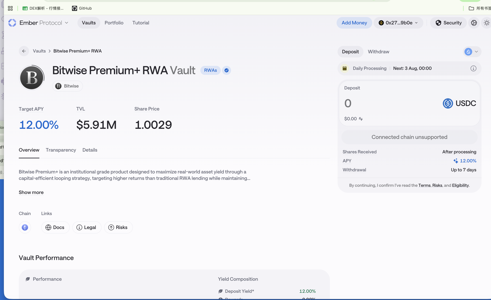

# Ember —— Bitwise Premium+ RWA Vault（PPLUS）／ Securitize Corporate Bond

> ✅ **2026-08-02 更正**：`ember.so/earn/PPLUS` 的正式产品名是 **"Bitwise Premium+ RWA Vault"**（Premium**Plus**），**不是** 我原先推测的 OpenTrade PRIME+。curator 也已确认就是 **Bitwise**。

> **状态**：✅ 已确认接入（Bitwise vault，接入情况「WK」）｜ 🟡 待确认（Securitize Corporate Bond）
> **调研时间**：2026-07-31 ｜ **解析类型**：A（NAV 累积，ERC-4626 share 价格上涨）
> ⚠️ **本协议是本轮调研公开信息最少的一个**，多处需要 DD 文档 / 项目方补充，见「9. 待确认清单」

## 0. 一句话结论

Ember 是一个**策展型（curated）金库平台**，按 ERC-4626 逻辑发 receipt token、靠 share 汇率上涨累积收益；Master 表里的「Ember (Bitwise)」是一个把三个 RWA 收益代币（**PST / sUSDai / PRIME**）拿去做**循环贷（looping）加杠杆**的 USDC 金库，因此它不是一个"原生 RWA 协议"，而是**RWA 收益的杠杆封装层**——这决定了它的风险披露和 NAV 解析都要按"杠杆策略金库"而不是"底层资产基金"来写。

## 1. 基础信息（Master CSV 口径）

### 1.1 Ember (Bitwise) — 已确认接入

| 字段 | 值 |
|------|-----|
| 协议 | Ember (Bitwise) |
| 链 | Ethereum |
| Supply Coins | USDC |
| Coins Integrated | -（表内为空，实际应为 vault share token，⚠️ 待补） |
| 池子 TVL | 3M（CSV 口径）｜ vaults.fyi 显示 Ember Earn 金库 $3.25M（2026-07 抓取） |
| 收益率 | 10%（CSV）｜ vaults.fyi 7 日年化 9.53% |
| 类别 | Private Credit |
| 产品 | RWA Vault |
| 产品描述 | 循环贷：PST、sUSDai 和 PRIME |
| 产品网页 | https://ember.so/earn/PPLUS |
| 池子类别 | 活期（Flexible） |
| DD 文档 | `[Bitwise]Binance Web3 Earn DD Doc - Bitwise RWA Multiply Vault.docx` |
| Onboarding | Projects' campaign info 项目信息收集 |
| 预算 | $300,000 |
| POC | Cece ｜ 执行：预算 + 合约 ｜ 接入情况：WK |

### 1.2 Ember (Securitize) — 待确认

| 字段 | 值 |
|------|-----|
| 链 / Supply Coins | Ethereum / USDT |
| 池子 TVL / 收益率 | 0 / 7% |
| 类别 / 产品 | Bond / Corporate Bond product（七月中上线） |
| 产品上线 | x（未上线） |
| POC | Terry ｜ 执行：产品 |

> 这两行在 Master 表里都叫 "Ember"，但一个 curator 写 Bitwise、一个写 Securitize，**产品上线状态、币种、类别全不同**。判断：同一个 Ember 金库平台上的两个不同 vault。⚠️ 需 Cece / Terry 确认是否同一平台。

## 2. 协议背景

- **平台定位**：Ember Vaults 是"结构化收益产品"——用户存入资产、拿到 receipt token（share），由 **curator（专业风险管理人）** 把资金部署到策略里。平台按 ERC-4626 原则实现（官方 docs 原文：*"follows ERC-4626 principles"*）。
- **费用模型**：curator 可收 **Performance Fee（仅对正收益部分）** 和 **Management Fee（按 AUM 年化）**，两项都**直接内嵌进 share 价格**（官方原文："share price simply reflects fees and performance"，不移动用户资金）。
  → **数据含义**：我们解析出来的 NAV 已经是**净费后**的，不需要再扣费。
- **公开可查金库**：Ethereum 主网 `0x9be9294722f8AAd37b11a9792Be2C782182caFA2`（Ember Earn / eEARN，USDC），第三方（vaults.fyi）标注 curator 为 **Rivershore**，策略描述为"稳定币借贷市场 + 成熟 DeFi 协议上的杠杆借贷循环 + delta 中性资金费率头寸"。
- ⚠️ **命名撞车警告**：另有一个 **Ember Protocol on Sui**（Bluefin 团队孵化，与 R25 合作 rcUSD vault），以及一个 Core 链上的比特币抵押借贷 Ember。**三者不是同一个项目**，搜资料时极易混淆。
- ⚠️ **Bitwise 身份待核实**：公开资料能确认 Bitwise 自 2026 年 1 月起在 **Morpho** 上做 curator（首个大型传统资管做 allocation vault，目标约 6% APY）；**没有**公开资料证实 Bitwise 在 ember.so 上策展 vault。DD 文档标题写的是 Bitwise RWA Multiply Vault，需以 DD 为准。

## 3. 底层资产（Underlying）

这是一个**两层结构**：

```
用户 USDC
  └─ Ember vault（杠杆循环）
       ├─ PST     ← Huma Finance 的 PayFi Strategy Token（跨境支付/应收账款融资）
       ├─ sUSDai  ← USD.AI 的收益型合成美元（GPU/AI 算力设备抵押贷）
       └─ PRIME   ← ⚠️ 待确认是 OpenTrade PRIME+ 还是 Morpho 上的房屋净值贷（home equity）PRIME
```

底层真实资产 = 支付应收账款 + AI 算力硬件设备贷 + （待确认的）私人信贷/房贷。三个都是私人信贷（Private Credit），**相关性不低**——这是本产品最应该披露的一点。

> 关联文档：[Huma.md](Huma.md)、[USDai.md](USDai.md)、[OpenTrade.md](OpenTrade.md)

## 4. 收益来源（Yield Source）

1. **底层 RWA 票息**：PST / sUSDai / PRIME 各自的真实收益（分别约 10% / 10–15% / 6%+ 量级）
2. **循环贷杠杆放大**：把 RWA 代币抵押借出稳定币再买入，重复。公开资料对这套 RWA looping 的描述是：基础收益 8% 左右可放大到 **15–20%**，但每加一层杠杆清算风险上升
3. （可能）**delta 中性资金费率**收益、DeFi 借贷利差

CSV 标的收益率 10%，落在"底层 + 适度杠杆"的合理区间。

## 5. 链上机制与凭证代币

> ✅ **2026-08-02 产品页截图确认。完整记录见 [../03-参考/已确认合约地址与链上实测.md](../03-参考/已确认合约地址与链上实测.md)**

### 产品页截图（2026-08-02，Bitwise Premium+ RWA Vault）



**截图上要看的点**：

| 位置 | 内容 | 意义 |
|------|------|------|
| 页面标题 | 🔴 **"Bitwise Premium+ RWA Vault"** + `RWAs` 标签 + 认证勾 | ✅ **PPLUS = Premium Plus**，不是我推测的 OpenTrade PRIME+ |
| 标题下方 | 🔴 **Bitwise 徽章 + logo** | ✅ **curator 确认是 Bitwise**（此前找不到公开证据） |
| **Share Price** | **1.0029** | ✅ 这就是 NAV，确认 A 类；**极接近 1.0 → 金库很新，几乎无历史 NAV 可回溯** |
| Target APY | **12.00%** | ⚠️ 是 **Target 目标值**，不是实测收益（CSV 写 10%） |
| TVL | **$5.91M** | CSV 写 3M，已过期 |
| 右侧面板 | Deposit 币种 **USDC** ✅ ｜ Chain 图标为 Ethereum ✅ | CSV 正确 |
| 🔴 **Daily Processing** | **"Next: 3 Aug, 00:00"** | **申购是每日批处理，不是即时** |
| 🔴 **Shares Received** | **"After processing"** | **签完交易拿不到 share** → 见下方专门说明 |
| **Withdrawal** | **Up to 7 days** | 后台「赎回处理时间」填 7 天 |
| Yield Composition | Deposit Yield **12.00%** ／ Rewards **0.00%** | 目前无代币激励 |
| 产品描述原文 | "institutional grade product designed to maximize real-world asset yield through a **capital-efficient looping strategy**" | ✅ 印证 CSV 的"循环贷" |
| 底部链接 | **Docs / Legal / Risks** | Compliance 与 Risk Tab 文案可直接取用 |
| Tab | Overview / **Transparency** / **Details** | 📌 **合约地址大概率在 Details 或 Transparency 里，点开再截一次即可** |
| 右侧按钮 | "Connected chain unsupported" | 当时钱包在错的链上，不影响以上结论 |

**🔴 两处更正**

| 项 | 我原先的判断 | 实际（产品页确认） |
|----|------------|-----------------|
| PPLUS 是什么 | 推测 = OpenTrade 的 **PRIME+** | ❌ **错。是 "Bitwise Premium+ RWA Vault"** —— **P**remium**Plus**，与 OpenTrade 无关 |
| curator 是不是 Bitwise | ⚠️ 找不到公开证据 | ✅ **确认是 Bitwise**（页面有 Bitwise 徽章 + logo，且有 RWAs 认证标） |

| 项 | 内容（2026-08-02 产品页） |
|----|------|
| 正式产品名 | **Bitwise Premium+ RWA Vault** |
| 链 | Ethereum ✅ ｜ 申购币种：**USDC** ✅ |
| **Share Price（NAV）** | ✅ **1.0029** —— 确认 **A 类 NAV 累积型**；且**极接近 1.0 说明金库很新，几乎没有历史 NAV 可回溯** |
| Target APY | **12.00%**（CSV 写 10%）⚠️ 注意是 **Target 目标值**，不是实测收益 |
| TVL | **$5.91M**（CSV 写 3M） |
| Yield Composition | Deposit Yield 12.00% ／ Rewards 0.00%（目前无代币激励） |
| 🔴 **申购机制** | **Daily Processing，"Next: 3 Aug, 00:00"**，且 **"Shares Received: After processing"**<br>→ **申购不是即时铸份额，见下方专门说明** |
| **赎回时效** | **最长 7 天**（Withdrawal: Up to 7 days）→ 后台「赎回处理时间」填 7 天 |
| 合约地址 | ⚠️ 仍待补。页面有 **Details / Transparency** 两个 tab，点进去应有地址 —— **再截一次图即可** |
| 已知的另一个金库 | Ember Earn：`0x9be9294722f8AAd37b11a9792Be2C782182caFA2`（Ethereum）—— ⚠️ **不是本产品**，别配错 |
| 页面链接 | Docs / **Legal** / **Risks** → Compliance 与 Risk Tab 文案可直接取用 |
| 产品定位原文 | "institutional grade product designed to maximize real-world asset yield through a **capital-efficient looping strategy**，targeting higher returns than traditional RWA lending" ✅ 印证 CSV 的"循环贷" |

### 🔴 「每日批处理」会打破 PRD 的申购流程

页面明确写 **Daily Processing** + **Shares Received: After processing**，意思是：

```
用户签完申购交易 → USDC 已扣走 → 但拿不到 share
                 → 等到下一个处理时点（每天 00:00）→ 才铸出 share
```

**这段真空期里**：用户的钱没了，凭证代币 balance 还是 0 → **按现有解析逻辑（balance × NAV），持仓会显示为 0**。

**对 PRD 的直接冲击**：

| PRD 位置 | 问题 |
|---------|------|
| 4.6.1 Step 4「申购成功」 | 展示"质押金额 900.28 USDC"，但此刻链上并无对应持仓 |
| 4.5.2 Portfolio Tab | 展示规则是"有持仓才展示" → 用户申购后打开详情页会看到**空状态** |
| 整体 | PRD **只为「赎回中」设计了中间态，没有「申购中」** |

→ 🔴 **建议**：新增「申购处理中（Pending Subscription）」状态，或中台解析要能识别"已存入未铸份额"的待处理金额。**需找 Marcus 单独过一次。**

## 6. 数据接入要点（对齐 PRD）

### 6.1 六维度自评

| 维度 | 可行性 | 取数方式 | 备注 |
|------|:---:|---------|------|
| 实时解析 | ✅ | share balance × `convertToAssets` | 标准 4626 路径 |
| 交易历史解析 | ✅ | `Deposit` / `Withdraw` 事件 | 4626 标准事件 |
| 池子自发现 | 🟡 | 是否有 Factory / vault 注册表待确认 | 目前只有两个 vault，可先硬编码 |
| APY | ✅ | 由 NAV 天级差分自算（推荐）；或取平台展示值 | 杠杆策略 APY 波动大，7d/30d 平滑口径要定 |
| NAV 历史 | ✅ | 天级打点 `convertToAssets`；历史可用 archive node 回溯 | **本协议 NAV 已净费后** |
| PNL | ✅ | 天级快照差分，Jackson 侧聚合 | 杠杆策略**可能出现负收益**，PRD 允许负值这点在这里最容易被触发 |

### 6.2 关键取数口径

- **NAV 已含费**：Performance / Management Fee 内嵌 share 价格，勿二次扣减
- **APY 建议自算**：`(NAV_t / NAV_{t-7}) ^ (365/7) - 1`，不要直接用平台前端值（杠杆策略前端常展示目标值）
- **TVL**：`totalAssets()`

### 6.3 需向项目方索取

1. **PPLUS 金库合约地址 + ABI**（当前只有 EARN 金库地址）
2. 是否标准 ERC-4626（`convertToAssets` / `previewRedeem` 是否可用）
3. 循环贷标的清单及权重（PST / sUSDai / PRIME 的实际配比与调仓频率）
4. 赎回机制：是否有队列、最坏情况到账时间、是否需要 request ID
5. Securitize Corporate Bond 产品的上线时间、合约、赎回条款
6. 历史 NAV 数据（若合约上线时间早于我们打点时间）

## 7. 风险（Risk）

1. **杠杆/清算风险**：循环贷是本产品的核心收益来源，也是核心风险。底层 RWA 代币价格（NAV）若下跌或抵押率被调整，可能触发清算，导致 **NAV 实际下跌、用户本金亏损**
2. **底层信用集中风险**：三个标的（支付应收款、AI 算力设备贷、私人信贷）**同属私人信贷赛道**，宏观信用环境恶化时相关性高，分散效果有限
3. **退出流动性风险**：解开杠杆循环需要时间，极端行情下赎回可能延迟
4. **多层嵌套的智能合约风险**：Ember vault + 三个底层协议 + 所用借贷协议（Morpho / Fluid 等），任一环节出问题都会传导
5. **策展人风险（Curator Risk）**：仓位配置、杠杆倍数由 curator 决定，用户无法直接控制
6. ⚠️ **项目识别风险（我们自己的风险）**：ember.so 与 Sui 上的 Ember Protocol、Core 上的 Ember 同名，配置合约地址时务必核对链和地址

## 8. 合规与准入（Compliance）

- ⚠️ 公开信息不足。Ember 平台本身是非托管 DeFi 金库，通常无 KYC；但 curator 若为 Bitwise（受监管资管），可能有额外准入要求
- Securitize 侧产品若是代币化企业债，**大概率涉及合格投资者 / 地域限制**（Securitize 平台产品普遍如此）
- → 必须以 DD 文档为准

## 9. 待确认清单

| # | 问题 | 问谁 / 怎么查 |
|---|------|------------|
| 1 | ember.so 的 PPLUS 金库合约地址 | Cece → 项目方；或从 ember.so 前端抓（app 有 Cloudflare 防护，WebFetch 403） |
| 2 | Bitwise 是否真为 curator | DD 文档 `[Bitwise]Binance Web3 Earn DD Doc` |
| 3 | PRIME 具体是哪个 PRIME | DD 文档 / 项目方；对照 OpenTrade PRIME+ |
| 4 | 是否标准 ERC-4626 | 合约 ABI |
| 5 | 赎回是否有队列 / request ID | 项目方；影响 PRD 4.6.2「赎回中」状态 |
| 6 | Ember (Securitize) 是否同一平台、是否已上线 | Terry |
| 7 | 后台「底层资产类型」枚举只有 4 类，本产品该归 Private Credit 还是 Structured Products（它其实是杠杆结构化产品） | Marcus |

## 10. 参考链接

- Ember 官方文档（核心概念 / 金库机制 / 费用）：https://learn.ember.so/ember-protocol/core-concepts
- 产品页（有防护，浏览器打开）：https://ember.so/earn/PPLUS
- Ember Earn 金库第三方数据：https://app.vaults.fyi/opportunity/mainnet/0x9be9294722f8AAd37b11a9792Be2C782182caFA2
- Bitwise 在 Morpho 做 curator 的背景：https://eco.com/support/en/articles/13064566-morpho-protocol-explained-2026
- ⚠️ 易混淆的同名项目（Sui 上的 Ember Protocol）：https://www.theblock.co/press-releases/383307/r25-and-ember-protocol-debut-exclusive-vault-on-sui-via-topnod-wallet
