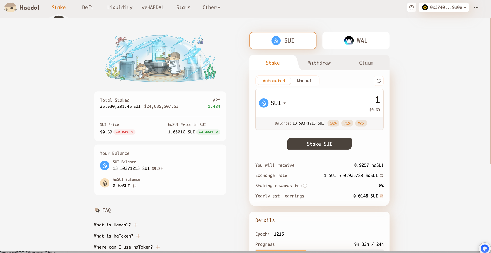
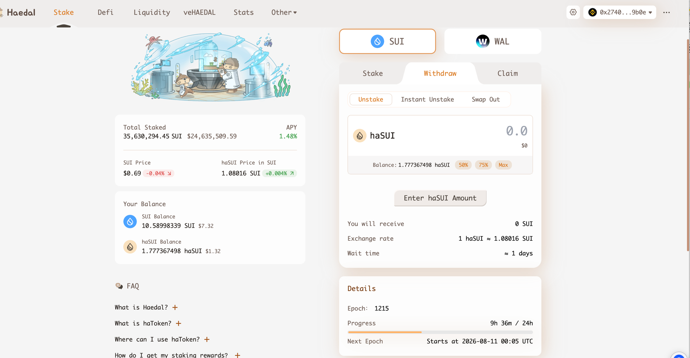
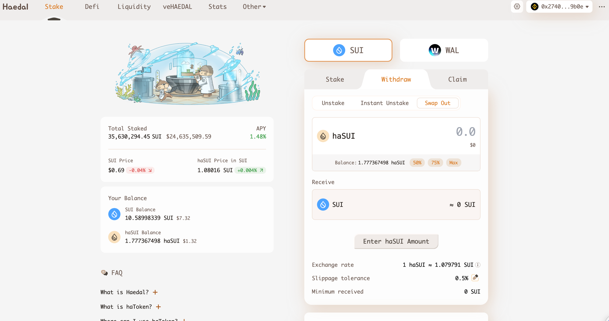

# Haedal —— haSUI（SUI 流动质押）

> ⚠️ **范围声明**：本协议**不属于**本仓库原本的 RWA 7 协议范围，来自 **DeX 行情接链项目**（协议表条目 `SUIHaedal`）。
> **状态**：✅ stake + 两条赎回路径均已实测并链上验证（**本批唯一有截图落盘的协议**）
> **实测时间**：2026-08-10 ｜ **测试钱包**：SUI `0x27408ed9752b653e009de0ce83608e7a3dd4bccc5362045978b4b38bb3159b0e`
> **链上验证方式**：SUI **GraphQL**（`graphql.mainnet.sui.io`）—— ⚠️ JSON-RPC 公共节点已下线，见 §6.5
> **解析类型**：A（NAV 累积，1 haSUI = 1.08016 SUI）

## 0. 一句话结论

haSUI 是 SUI 的流动质押凭证（NAV 累积，1 haSUI ≈ 1.080 SUI）。**本协议最重要的实测发现是：UI 上的「赎回」有三个 tab，其中两条路径的链上事件完全不同 —— 普通 Unstake 抛 `UserNormalUnstaked` 且当笔不到账（等 epoch），Swap Out 抛 `UserInstantUnstaked` + DEX router 的 `SwapEvent` 且当笔即时到账。把两者当成同一种「赎回」处理，PNL 和状态机都会错。**

## 1. 基础信息（实测口径）

| 字段 | 值 |
|------|-----|
| 协议 | Haedal（haedal.xyz） |
| 链 | **SUI** |
| 本次实测产品 | **haSUI**（另有 WAL 产品线未测） |
| Supply Coins | SUI（原生币） |
| Coins Integrated | **haSUI** |
| Total Staked | **35,630,291.45 SUI ≈ $24,635,507.52**（2026-08-10 UI 快照） |
| 收益率 | **APY 1.48%**（2026-08-10 UI 快照） |
| **Staking rewards fee** | **6%**（UI 明示，协议抽成） |
| haSUI / SUI 汇率 | **1.08016 SUI**（UI 快照，标注 +0.004% ↗） |
| SUI 价格 | **$0.69**（UI 快照） |
| 池子类别 | **混合**：普通 Unstake ≈ 1 天（等 epoch）／ Instant Unstake ／ Swap Out 即时 |
| 产品网页 | https://haedal.xyz |
| 接入情况 | 待定（DeX 项目侧口径） |

## 2. 协议背景

⬜ **未做**。UI 观察到的产品结构：顶部导航 **Stake / Defi / Liquidity / veHAEDAL / Stats / Other**，资产可切 **SUI / WAL**（Walrus）。
有 **veHAEDAL** 治理代币锁仓机制。

## 3. 底层资产

⬜ **未做**。底层为 SUI 原生质押（委托给验证人），验证人清单未取。UI 的 Stake 面板有 **Automated / Manual** 两个模式 —— **Manual 疑为手动选验证人**，未测。

## 4. 收益来源

| 收益腿 | 来源 |
|--------|------|
| SUI 原生质押收益 | 扣 **6% staking rewards fee** 后归 haSUI 持有人（体现为 haSUI/SUI 汇率上升） |

⚠️ 单腿，相对简单。**注意 6% 抽成已反映在汇率里**，不要重复扣减。

## 5. 链上机制与凭证代币（✅ 实测）

### 5.1 地址 / 包清单

| 项 | 值 |
|----|-----|
| **Haedal package** | `0xbde4ba4c2e274a60ce15c1cfff9e5c42e41654ac8b6d906a57efa4bd3c29f47d` |
| **haSUI coinType** | `0xbde4ba4c2e274a60ce15c1cfff9e5c42e41654ac8b6d906a57efa4bd3c29f47d::hasui::HASUI` |
| SUI coinType | `0x0000000000000000000000000000000000000000000000000000000000000002::sui::SUI` |
| 🔴 **Swap Out 用到的 DEX router package** | `0x33ec64e9bb369bf045ddc198c81adbf2acab424da37465d95296ee02045d2b17` |
| 事件模块 | `…::staking::UserStaked` / `UserNormalUnstaked` / `UserInstantUnstaked` |

### 5.2 🔴🔴 三条赎回路径，链上完全不是一回事

UI 的 **Withdraw** 下有三个 tab：**Unstake ／ Instant Unstake ／ Swap Out**。实测两条：

| 路径 | 链上事件 | 当笔 SUI 到账？ | 汇率 | 样本 |
|------|---------|:---:|------|------|
| **Unstake**（默认） | `staking::UserNormalUnstaked` | 🔴 **否**（只扣 gas 0.000567 SUI） | 1 haSUI = 1.08016 SUI（UI）| ✅ 已实测 |
| **Instant Unstake** | ⬜ 未测 | 推测是 | 推测有折价 | ⬜ **无样本** |
| **Swap Out** | `staking::UserInstantUnstaked` **+ `0x33ec64e9…::router::SwapEvent`** **+ `router::ConfirmSwapEvent`** | ✅ **是**（净 +1.079686948 SUI） | 换出毛额 **≈1.079943**（净额 1.079687 + gas 0.000257） UI 报价 1.079791，滑点容忍 0.5% | ✅ 已实测 |

**→ 这是本页最重要的结论。三条路径必须当成三种交易类型：**

1. **Unstake** = 「赎回-提交」，用户 haSUI 已扣但 SUI 未到 → **必须有「赎回中」状态**（UI 明示 *Wait time ≈ 1 days*，Next Epoch 2026-08-11 00:05 UTC，Epoch 1215）
2. **Swap Out** = 🔴 **走外部 DEX router 的二级市场兑换**，虽然协议自己也抛了 `UserInstantUnstaked`，但**实际对价来自 DEX 池子而非协议赎回** → **是否计为「赎回」需要产品定义**（与 8/3 记录的 Re 走 ParaSwap、Fragmetric 买 wFRAG 是同一类问题，但 Haedal 更微妙 —— **协议事件和 DEX 事件同时出现**）
3. **Instant Unstake** 仍是空白

### 5.3 汇率交叉验证（三方吻合）

| 来源 | 数值 |
|------|------|
| UI Stake 面板 | 1 SUI ≈ **0.925789** haSUI |
| 链上实测反推 | 1 SUI → **0.925789166** haSUI |
| UI「haSUI Price in SUI」（反向） | **1.08016**（1 / 0.925789 = 1.080159 ✅） |

**→ 完全吻合，NAV 反推口径可靠。**

## 6. 数据接入要点

### 6.1 ✅ 实测交易全集（2026-08-10，UTC）

| # | 时间 | 操作 | 交易类型 | digest | 链上结果 |
|:---:|------|------|---------|--------|---------|
| 1 | 09:37:25.910 | Stake 1 SUI | **质押（即时 mint）** | `8wToiZwttDRZnAXc5X5xf9boD9Njee77qumFokExup18` | checkpoint 309004341 SUI **−1.001580784**（含 gas 0.001580784） haSUI **+0.925789166** event `staking::UserStaked` |
| 2 | 09:40:49.369 | Unstake 1 haSUI | 🔴 **赎回-提交（等 epoch）** | `Cx9XQ1BsUuKmmd9bJ76CBT2TypvKxs3w96ZBf5JYUSGy` | checkpoint 309005265 haSUI **−1.0** SUI **−0.000567172（仅 gas）** event `staking::UserNormalUnstaked` |
| 3 | 09:41:44.197 | Swap Out 1 haSUI | 🔴 **即时兑出（走 DEX router）** | `BDw1Khj8SCcMRGP1mPTmofFK7j4b3NtMUZgqwVfqhd8C` | checkpoint 309005517 haSUI **−1.0** → SUI **+1.079686948** events `staking::UserInstantUnstaked` + `router::SwapEvent` + `router::ConfirmSwapEvent` |

全部 **status = SUCCESS**。

### 6.2 🔴 给解析同学的四条规格

| # | 规格 | 说明 |
|:---:|------|------|
| **1** | 🔴 **按 event 区分赎回路径，不能只看余额变化** | 第 2、3 笔的 haSUI 变化**一模一样（−1.0）**，但一个到账一个不到账。**只看 balance change 会把两者判成同一种交易** —— 必须读 `UserNormalUnstaked` vs `UserInstantUnstaked` |
| **2** | 🔴 **Unstake 需要「赎回中」状态 + claim 样本** | 第 2 笔用户 haSUI 已扣、SUI 未到，中间态约 1 天。**claim 那一笔本次未拿到**（见 §9） |
| **3** | **Swap Out 的归类需产品定义** | 协议事件 + DEX 事件同时出现。若计为赎回，PNL 里会混入 DEX 滑点；若不计，用户会觉得「我明明从 Haedal 页面退出了却不算赎回」 |
| **4** | 🔴 **gas 要从本金里剥离，SUI 的 gas 还带 rebate** | 第 1 笔 SUI 变化 −1.001580784，其中 **0.001580784 是 gas**，本金是 1.0。按 balance change 直接算本金会偏高。 ⚠️ **SUI 的 gas = computation + storage − storageRebate**（本次三笔的 rebate 都在 1400 万 MIST 量级，占 storage 的 90%+）。**不减 rebate 会把 gas 高估约 10 倍**，小额交易里直接淹没本金 |

### 6.3 六维度自评

| 维度 | 可行性 | 取数方式 | 备注 |
|------|:---:|---------|------|
| 实时解析 | ✅ | haSUI balance × 1.08016 | 汇率三方吻合 |
| 交易历史解析 | ✅ | 见 §6.1 三类 | 缺 Instant Unstake + claim |
| 池子自发现 | 🟡 | 单一 staking pool | 另有 WAL 产品线未测 |
| APY | 🟡 | UI 有 1.48% | 链上/API 取数未查 |
| NAV 历史 | 🟡 | haSUI/SUI 汇率天级打点 | **注意 6% fee 已内含** |
| PNL | 🟡 | 净值差 | ⚠️ Swap Out 路径的滑点归属见 §6.2 第 3 条 |

### 6.4 需向项目方索取

1. **Unstake 后的 claim 流程**（是否需用户再发一笔、事件签名、Claim tab 的行为）
2. **Instant Unstake 的折价规则**（与 Swap Out 有何区别）
3. haSUI/SUI 汇率的链上取数入口（哪个 object 的哪个字段）
4. 6% staking rewards fee 的计费与结算方式
5. WAL 产品线是否同一套机制
6. Stake 面板 Automated / Manual 两个模式的区别

### 6.5 ⚠️ SUI 链上取数的一个坑（工程侧注意）

> **SUI 公共 fullnode 的 JSON-RPC 已下线。**
> 本次用 `sui_getTransactionBlock` 查询直接返回：
> `-32601 Method not found. JSON-RPC on public fullnodes has been deprecated. Please migrate to gRPC or GraphQL endpoints.`
>
> 可用替代：**GraphQL** `https://graphql.mainnet.sui.io/graphql`
> - 字段名是 `transaction(digest:)`，**不是** 旧版的 `transactionBlock`
> - 余额变化取 `effects.balanceChangesJson`，事件取 `effects.events.nodes[].contents.type.repr`
> - Move 调用需从 `transactionJson` 里递归找 `MoveCall`
>
> **→ 如果解析侧还在用 SUI JSON-RPC，需要提前排期迁移到 GraphQL 或 gRPC。**

## 7. 风险

⬜ **未做**。实测中直接观察到的两点：
1. **赎回等 epoch**：普通 Unstake 需等下一个 epoch（本次 Epoch 1215，Next Epoch 2026-08-11 00:05 UTC，UI 标 ≈1 天）
2. **Swap Out 依赖 DEX 流动性**：即时退出的对价来自 DEX 池子，**大额时滑点风险由用户承担**（UI 默认滑点容忍 0.5%）

## 8. 合规与准入

⬜ **未做**。UI 无 KYC 环节，链上非托管。

## 9. 待确认清单

| # | 问题 | 问谁 / 怎么查 |
|---|------|------------|
| 1 | 🔴 **Unstake 的 claim 样本**（本次只到提交，需等 2026-08-11 00:05 UTC 之后） | Linnea 补做 |
| 2 | 🔴 **Instant Unstake 样本 + 折价规则** | Linnea 补做 |
| 3 | 🔴 **Swap Out 是否计为「赎回」** —— 需产品定义 | Marcus / 内部对齐 |
| 4 | haSUI 汇率链上取数入口 | 项目方 |
| 5 | SUI 解析侧是否已从 JSON-RPC 迁移（见 §6.5） | 中台解析同学 |
| 6 | 协议背景 / 底层验证人 / 风险 / 合规四章 | 未做，需补 |

## 10. 参考链接

- 产品页：https://haedal.xyz
- SUI GraphQL 端点：https://graphql.mainnet.sui.io/graphql
- SUI JSON-RPC 迁移说明：https://docs.sui.io/develop/accessing-data/json-rpc-migration

## 11. 实测截图（✅ 已落盘）

| 文件 | 内容 |
|------|------|
|  | **Stake 面板**：1 SUI → 0.9257 haSUI ｜ 汇率 0.925789 ｜ fee 6% ｜ Total Staked 35,630,291.45 SUI ｜ APY 1.48% ｜ Epoch 1215 |
|  | **Withdraw / Unstake tab**：1 haSUI ≈ 1.08016 SUI ｜ **Wait time ≈ 1 days** ｜ 余额 1.777367498 haSUI ｜ Next Epoch 2026-08-11 00:05 UTC |
|  | **Withdraw / Swap Out tab**：1 haSUI ≈ 1.079791 SUI ｜ **Slippage tolerance 0.5%** ｜ 三个 tab 并列（Unstake / Instant Unstake / Swap Out） |
