# Metis Andromeda DEX 协议汇总（Hercules V3 / Netswap / WAGMI / Tethys）

> **状态**：🟡 四个入选协议的 Swap / 加流动性 / 减流动性公开样本 hash 已齐（Confluence 24 条，全部链上复核 status=1），浏览器交易页截图已齐；🔴 **Hercules 前端 503、Tethys 域名已过期待售**，两者没有可用前端；🔴 Hercules V3 与 WAGMI 的 LP 样本不是标准的「用户手动加 / 减流动性」，已另外补采候选（见各节）；本人实测 ⬜ 未做
> **调研时间**：2026-09-29
> **交付口径**：覆盖页面可点击的交易类型 + 交易哈希 + 截图 + 背景信息；**不做链上深度解析（解析由解析同学做）**
> **链**：**Metis Andromeda**，chainId **1088**
> **样本来源**：⚠️ 全部 hash 来自**链上公开交易，非本人钱包**
> **来源**：Confluence「各链协议调研」Metis 子页 pageId=**609479857**（hash 与覆盖率数据照搬该页；⚠️ 子页没写快照日期，Swap 样本采于 2026-08-15）

## 0. 一句话结论

Metis 入选 **4 / 12** 个协议：**Hercules V3**（50.0%）+ **Netswap**（42.4%）+ **WAGMI**（4.0%）+ **Tethys**（3.4%），入选交易量覆盖率 **99.9%**（Confluence 快照，GeckoTerminal 口径）。链级 **OKX 支持、Ave 支持**；协议级 Netswap 是 Ave 支持，WAGMI / Tethys 是 OKX 支持，Hercules V3 两家都不支持、只是按交易量入选。🔴 **只有 Netswap、WAGMI 的前端还能用**：Hercules 前端返回 503，Tethys 域名已挂牌出售。这两个协议的链上交易量基本是聚合器路由进来的。

## 1. 链基础信息

| 字段 | 值 |
|------|-----|
| 链 | Metis Andromeda（以太坊 L2） |
| chainId | **1088** |
| 原生币 | **METIS**（18 位）；包装币 WMETIS `0x75cb093e4d61d2a2e65d8e0bbb01de8d89b53481` |
| 公共 RPC | `https://andromeda.metis.io/?owner=1088` ｜ `https://metis-rpc.publicnode.com`（2026-09-29 均实测 `eth_chainId`=0x440 ✅；publicnode 的 `eth_getLogs` 单次最多 50,000 区块） |
| 区块浏览器 | https://andromeda-explorer.metis.io （Blockscout） |
| 链 TVL | **$2,791,390**（DefiLlama `/v2/chains`，2026-09-29 快照） |
| 链总日交易量 | $105,060（Confluence 快照） |
| DexScreener / GeckoTerminal | 是（slug=metis）/ 是（slug=metis） |
| OKX / Ave 链级支持 | 是 / 是 |

### 1.1 协议覆盖率（照搬 Confluence）

| 协议 | 日交易量(USD) | 占比 | 累计 | 是否入选 | 理由 |
|------|------|------|------|:---:|------|
| Hercules V3 | 52,577.35 | 50.0% | 50.0% | ✅ | 交易量覆盖 |
| Netswap | 44,537.51 | 42.4% | 92.4% | ✅ | Ave 支持 + 交易量覆盖 |
| WAGMI | 4,250.46 | 4.0% | 96.5% | ✅ | OKX 支持 + 交易量覆盖 |
| Tethys | 3,551.58 | 3.4% | 99.9% | ✅ | OKX 支持 + 交易量覆盖 |
| SushiSwap V3 / Hercules V2 / Standard / Agora Swap / HyperJump / SushiSwap V2 / Hermes Protocol / Archly | 合计 < $143 | ≈0.1% | 100.0% | — | 未入选 |

📌 公共观察：本链多笔 Swap 样本的 `to` 是同几个聚合器合约——`0xf613e798…0fe67`（Conflux 上也出现同址，无名称标签）、`0x771cab02…1cc6`、`0x16089615…bd04`，不是各 DEX 自己的 Router。

---

## 2. Hercules V3

### 2.1 基础信息

| 字段 | 值 |
|------|-----|
| 协议类型 | **V3 / CLMM**（Algebra 引擎集中流动性，浏览器池子名 `AlgebraPool`；池子没有 `fee()` 读数，为 Algebra 动态费率） |
| 官网 | https://app.hercules.exchange （🔴 2026-09-29 返回 **503 Service Temporarily Unavailable**；DefiLlama 父协议也标记 `deadUrl`） |
| **操作入口** | ⚠️ 无可用前端（原入口 https://app.hercules.exchange 已 503） |
| Factory | `0xc5bfa92f27df36d268422ee314a1387bb5ffb06a`（示例池 `factory()` 链上读出） |
| LP 相关合约 | ALM 金库（Hypervisor）`0x015b8a7698148271dc95635e32a6a76d723dbaff`（份额代币 `aWMETIS-WETH`）；rebalance 调用方 `0x2ffaced56c4366115b65adbb8703a5541a27973d`（浏览器标签 **Admin**） |
| 示例 pool | `0xbd718c67cd1e2f7fbe22d47be21036cd647c7714`（WETH/WMETIS） |
| Ave / OKX | 否 / 否 |
| 交易量占比 | 50.0%（日量 $52,577.35 / 日交易 651 笔 / TVL $94,151.52，GeckoTerminal） |
| DefiLlama | slug `hercules-v3`（父协议 `Hercules`，代币 TORCH），TVL **$85,888**（2026-09-29） |

### 2.2 协议背景

Hercules 是 Metis 上仿照 Arbitrum 上的 Camelot 做的 DEX，定位「社区优先、资本效率高」，治理代币 TORCH。V3 基于 Algebra 集中流动性引擎，DefiLlama 于 2024-03 收录，同时还有 V2。🔴 目前前端已经下线（503），DefiLlama 也标了 `deadUrl`，TVL 只剩约 $8.6 万；但示例池仍有日均几百笔交易，基本是聚合器路由进来的，另有 ALM 金库定期 rebalance。

### 2.3 操作清单

🔴 **前端 503，页面上没有可点击的交易类型**。下表按链上能看到的行为列出，供解析参考：

| # | 交易类型 | 链上实际形态 |
|---|---------|------------|
| 1 | Swap | 聚合器路由进 AlgebraPool |
| 2 | 加 / 减流动性 | 主要是 ALM 金库（Hypervisor）rebalance：同一笔交易里先 Burn + Collect 旧区间、再 Mint 新区间 |
| 3 | 用户存入 / 赎回 ALM 金库 | 用户直接调金库，铸造或销毁 `aWMETIS-WETH` 份额 |

### 2.4 公开样本交易（⚠️ 非本人钱包）

| 交易类型 | tx hash | 截图 |
|---------|---------|------|
| Swap | [0x838817e92deb68055d8e094299c65cc0e1db309095c7f8f3efa42a91b7050e96](https://andromeda-explorer.metis.io/tx/0x838817e92deb68055d8e094299c65cc0e1db309095c7f8f3efa42a91b7050e96) | `HerculesV3-Metis-swap交易-20260929.png` |
| Swap | [0x6b2582f28f2d7ce515f1e2ad5229a28e0c408aa8b2b1ce4253dc049f3ada2539](https://andromeda-explorer.metis.io/tx/0x6b2582f28f2d7ce515f1e2ad5229a28e0c408aa8b2b1ce4253dc049f3ada2539) | — |
| Swap | [0xc84c5303f41ee81a9081b2de723f94aa0952987d9c09e3c0908bfd390d268237](https://andromeda-explorer.metis.io/tx/0xc84c5303f41ee81a9081b2de723f94aa0952987d9c09e3c0908bfd390d268237) | — |
| Swap | [0xbda912a1e2c6b63061b226d781d147363d8e58d3b92289fa048c28c9e83300ee](https://andromeda-explorer.metis.io/tx/0xbda912a1e2c6b63061b226d781d147363d8e58d3b92289fa048c28c9e83300ee) | — |
| 加流动性（Confluence 标注） | [0x53e0a308d7752fdf47170cee8e2c565d8dce712fcdb0cd7528a8ceaa9ee96d69](https://andromeda-explorer.metis.io/tx/0x53e0a308d7752fdf47170cee8e2c565d8dce712fcdb0cd7528a8ceaa9ee96d69) | `HerculesV3-Metis-加流动性交易-20260929.png` |
| 减流动性（Confluence 标注） | [0xf16875aa44b15dc1f041056ec4cd0f367f12fd715625d840cf238b036572ea55](https://andromeda-explorer.metis.io/tx/0xf16875aa44b15dc1f041056ec4cd0f367f12fd715625d840cf238b036572ea55) | `HerculesV3-Metis-减流动性交易-20260929.png` |
| 🆕 用户赎回 ALM 金库（补采，链上实查） | [0x9f950722d202aeafd1945a52920eae909efa3d86ed97fc7dbf27b3940b959090](https://andromeda-explorer.metis.io/tx/0x9f950722d202aeafd1945a52920eae909efa3d86ed97fc7dbf27b3940b959090) | ⬜ |
| 🆕 用户存入 ALM 金库（补采，链上实查） | [0x95451160ca41411b1d37d1ce207b0f731d625272dd95599a330e8f7e59840809](https://andromeda-explorer.metis.io/tx/0x95451160ca41411b1d37d1ce207b0f731d625272dd95599a330e8f7e59840809) | ⬜ |

🔴 **样本口径提醒**：Confluence 里的「加流动性」`0x53e0a308…` 和「减流动性」`0xf16875aa…` 在浏览器上的方法名都是 **`rebalance`**，调用方是 **Admin** 合约 `0x2ffaced5…`，同一笔交易里池子同时发出 Burn、Collect、Mint——这是 **ALM 金库调仓**，不是用户在前端手动加 / 减流动性。近 20 万区块内池子的 Mint / Burn 几乎全部来自这个 Admin 合约。所以补采了两条用户侧样本：
- `0x9f950722…`（2026-09-21）：用户 `0x5367109b…` 直接调金库 `0x015b8a76…`，销毁 `aWMETIS-WETH` 份额，金库从池子 Burn + Collect 取回资金 → 可当「减流动性」用。
- `0x95451160…`（2026-06-01）：经 `0xd882a7ad…` 存入金库，铸造份额后又转给 `0xc7804f6f…`（疑为 farm 合约）→ ⚠️ 可当「加流动性」候选，但这笔池子里没有 Mint（资金暂留金库），用不用请解析同学判断。

### 2.5 操作覆盖

| 交易类型 | 公开样本 hash | 截图 | 备注 |
|---------|--------------|:---:|------|
| Swap | ✅ 4 条 | 🟡 交易页 ✅；swap 页 ⬜ | 前端 503，页面没有该入口 |
| 加流动性 | 🟡 Confluence 1 条（实为 rebalance）+ 补采候选 1 条 | 🟡 交易页 ✅；流动性页 ⬜ | 前端 503 |
| 减流动性 | 🟡 Confluence 1 条（实为 rebalance）+ 补采 1 条 | 🟡 交易页 ✅（Confluence 那条） | 补采那条未截图 |

### 2.6 截图

| 文件 | 内容 |
|------|------|
| 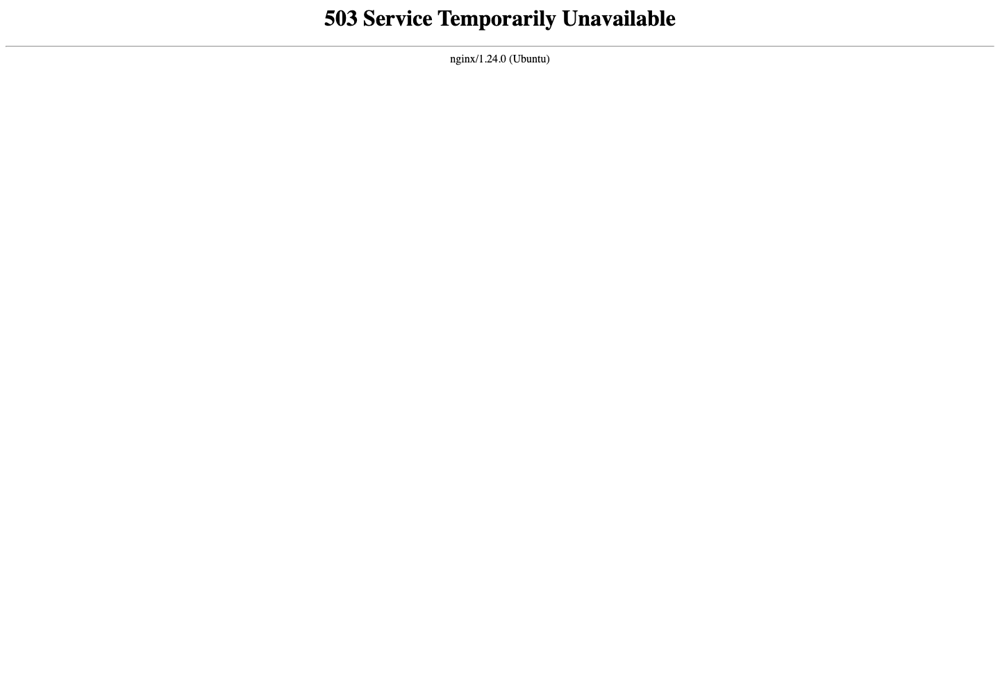 | app.hercules.exchange 返回 503（证明前端截图缺口原因） |
| 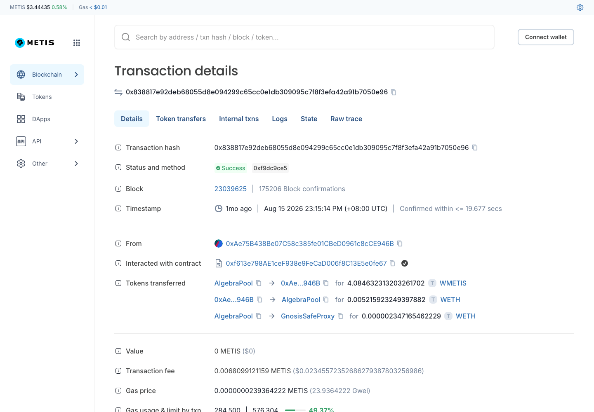 | 交易详情，`to` = `0xf613e798…`，WMETIS ⇄ WETH 经 AlgebraPool |
| 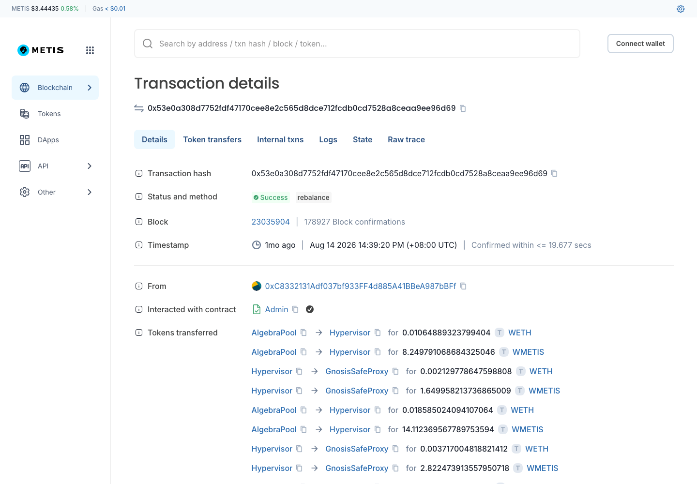 | 方法 `rebalance`，Interacted with Admin，AlgebraPool ⇄ Hypervisor |
| 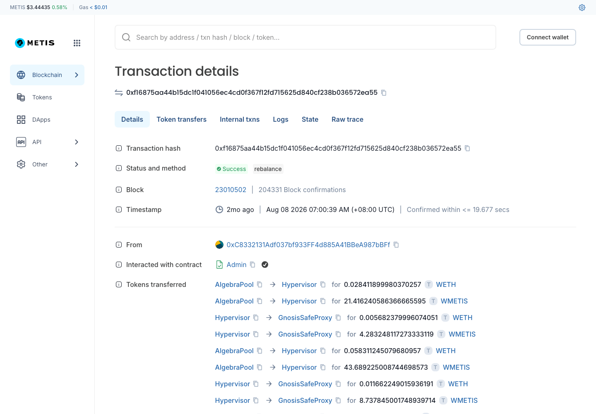 | 同上，方法 `rebalance` |

---

## 3. Netswap

### 3.1 基础信息

| 字段 | 值 |
|------|-----|
| 协议类型 | **V2**（Uniswap V2 式恒定乘积 AMM，LP 凭证为 ERC-20 `NLP`） |
| 官网 | https://netswap.io |
| **操作入口** | https://netswap.io/#/swap ｜ https://netswap.io/#/pool ｜ https://netswap.io/#/farm ｜ https://netswap.io/#/nett-staking （另有 Launchpad、Bridge、Analytics） |
| 前端链 | ✅ 前端只服务 Metis，打开即是目标链 |
| 文档 / 审计 | https://docs.netswap.io/security/security-audits |
| Factory | `0x70f51d68d16e8f9e418441280342bd43ac9dff9f`（示例池 `factory()` 链上读出） |
| Router（LP 交易的 to） | `0x1e876cce41b7b844fde09e38fa1cf00f213bff56`（浏览器标签 **NetswapRouter**，方法 `addLiquidityMetis` / `removeLiquidity`） |
| 示例 pool | `0x3d60afecf67e6ba950b499137a72478b2ca7c5a1`（m.USDT/Metis） |
| Ave / OKX | 是 / 否 |
| 交易量占比 | 42.4%（日量 $44,537.51 / 日交易 6,074 笔 / TVL $893,819.48，GeckoTerminal） |
| DefiLlama | slug `netswap`，TVL **$1,460,484**（2026-09-29），治理代币 NETT |

### 3.2 协议背景

Netswap 是 Metis Andromeda 上的原生 DEX，DefiLlama 于 2021-12 收录，采用和 Uniswap 相同的 AMM 模型，治理代币 NETT。它是 Metis 上 TVL 最高的 DEX，产品线除 Swap / 流动性外还有 Farm、NETT 质押、Launchpad、跨链桥入口和交易赛，DefiLlama 记录有 2 份审计。

### 3.3 操作清单（页面可点击）

| # | 交易类型 | 入口 |
|---|---------|------|
| 1 | **Swap** | https://netswap.io/#/swap |
| 2 | **加流动性** | https://netswap.io/#/pool → 选池 → Add |
| 3 | **减流动性** | 同上 → MY POOL → Remove |
| 4 | Farm（LP 挖矿） | https://netswap.io/#/farm （页面有，本次未取样） |
| 5 | NETT 质押 | https://netswap.io/#/nett-staking （页面有，本次未取样） |

### 3.4 公开样本交易（⚠️ 非本人钱包）

| 交易类型 | tx hash | 截图 |
|---------|---------|------|
| Swap | [0x360cc32c952cefb9458ece8d5cbb298534184d29f34e16d4d2f3a00d911fc994](https://andromeda-explorer.metis.io/tx/0x360cc32c952cefb9458ece8d5cbb298534184d29f34e16d4d2f3a00d911fc994) | `Netswap-Metis-swap交易-20260929.png` |
| Swap | [0xa2563707a14a12235cea0faf1c73564609968847ca7c9b1fc3280cd7aef15133](https://andromeda-explorer.metis.io/tx/0xa2563707a14a12235cea0faf1c73564609968847ca7c9b1fc3280cd7aef15133) | — |
| Swap | [0x1c94f8d06b2662b376c9067fe3109aa51cfe47ba89e56e49ab5b07b18fdd6359](https://andromeda-explorer.metis.io/tx/0x1c94f8d06b2662b376c9067fe3109aa51cfe47ba89e56e49ab5b07b18fdd6359) | — |
| Swap | [0xe5f1766e30db38c5ef510f625b235804d127a5f3643bfa2c6670cdd55c2d9df7](https://andromeda-explorer.metis.io/tx/0xe5f1766e30db38c5ef510f625b235804d127a5f3643bfa2c6670cdd55c2d9df7) | — |
| 加流动性 | [0xc0a63070b3c1e0296ab6dd8a4504b2629f505b0a598b89fd98f4b57eb88e8f11](https://andromeda-explorer.metis.io/tx/0xc0a63070b3c1e0296ab6dd8a4504b2629f505b0a598b89fd98f4b57eb88e8f11) | `Netswap-Metis-加流动性交易-20260929.png` |
| 减流动性 | [0x19e4d78ed661aeb4fdf1e6c391b63b879f0f6a1d5be7f6444b087410374b7b9f](https://andromeda-explorer.metis.io/tx/0x19e4d78ed661aeb4fdf1e6c391b63b879f0f6a1d5be7f6444b087410374b7b9f) | `Netswap-Metis-减流动性交易-20260929.png` |

📌 样本备注：加 / 减流动性两笔不在示例池上，而是 Netswap 的另一个池 `0x5ae3ee7f…5091`（m.USDC/Metis，`factory()` 同为 Netswap Factory），经 NetswapRouter 发起，是标准的用户 LP 操作。

### 3.5 操作覆盖

| 交易类型 | 公开样本 hash | 截图 | 备注 |
|---------|--------------|:---:|------|
| Swap | ✅ 4 条 | ✅ swap 页 + 交易页 | |
| 加流动性 | ✅ 1 条 | ✅ 流动性页 + 交易页 | 在 m.USDC/Metis 池 |
| 减流动性 | ✅ 1 条 | ✅ 交易页 | 同上 |
| Farm | ⬜ | ⬜ | 页面有入口，本次未取样 |
| NETT 质押 | ⬜ | ⬜ | 页面有入口，本次未取样 |

### 3.6 截图

| 文件 | 内容 |
|------|------|
| 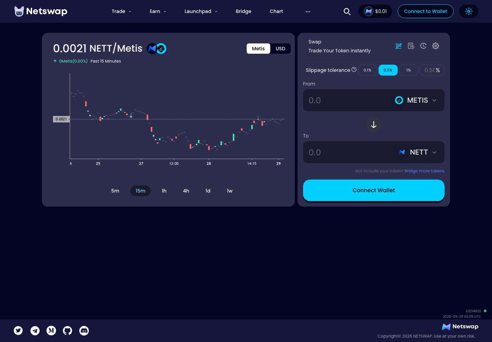 | Swap 面板 METIS → NETT，NETT/Metis 行情图 |
| 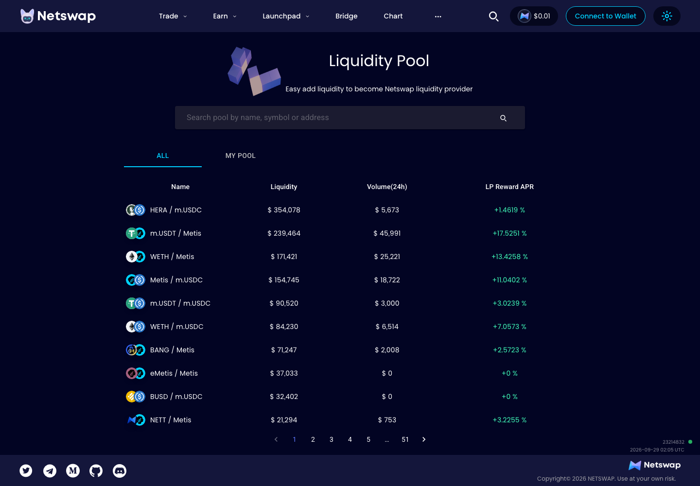 | Liquidity Pool 列表（m.USDT/Metis 流动性 $239,499 等） |
| 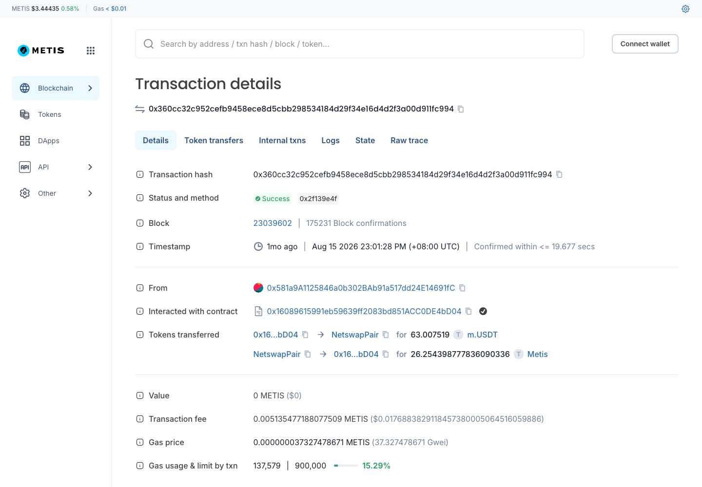 | 交易详情，m.USDT ⇄ Metis 经 NetswapPair |
| 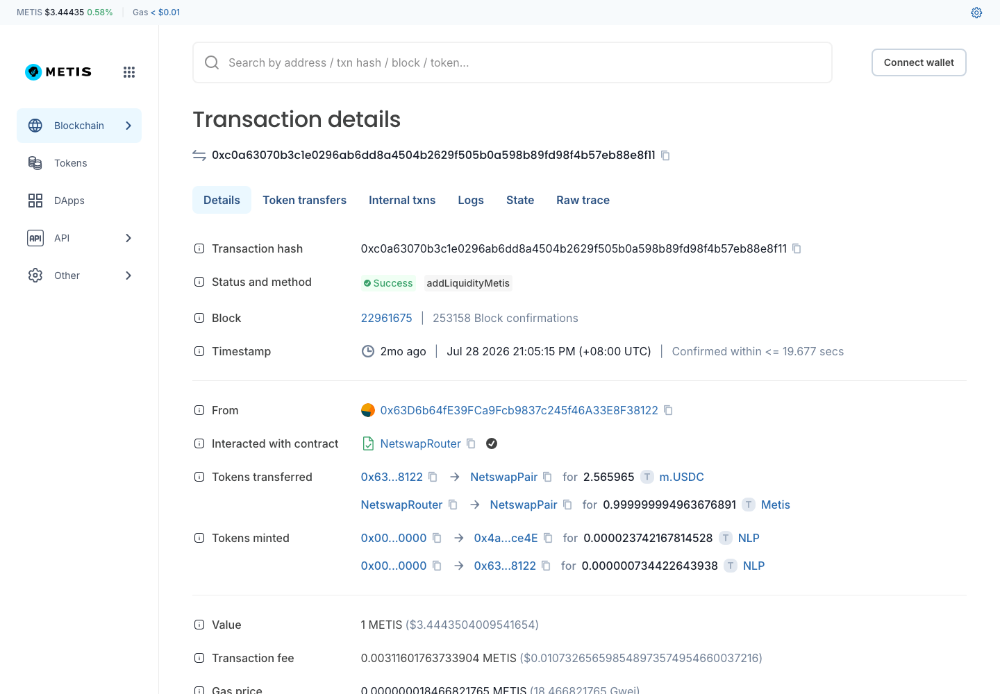 | 方法 `addLiquidityMetis`，NetswapRouter，铸造 NLP |
| 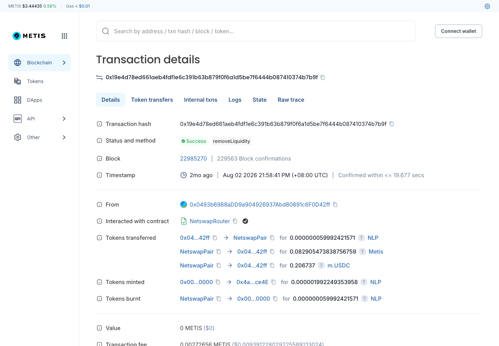 | 方法 `removeLiquidity`，销毁 NLP |

---

## 4. WAGMI

### 4.1 基础信息

| 字段 | 值 |
|------|-----|
| 协议类型 | **V3 / CLMM**（Uniswap V3 分叉，示例池 `fee()`=1500 即 0.15%；LP 凭证为 NFT `Uniswap V3 Positions NFT-V1`） |
| 官网 | https://wagmi.com ｜ 应用 https://app.wagmi.com |
| **操作入口** | https://app.wagmi.com/trade/swap?chain=1088 ｜ https://app.wagmi.com/liquidity/pools?chain=1088 （另有 Leverage、Strategies、GMI、Dashboard） |
| 前端链 | ⚠️ 前端默认打开 **Sonic** 链，必须带 `?chain=1088` 才落到 Metis（已截图确认显示 METIS/WAGMI、「Metis token bridge」）；⚠️ 部分地区访问会返回 451「Region Restricted」 |
| Factory | `0x8112e18a34b63964388a3b2984037d6a2efe5b8a`（示例池 `factory()` 链上读出，与前端代码里 Metis 的配置一致） |
| NonfungiblePositionManager | `0xa7e119cf6c8f5be29ca82611752463f0ffcb1b02`（`name()` = Uniswap V3 Positions NFT-V1，前端代码里 Metis 配置的地址） |
| 其他产品合约 | GMI `0x19eab1a88328da0fb9471f36582a3c107e740776`（前端配置 `gmi`）；杠杆 LiquidityBorrowingManager `0xca95290e0079ae61f4c433819607f53f9feced53`（浏览器标签） |
| 示例 pool | `0xd0c5ecbb9e363531ea4cbf5807837c656d308eb0`（WETH/WMETIS 0.15%，流动性页上可见） |
| Ave / OKX | —（Confluence 未填）/ 是 |
| 交易量占比 | 4.0%（日量 $4,250.46，GeckoTerminal；日交易数与 TVL Confluence 未填） |
| DefiLlama | slug `wagmi`，总 TVL $264,690，其中 Metis **$37,393**（2026-09-29） |

### 4.2 协议背景

WAGMI 是多链部署的集中流动性 DEX，DefiLlama 于 2023-04 收录，目前覆盖 Sonic、Metis、Kava、zkSync Era、IOTA EVM、Ethereum、Base 等链，记录有 3 份审计。按官方描述，它是一个「限定 TVL」的 DEX，主打高级做市策略和 GMI 机制，尽量提高托管流动性的利用率；前端除 V3 池外还有杠杆（Leverage / LiquidityBorrowingManager）、策略（Strategies）和 GMI 金库。

### 4.3 操作清单（页面可点击）

| # | 交易类型 | 入口 |
|---|---------|------|
| 1 | **Swap** | https://app.wagmi.com/trade/swap?chain=1088 |
| 2 | **加流动性**（开 V3 NFT 仓位） | https://app.wagmi.com/liquidity/pools?chain=1088 → Join / Create pool |
| 3 | **减流动性** | Dashboard → 仓位 → Remove |
| 4 | 杠杆做市（Leverage，借贷 / 还款） | 导航 Trade / Liquidity → Leverage（页面有） |
| 5 | GMI 金库存取 | 导航 GMI（页面有） |

### 4.4 公开样本交易（⚠️ 非本人钱包）

| 交易类型 | tx hash | 截图 |
|---------|---------|------|
| Swap | [0x2e60845c6478281aedf102ee998207157c8dfc4c8f61da15e67b84bd4794574d](https://andromeda-explorer.metis.io/tx/0x2e60845c6478281aedf102ee998207157c8dfc4c8f61da15e67b84bd4794574d) | `WAGMI-Metis-swap交易-20260929.png` |
| Swap | [0x26b5f044e5bf100368d1a75fe86a64c85298a930ff2ec1205c6273c4ddd4ea2c](https://andromeda-explorer.metis.io/tx/0x26b5f044e5bf100368d1a75fe86a64c85298a930ff2ec1205c6273c4ddd4ea2c) | — |
| Swap | [0x1859114ac67c7192239a46ee73a6d99148de518703cfcf2a190959feb2a2a2de](https://andromeda-explorer.metis.io/tx/0x1859114ac67c7192239a46ee73a6d99148de518703cfcf2a190959feb2a2a2de) | — |
| Swap | [0x8d2e87b3df02ae1a0eee37454deff4e855a2682fc9954c830ad6ea2ea9d9f96a](https://andromeda-explorer.metis.io/tx/0x8d2e87b3df02ae1a0eee37454deff4e855a2682fc9954c830ad6ea2ea9d9f96a) | — |
| 加流动性（Confluence 标注） | [0x3a8b4d7a0dd692561b42fc643fd06df956c632ad77049cd03a5a8c9d3da172b9](https://andromeda-explorer.metis.io/tx/0x3a8b4d7a0dd692561b42fc643fd06df956c632ad77049cd03a5a8c9d3da172b9) | `WAGMI-Metis-加流动性交易-20260929.png` |
| 减流动性（Confluence 标注） | [0xf31fa92997553b89ce1b853c4f5a671bfdf3d9534fa33bbcf5d19195fa67063d](https://andromeda-explorer.metis.io/tx/0xf31fa92997553b89ce1b853c4f5a671bfdf3d9534fa33bbcf5d19195fa67063d) | `WAGMI-Metis-减流动性交易-20260929.png` |
| 🆕 减流动性（标准 PositionManager，补采，链上实查） | [0xd6dabf9e8f8b1c6f6fdac4e6192226a63367d7d6c8b77c8c67740392e6e00809](https://andromeda-explorer.metis.io/tx/0xd6dabf9e8f8b1c6f6fdac4e6192226a63367d7d6c8b77c8c67740392e6e00809) | ⬜ |
| 🆕 加流动性（IncreaseLiquidity，补采候选，链上实查） | [0xfec2598b5689db4f1f8425d0c36be4b6328752dd4eab3dd98996d6cff3894d61](https://andromeda-explorer.metis.io/tx/0xfec2598b5689db4f1f8425d0c36be4b6328752dd4eab3dd98996d6cff3894d61) | ⬜ |

🔴 **样本口径提醒**：Confluence 的两条 LP 样本都不是标准 V3 加 / 减流动性——
- 「加流动性」`0x3a8b4d7a…`（2026-05-15）方法名 **`repayBorrow`**，调用的是杠杆产品 LiquidityBorrowingManager，属于「杠杆仓位还款」，池子里的 Mint 是还款后重新做市的副产物；
- 「减流动性」`0xf31fa929…`（2026-08-04）调用的是 **GMI** 合约 `0x19eab1a8…`，属于 GMI 金库操作。

因此补采了两条走 NonfungiblePositionManager 的样本（都在 WAGMI Factory 的池子上，但不是示例池）：
- `0xd6dabf9e…`（2026-07-28）：直接调 PositionManager `multicall`，池 `0x17112bf0…fa14` 发出 Burn → 标准「减流动性」；
- `0xfec2598b…`（2026-06-20）：PositionManager 发出 `IncreaseLiquidity`，但交易 `to` 是 `0x7b2966d0…7e02`（经第三方合约调用），池 `0x4680b3f8…5c55` → ⚠️ 候选；这是近约 45 万区块内最新的一笔 `IncreaseLiquidity`，用户直接调 PositionManager 的加流动性样本还没找到。

### 4.5 操作覆盖

| 交易类型 | 公开样本 hash | 截图 | 备注 |
|---------|--------------|:---:|------|
| Swap | ✅ 4 条 | ✅ swap 页 + 交易页 | 样本 `to` 均为聚合器 `0xf613e798…` |
| 加流动性 | 🟡 Confluence 1 条（实为杠杆还款）+ 补采候选 1 条 | ✅ 流动性页 + 交易页（Confluence 那条） | 补采那条未截图 |
| 减流动性 | 🟡 Confluence 1 条（实为 GMI）+ 补采 1 条 | ✅ 交易页（Confluence 那条） | 补采那条未截图 |
| 杠杆（借 / 还） | 🟡 `0x3a8b4d7a…` 即为 repayBorrow | ✅ 同上交易页 | 借款侧未取样 |
| GMI 金库 | 🟡 `0xf31fa929…` 即为 GMI 操作 | ✅ 同上交易页 | 存 / 取方向待解析同学确认 |

### 4.6 截图

| 文件 | 内容 |
|------|------|
| 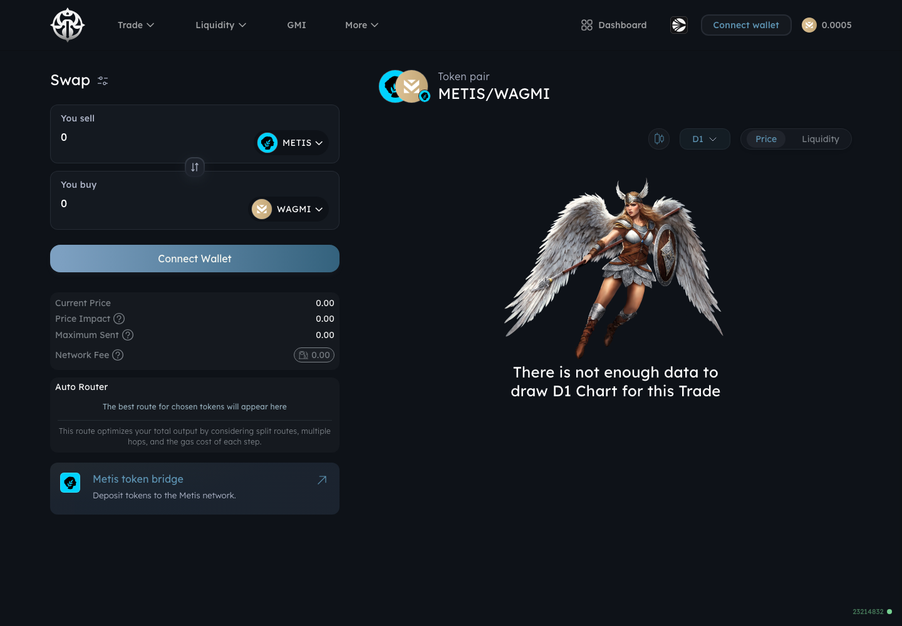 | `?chain=1088`，METIS → WAGMI，底部「Metis token bridge」 |
| 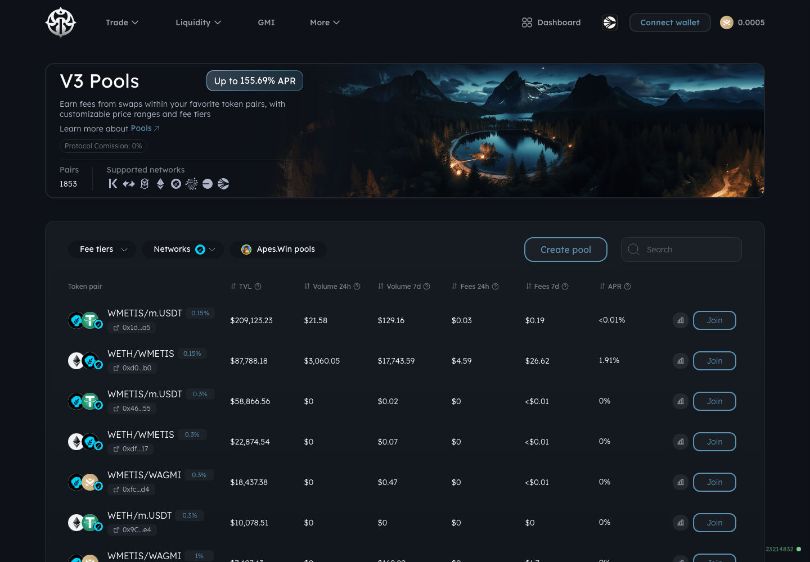 | V3 Pools 列表（WMETIS/m.USDT、WETH/WMETIS 0.15% 等 Metis 池） |
| 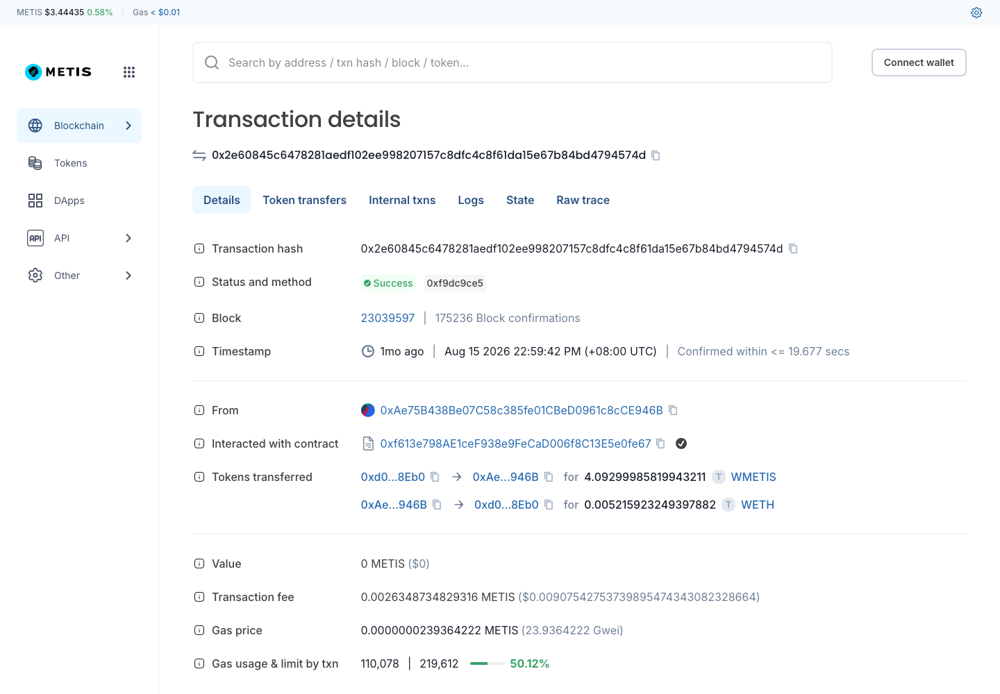 | 交易详情，`to` = `0xf613e798…`，WMETIS ⇄ WETH |
| 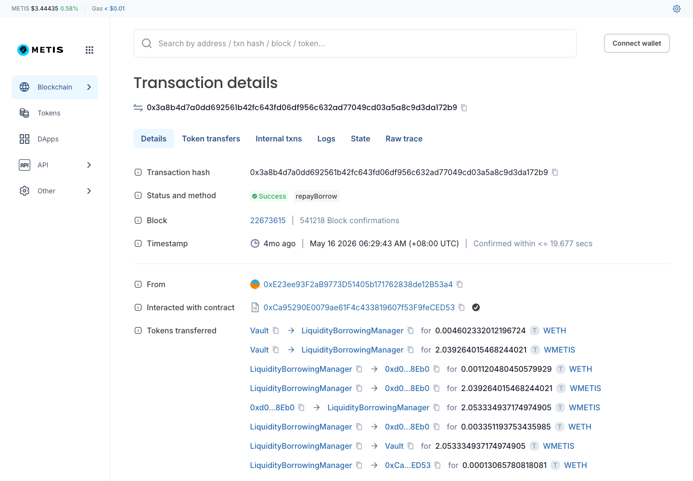 | 方法 `repayBorrow`，Vault / LiquidityBorrowingManager |
| 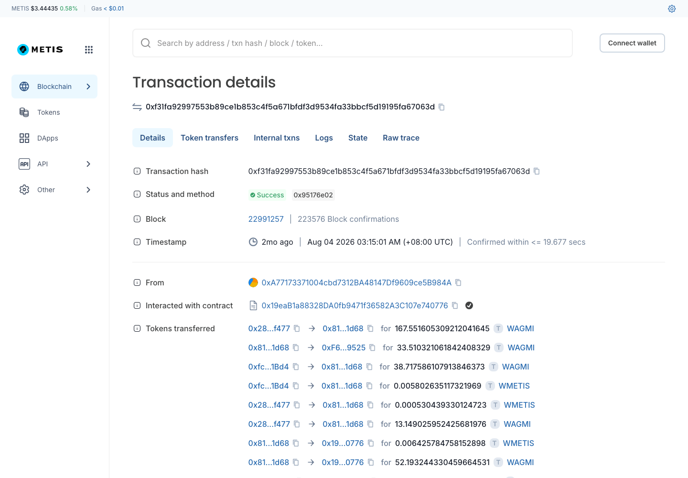 | 调 GMI 合约 `0x19eab1a8…`，WAGMI / WMETIS 多笔转账 |

---

## 5. Tethys

### 5.1 基础信息

| 字段 | 值 |
|------|-----|
| 协议类型 | **V2**（Uniswap V2 式，浏览器显示 `UniswapV2Pair` / `UniswapV2Router02`，LP 凭证为 ERC-20 `TETHYSLP`） |
| 官网 | https://tethys.finance （🔴 2026-09-29 已是**域名待售页**「tethys.finance may be for sale」；`app.tethys.finance` 同样；DefiLlama 父协议标记 `deadUrl`） |
| **操作入口** | ⚠️ 无可用前端 |
| Factory | `0x2cdfb20205701ff01689461610c9f321d1d00f80`（示例池 `factory()` 链上读出） |
| Router（LP 交易的 to） | `0x81b9fa50d5f5155ee17817c21702c3ae4780ad09`（浏览器标签 UniswapV2Router02，方法 `addLiquidityETH` / `removeLiquidityETH`） |
| 示例 pool | `0xee5adb5b0dfc51029aca5ad4bc684ad676b307f7`（WETH/Metis） |
| Ave / OKX | —（Confluence 未填）/ 是 |
| 交易量占比 | 3.4%（日量 $3,551.58，GeckoTerminal） |
| DefiLlama | slug `tethys-amm`（父协议 `Tethys Finance`，代币 TETHYS），TVL **$178,950**（2026-09-29） |

### 5.2 协议背景

Tethys Finance 是 Metis Andromeda 早期的原生 DEX，DefiLlama 于 2021-12 收录（与 Netswap 同期），治理代币 TETHYS，曾经还做过永续合约产品 Tethys Perpetual。DefiLlama 记录有 2 份审计。🔴 现在官网域名已过期挂牌出售，前端不可用；链上还剩约 $17.9 万 TVL，Swap 基本靠聚合器路由进来。

### 5.3 操作清单

🔴 **前端已下线（域名待售），页面上没有可点击的交易类型**。链上仍能看到的行为：

| # | 交易类型 | 链上实际形态 |
|---|---------|------------|
| 1 | Swap | 聚合器路由进 UniswapV2Pair |
| 2 | 加流动性 | 直接调 Router `addLiquidityETH` |
| 3 | 减流动性 | 直接调 Router `removeLiquidityETH` |

### 5.4 公开样本交易（⚠️ 非本人钱包）

| 交易类型 | tx hash | 截图 |
|---------|---------|------|
| Swap | [0x416b7da7587064329789676b96a87712ee256d14b847f0fece8f8c131d0e2dfa](https://andromeda-explorer.metis.io/tx/0x416b7da7587064329789676b96a87712ee256d14b847f0fece8f8c131d0e2dfa) | `Tethys-Metis-swap交易-20260929.png` |
| Swap | [0x861c250c04681282faab69017271731596e37059ea8e569c63967e6483684957](https://andromeda-explorer.metis.io/tx/0x861c250c04681282faab69017271731596e37059ea8e569c63967e6483684957) | — |
| Swap | [0xd722e6957f621ac4caa5c8ef07622067871db93569db9d1f2602900e0d76ac30](https://andromeda-explorer.metis.io/tx/0xd722e6957f621ac4caa5c8ef07622067871db93569db9d1f2602900e0d76ac30) | — |
| Swap | [0xa1bcff6a23130c19dfb16a0a4c08c62f201a9dc593ea7d624e0b0533d918290e](https://andromeda-explorer.metis.io/tx/0xa1bcff6a23130c19dfb16a0a4c08c62f201a9dc593ea7d624e0b0533d918290e) | — |
| 加流动性 | [0xc3ddb2ec1dd39c685820f45fb4295ecfba6ec3b3583e9d7fefabb90e97c04f68](https://andromeda-explorer.metis.io/tx/0xc3ddb2ec1dd39c685820f45fb4295ecfba6ec3b3583e9d7fefabb90e97c04f68) | `Tethys-Metis-加流动性交易-20260929.png` |
| 减流动性 | [0xe54ec04e1adbe96e67c44c1568906aee0cb6ee953e6c1524d80838a744bcb7d2](https://andromeda-explorer.metis.io/tx/0xe54ec04e1adbe96e67c44c1568906aee0cb6ee953e6c1524d80838a744bcb7d2) | `Tethys-Metis-减流动性交易-20260929.png` |

📌 样本备注：加 / 减流动性由同一地址 `0xEE9ACdFc…03fBC` 在 2026-03-21 相隔 1 分钟内完成（先 `addLiquidityETH` 再 `removeLiquidityETH`），都是标准 V2 Router 调用。

### 5.5 操作覆盖

| 交易类型 | 公开样本 hash | 截图 | 备注 |
|---------|--------------|:---:|------|
| Swap | ✅ 4 条 | 🟡 交易页 ✅；swap 页 ⬜ | 前端下线，页面没有该入口 |
| 加流动性 | ✅ 1 条 | 🟡 交易页 ✅；流动性页 ⬜ | 同上 |
| 减流动性 | ✅ 1 条 | ✅ 交易页 | |

### 5.6 截图

| 文件 | 内容 |
|------|------|
| 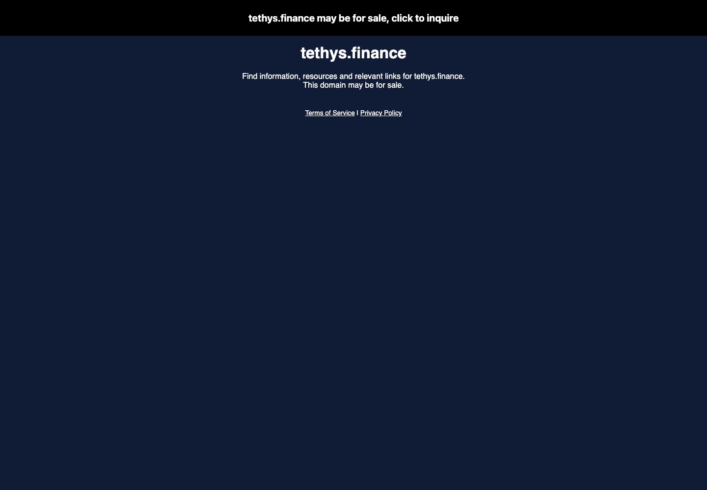 | tethys.finance 已是域名待售页（证明前端截图缺口原因） |
| 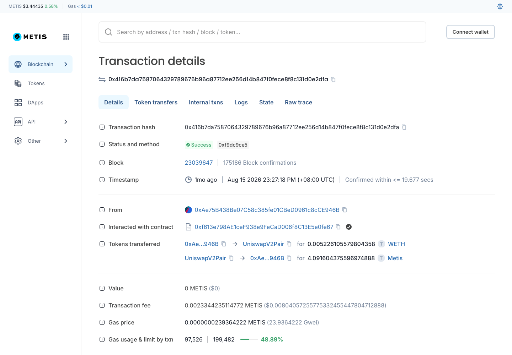 | 交易详情，`to` = `0xf613e798…`，WETH ⇄ Metis 经 UniswapV2Pair |
| 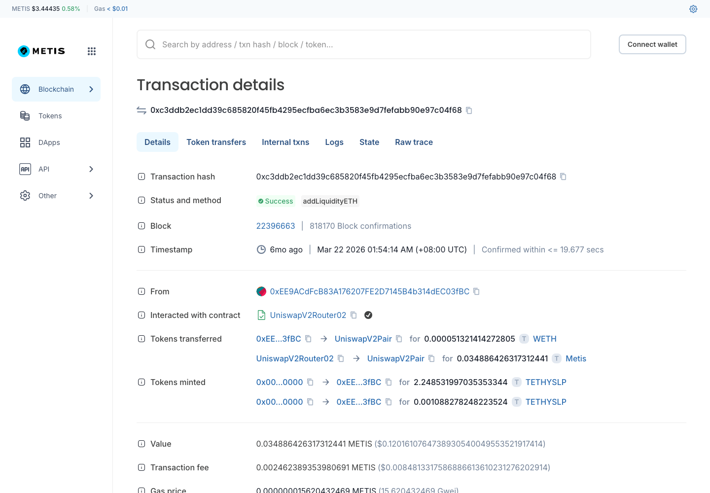 | 方法 `addLiquidityETH`，UniswapV2Router02，铸造 TETHYSLP |
| 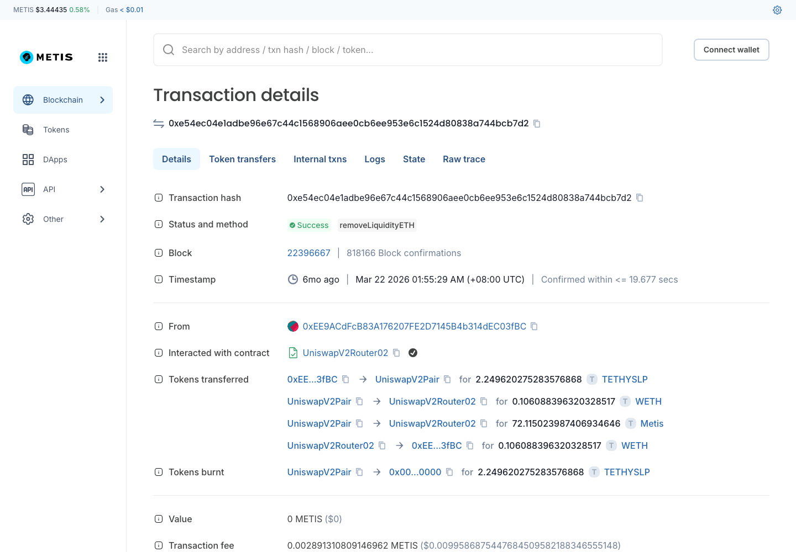 | 方法 `removeLiquidityETH`，销毁 TETHYSLP |

---

## 6. 待办 / 缺口

| # | 事项 | 说明 |
|---|------|------|
| 1 | 🔴 Hercules V3、Tethys 没有可用前端 | 前端 503 / 域名待售，swap 页、流动性页截图无法提供；需要和下游确认「前端已死、只有聚合器流量」的协议还要不要按常规口径交付 |
| 2 | 🔴 Hercules V3 LP 样本口径 | Confluence 两条是 ALM `rebalance`；已补采用户赎回 `0x9f950722…`、存入候选 `0x95451160…`，请确认用哪条，并决定是否同步更新 Confluence |
| 3 | 🔴 WAGMI LP 样本口径 | Confluence 两条分别是杠杆还款 / GMI；已补采标准减流动性 `0xd6dabf9e…`、加流动性候选 `0xfec2598b…`，同上请确认 |
| 4 | 补采 hash 的浏览器截图 | 上面 4 条补采样本还没截交易页，确认采用后再补 |
| 5 | WAGMI / Tethys 的 Ave 支持、WAGMI 日交易数与 TVL | Confluence 表里是「—」，⚠️ 待查 |
| 6 | Netswap Farm / NETT 质押、WAGMI Leverage 借款侧 / Strategies | 页面有入口，本次未取样 |
| 7 | WAGMI 前端地区限制 | 部分地区访问 app.wagmi.com 返回 451，用户本地操作前先确认能打开 |
| 8 | Confluence 子页没写快照日期 | 覆盖率数据的日期 ⚠️ 待查 |
| 9 | 本人实测 | 本页全是公开样本，本人钱包 ⬜ 未做 |
