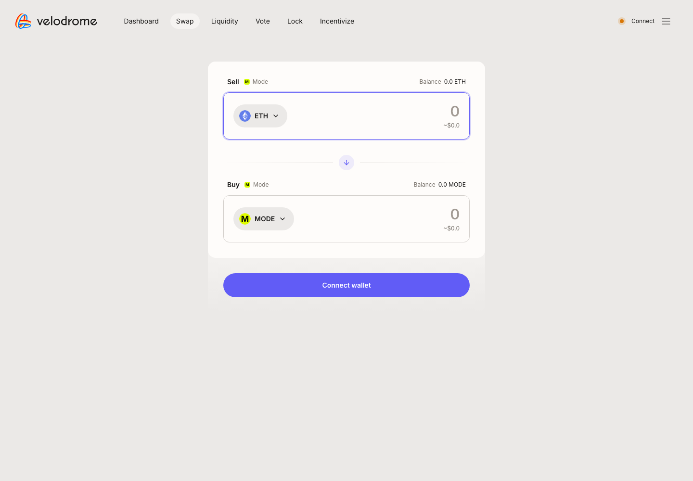
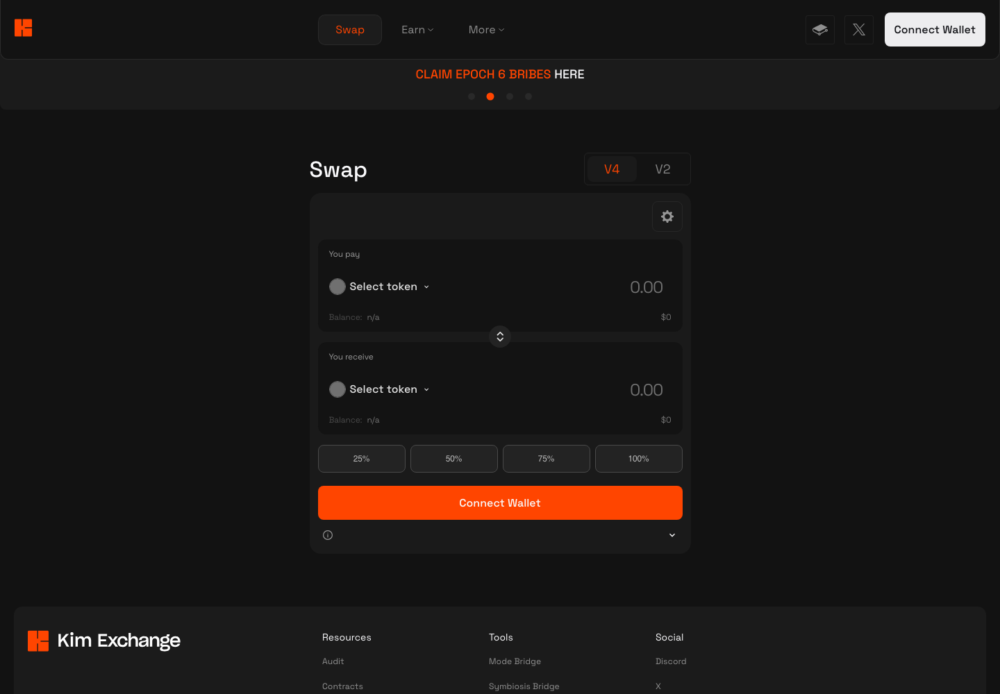
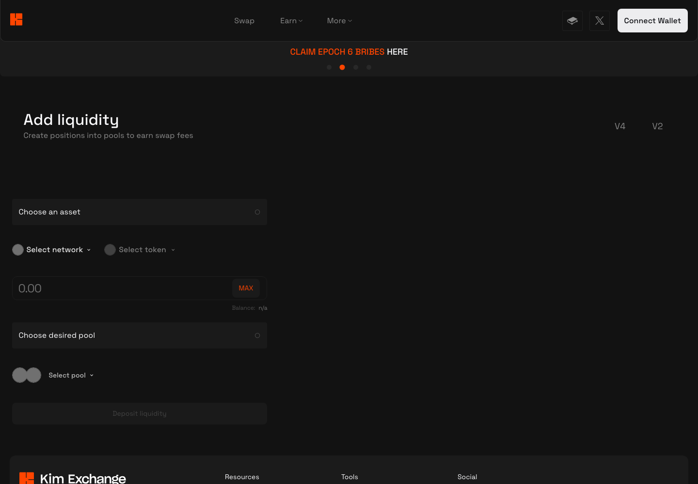
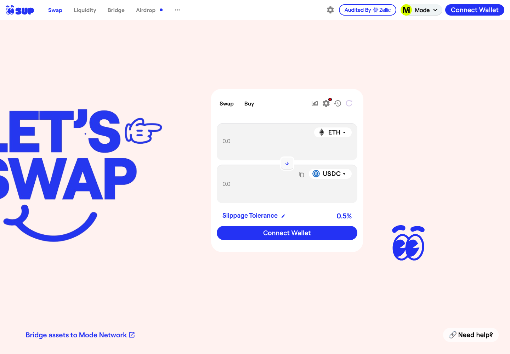
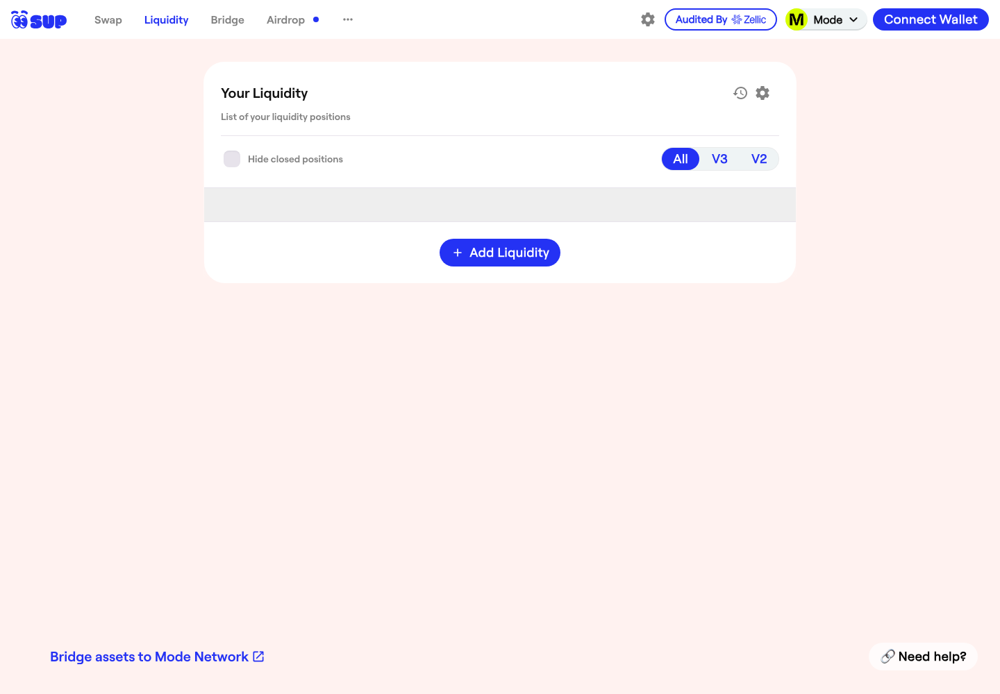

# Mode 链 DEX 协议汇总（Velodrome Slipstream / Kim V4 / SwapMode / Velodrome V2 / Kim / SupSwap）

> **状态**：🟡 6 个协议 × 3 类核心交易（Swap / 加流动性 / 减流动性）公开样本已齐；前端截图 5/6 协议已截（SwapMode 前端 522 宕机）
> **调研时间**：2026-09-29
> **交付口径**：每个协议 = 需要调研的协议 + 页面操作截图 + 对应行为的交易 hash + 背景信息；**不做链上深度解析**（解析由解析同学做）
> **链**：**Mode**（chainId **34443**）
> **样本来自链上公开交易，非本人钱包**（Confluence 已采 36 条 + 本次补采 1 条，均已在 Mode Blockscout 上逐条核验 `status=success`）
> **来源**：Confluence「各链协议调研」Mode 子页 pageId **610323213**

## 0. 一句话结论

Mode 链入选 **6 / 13** 个协议，入选交易量覆盖率 **99.7%**（链总日交易量 $22,367，Confluence 子页数据，来源 GeckoTerminal；样本 hash 采集于 2026-08-17~18）。链级 **OKX 支持 ✅ / Ave 支持 ✅**；协议级 Ave 支持的是 Kim V4、Kim，OKX 支持的是 Kim V4、SwapMode、Kim、SupSwap。6 个协议分两类前端：**Velodrome（Slipstream CL + V2 共用 velodrome.finance）**、**Kim（V4 Algebra + V2 共用 app.kim.exchange）**，另有 SwapMode（V2）、SupSwap（V3）各自独立前端。

🔴 **本次发现**：Confluence 给 Velodrome Slipstream 登记的"减少流动性" hash `0x5626fc6a…` 实际是**把 LP NFT 质押进 gauge**（调用 `ModeLeafCLGauge.deposit`，Pool 上的 `Burn` 事件 amount=0，只是结算手续费），不是真正减流动性。本次已补采一条真实减流动性样本（见 §2.4）。

## 1. 链基础信息

| 字段 | 值 |
|------|-----|
| 链 | **Mode**（OP Stack L2），chainId **34443** |
| 原生币（Gas） | **ETH**（18 位）；治理代币 MODE `0xdfc7c877a950e49d2610114102175a06c2e3167a` |
| 公共 RPC | `https://mainnet.mode.network` |
| 区块浏览器 | https://explorer.mode.network （Blockscout） |
| 链 TVL | **$1,984,432**（DefiLlama `v2/chains`，2026-09-29） |
| Dexscreener / GeckoTerminal | 是（slug=mode）/ 是（slug=mode） |
| 链级 OKX / Ave | ✅ / ✅（Confluence） |

### 协议覆盖率（照搬 Confluence 610323213）

选择规则：OKX 支持全收 + Ave 支持全收 + 按交易量降序累计覆盖 ≥90%。

| 协议 | 日交易量(USD) | 占比 | 累计占比 | 入选 | 入选理由 |
|------|------|------|------|------|------|
| Velodrome Finance Slipstream | 10,700.36 | 47.8% | 47.8% | ✅ | 交易量覆盖 |
| Kim V4 | 7,460.62 | 33.4% | 81.2% | ✅ | Ave+OKX+交易量覆盖 |
| SwapMode | 1,201.39 | 5.4% | 86.6% | ✅ | OKX+交易量覆盖 |
| Velodrome Finance V2 | 1,190.10 | 5.3% | 91.9% | ✅ | 交易量覆盖 |
| Kim | 1,048.36 | 4.7% | 96.6% | ✅ | Ave+OKX |
| SupSwap | 701.24 | 3.1% | 99.7% | ✅ | OKX |
| Balancer V2 / iZiSwap / DYORSwap / DackieSwap V3 / DackieSwap V2 / Poolshark / Archly | 合计 64.7 | 0.3% | 100.0% | — | — |

---

## 2. Velodrome Finance Slipstream（CL 集中流动性）

### 2.1 基础信息

| 字段 | 值 |
|------|-----|
| 协议类型 | **CL 集中流动性**（Slipstream = Uniswap V3 分叉 + Velodrome gauge 改造，按 tickSpacing 分档）；LP 凭证 = ERC-721 `VELO-CL-POS` |
| 官网 | https://velodrome.finance |
| **操作入口** | ⚠️ **与 Velodrome V2 共用同一前端，无独立 URL**：**Swap**：https://velodrome.finance/swap?chain0=34443&chain1=34443 ｜ **Liquidity**：https://velodrome.finance/liquidity?filters=Mode （池列表里池型标签 **"Concentrated N"** = Slipstream，N 为 tickSpacing；**"Basic Volatile / Basic Stable"** = V2；也可用 TYPE 筛选）｜ 加流动性：列表内点池子的 **New deposit** |
| 前端切链说明 | 🔴 前端默认 OP Mainnet。实测 **`chain0=34443&chain1=34443`** 能让 swap 页 Sell/Buy 两侧都落到 Mode；流动性页用 **`filters=Mode`**。⚠️ `filters=Mode`（默认 Listed & Emerging）下 Mode 链**无任何池子显示**，需加 `unknown`（`filters=Mode%2Cunknown`）才出池列表——Velodrome 前端目前未把 Mode 池列入白名单 |
| Factory | `ModeCLFactory` `0x04625b046c69577efc40e6c0bb83cdbafab5a55f`（链上 `factory()` 读出） |
| NFT 仓位管理器 | `ModeNonfungiblePositionManager` `0x991d5546c4b442b4c5fdc4c8b8b8d131deb24702` |
| 示例 pool | `0xefe134dc2be0943a51c52bb2b2bac09ab1152f95`（oUSDT/USDC，tickSpacing 1，fee 0.02%） |
| Router | ⚠️ 待查：样本 swap 的 `to` 为 `0x727c3f49…ee4f`（未验证合约，同时出现在 Kim V4 / Velodrome V2 样本中，疑为聚合器/通用路由）和 `0x0d6e46b9…6928`，均非官方命名合约 |
| Ave / OKX | 否 / 否 |
| 日交易量占比 | 47.8%（$10,700.36/日，TVL $11,439.71，GeckoTerminal） |
| DefiLlama | `velodrome-v3`，Mode TVL **$2,620**（2026-09-29）；收录 2024-03-06；审计 https://velodrome.finance/security |

### 2.2 协议背景

Velodrome 是 Optimism 上的头部 ve(3,3) DEX（Solidly 分叉），VELO 锁仓成 veVELO 投票决定 gauge 排放。Slipstream 是其集中流动性版本，在原有 sAMM/vAMM 之外新增 CL 池，且 CL 池同样可挂 gauge 领 VELO 排放。Velodrome 通过 "Superchain" 扩展到 Mode 等 OP Stack 链（Mode 上的合约带 `Mode` / `Leaf` 前缀，如 `ModeLeafCLGauge`）。

### 2.3 操作清单

| # | 操作 | 入口 |
|---|------|------|
| 1 | Swap | swap 页（两侧选 Mode） |
| 2 | 加流动性（Mint，开 CL 仓位） | Liquidity → 选 Concentrated 池 → New deposit |
| 3 | 减流动性（Burn/decreaseLiquidity） | Dashboard → 我的仓位 → Withdraw |
| 4 | 其他：质押 LP 到 gauge / 领 VELO 排放 / 领手续费 | Dashboard（需连钱包，未截） |

### 2.4 公开样本交易

| 交易类型 | 时间 (UTC) | tx hash | 截图 |
|---------|-----------|---------|------|
| Swap | 2026-08-17 20:30 | [`0x5d44e22e626256c9ecc2ea32c7c6fcadea672da40a8e67cb4596fdd726cf8993`](https://explorer.mode.network/tx/0x5d44e22e626256c9ecc2ea32c7c6fcadea672da40a8e67cb4596fdd726cf8993) | `VelodromeSlipstream-Mode-swap交易-20260929.png` |
| Swap | 2026-08-17 19:11 | [`0x5fe7d8fe5637ed83131df957669fcc714df0c0626cc8f1ead353a26976abc36c`](https://explorer.mode.network/tx/0x5fe7d8fe5637ed83131df957669fcc714df0c0626cc8f1ead353a26976abc36c) | — |
| Swap | 2026-08-17 16:07 | [`0xc572c640fa4c1afaf11f246a0db504f4b83d1d9c7c0c36eb4641c4014feb6754`](https://explorer.mode.network/tx/0xc572c640fa4c1afaf11f246a0db504f4b83d1d9c7c0c36eb4641c4014feb6754) | — |
| Swap | 2026-08-17 15:55 | [`0x5125ce467bcf8a9db0de03db30cba04e88fe0a665d323945d4de2eb6294303c5`](https://explorer.mode.network/tx/0x5125ce467bcf8a9db0de03db30cba04e88fe0a665d323945d4de2eb6294303c5) | — |
| 加流动性 | 2025-03-03 19:07 | [`0x3358ebbf7773914b1afd95c8505127e6c96d1b67a78b4a6687fe48b3c6ed297a`](https://explorer.mode.network/tx/0x3358ebbf7773914b1afd95c8505127e6c96d1b67a78b4a6687fe48b3c6ed297a) | `VelodromeSlipstream-Mode-加流动性交易-20260929.png` |
| ⚠️ gauge 质押（Confluence 登记为"减少流动性"） | 2025-03-05 04:32 | [`0x5626fc6ae86f2d52da8a3583f004cb0f446c7f14ee26a4323fffa6b85885490f`](https://explorer.mode.network/tx/0x5626fc6ae86f2d52da8a3583f004cb0f446c7f14ee26a4323fffa6b85885490f) | `VelodromeSlipstream-Mode-gauge质押交易-20260929.png` |
| **减流动性（本次补采）** | 2026-08-29 15:50 | [`0xb043133688a0dbd42152961d867ac01e4c4f9facd20f89fb5fae0cb6766ff3b2`](https://explorer.mode.network/tx/0xb043133688a0dbd42152961d867ac01e4c4f9facd20f89fb5fae0cb6766ff3b2) | `VelodromeSlipstream-Mode-减流动性交易-20260929.png` |

- `0x5626fc6a…`：`to` = `ModeLeafCLGauge` `0x60e31aceac0953d972479659d4a0863af343ba1b`，方法 `deposit`；Pool `Burn` 事件 amount=0 + `Collect`（先结算手续费再把 NFT tokenId 9161 转进 gauge）。**是质押，不是减流动性**。
- `0xb0431336…`：示例 pool 上 `Burn` amount=191862696（非零），由第三方策略合约 `NftFarmStrategy` `0xcc2a3efe…cdbd` 调用 NFT 管理器完成（`exit`）。⚠️ 不是从 Velodrome 前端直接点出来的，但池子和 Burn 事件与前端操作一致；如需前端直连样本可再补。

### 2.5 操作覆盖

| 交易类型 | 公开样本 hash | 截图 | 备注 |
|---------|--------------|:---:|------|
| Swap | `0x5d44e22e…` 等 4 条 | ✅ 前端 swap 页 + 交易详情 | 前端图与 V2 共用 |
| 加流动性 | `0x3358ebbf…` | ✅ 交易详情 + 前端流动性页 | |
| 减流动性 | `0xb0431336…`（补采） | ✅ 交易详情 | Confluence 原登记那条实为 gauge 质押 |
| gauge 质押 / 领排放 / collect | `0x5626fc6a…`（gauge 质押） | ✅ 交易详情 | 领排放、单独 collect 未取样 |

截图： 

---

## 3. Kim V4（Algebra 集中流动性）

### 3.1 基础信息

| 字段 | 值 |
|------|-----|
| 协议类型 | **Algebra Integral（集中流动性，动态费率）**；LP 凭证 = ERC-721 `Algebra Positions NFT-V2` |
| 官网 | https://kim.exchange |
| **操作入口** | ⚠️ **与 Kim（V2）共用同一前端**：**Swap**：https://app.kim.exchange/swap （右上 **V4 / V2** 页签切换池型）｜ **加流动性**：https://app.kim.exchange/liquidity/router （同样有 V4 / V2 页签）｜ **Pools**：https://app.kim.exchange/pools |
| Factory | `AlgebraFactory` `0xb5f00c2c5f8821155d8ed27e31932cfd9db3c5d5` |
| 仓位管理器 | `Position Manager v4`（NonfungiblePositionManager）`0x2e8614625226d26180adf6530c3b1677d3d7cf10` |
| 示例 pool | `0x468cc91df6f669cae6cdce766995bd7874052fbc`（WETH/USDC，tickSpacing 60，当前动态费 0.0107%） |
| Router | ⚠️ 待查：4 条样本 swap 均经 `0x727c3f49…ee4f`（未验证合约） |
| Ave / OKX | 是 / 是 |
| 日交易量占比 | 33.4%（$7,460.62/日，TVL $79,641.38） |
| DefiLlama | `kim-exchange-v3`（⚠️ DefiLlama 叫 "KIM Exchange V3"，与 Confluence 的 "Kim V4" 同为 Algebra 池，按 Factory 判断为同一套），Mode TVL **$140,247**；审计 https://github.com/kim-protocol/public-reports/tree/main/audits |

### 3.2 协议背景

Kim Exchange 是 Mode 原生 DEX，DefiLlama 描述为"带 staking 模块激励 LP 的 Mode 原生 DEX"，同时部署在 Base。V4 为基于 Algebra 的集中流动性池（动态费率），V2 为恒定乘积池；另有 Kim Vaults、治理（gov.kim.exchange）、NFT marketplace 等周边产品。

### 3.3 操作清单

| # | 操作 | 入口 |
|---|------|------|
| 1 | Swap（V4 页签） | /swap |
| 2 | 加流动性（开 V4 仓位） | /liquidity/router → V4 |
| 3 | 减流动性 | /pools → 我的仓位（需连钱包） |
| 4 | 其他：LP 质押、bribes 领取、投票 | Earn 菜单（未截） |

### 3.4 公开样本交易

| 交易类型 | 时间 (UTC) | tx hash | 截图 |
|---------|-----------|---------|------|
| Swap | 2026-08-18 02:56 | [`0xaece7f88935a8bd0ebae76ec4905ea2984c18b48b59c26b82ef2357a6da40761`](https://explorer.mode.network/tx/0xaece7f88935a8bd0ebae76ec4905ea2984c18b48b59c26b82ef2357a6da40761) | `KimV4-Mode-swap交易-20260929.png` |
| Swap | 2026-08-18 02:55 | [`0xf72b29bddd63d893e828dec6a3a918fc9d3382c763b51ad504b608743f6cf878`](https://explorer.mode.network/tx/0xf72b29bddd63d893e828dec6a3a918fc9d3382c763b51ad504b608743f6cf878) | — |
| Swap | 2026-08-18 02:51 | [`0x4c07563bd7bdf48cb0702bfbd080fb5bdb30b05dcce15e71bd7b0f53bee4ffef`](https://explorer.mode.network/tx/0x4c07563bd7bdf48cb0702bfbd080fb5bdb30b05dcce15e71bd7b0f53bee4ffef) | — |
| Swap | 2026-08-18 02:51 | [`0xefd23dc566d3f860e9fdb07907e8d070b0b51d31ebfc319ee409297e5e527dac`](https://explorer.mode.network/tx/0xefd23dc566d3f860e9fdb07907e8d070b0b51d31ebfc319ee409297e5e527dac) | — |
| 加流动性 | 2024-04-09 09:40 | [`0x1700f04a0d21e2b114b6b18188084972902d9bec1ca35108cc3497724b277eb1`](https://explorer.mode.network/tx/0x1700f04a0d21e2b114b6b18188084972902d9bec1ca35108cc3497724b277eb1) | `KimV4-Mode-加流动性交易-20260929.png` |
| 减流动性 | 2024-04-09 09:39 | [`0xc55cc0c794b7c93e341b4a839cbf692444b595b9eb43cecc5d7492ad1967503e`](https://explorer.mode.network/tx/0xc55cc0c794b7c93e341b4a839cbf692444b595b9eb43cecc5d7492ad1967503e) | `KimV4-Mode-减流动性交易-20260929.png` |

### 3.5 操作覆盖

| 交易类型 | 公开样本 hash | 截图 | 备注 |
|---------|--------------|:---:|------|
| Swap | `0xaece7f88…` 等 4 条 | ✅ | 前端 swap 页与 Kim V2 共用 |
| 加流动性 | `0x1700f04a…` | ✅ | Position Manager v4 `multicall`，铸 NFT |
| 减流动性 | `0xc55cc0c7…` | ✅ | Pool `Burn` 非零 + `DecreaseLiquidity` |
| LP 质押 / bribes | — | ⬜ | 未取样 |

截图： 

---

## 4. SwapMode（V2）

### 4.1 基础信息

| 字段 | 值 |
|------|-----|
| 协议类型 | **Uniswap V2 / PancakeSwap V2 分叉**（恒定乘积），LP 凭证 ERC-20 |
| 官网 | https://swapmode.fi |
| **操作入口** | https://swapmode.fi/swap ｜ https://swapmode.fi/liquidity ｜ 🔴 **2026-09-29 两次访问均返回 Cloudflare 522（源站超时）**，前端不可用 |
| Factory | `PancakeFactory` `0xfb926356baf861c93c3557d7327dbe8734a71891` |
| Router | `PancakeRouter` `0xc1e624c810d297fd70ef53b0e08f44fabe468591`（加/减流动性样本直连此合约） |
| 示例 pool | `0x50273860341bb80de359cd391bef9b2eb228753c`（WETH/USDC） |
| Ave / OKX | 否 / 是 |
| 日交易量占比 | 5.4%（$1,201.39/日，TVL $16,384.34） |
| DefiLlama | `swapmode-v2`，Mode TVL **$46,386**；另有 `swapmode-v3`（$2,320，本页未入选）；审计 BlockSAFU（Router/Factory 各一份） |

### 4.2 协议背景

SwapMode 自称"Mode 上的首要 DEX、流动性一站式中心"，2024-02 上线（DefiLlama 收录 2024-02-07），合约为 PancakeSwap V2 分叉。样本 swap 的 `to` 多为聚合器/第三方路由（如 LiFi Diamond `0x1231deb6…`），说明链上成交量里相当比例来自聚合器路由而非其前端。

### 4.3 操作清单

| # | 操作 | 入口 |
|---|------|------|
| 1 | Swap | /swap（⚠️ 前端 522） |
| 2 | 加流动性 | /liquidity（⚠️ 前端 522） |
| 3 | 减流动性 | /liquidity → 我的仓位（⚠️ 前端 522） |

### 4.4 公开样本交易

| 交易类型 | 时间 (UTC) | tx hash | 截图 |
|---------|-----------|---------|------|
| Swap | 2026-08-17 20:35 | [`0xd81c6cff407fb719ac5f85b01607819fdc4cdc8d72fc46382ed9a6109d69949b`](https://explorer.mode.network/tx/0xd81c6cff407fb719ac5f85b01607819fdc4cdc8d72fc46382ed9a6109d69949b) | `SwapMode-Mode-swap交易-20260929.png` |
| Swap | 2026-08-17 20:30 | [`0xfe63ff170435210f254e6fb986c76ab7dd597eb9c7ed7435224859ad3e458f35`](https://explorer.mode.network/tx/0xfe63ff170435210f254e6fb986c76ab7dd597eb9c7ed7435224859ad3e458f35) | — |
| Swap | 2026-08-17 20:30 | [`0xb6b285dc78264b778a4d0c8e71ed49c87ed0555f7e0429e90f15dfb324f631db`](https://explorer.mode.network/tx/0xb6b285dc78264b778a4d0c8e71ed49c87ed0555f7e0429e90f15dfb324f631db) | — |
| Swap | 2026-08-17 20:26 | [`0xa1e1d930e00b28fc28ba5cd8f2e3abca88874ff043a837e757d08c7448c49762`](https://explorer.mode.network/tx/0xa1e1d930e00b28fc28ba5cd8f2e3abca88874ff043a837e757d08c7448c49762) | — |
| 加流动性 | 2024-02-19 07:48 | [`0xd7cce9ec0329045e1bfdc1360c143963038202eb2878132b4d707d3078a2c355`](https://explorer.mode.network/tx/0xd7cce9ec0329045e1bfdc1360c143963038202eb2878132b4d707d3078a2c355) | `SwapMode-Mode-加流动性交易-20260929.png` |
| 减流动性 | 2024-02-19 07:49 | [`0xd27f87987c6bab1ad237f3d84eb1d3d4a44c2f112f675851f4cd0f6e00489e0c`](https://explorer.mode.network/tx/0xd27f87987c6bab1ad237f3d84eb1d3d4a44c2f112f675851f4cd0f6e00489e0c) | `SwapMode-Mode-减流动性交易-20260929.png` |

### 4.5 操作覆盖

| 交易类型 | 公开样本 hash | 截图 | 备注 |
|---------|--------------|:---:|------|
| Swap | `0xd81c6cff…` 等 4 条 | 🟡 交易详情 ✅ / 前端 ⬜ | 前端 522 |
| 加流动性 | `0xd7cce9ec…` | 🟡 交易详情 ✅ / 前端 ⬜ | `addLiquidityETH` |
| 减流动性 | `0xd27f8798…` | ✅ 交易详情 | `removeLiquidityETHWithPermit` 类 |

---

## 5. Velodrome Finance V2（sAMM / vAMM）

### 5.1 基础信息

| 字段 | 值 |
|------|-----|
| 协议类型 | **Solidly 式 V2**（volatile 恒定乘积 + stable 曲线两种池），LP 凭证 ERC-20 |
| 官网 | https://velodrome.finance |
| **操作入口** | ⚠️ **与 Slipstream 共用同一前端**：**Swap**：https://velodrome.finance/swap?chain0=34443&chain1=34443 ｜ **Liquidity**：https://velodrome.finance/liquidity?filters=Mode （池型标签 **"Basic Volatile" / "Basic Stable"** = V2，区别于 "Concentrated" = Slipstream） |
| Factory | `ModePoolFactory` `0x31832f2a97fd20664d76cc421207669b55ce4bc0` |
| Router | `ModeRouter` `0x3a63171dd9bebf4d07bc782fecc7eb0b890c2a45`（加/减流动性样本直连） |
| 示例 pool | `0x0fba984c97539b3fb49acda6973288d0efa903db`（WETH/MODE，volatile） |
| Ave / OKX | 否 / 否 |
| 日交易量占比 | 5.3%（$1,190.10/日，TVL $3,088.75） |
| DefiLlama | `velodrome-v2`，Mode TVL **$13,891**（2026-09-29） |

### 5.2 协议背景

Velodrome V2 是 Velodrome 的经典 Solidly 式 AMM（2023-07 上线），与 Slipstream 共用 VELO/veVELO 排放和投票体系。背景同 §2.2。

### 5.3 操作清单

同 §2.3，只是在流动性页选 Basic Volatile / Basic Stable 池。

### 5.4 公开样本交易

| 交易类型 | 时间 (UTC) | tx hash | 截图 |
|---------|-----------|---------|------|
| Swap | 2026-08-17 20:35 | [`0x463774606934f0d42246b2d6f0a3e85691925f489633b5f7c68176d1f67792ed`](https://explorer.mode.network/tx/0x463774606934f0d42246b2d6f0a3e85691925f489633b5f7c68176d1f67792ed) | `VelodromeV2-Mode-swap交易-20260929.png` |
| Swap | 2026-08-17 20:35 | [`0x875a35e181fd2a6c69d4958eedbfb8f81b5c8ff6dc1d07dd85a8523ceef324e2`](https://explorer.mode.network/tx/0x875a35e181fd2a6c69d4958eedbfb8f81b5c8ff6dc1d07dd85a8523ceef324e2) | — |
| Swap | 2026-08-17 20:35 | [`0x92be47ba1ef7eae9833858d1f338a96019626b070007b329283270b50baab952`](https://explorer.mode.network/tx/0x92be47ba1ef7eae9833858d1f338a96019626b070007b329283270b50baab952) | — |
| Swap | 2026-08-17 20:33 | [`0x6957c8790c086a51f692342cafc7243f373273ac8de95d6bf2827e7b1abc5ef1`](https://explorer.mode.network/tx/0x6957c8790c086a51f692342cafc7243f373273ac8de95d6bf2827e7b1abc5ef1) | — |
| 加流动性 | 2024-08-06 09:09 | [`0x1d2d08a4aa44ba7e2550095257eec26bb7aee1dfc6a46c04cfc4f381a3922623`](https://explorer.mode.network/tx/0x1d2d08a4aa44ba7e2550095257eec26bb7aee1dfc6a46c04cfc4f381a3922623) | `VelodromeV2-Mode-加流动性交易-20260929.png` |
| 减流动性 | 2024-08-06 08:26 | [`0xab4ec09071cbefb4d5f90f4d3388ec233aace65a3fbae0dcc5e0543bd6ca4e52`](https://explorer.mode.network/tx/0xab4ec09071cbefb4d5f90f4d3388ec233aace65a3fbae0dcc5e0543bd6ca4e52) | `VelodromeV2-Mode-减流动性交易-20260929.png` |

### 5.5 操作覆盖

| 交易类型 | 公开样本 hash | 截图 | 备注 |
|---------|--------------|:---:|------|
| Swap | `0x46377460…` 等 4 条 | ✅ | 前端图复用 `VelodromeSlipstream-Mode-swap页-20260929.png` |
| 加流动性 | `0x1d2d08a4…` | ✅ | 前端图复用 `VelodromeSlipstream-Mode-流动性页-20260929.png`（图中池子即 Basic Volatile V2 池） |
| 减流动性 | `0xab4ec090…` | ✅ | |
| gauge 质押 / 领排放 | — | ⬜ | 未取样 |

---

## 6. Kim（V2）

### 6.1 基础信息

| 字段 | 值 |
|------|-----|
| 协议类型 | **Uniswap V2 分叉**（恒定乘积），LP 凭证 ERC-20 |
| 官网 | https://kim.exchange |
| **操作入口** | ⚠️ **与 Kim V4 共用前端**：**Swap**：https://app.kim.exchange/swap （切 **V2** 页签）｜ **加流动性**：https://app.kim.exchange/liquidity/router （切 **V2** 页签）｜ https://app.kim.exchange/pools |
| Factory | `KimFactory` `0xc02155946dd8c89d3d3238a6c8a64d04e2cd4500` |
| Router | `KimRouter` `0x5d61c537393cf21893be619e36fc94cd73c77dd3` |
| 示例 pool | `0xf4c85269240c1d447309fa602a90ac23f1cb0dc0`（WETH/USDT） |
| Ave / OKX | 是 / 是 |
| 日交易量占比 | 4.7%（$1,048.36/日，TVL $50,742.78） |
| DefiLlama | `kim-exchange-v2`，Mode TVL **$92,922**；收录 2024-01-17 |

### 6.2 协议背景

同 §3.2。Kim V2 是 Kim Exchange 最早的恒定乘积池版本（2024-01），V4（Algebra）后续上线，两者在同一前端用页签切换。

### 6.3 操作清单

| # | 操作 | 入口 |
|---|------|------|
| 1 | Swap（V2 页签） | /swap |
| 2 | 加流动性（V2 页签） | /liquidity/router |
| 3 | 减流动性 | /pools → 我的仓位（需连钱包） |

### 6.4 公开样本交易

| 交易类型 | 时间 (UTC) | tx hash | 截图 |
|---------|-----------|---------|------|
| Swap | 2026-08-17 20:30 | [`0x336f6e9da44363b771e0592934a5776ae44c8c0300b4566d1fbede5b2092dcc1`](https://explorer.mode.network/tx/0x336f6e9da44363b771e0592934a5776ae44c8c0300b4566d1fbede5b2092dcc1) | `Kim-Mode-swap交易-20260929.png` |
| Swap | 2026-08-17 20:26 | [`0x242de31cb9f2f03a8e3667652044a39fd91f41cc52c1c86ffa06aaaa12876e62`](https://explorer.mode.network/tx/0x242de31cb9f2f03a8e3667652044a39fd91f41cc52c1c86ffa06aaaa12876e62) | — |
| Swap | 2026-08-17 20:26 | [`0x8d7b5263445dbe4d49f79c1a809c9c21f327c19afbc5be766dba1466470535da`](https://explorer.mode.network/tx/0x8d7b5263445dbe4d49f79c1a809c9c21f327c19afbc5be766dba1466470535da) | — |
| Swap | 2026-08-17 15:52 | [`0xd10b598322d6083fe65cc87854330586b59a4aa010c70613320419ebc455cb17`](https://explorer.mode.network/tx/0xd10b598322d6083fe65cc87854330586b59a4aa010c70613320419ebc455cb17) | — |
| 加流动性 | 2024-02-19 06:33 | [`0xd3ee643ac6e687959663b6e7b10c6abf56dfb2af1e032c14aebc002854c6c0e4`](https://explorer.mode.network/tx/0xd3ee643ac6e687959663b6e7b10c6abf56dfb2af1e032c14aebc002854c6c0e4) | `Kim-Mode-加流动性交易-20260929.png` |
| 减流动性 | 2024-02-19 06:35 | [`0x7bb967dbb6851396ff26e17d891825c77355d2753e5ccc7bb0258963d2e59d96`](https://explorer.mode.network/tx/0x7bb967dbb6851396ff26e17d891825c77355d2753e5ccc7bb0258963d2e59d96) | `Kim-Mode-减流动性交易-20260929.png` |

### 6.5 操作覆盖

| 交易类型 | 公开样本 hash | 截图 | 备注 |
|---------|--------------|:---:|------|
| Swap | `0x336f6e9d…` 等 4 条 | ✅ | 前端 swap 页与 V4 共用 |
| 加流动性 | `0xd3ee643a…` | ✅ | KimRouter `addLiquidityETH` |
| 减流动性 | `0x7bb967db…` | ✅ | KimRouter `removeLiquidity` |

---

## 7. SupSwap（V3）

### 7.1 基础信息

| 字段 | 值 |
|------|-----|
| 协议类型 | **V3 集中流动性**（PancakeSwap V3 分叉：Swap 事件为带 protocolFees 的 Pancake V3 版），LP 凭证 ERC-721；前端同时有 V2 池 |
| 官网 | https://supswap.xyz |
| **操作入口** | **Swap**：https://supswap.xyz/swap ｜ **Liquidity**：https://supswap.xyz/liquidity （All / **V3** / V2 页签 + Add Liquidity）｜ Info：https://supswap.xyz/info/v3 |
| Factory | `SupV3Factory` `0xa0b018fe0d00ed075fb9b0eee26d25cf72e1f693` |
| 仓位管理器 | `NonfungiblePositionManager` `0x1189180050ce260451d802a7b648134d85883b29` |
| 示例 pool | `0xf2e9c024f1c0b7a2a4ea11243c2d86a7b38dd72f`（WETH/USDC，fee 0.05%，tickSpacing 10） |
| Router | ⚠️ 样本 swap 走 `0xa6a1e3fc…5ada`（未验证）与 `RelayApprovalProxyV3` `0xccc88a9d…15be`（Relay 跨链聚合），均为第三方入口 |
| Ave / OKX | 否 / 是 |
| 日交易量占比 | 3.1%（$701.24/日，TVL $2,004.71） |
| DefiLlama | `supswap-v3`，Mode TVL **$26,741**；`supswap-v2` $765；审计 Zellic（https://github.com/Zellic/publications/blob/master/SupSwap%20-%20Zellic%20Audit%20Report.pdf） |

### 7.2 协议背景

SupSwap 自称"Mode Network 的原生流动性层"，2024-02 上线，提供 V2 与 V3 两类池，经 Zellic 审计。Confluence 入选的示例 pool 属 V3（SupV3Factory）。

### 7.3 操作清单

| # | 操作 | 入口 |
|---|------|------|
| 1 | Swap | /swap |
| 2 | 加流动性（V3 开仓） | /liquidity → Add Liquidity |
| 3 | 减流动性 | /liquidity → 我的仓位 → Remove（需连钱包） |

### 7.4 公开样本交易

| 交易类型 | 时间 (UTC) | tx hash | 截图 |
|---------|-----------|---------|------|
| Swap | 2026-08-17 12:19 | [`0x3054093a57d33e00776a81343c7db00e8bdc87d090b65ddf46f6c4787b910ca8`](https://explorer.mode.network/tx/0x3054093a57d33e00776a81343c7db00e8bdc87d090b65ddf46f6c4787b910ca8) | `SupSwap-Mode-swap交易-20260929.png` |
| Swap | 2026-08-17 11:28 | [`0xa0975b525d549db13e924cad94d9f48c343d3abaff1982004557311397bfc4f8`](https://explorer.mode.network/tx/0xa0975b525d549db13e924cad94d9f48c343d3abaff1982004557311397bfc4f8) | — |
| Swap | 2026-08-17 12:19 | [`0x3d59d1fcfc06fb0371119c92f7f243804962c6bb33dc6d6e5670d737160b0c71`](https://explorer.mode.network/tx/0x3d59d1fcfc06fb0371119c92f7f243804962c6bb33dc6d6e5670d737160b0c71) | — |
| Swap | 2026-08-17 11:28 | [`0xd691bb939bbb89b9abd6b373d0bfc740a1341e0f6ad56d90c6f36e705c68c095`](https://explorer.mode.network/tx/0xd691bb939bbb89b9abd6b373d0bfc740a1341e0f6ad56d90c6f36e705c68c095) | — |
| 加流动性 | 2024-02-21 09:06 | [`0x3d7425d25ce48203223cc856c293f29fa35c6f5dd1b23ed19f0fa675eb5858f0`](https://explorer.mode.network/tx/0x3d7425d25ce48203223cc856c293f29fa35c6f5dd1b23ed19f0fa675eb5858f0) | `SupSwap-Mode-加流动性交易-20260929.png` |
| 减流动性 | 2024-02-21 09:01 | [`0x1d8cc5668a692d31fee8f0f2842b839737b135042399208595de10027e2446f9`](https://explorer.mode.network/tx/0x1d8cc5668a692d31fee8f0f2842b839737b135042399208595de10027e2446f9) | `SupSwap-Mode-减流动性交易-20260929.png` |

### 7.5 操作覆盖

| 交易类型 | 公开样本 hash | 截图 | 备注 |
|---------|--------------|:---:|------|
| Swap | `0x3054093a…` 等 4 条 | ✅ 前端 swap 页 + 交易详情 | |
| 加流动性 | `0x3d7425d2…` | ✅ 前端流动性页 + 交易详情 | |
| 减流动性 | `0x1d8cc566…` | ✅ 交易详情 | Burn 非零 + Collect |
| V2 池操作 | — | ⬜ | 入选池为 V3，V2 未取样 |

截图： 

---

## 8. 截图清单（均在 `截图/`）

| 协议 | 前端 | 交易详情（Mode Blockscout） |
|------|------|------|
| Velodrome Slipstream | `VelodromeSlipstream-Mode-swap页-20260929.png`、`VelodromeSlipstream-Mode-流动性页-20260929.png` | `…-swap交易-`、`…-加流动性交易-`、`…-减流动性交易-`、`…-gauge质押交易-20260929.png` |
| Velodrome V2 | 复用 Slipstream 两张前端图 | `VelodromeV2-Mode-swap交易/加流动性交易/减流动性交易-20260929.png` |
| Kim V4 | 复用 `Kim-Mode-swap页-20260929.png`、`Kim-Mode-流动性页-20260929.png` | `KimV4-Mode-swap交易/加流动性交易/减流动性交易-20260929.png` |
| Kim | `Kim-Mode-swap页-20260929.png`、`Kim-Mode-流动性页-20260929.png` | `Kim-Mode-swap交易/加流动性交易/减流动性交易-20260929.png` |
| SwapMode | ⬜ 前端 522，未截 | `SwapMode-Mode-swap交易/加流动性交易/减流动性交易-20260929.png` |
| SupSwap | `SupSwap-Mode-swap页-20260929.png`、`SupSwap-Mode-流动性页-20260929.png` | `SupSwap-Mode-swap交易/加流动性交易/减流动性交易-20260929.png` |

## 9. 待办 / 缺口

| # | 缺口 | 建议 |
|---|------|------|
| 1 | 🔴 Confluence 610323213 中 Velodrome Slipstream "减少流动性" hash `0x5626fc6a…` 实为 gauge 质押 | 建议 Confluence 替换为 `0xb0431336…`（或再找一条前端直连 NFT 管理器的 decreaseLiquidity）——本次未改 Confluence |
| 2 | SwapMode 前端 swapmode.fi 522 宕机，swap 页 / 流动性页截图缺 | 过几天重试；若持续宕机需评估项目是否停运 |
| 3 | Velodrome 前端 Mode 池不在默认列表（需 `unknown` 过滤才显示） | 前端可用性偏弱，接入时以链上 Factory 枚举为准 |
| 4 | `0x727c3f49…ee4f` 为多家协议 swap 共用的未验证合约 | ⚠️ 待查（疑为聚合器/通用路由），解析不能按 Router 白名单认交易，应以 Pool 事件为准 |
| 5 | Kim V4 / Kim 的加减流动性样本在 2024-02~04，较旧 | 如需近期样本可按 Pool 事件补采 |
| 6 | 各协议 gauge 质押 / 领奖励 / collect 等"其他"类型未取样 | 需连钱包确认页面入口后再补 |
