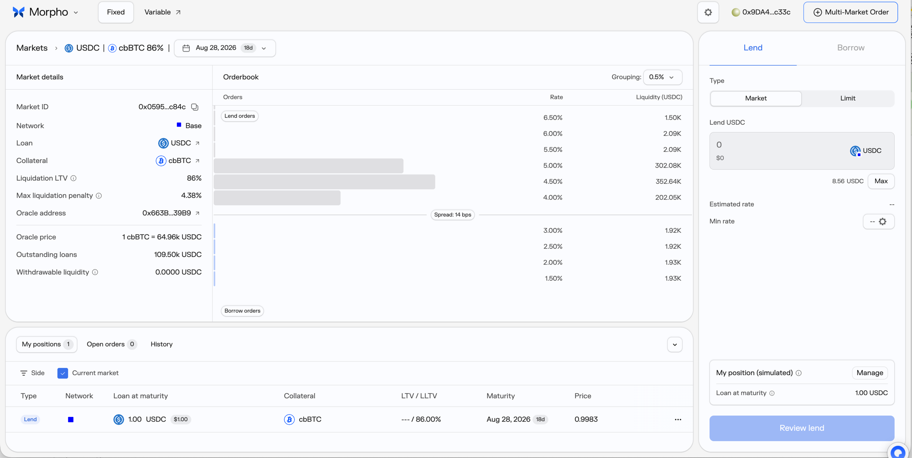
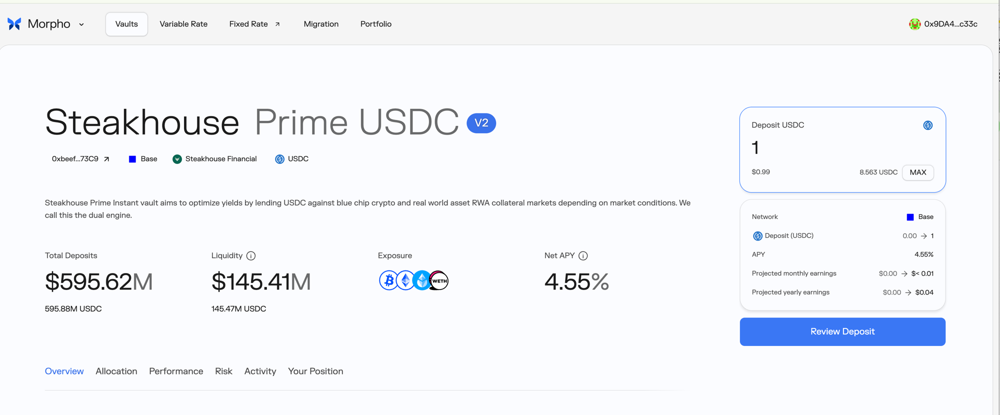

# Morpho —— Vault V2（Steakhouse Prime USDC）／ Fixed Rate（Midnight 订单簿）

> ⚠️ **范围声明**：本协议**不属于**本仓库原本的 RWA 7 协议范围，来自 **DeX 行情接链项目**（协议表条目 `KatanaMorpho`）。
> **状态**：✅ 两条产品线的申购路径均已实测并逐笔链上验证
> **实测时间**：2026-08-10 ｜ **测试钱包**：`0x9da44afe5ba28aa42301c626155ea66eb544c33c`
> ⚠️ **2026-08-10 已在 Base 和 Katana 两条链上分别实测** —— 协议表条目名 `KatanaMorpho` 指向 Katana，但两条链的部署差异很大，见 §5.5 与 §9
> **本页可信度**：全部链上事实为 Blockscout 交易/日志 + Base RPC `eth_call` 实测；UI 数值来自 2026-08-10 截图（已落盘）

## 0. 一句话结论

Morpho 在同一个品牌下有**两条机制根本不同的产品线**，**必须当成两个协议来解析**：

| | **Vault V2**（Steakhouse Prime USDC） | **Fixed Rate**（Midnight 订单簿） |
|---|---|---|
| 性质 | ERC-4626 收益金库 | 🔴 **固定期限 + 订单簿撮合**（有到期日） |
| 凭证 | ✅ ERC-20 份额代币 `steakUSDC` | 🔴 **完全没有凭证代币** |
| 持仓怎么读 | `balanceOf` × 份额价格 | 🔴 只能读 `Midnight` 合约里的 `(marketId, user)` |
| 一次 UI 操作 | **1 笔**交易（permit 打包） | **3 笔**交易 |

**→ 如果按「读份额代币余额」的通用思路做解析，固定利率那条线的持仓会 100% 读不到（用户看到资产为 0）。**

## 1. 基础信息（实测口径）

| 字段 | Vault V2 | Fixed Rate |
|------|---------|-----------|
| 产品名 | **Steakhouse Prime USDC V2**（合约里 name = "Steakhouse Prime Instant"） | **USDC / cbBTC 86%** 市场 |
| 链 | **Base** | **Base** |
| Curator / 做市 | **Steakhouse Financial** | maker `0xCc2021d606ce42EAC81fEA01e6B9b5cE22a8C003`（EOA，非合约） |
| Supply Coins | USDC | USDC |
| Coins Integrated | **steakUSDC** | 🔴 **无** |
| TVL | Total Deposits **$595.62M**（595.88M USDC） | Outstanding loans **109.50k USDC** |
| 流动性 | **$145.41M**（145.47M USDC） | 🔴 **Withdrawable liquidity 0.0000 USDC** |
| 收益率 | **Net APY 4.55%** | 订单簿挂单 1.50%–6.50%，**Spread 14 bps** |
| 池子类别 | 活期（但见 §6.4 的 ⚠️） | 🔴 **定期，到期日 2026-08-28（18 天）** |
| 抵押物 | Exposure: BTC / ETH / WETH 等 | **cbBTC**，Liquidation LTV **86%**，Max liquidation penalty **4.38%** |
| 产品网页 | app.morpho.org（Vaults） | app.morpho.org（Fixed） |
| 接入情况 | 待定（DeX 项目侧口径） |

**金库自述**（UI 原文）：*"Steakhouse Prime Instant vault aims to optimize yields by lending USDC against blue chip crypto and real world asset RWA collateral markets depending on market conditions. We call this the dual engine."*
→ 🔴 **注意：这个金库的底层含 RWA 抵押品市场** —— 与本仓库的 RWA 主题实际有交集，不只是纯 crypto 借贷。

## 2. 协议背景

⬜ **未做**。UI 观察到的产品结构：**Vaults / Variable Rate / Fixed Rate / Migration / Portfolio**；Fixed 页另有 **Multi-Market Order** 入口。

## 3. 底层资产

⬜ **未做**。已实测的资金流向见 §5.3（金库 → 适配器 → Morpho Blue 市场三层嵌套）。

## 4. 收益来源

| 产品线 | 收益来源 |
|--------|---------|
| Vault V2 | 把 USDC 借给 blue chip crypto **+ RWA 抵押品市场**（"dual engine"），利息扣费后累积进份额价格 |
| Fixed Rate | 订单簿撮合的固定利率，到期一次性结算 |

⚠️ 均为页面自述，未做收益拆分。

## 5. 链上机制与合约（✅ 全部实测）

### 5.1 合约清单

| 项 | 地址 | 实测确认 |
|----|------|---------|
| **金库 / 份额代币 steakUSDC** | `0xbeef0e0834849aCC03f0089F01f4F1Eeb06873C9` | 合约名 **`VaultV2`**<br>name "Steakhouse Prime Instant"、symbol **steakUSDC**<br>🔴 **decimals = 18**（而底层 USDC 是 6，见 §6.3）<br>`asset()` = USDC ✅ ｜ totalSupply 575,013,319.59 份额 |
| **Bundler3**（金库存款入口） | `0x6BFd8137e702540E7A42B74178A4a49Ba43920C4` | 用户实际调用的是这个，**不是金库本体** |
| GeneralAdapter1 | `0xb98c948CFA24072e58935BC004a8A7b376AE746A` | 执行 permit / transferFrom / erc4626Deposit |
| MorphoMarketV1AdapterV2 | `0xfDd31Cdf6712c47A4e67037D9F2E35587f5404C0` | 金库 → Morpho Blue 的资金分配适配器 |
| Morpho Blue（底层借贷） | `0xBBBBBbbBBb9cC5e90e3b3Af64bdAF62C37EEFFCb` | 最终 `Supply` 落在这里 |
| **Midnight**（固定利率主合约） | `0xAdedD8ab6dE832766Fedf0FaC4992E5C4D3EA18A` | 🔴 **持仓的唯一记账地** |
| MidnightBundlesV1（固定利率入口） | `0x091183d729BE9f808c212b475E387A12E67850A7` | 用户实际调用这个 |
| EcrecoverRatifier | `0xd6e70365C8E8DDa9a4ca662C07bbE663b017755E` | 订单签名验证 |
| USDC (Base) | `0x833589fCD6eDb6E08f4c7C32D4f71b54bdA02913` | decimals 6 |
| **固定利率 Market ID** | `0x05959752fdeff325962b9d263edb421efc6e2186a49360dba6c32e86ebf6c84c` | ✅ 与 UI 显示的 `0x0595…c84c` 吻合 |
| Oracle（UI 显示） | `0x663B…39B9`（未取全）｜ Oracle price 1 cbBTC = **64.96k USDC** | ⬜ 完整地址待补 |

### 5.2 🔴 Fixed Rate：一次「Lend」= 3 笔链上交易，且第 2 笔是别处没有的

| 顺序 | 时间(UTC) | 合约 | 方法 | 作用 |
|:---:|----------|------|------|------|
| 1 | 10:22:41 | USDC | `approve` | 授权给 MidnightBundlesV1，额度 1.000000 |
| 2 | 10:22:49 | **Midnight** | 🔴 **`setIsAuthorized`** | `authorized = MidnightBundlesV1`、`onBehalf = 用户`、`true`<br>→ **给 bundler 开代操作权限，这是一次性的独立授权交易** |
| 3 | 10:22:59 | MidnightBundlesV1 | `midnightBundlesV1BuyWithAssetsTargetAndWithdrawCollateral` | 真正的撮合成交 |

🔴 **`setIsAuthorized` 这一步很容易被漏掉**：它不转任何资产、不产生持仓变化，但**是首次使用固定利率产品的必经步骤**。解析时若不识别，会出现「用户明明操作了 3 次，历史只显示 1 条」。

### 5.3 🔴 Vault V2：一次「Deposit」= 1 笔交易，但链上是三层嵌套

用户只签 **1 笔** `Bundler3.multicall`，内含 3 个子调用：

```
① USDC.permit(owner=用户, spender=GeneralAdapter1)     ← 🔴 签名授权，不是单独的 approve 交易
② GeneralAdapter1.erc20TransferFrom(USDC, 1.000000)
③ GeneralAdapter1.erc4626Deposit(vault=0xbeef…, assets=1.000000, onBehalf=用户)
```

而这一笔交易在链上**连锁触发了三层 supply**：

```
用户 ──1.0 USDC──> GeneralAdapter1 ──> VaultV2(0xbeef…)
                                          │  ← 铸 0.9649720692021222 steakUSDC 给用户
                                          └──1.0 USDC──> MorphoMarketV1AdapterV2
                                                             └──1.0 USDC──> Morpho Blue
                                                                  Supply(assets=1.0, shares=908336784980)
```

🔴🔴 **给解析同学的最大坑**：这一笔交易里**出现了两个不同的「Supply / Deposit 事件」和两套完全不同的 shares 数字**：

| 事件 | 发出者 | shares | 归属 |
|------|-------|--------|------|
| `VaultV2.Deposit` | 金库 | **964972069202122200**（18 位） | ✅ **这是用户的** |
| `Morpho.Supply` | Morpho Blue | **908336784980** | ❌ **是金库的，`onBehalf` 是适配器不是用户** |

**→ 如果解析器扫 Morpho Blue 的 `Supply` 事件来识别用户存款，会拿到错误的 shares 数字，且把金库的仓位算成用户的。**
**→ 必须以 `VaultV2.Transfer(from=0x0, to=用户)` / `VaultV2.Deposit(onBehalf=用户)` 为准。**
📌 注意 `VaultV2.Deposit` 事件里 **`sender` = GeneralAdapter1（不是用户）**，只有 `onBehalf` 才是用户 —— 与 8/10 记录的 Ember「tx.from 是项目方 operator」是同一类坑。

### 5.4 份额价格与成交价（✅ 双向交叉验证）

**Vault V2**：

| 来源 | 数值 |
|------|------|
| 链上实测反推 | 1.000000 USDC → 0.9649720692021222 steakUSDC → **1.036302 USDC/share** |
| `convertToAssets(1e18)` 实测 | **1.036302 USDC** ✅ 完全一致 |
| `previewRedeem(用户全部份额)` | **1.000003 USDC** ✅ 与投入 1.0 USDC 吻合（已产生 0.000003 利息） |

**Fixed Rate**：

| 来源 | 数值 |
|------|------|
| 链上 `Take` 事件 | `buyerAssets` = 1000000（1.0 USDC）→ `units` = **1001654** |
| 反推单价 | 1000000 / 1001654 = **0.998348** |
| UI 显示 Price | **0.9983** ✅ 吻合 |
| UI "Loan at maturity" | **1.00 USDC**（对应 units 1.001654，到期兑付面值） |
| 滑点保护 | `minUnits` = 1001412，实得 1001654（优于保护值） |

**→ 固定利率是「折价买入、到期按面值兑付」的贴现模式**，收益 = (units − assets) / assets = **0.1654% / 18 天** ≈ **年化 3.35%**。
🔴 **这个收益不体现在任何代币余额的增长上** —— 它体现在「到期能拿回 1.001654 而现在只付了 1.0」。**PNL 必须按到期价值折算，不能按余额差。**

### 5.5 🔴🔴 Katana 实测：一笔存款里份额代币被 mint 了两次，给两个不同地址

> **2026-08-10 13:08:03 UTC 在 Katana（chainId 747474）实测**
> tx `0x6b44d705d42017e94af11b2908f1c8295c657ea0b3b1cc1de5a6f4a24362fc40`
> 金库 **Yearn OG ETH**（symbol `yOG-ETH`）`0x5920A6FC553af799542EDA628AdfCc9eA52e141C`

这一笔里，**同一个份额代币 `yOG-ETH` 出现了两条 `Transfer(from=0x0)`**：

| 顺序 | 事件 | 收款方 | 数量 | 性质 |
|:---:|------|-------|------|------|
| 1 | `AccrueInterest` → `Transfer(src=0x0)` | **`0x518C21DC88D9780c0A1Be566433c571461A70149`**（**SafeL2 多签**，curator 金库） | **0.001711443599531311** | 🔴 **performance fee，不是任何人的申购** |
| 2 | `Transfer(src=0x0)` + `Deposit` | `0x9DA44Afe…c33c`（用户） | **0.004992515259004409** | ✅ 用户的申购份额 |

🔴🔴 **这直接推翻「申购 = 份额代币 `Transfer(from=0x0)`」这条通用识别规则。**

本仓库此前在 Re、Renzo 等协议上都写过这条规则（见 [Renzo.md](Renzo.md) §6.2、[../03-参考/交付研发-2026-08-03实测结果.md](../03-参考/交付研发-2026-08-03实测结果.md) §3.4）。在 Morpho V2 金库上，**它会把 curator 的 performance fee 误判成一笔申购**：

- 费用接收方是个 **SafeL2 多签**（实测其 `yOG-ETH` 余额已累积到 **0.2661717249226733**，是本次用户份额的 53 倍）
- 若该地址进了我们的解析范围，会凭空生成一条「申购」记录；即使不在范围内，**`totalSupply` 的增量也大于用户申购份额之和**，用「供应量变化」反推资金流会偏
- 费用铸造与用户申购**在同一笔交易、同一个 block、同一个 token**，靠交易哈希或时间都区分不开

**✅ 正确的识别方式**：以 **`Deposit` 事件**为准，取其中的**受益人字段**，不要扫裸 `Transfer(from=0x0)`。

⚠️ **但受益人字段名在两条链上不一样**（Blockscout 解码结果）：

| 链 | 金库 | Deposit 事件签名（解码后） |
|----|------|------------------------|
| Base | Steakhouse Prime USDC | `Deposit(sender, **onBehalf**, assets, shares)` |
| Katana | Yearn OG ETH | `Deposit(caller, **owner**, assets, shares)` |

→ **不能按字段名硬编码**，需按 ABI 的第 2 个 indexed 参数取受益人。（两者 UI 都标 V2，字段名差异可能来自浏览器所用 ABI 不同，**上线前需以合约实际 ABI 复核**。）

#### Katana 这笔是 4 层嵌套（比 Base 多一层）

```
用户 ──0.005 vbETH──> GeneralAdapter1 (0x916Aa175…)
                          └──> Yearn OG ETH 金库 (0x5920A6FC…)   ← 铸 yOG-ETH 给用户
                                   └──> 适配器 (0x1fd23989ADc1…)
                                            └──> Morpho Blue (0xD50F2DffFd62…)
```
且 **vbETH 本身还是一层包装** —— 合约 `0xEE7D8BCFb72bC1880d0Cf19822eB0a2e6577Ab62`，名称 **"Vault Bridge ETH"**，合约类型 **`TokenWrappedTransparentProxy`**（agglayer 跨链桥包装代币）。

🔴 **所以 Katana 侧用户的 ETH 计价价值要三次换算**：
```
份额数 × 份额价格(vbETH/share) × vbETH→ETH 汇率 × ETH 价格
```
Base 那条线只需两次（份额 × 份额价格 × USDC 价格）。**同一个「Morpho」协议，两条链的估值链路长度不同。**

#### Katana 侧实测数据

| 项 | 值 |
|----|-----|
| 投入 | **0.005 vbETH** |
| 得到份额 | **0.004992515259004409 yOG-ETH** |
| 反推份额价格 | 0.005 / 0.004992515259004409 = **1.0014994 vbETH/share** |
| `convertToAssets(1e18)` 实测 | **1.001499406870679** ✅ 完全一致 |
| `previewRedeem(用户份额)` | **0.005000001080119404 vbETH** ✅ 与投入吻合 |
| 金库 decimals | 18 ｜ `asset()` = vbETH（18 位）→ **本条线无精度错配**（与 Base 的 6/18 错配不同） |
| gas | **0.000616735846677 ETH**（原生 ETH，非 vbETH） |
| 🔴 `maxWithdraw` / `maxDeposit` | **均为 0** —— 与 Base 侧同样的异常，见 §6.3。**两条链都复现，说明是 Vault V2 的共性行为，不是单个金库配置问题** |

📌 **补记一个操作前提**：Katana 的 gas 用**原生 ETH**，与金库资产 vbETH 是两种东西。实测该钱包在做这笔之前 vbETH 有 0.0052 但原生 ETH 为 0、nonce 为 0，**无法提交**；需先桥入 ETH 当 gas。

## 6. 数据接入要点

### 6.1 ✅ 实测交易全集（2026-08-10，UTC，Base 链）

| # | 时间 | 操作（UI 视角） | 交易类型 | tx hash | 链上结果 |
|:---:|------|---------------|---------|---------|---------|
| 1 | 10:20:19 | （入金） | **转入 ETH** | `0x48ac3c98758991c8edd3b1f7b590eada3e14fc4594603ff3d22aa218da9adcb9` | 收到 0.007817940835934815 ETH（gas 用） |
| 2 | 10:22:41 | Lend 第 1 步 | **approve(USDC)** | `0x9b135ccb5bd9e4a5a2c11206e1c10f6114e765c0c70d94ce0c7928ec1ef193b1` | 授权 MidnightBundlesV1 额度 1.000000 |
| 3 | 10:22:49 | Lend 第 2 步 | 🔴 **setIsAuthorized（协议授权）** | `0x7662921667e04bddaded87aaaa82d615f869275b03b3bcbb0832685f10cf7a2c` | Midnight 上给 bundler 开代操作权限 |
| 4 | 10:22:59 | Lend 1 USDC（固定利率） | 🔴 **固定利率申购（订单簿撮合，无凭证代币）** | `0x988c45d3da0e524795ffbd7a7c32c989b7308dc2aced6c9f6ca5d54d72cf6375` | USDC **−1.000000**<br>`Take`: units **1001654**、maturity 2026-08-28<br>`UpdatePosition` ×2（用户 + maker）<br>🔴 **无任何代币铸给用户** |
| 5 | 11:07:55 | Deposit 1 USDC（金库） | **金库申购（即时 mint）** | `0xeea5de7b2aa3e8db4787ee5c70c47f4f86e8f9e9ef2e920091181381c7d14e5b` | USDC **−1.000000**<br>steakUSDC **+0.9649720692021222**（from `0x0`）<br>三层嵌套见 §5.3 |

全部 status = ok。**赎回 / 提前退出两条路径本次均未做**（见 §9）。

### 6.2 🔴 给解析同学的五条规格

| # | 规格 | 说明 |
|:---:|------|------|
| **1** | 🔴 **固定利率持仓没有代币，只能读合约** | 持仓 = `Midnight` 合约里 `(marketId, user)` 的记录，事件是 `UpdatePosition(id_, user, …)`。**扫代币余额永远读不到**。必须按 marketId + 用户地址查 |
| **2** | 🔴 **同一笔交易里有两套 shares，别拿错** | 见 §5.3。用户的是 `VaultV2.Deposit.shares`（18 位），Morpho Blue 的 `Supply.shares` 是金库的 |
| **3** | 🔴🔴 **绝不能用「份额代币 `Transfer(from=0x0)`」识别申购** | 见 §5.5。Katana 实测：一笔存款里该事件出现 **2 次**，一次给用户、一次是给 curator 多签的 **performance fee**。**必须用 `Deposit` 事件的受益人字段**，且字段名两条链不一致（Base `onBehalf` / Katana `owner`），要按 ABI 第 2 个 indexed 参数取 |
| **4** | 🔴 **事件里的 `sender` / `caller` 不是用户** | Bundler / Adapter 模式下发起人恒为适配器合约。**按 sender 归属会全错** |
| **5** | 🔴 **精度与估值链路两条链不同** | Base：金库份额 18 位、底层 USDC 6 位（**错配**）、固定利率 units 6 位 —— 同一条链内三套精度<br>Katana：份额与 vbETH 均 18 位（不错配），但**多一层 vbETH 包装**，估值要三次换算（见 §5.5） |
| **6** | **固定利率有到期日，是定期产品** | 到期 2026-08-28。**需要「到期日」「到期可得」字段**，且到期后应有一笔结算交易（本次未观测到，见 §9） |

### 6.3 ⚠️ 一个已验证但原因未确认的异常

在 Base 主网对金库 `0xbeef0e08…` 实测（2026-08-10）：

| 调用 | 返回 |
|------|------|
| `convertToAssets(1e18)` | 1.036302 USDC ✅ 正常 |
| `previewRedeem(用户份额)` | 1.000003 USDC ✅ 正常 |
| 🔴 `maxWithdraw(用户)` | **0** |
| 🔴 `maxRedeem(用户)` | **0** |
| 🔴 `maxDeposit(用户)` | **0** |

🔴 **`maxDeposit` 返回 0，但用户在几十分钟前刚成功存进 1 USDC** —— 说明这几个 `max*` 视图在 Vault V2 上**不能当作「用户能否申购/赎回」的判断依据**。
🔴 **2026-08-10 在 Katana 的 Yearn OG ETH 金库上复现了完全相同的现象**（`maxWithdraw` / `maxDeposit` 均为 0，而 `convertToAssets` / `previewRedeem` 正常）→ **这是 Morpho Vault V2 的共性行为，不是某个金库的配置问题**，影响面是所有 V2 金库。
⚠️ **原因仍未确认**（可能与 Vault V2 的 liquidity adapter 设计、额度上限、或 idle assets 为 0 有关；UI 同时显示 Liquidity $145.41M，与 `maxWithdraw = 0` 直接矛盾）。
**→ 给解析同学**：**不要用 `maxWithdraw` / `maxDeposit` 做可用性判断或余额展示**，否则用户会看到「余额 0 / 不可赎回」。用 `previewRedeem` 或 `convertToAssets` 取价值。
**→ ⬜ 待查**：这是 Vault V2 的设计语义还是该金库的具体配置，需要问项目方或读 VaultV2 源码确认。

### 6.4 ⚠️ Fixed Rate 的「Withdrawable liquidity 0.0000 USDC」

UI 市场页明确显示 **Withdrawable liquidity 0.0000 USDC**，同时 Outstanding loans 109.50k USDC。
→ **推断（未证实）**：固定利率是**到期才可取**，中途退出需要在订单簿上反向卖出（UI 有 `reduceOnly` 参数，成交方法名也带 `AndWithdrawCollateral`）。
→ 🔴 **若确认如此，池子类别绝不能标「活期」** —— 与 8/3 记录的 Re「CSV 标活期但赎回窗口关闭」是同一类错误。**需实测提前退出来确认。**

### 6.5 六维度自评

| 维度 | Vault V2 | Fixed Rate | 备注 |
|------|:---:|:---:|------|
| 实时解析 | ✅ | 🟡 | 金库：`balanceOf` × `convertToAssets` 已验证<br>固定利率：**需按 marketId 读 Midnight 合约，取数方式未验证** |
| 交易历史解析 | ✅ | ✅ | 申购侧样本齐全；**两条线的赎回都无样本** |
| 池子自发现 | 🟡 | 🟡 | 金库有工厂/注册表未查；固定利率市场按 marketId 枚举方式未查 |
| APY | 🟡 | 🟡 | 金库 UI 有 Net APY 4.55%；固定利率需从贴现率自算（见 §5.4） |
| NAV 历史 | 🟡 | ❌ | 金库可用 `AccrueInterest` 事件的 `newTotalAssets` 打点（本次已见到该事件）<br>固定利率**无 NAV 概念**，是贴现价 |
| PNL | 🟡 | 🔴 | 固定利率的 PNL **必须按到期价值算，不能按余额差**（见 §5.4） |

### 6.6 需向项目方索取

1. 🔴 **Midnight 合约按 `(marketId, user)` 读持仓的具体函数**（固定利率实时解析的唯一入口）
2. 🔴 **`maxWithdraw` / `maxDeposit` 返回 0 的原因**（见 §6.3）
3. 🔴 **固定利率的提前退出机制与到期结算流程**（是否需用户发起、有无自动结算）
4. 固定利率市场的 marketId 枚举方式（池子自发现依赖）
5. Vault V2 的 `AccrueInterest` 是否可作为 NAV 历史的唯一数据源
6. Oracle 完整地址（UI 只显示 `0x663B…39B9`）
7. 金库「dual engine」里 RWA 抵押品市场的具体清单（与本仓库 RWA 主题有交集）

## 7. 风险

⬜ **未做**。实测中直接观察到的三点：
1. 🔴 **固定利率有到期日与清算参数**：Liquidation LTV **86%**、Max liquidation penalty **4.38%**，抵押物 cbBTC（BTC 价格波动直接影响）
2. 🔴 **金库是多层嵌套**：用户 → VaultV2 → MorphoMarketV1AdapterV2 → Morpho Blue 市场，任一层出问题都会传导；且底层含 **RWA 抵押品市场**（信用风险与纯 crypto 不同）
3. **固定利率流动性**：Withdrawable liquidity 显示 0，中途退出可能困难（见 §6.4）

## 8. 合规与准入

⬜ **未做**。UI 无 KYC 环节，链上非托管。

## 9. 待确认清单

| # | 问题 | 问谁 / 怎么查 |
|---|------|------------|
| 1 | 🔴 **要接 Base 还是 Katana？两条链差异很大，不能互相替代** —— 已确认 Morpho 在两条链都有部署（Katana chainId **747474**），但：<br>① **固定利率产品只在 Base**，Katana 没有（官方文档 Midnight 仅列 Base；markets.morpho.org 的 Network 筛选器只有 Base 一项）<br>② Katana 全部金库用 **vb 系包装资产**（vbUSDC / vbETH / vbUSDT），估值多一层<br>③ **同名不同物**：两条链都有 "Steakhouse Prime USDC"，Base 是原生 USDC / $595.62M / 4.43%，Katana 是 vbUSDC / $1.49M / 1.56% | 提需求方 / DeX 项目侧 |
| 2 | 🔴 **三条线的赎回样本都没有**（Base 金库 withdraw / Katana 金库 withdraw / 固定利率提前退出或到期结算） | Linnea 补做（固定利率到期日 **2026-08-28**，可等到期观察自动结算） |
| 3 | 🔴 **Midnight 持仓读取函数**（固定利率实时解析入口） | 项目方 / 读 Midnight 源码 |
| 4 | 🔴 `maxWithdraw`/`maxDeposit` 返回 0 的原因 —— **两条链均复现**（见 §6.3） | 项目方 / 读 VaultV2 源码 |
| 5 | 🔴 **`Deposit` 事件受益人字段名两条链不一致**（Base `onBehalf` / Katana `owner`）—— 是浏览器 ABI 差异还是合约版本差异？ | 以合约实际 ABI 复核 |
| 6 | 🔴 **performance fee 的铸造频率与触发条件**（每笔存款都会触发，还是按时间/阈值？）—— 影响「供应量变化反推资金流」的误差量级 | 项目方 / 读 VaultV2 源码 |
| 7 | **vbETH / vbUSDC 的汇率取数入口**（Katana 侧估值必需，Vault Bridge 是否有 NAV 接口） | Katana / Vault Bridge 项目方 |
| 8 | 固定利率是否只能到期取（决定池子类别标活期还是定期） | 实测提前退出 |
| 9 | 协议背景 / 底层 / 风险 / 合规四章 | 未做，需补 |

## 10. 参考链接

- 产品页：https://app.morpho.org
- 金库合约（Base）：`0xbeef0e0834849aCC03f0089F01f4F1Eeb06873C9`
- Midnight 合约（Base）：`0xAdedD8ab6dE832766Fedf0FaC4992E5C4D3EA18A`

## 11. 实测截图（✅ 已落盘）

| 文件 | 内容 |
|------|------|
|  | **Fixed / USDC｜cbBTC 86%**：Market ID `0x0595…c84c` ｜ Network **Base** ｜ Liquidation LTV 86% ｜ Max liquidation penalty 4.38% ｜ Oracle price 1 cbBTC = 64.96k USDC ｜ Outstanding loans 109.50k ｜ **Withdrawable liquidity 0.0000** ｜ 订单簿 1.50%–6.50%、Spread 14 bps ｜ My positions: Lend 1.00 USDC、Maturity Aug 28 2026 (18d)、**Price 0.9983** |
|  | **Steakhouse Prime USDC V2**：`0xbeef…73C9` ｜ Base ｜ Steakhouse Financial ｜ Total Deposits **$595.62M** ｜ Liquidity **$145.41M** ｜ **Net APY 4.55%** ｜ dual engine 描述（含 **RWA collateral markets**）｜ Deposit 1 USDC 预览 |
