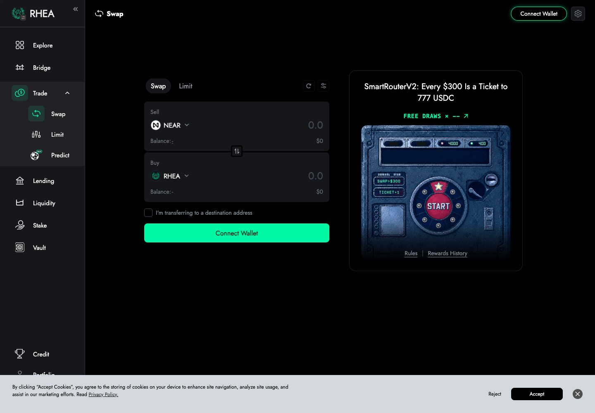
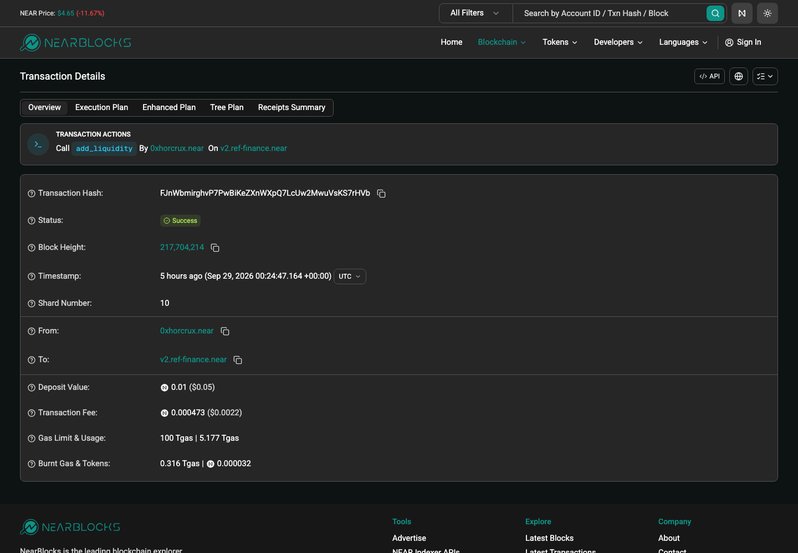
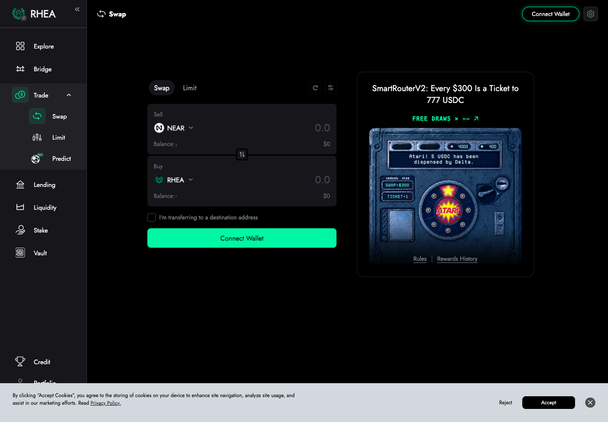
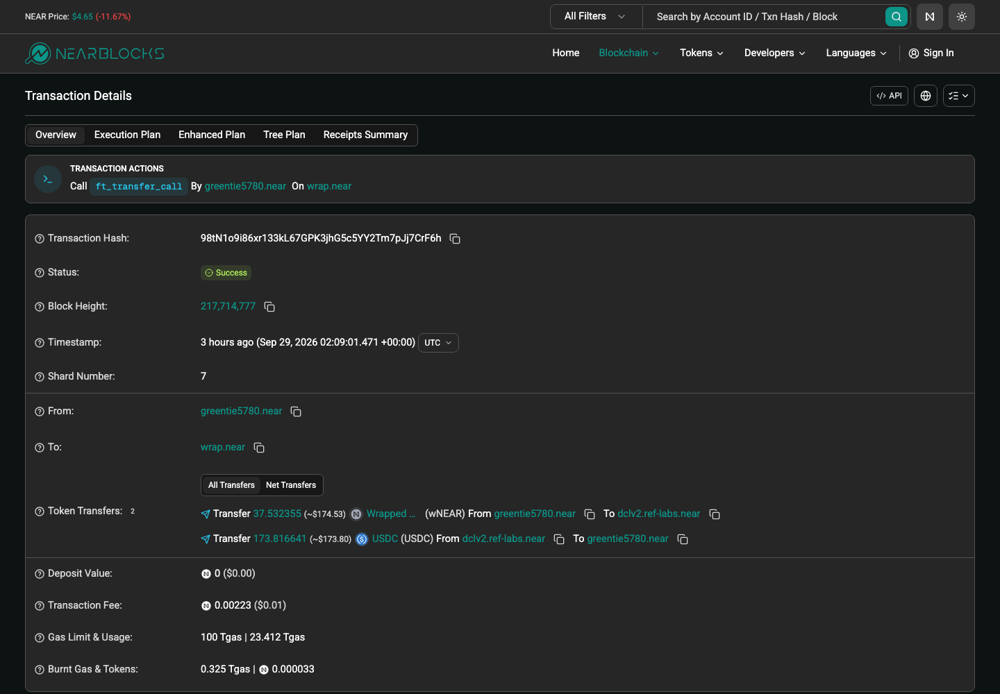
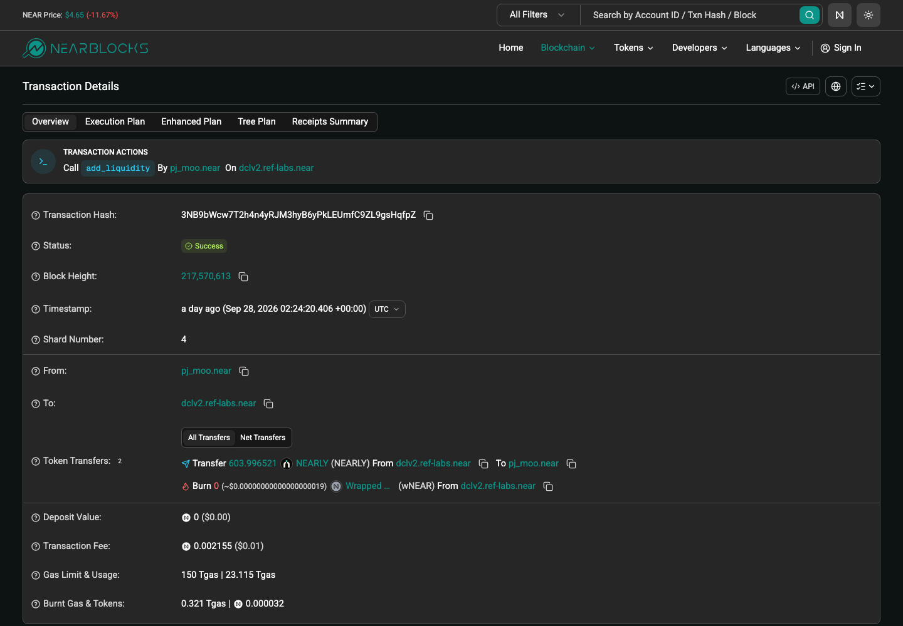
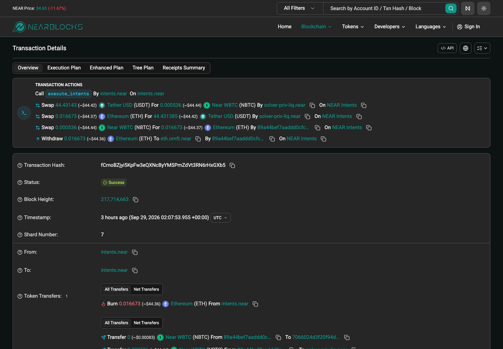

# NEAR 链 DEX 协议汇总（Rhea Dex 经典池 / Rhea Dex DCL / NEAR Intents）

> **状态**：🟡 三个协议的公开样本 hash 已取到并确认成功；截图 12/12 已落盘（§6）；NEAR Intents 是否纳入待上会拍板
> **调研时间**：2026-09-29
> **交付口径**：覆盖页面可点击的交易类型 + 交易 hash + 截图 + 背景信息；**不做链上深度解析（解析是解析同学的事）**
> **链**：**NEAR**（**非 EVM**，账户模型，tx hash 为 base58 约 43–44 字符）
> **样本来源**：**全部为链上公开地址的交易，非本人钱包**
> **数据来源**：chain-protocol-audit 本地核查（`~/Downloads/chain-protocol-audit/NEAR-20260929.md`）+ DefiLlama + GeckoTerminal + Ave 前端接口 + NEAR RPC / nearblocks

## 0. 一句话结论

NEAR 上真正的池子型 DEX 只有 **Rhea Dex（原 Ref Finance）** 一家，但它是**两套合约**：经典 AMM 池 `v2.ref-finance.near` 和 DCL 集中流动性 `dclv2.ref-labs.near`，按 DEX 惯例分两节写。全链交易量的大头（约 78%）其实是 **NEAR Intents**，它不是池子，是"用户签意图、solver 撮合"的结算合约，没有加/减流动性；**是否纳入覆盖率要上会拍板**：不纳入则 Rhea 两套就达标（95.6%–100%），纳入则只收 Rhea 只有约 21%。

---

## 1. 链基础信息

| 字段 | 值 |
|---|---|
| 链 | NEAR Protocol 主网（非 EVM，WASM 合约，账户名如 `xxx.near` 或 64 位 hex 隐式账户） |
| 原生币 | NEAR（24 位精度；DEX 里用 `wrap.near` 即 wNEAR） |
| 公共 RPC | `https://rpc.mainnet.near.org` ｜ `https://free.rpc.fastnear.com`（本次使用） |
| 区块浏览器 | https://nearblocks.io ｜ https://pikespeak.ai |
| 浏览器 API | `https://api.nearblocks.io/v1/account/<account>/txns?method=<方法名>`、`/v1/txns/<hash>` |
| 链 TVL | $223,971,240（DefiLlama `/v2/chains`，2026-09-29） |
| 全链 DEX 24h | DefiLlama 各协议合计 $153,545,575（含 Intents） |
| 我方现状 | 基础解析表仅上线"链基础数据"，其他模块待开发；BN 钱包不支持，OKX 钱包支持 |

### ⚠️ NEAR 非 EVM 取数注意
1. **没有 `eth_getLogs`、没有 topic0**。合约"事件"是 receipt 里的**日志字符串**：Rhea 经典池是纯文本（如 `Swapped X a for Y b`、`Liquidity added [...]`），DCL 和 Intents 是 `EVENT_JSON:{...}`（NEP-297 格式）。
2. **一笔交易 = 多个 receipt 异步执行**。swap 常见入口是**代币合约的 `ft_transfer_call`**（交易的 receiver 是代币合约，如 `wrap.near`），Rhea 合约里执行的是 `ft_on_transfer` 回调；只按"交易 receiver = DEX 合约"筛会漏掉大部分 swap。
3. **查交易状态要带 sender**：RPC `EXPERIMENTAL_tx_status` 参数是 `tx_hash + sender_account_id`；公共节点不是 archive，**约 2 天前的交易会报 `UNKNOWN_TRANSACTION`**，这时改用 nearblocks `/v1/txns/<hash>`。
4. **有 gas 代付（元交易）**：部分交易 signer 是 `rheagasrelayer.near`，动作是 `Delegate`，真实用户在内层（见 §3.4 减流动性第 2 条）。按 signer 归属会错。
5. **多跳 / 混合路由**：一笔交易可同时经过经典池和 DCL（见 §4.4 第 4 条）。
6. nearblocks 公开 API 对 `method=add_liquidity/remove_liquidity` 的筛选多次超时（`read timed out` / 520），流动性样本改从 Ave 前端流动性事件接口取候选，再用 RPC/nearblocks 逐条确认。

---

## 2. 三维度入选（简版，详见 Downloads 报告）

| 协议 | OKX | Ave | 量占比（DefiLlama 24h） | 入选 |
|---|---|---|---|---|
| Rhea Dex 经典池 | ❌（OKX swap 链列表无 NEAR） | ✅ `reffinance` | Rhea 合计 20.53%（GT 口径经典 ≈ Rhea 的 65%） | ✅ |
| Rhea Dex DCL | ❌ | ✅ `refdcl` | GT 口径 ≈ Rhea 的 35% | ✅ |
| NEAR Intents | ❌ | 未见 | 78.54% | 🟡 待拍板 |
| THORSwap / DeltaTrade / Meme Cooking / Veax / Orderly | — | — | 合计 <1%，且为聚合器/策略机器人/launchpad/无量 | ❌ |

| 覆盖率口径 | Rhea 两套 | 结论 |
|---|---|---|
| **含 Intents**（DefiLlama） | 20.53%（加上 Intents 为 99.06%） | 只收 Rhea ❌ |
| **不含 Intents**（DefiLlama，聚合器仍在分母） | 95.64% | ✅ |
| **不含 Intents**（DefiLlama，剔聚合器+launchpad） | 99.64% | ✅ |
| **不含 Intents**（GT top60 池） | 100%（经典 64.75% + DCL 35.25%，单收经典不达标） | ✅ |

---

## 3. Rhea Dex —— 经典 AMM 池（`v2.ref-finance.near`）

### 3.1 基础信息

| 字段 | 值 |
|---|---|
| 协议 | Rhea Dex 经典池（原 Ref Finance v2） |
| 合约 | `v2.ref-finance.near` |
| 池型 | 前端 Liquidity 页签 **AMM**（"based on the Uniswap v2 algorithm"）/ **Stable** / **ALMM** 三类都在本合约；链上 `pool_kind`：`SIMPLE_POOL`（恒定乘积，如 #6458 RHEA/wNEAR，费率 0.3%）、`DEGEN_SWAP`（带预言机的 Degen 池，如 #5515 wNEAR/USDC、#6063 wNEAR/USDt，amp=40）、以及 Stable / Rated 稳定币池。实测前端标 ALMM 的 NEAR-USDC（TVL $77万）即 #5515 DEGEN_SWAP |
| LP 凭证 | **合约内记账的 shares**（不是独立代币合约，也不是 NFT） |
| 产品网页 | https://app.rhea.finance/ |
| **操作入口** | https://app.rhea.finance/swap （Trade → Swap）｜ https://app.rhea.finance/pools （Liquidity，经典池在 AMM / Stable / ALMM 三个页签） |
| 文档 | https://guide.rhea.finance/ ⚠️ 未逐页核实 |
| 统计 | https://stats.ref.finance/ |
| 接入情况 | 待开发 |

### 3.2 协议背景
Rhea Finance 由 NEAR 上原有的 **Ref Finance（DEX）与 Burrow Finance（借贷）合并**而来（DefiLlama 描述），是 NEAR 最大的原生 DeFi 平台。前端导航有 Trade / Liquidity / Lending / Stake / Vault / Bridge 等；其中 **Lending 属于 Rhea Lend（原 Burrow），不是 DEX，本报告不覆盖**。DefiLlama 口径 Rhea Dex 24h $31.5M、30d $12.95 亿。

### 3.3 操作清单

| # | 操作 | 入口路径 | 链上方法 |
|---|---|---|---|
| 1 | Swap | Trade 页 | 代币合约 `ft_transfer_call` → Rhea `ft_on_transfer`；或直接调 `swap`（先存入合约内余额） |
| 2 | 加流动性 | Liquidity → 选池 → Add | `add_liquidity`（Simple 池）/ `add_stable_liquidity`（Degen/Stable 池） |
| 3 | 减流动性 | Liquidity → 我的仓位 → Remove | `remove_liquidity`（常与 `withdraw` 同笔打包）/ `remove_liquidity_by_tokens` |
| 4 | Farm / Stake | Liquidity 页 ⚡️Farm 页签 / Stake 页 | ⚠️ 属于激励/质押，不在本次 DEX 交易类型内，未取样 |
| 5 | Predict | Trade → Predict | ⚠️ 预测市场，非 DEX 交易类型，未取样 |

### 3.4 公开样本交易（非本人钱包，2026-09-28 ~ 09-29 UTC）

| 交易类型 | hash | 说明（signer / 路径） | 截图 |
|---|---|---|---|
| **Swap 买 RHEA** | [`TUy3SqLA72PJUBCHChFFw3qG73BmjVMSDbkdGXj6QaB`](https://nearblocks.io/txns/TUy3SqLA72PJUBCHChFFw3qG73BmjVMSDbkdGXj6QaB) | `cexmm.near`，`ft_transfer_call`：USDt → wNEAR → RHEA（两跳），09-29 02:09:30 | `RheaDex-NEAR-swap交易-20260929.png` |
| **Swap 买 RHEA** | [`2DCqJMtq1LFXaw3C4BZ2yVVvm5CoNXZdKYzJ7GaenBhd`](https://nearblocks.io/txns/2DCqJMtq1LFXaw3C4BZ2yVVvm5CoNXZdKYzJ7GaenBhd) | `parvejkhan1122.tg`，USDC → USDT.e → wNEAR → RHEA（三跳），09-29 02:10:37 | — |
| **Swap 卖 RHEA** | [`CyRK37wxSW965A9bPE629dpEC94Lk7F6rimguh4qujjS`](https://nearblocks.io/txns/CyRK37wxSW965A9bPE629dpEC94Lk7F6rimguh4qujjS) | `bitas.near`，`ft_transfer_call`：16210.94 RHEA → 376.19 wNEAR（单跳 #6458），09-29 02:09:25 | — |
| **Swap 卖 RHEA** | [`CBcDa22hnNA8rGoyq3siu62SibmUBBsX3Q6bPJN9fVt1`](https://nearblocks.io/txns/CBcDa22hnNA8rGoyq3siu62SibmUBBsX3Q6bPJN9fVt1) | 隐式账户 `c29cd967…bc9a49`，直接调 `swap`：RHEA → wNEAR → USDT.e → USDt，09-29 02:09:26 | — |
| Swap（Degen 池 #6063） | [`4B2j3qkkXos6n8KRg7hRK4tZpDff86tTxEeJzNpEzEar`](https://nearblocks.io/txns/4B2j3qkkXos6n8KRg7hRK4tZpDff86tTxEeJzNpEzEar) | `lolr.near`，RHEA → wNEAR → USDt，09-29 02:01:45 | — |
| Swap（Degen 池 #6063） | [`Av4Ke65HL9LdSJbmJdBguZsTA6zbp85cCWgqHwRUwB6E`](https://nearblocks.io/txns/Av4Ke65HL9LdSJbmJdBguZsTA6zbp85cCWgqHwRUwB6E) | `zerotest.near`，`swap`：wNEAR → USDt → wNEAR（环形套利），09-29 02:06:26 | — |
| **加流动性**（Simple 池 #6458） | [`FJnWbmirghvP7PwBiKeZXnWXpQ7LcUw2MwuVsKS7rHVb`](https://nearblocks.io/txns/FJnWbmirghvP7PwBiKeZXnWXpQ7LcUw2MwuVsKS7rHVb) | `0xhorcrux.near`，`add_liquidity`，日志 `Liquidity added [2512.04 RHEA, 63.80 wNEAR]`，09-29 00:24:47 | `RheaDex-NEAR-加流动性交易-20260929.png` |
| **加流动性**（Degen 池 #5515） | [`5MrvKzs5x79q5LNqqfyi23EzdiYTgemewpSLvurP39vD`](https://nearblocks.io/txns/5MrvKzs5x79q5LNqqfyi23EzdiYTgemewpSLvurP39vD) | `pulamica.near`，`add_stable_liquidity`，日志 `Mint ... shares`，09-29 00:31:40 | — |
| **减流动性**（Simple 池 #6458） | [`EhNCrSEHU9wqn7xsV9K9tNBaafLxpQFifMeytseFF1Gm`](https://nearblocks.io/txns/EhNCrSEHU9wqn7xsV9K9tNBaafLxpQFifMeytseFF1Gm) | `cromatofor0.near`，`remove_liquidity` + 2×`withdraw` 同笔，09-29 02:05:52 | `RheaDex-NEAR-减流动性交易-20260929.png` |
| **减流动性**（Degen 池 #5515） | [`6JnsfhrrQeXaG6vDGvr4L6Hu2jaG3K6CUcD61RiVW5Ew`](https://nearblocks.io/txns/6JnsfhrrQeXaG6vDGvr4L6Hu2jaG3K6CUcD61RiVW5Ew) | signer `rheagasrelayer.near`（`Delegate` 元交易），真实 LP `pulamica.near`，日志 `LP pulamica.near remove ... shares`，09-29 00:23:28 | — |

以上 10 笔均经 RPC `EXPERIMENTAL_tx_status` 确认 `SuccessValue`、无失败 receipt。

📌 买/卖以 RHEA/wNEAR 池（#6458）的 RHEA 为基准币（GT `kind` 口径）。

### 3.5 操作覆盖

| 交易类型 | 本人实测 | 公开样本 |
|---|:---:|:---:|
| Swap 买 | ⬜ | ✅ 2 笔 |
| Swap 卖 | ⬜ | ✅ 2 笔（另 Degen 池 2 笔） |
| 加流动性 | ⬜ | ✅ 2 笔（`add_liquidity` / `add_stable_liquidity`） |
| 减流动性 | ⬜ | ✅ 2 笔（含 1 笔 gas 代付元交易） |
| Farm / Stake | ⬜ | ⬜ 非本次 DEX 范围，未取样 |

---

## 4. Rhea Dex —— DCL 集中流动性（`dclv2.ref-labs.near`）

### 4.1 基础信息

| 字段 | 值 |
|---|---|
| 协议 | Rhea Dex DCL（Discretized Concentrated Liquidity，原 Ref v2） |
| 合约 | `dclv2.ref-labs.near` |
| 池 id 格式 | `<tokenX>\|<tokenY>\|<fee>`，如 `17208628…36133a1\|wrap.near\|100`（USDC/wNEAR，0.01%）、`nearly-993927.nearlytrade.near\|wrap.near\|10000`（1%） |
| LP 凭证 | 按价格区间（`left_point` / `right_point`）的仓位，id 形如 `<pool_id>#<序号>`（`lpt_id`），可理解为 V3 式 NFT 仓位 |
| 产品网页 | https://app.rhea.finance/（与经典池**共用同一前端**，无独立 URL） |
| **操作入口** | https://app.rhea.finance/swap （Trade → Swap，路由自动选经典或 DCL 池；同页还有 **Limit** 限价单页签）｜ https://app.rhea.finance/pools （Liquidity → **CLMM** 页签，页面注明 "Discretized Concentrated Liquidity (CLMM) pools"） |
| 接入情况 | 待开发 |

⚠️ DCL 与经典池共用前端，**Swap 页面不区分池型**，路由会自动混用两套合约。前端把 DCL 叫 **CLMM**，Liquidity 页以 `CLMM` 标签 + Fee Tiers（0.01% / 1% 等）区分。

### 4.2 协议背景
DCL 是 Ref Finance 推出的离散集中流动性 AMM（类似 Uniswap V3 的区间做市，但价格按离散 point 划分），多费率档（0.01% / 0.04% / 0.2% / 1% 等）。GT 口径 DCL 约占 Rhea 成交量 35%，其中 USDC/wNEAR 0.01% 池是 NEAR 全链单池成交量第一（24h 约 $773 万）；新发 meme 币（NEARLY、SHORE 等）也主要在 DCL 1% 档建池。

### 4.3 操作清单

| # | 操作 | 链上方法 |
|---|---|---|
| 1 | Swap | 代币合约 `ft_transfer_call` → DCL；日志 `EVENT_JSON` 含 `amount_in/amount_out/pool_id` |
| 2 | 加流动性（开区间仓位） | `add_liquidity`（亦有 `batch_add_liquidity`） |
| 3 | 减流动性 | `batch_remove_liquidity` / `remove_liquidity`；日志同时带 `claim_fee_token_x/y`（**减仓时顺带领手续费**） |
| 4 | Limit 限价单 | Trade → Limit 页签；⚠️ 未取样（本次未查到对应方法的公开样本，待补） |

### 4.4 公开样本交易（非本人钱包）

| 交易类型 | hash | 说明 | 截图 |
|---|---|---|---|
| **Swap（wNEAR→USDC）** | [`98tN1o9i86xr133kL67GPK3jhG5c5YY2Tm7pJj7CrF6h`](https://nearblocks.io/txns/98tN1o9i86xr133kL67GPK3jhG5c5YY2Tm7pJj7CrF6h) | `greentie5780.near`，37.53 wNEAR → 173.82 USDC，池 `USDC\|wrap.near\|100`，09-29 02:09:01 | `RheaDCL-NEAR-swap交易-20260929.png` |
| **Swap（wNEAR→USDC）** | [`hPXJDeTvC9Yjnw9AU6gwjqbWowyTyvUFSKHhQu5id1Z`](https://nearblocks.io/txns/hPXJDeTvC9Yjnw9AU6gwjqbWowyTyvUFSKHhQu5id1Z) | `wx-cruce.near`，11.56 wNEAR → 53.52 USDC，09-29 02:08:58 | — |
| **Swap（USDC→wNEAR）** | [`FdkQRfjrcFHWFiYZS9r5UJZQQP7znDDwiSF41HP7htGk`](https://nearblocks.io/txns/FdkQRfjrcFHWFiYZS9r5UJZQQP7znDDwiSF41HP7htGk) | `wx-cruce.near`，115.83 USDC → 25.00 wNEAR，09-29 02:09:02 | — |
| **Swap（USDC→wNEAR，混合路由）** | [`3c9XKjVQGy75UhjHzf6b4D1ansMK5FQp3um6aEsxJspe`](https://nearblocks.io/txns/3c9XKjVQGy75UhjHzf6b4D1ansMK5FQp3um6aEsxJspe) | `whatdoyoumean.near` 自有合约调用：经典池 wNEAR→USDC.e→USDC，再 DCL USDC→wNEAR（套利环），09-29 02:08:55 | — |
| **加流动性** | [`3NB9bWcw7T2h4n4yRJM3hyB6yPkLEUmfC9ZL9gsHqfpZ`](https://nearblocks.io/txns/3NB9bWcw7T2h4n4yRJM3hyB6yPkLEUmfC9ZL9gsHqfpZ) | `pj_moo.near`，`add_liquidity`，池 `NEARLY\|wrap.near\|10000`（Ave 记 $749.79），09-28 02:24:20 | `RheaDCL-NEAR-加流动性交易-20260929.png` |
| **加流动性** | [`8FT9p9a1nCUVj3BJqaqynapJ5AtMLmm3xfrGDuMXjUzR`](https://nearblocks.io/txns/8FT9p9a1nCUVj3BJqaqynapJ5AtMLmm3xfrGDuMXjUzR) | 隐式账户 `93dcb522…bc917f`，`add_liquidity`，池 `USDC\|wrap.near\|100`（小额），09-29 | — |
| **减流动性** | [`HUpiXHtakvq2qE5c4AhbzYaNuzGQt5J24yqR6RWp5UcA`](https://nearblocks.io/txns/HUpiXHtakvq2qE5c4AhbzYaNuzGQt5J24yqR6RWp5UcA) | `pj_moo.near`，`batch_remove_liquidity`，`lpt_id=…\|10000#15146`，同笔领手续费，09-28 14:04:16 | `RheaDCL-NEAR-减流动性交易-20260929.png` |
| **减流动性** | [`6iPbZSTCxJBhbtMnCkSzRi8a7UNtvuHzzpMiSYoYcEge`](https://nearblocks.io/txns/6iPbZSTCxJBhbtMnCkSzRi8a7UNtvuHzzpMiSYoYcEge) | `punkmonke.near`，`batch_remove_liquidity`，`lpt_id=…#15163`，09-28 10:42:02 | — |

确认方式：Swap 4 笔 + 减流动性 2 笔经 RPC `EXPERIMENTAL_tx_status` 确认成功；加流动性 2 笔 RPC 已超出非 archive 节点保留期（`UNKNOWN_TRANSACTION`），改用 nearblocks `/v1/txns/<hash>` 确认 `outcomes.status=true`、receiver=`dclv2.ref-labs.near`、方法 `add_liquidity`。

### 4.5 操作覆盖

| 交易类型 | 本人实测 | 公开样本 |
|---|:---:|:---:|
| Swap（两个方向） | ⬜ | ✅ 4 笔（2+2） |
| 加流动性 | ⬜ | ✅ 2 笔 |
| 减流动性（含领手续费） | ⬜ | ✅ 2 笔 |
| 单独领手续费（claim fee） | ⬜ | ⬜ 未单独取样 |
| Limit 限价单 | ⬜ | ⬜ 页面有该类型，未取样 |

---

## 5. NEAR Intents（🟡 待上会拍板是否纳入）

### 5.1 基础信息

| 字段 | 值 |
|---|---|
| 协议 | NEAR Intents（DefiLlama 归类 **Bridge**，GT 归为 DEX `near-intents`） |
| 合约 | `intents.near`（Verifier 合约，方法 `execute_intents`） |
| 机制 | 用户签名一个"意图"（我要用 A 换 B），**solver（做市方，如 `solver-priv-liq.near`）报价并成交**，Verifier 合约原子结算双方余额（`token_diff` 事件）；资产多为跨链映射代币（`nep141:eth-0x….omft.near`、`nep245:v2_1.omni.hot.tg:…` 等） |
| LP | **无池子、无 LP**，不存在加/减流动性 |
| 产品网页 / **操作入口** | https://near.com/swap （需登录：Passkey 或 NEAR / EVM / Solana / Stellar / TON / Tron 钱包）｜ 旧入口 https://near-intents.org/ 已提示"NEAR Intents has moved to near.com" |
| 量 | DefiLlama 24h $120.6M（占全链 78.54%），30d $44.40 亿 |

### 5.2 协议背景
NEAR Intents 是 NEAR 官方推的意图（intent）交易层，面向跨链兑换：用户在 NEAR 上签名，solver 网络在 BTC/ETH/SOL/ZEC 等多链资产间撮合结算。它不是 AMM，价格来自 solver 报价，所以现有"池子 + swap 事件"的解析框架不直接适用；结算记录在 `intents.near` 的 `token_diff` / `transfer` / `ft_withdraw` 等 NEP-297 事件里。

### 5.3 公开样本交易（非本人钱包）

| 交易类型 | hash | 说明 | 截图 |
|---|---|---|---|
| **Swap（意图结算）** | [`fCrnoBZjyi5KpFw3eQXNcByYMSPmZdVt3RN6rHxGXb5`](https://nearblocks.io/txns/fCrnoBZjyi5KpFw3eQXNcByYMSPmZdVt3RN6rHxGXb5) | signer/receiver 均为 `intents.near`，`execute_intents`；一笔打包 3 条意图：USDT→NBTC、ETH→USDT（solver `solver-priv-liq.near`）、NBTC→ETH 并提现 ETH，09-29 02:07:53 | `NEARIntents-NEAR-swap交易-20260929.png` |
| **Swap（意图结算）** | [`4FRqqUbtX8DoF5hzeMjQaAzKj8R9fYFpkvaBDaK9fun7`](https://nearblocks.io/txns/4FRqqUbtX8DoF5hzeMjQaAzKj8R9fYFpkvaBDaK9fun7) | `execute_intents`，`blockzen-near-intent.near` 与 `solver-priv-liq.near` 互换 ETH ↔ USDT，09-29 02:07（GT 记录 02:07:32） | — |

两笔经 RPC `EXPERIMENTAL_tx_status` 确认成功。

🔴 **一笔 `execute_intents` 常打包多个用户的多条意图**（样本里一笔含 3 个 `intent_hash`），按"一笔交易 = 一次 swap"计数会错。

### 5.4 操作覆盖

| 交易类型 | 公开样本 |
|---|:---:|
| Swap（意图结算） | ✅ 2 笔 |
| 加 / 减流动性 | **N/A**（架构无 LP，页面没有该类型） |
| 充值 / 提现（跨链进出） | ⬜ 未取样（属桥接行为） |

---

## 6. 截图

全部平铺在 `截图/`。前端页用 Playwright（有头 Chrome，绕过 Cloudflare 校验）截取；交易页为 nearblocks 交易详情。

| 文件 | 内容 | 状态 |
|---|---|---|
|  `RheaDex-NEAR-swap页-20260929.png` | https://app.rhea.finance/swap ，Trade 下有 Swap / Limit / Predict | ✅ |
|  `RheaDex-NEAR-流动性页-20260929.png` | Liquidity 页，TVL $35.8M、24h Volume $30.35M，页签 All Pools / AMM / Stable / ALMM / CLMM / Farm / Points | ✅ |
|  `RheaDex-NEAR-swap交易-20260929.png` | `TUy3Sq…`：`ft_transfer_call`，USDt→wNEAR→RHEA，Success | ✅ |
|  `RheaDex-NEAR-加流动性交易-20260929.png` | `FJnWbm…`：`add_liquidity` | ✅ |
|  `RheaDex-NEAR-减流动性交易-20260929.png` | `EhNCrS…`：`remove_liquidity` + `withdraw` | ✅ |
|  `RheaDCL-NEAR-swap页-20260929.png` | 与经典池**共用**同一 Swap 页（路由自动选池），内容同上 | ✅ |
|  `RheaDCL-NEAR-流动性页-20260929.png` | Liquidity → **CLMM** 页签，注明 Discretized Concentrated Liquidity (CLMM) pools | ✅ |
|  `RheaDCL-NEAR-swap交易-20260929.png` | `98tN1o…`：wNEAR→USDC（DCL 0.01% 池） | ✅ |
|  `RheaDCL-NEAR-加流动性交易-20260929.png` | `3NB9bW…`：`add_liquidity` on `dclv2.ref-labs.near`，Success，2026-09-28 02:24:20 UTC | ✅ |
|  `RheaDCL-NEAR-减流动性交易-20260929.png` | `HUpiXH…`：`batch_remove_liquidity` | ✅ |
|  `NEARIntents-NEAR-swap页-20260929.png` | https://near.com/swap 未登录时跳到登录页（Passkey / 多链钱包） | ✅（登录墙，未见兑换面板） |
|  `NEARIntents-NEAR-swap交易-20260929.png` | `fCrnoB…`：`execute_intents`，3 个 Swap + 1 个 Withdraw，On NEAR Intents | ✅ |

NEAR Intents 没有流动性页（架构无 LP），不截。

---

## 7. 待办 / 上会项

| # | 事项 | 谁定 / 怎么做 |
|---|---|---|
| 1 | 🔴 **NEAR Intents 是否纳入覆盖率**：纳入 → 必须支持 Intents 才能过 90%（架构是意图结算，不是池子）；不纳入 → Rhea 两套即达标 | 上会拍板 |
| 2 | Rhea 经典池多种 `pool_kind`（Simple / Degen / Stable / Rated），加流动性方法不同，开发评估是否都支持 | 开发 check |
| 3 | 经典池与 DCL 混合路由、gas 代付元交易（`rheagasrelayer.near`）对解析的影响 | 解析同学 |
| 4 | OKX 链级：NEAR 不在 OKX swap 链列表；OKX 内部 NEAR chainIndex 未独立核实 | 可选复核 |
| 5 | Ave 是否支持 Intents：只见反证（Intents 主力资产的 Ave pairs 里无 Intents），⚠️ 待核 | 人工在 Ave 上看 |
| 6 | 本人实测 hash：各协议页面操作后补本人交易 | Linnea |
| 7 | Rhea 文档站 URL 未逐页核实；Rhea Limit 限价单、DCL 单独领手续费未取样 | 补样本 |
