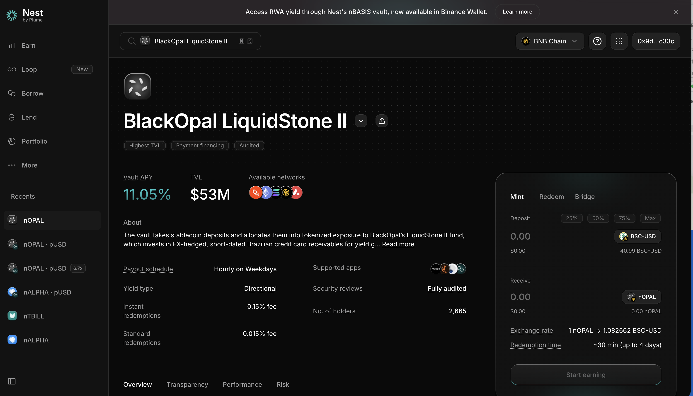

# Nest Credit（Plume）— nOPAL / nFXCF 等机构级 RWA 金库

> **状态**：✅ 已确认接入（nOPAL，六维度中 4 项已完成，见下）｜ 🟡 待确认（nFXCF / FalconX）
> **调研时间**：2026-07-31 ｜ **解析类型**：A（NAV 累积，收益自动复投进 token 价格）
> **调研质量**：高（官方 docs + 多方媒体一致）
> 📌 本文件覆盖 Master 表两行：**Nest Credit (Plume) / nOPAL** 与 **FalconX <> Plume / nFXCF**——同一个 Nest 平台的两个金库

## 0. 一句话结论

Nest 是 **Plume 生态的旗舰收益层**，把机构级资产（巴西信用卡应收账款、机构借贷、美债、私人信贷）包成一组 `n*` 金库代币；**收益自动复投进 token 价格、不派息、无 KYC、无赎回费**——是本批协议里**接入成本最低、机制最标准**的一个，nOPAL 已经跑通实时解析 / 交易历史 / 池子自发现 / APY 四项。

## 1. 基础信息（Master CSV 口径）

### 1.1 nOPAL（已接入，需修改）

| 字段 | 值 |
|------|-----|
| 协议 | Nest Credit (Plume) |
| 链 | BNB Chain（CSV 口径）⚠️ 官方主部署为 **Plume / Solana / Ethereum / Avalanche**，BNB 部署待核实（见 9.1） |
| Supply Coins | USDT（官方：pUSD 或 USDC） |
| Coins Integrated | nOPAL |
| 池子 TVL | 30M（CSV）｜ Plume 主网口径曾报 $42.7M |
| 收益率 | 12%（Pendle PT 固定收益约 11%） |
| 类别 | Private Credit |
| 产品 | BlackOpal LiquidStone II |
| 池子类别 | 活期 |
| 产品网页 | https://www.nest.credit/vaults/nest-opal-vault |
| DD 文档 | `[Jul 15 2026] Binance Earn BlackOpal DDQ` |
| 预算 / POC | $300,000 / Cece ｜ 执行：预算 + 合约 |
| 接入情况 | **WK 已接入，需修改** ｜ 实时数据：✅ |
| 六维度现状 | 实时解析 ✅ ／交易历史 ✅ ／池子自发现 ✅ ／APY ✅ ／NAV 历史 ⬜ ／PNL ⬜ |

### 1.2 nFXCF / FALX（待确认）

| 字段 | 值 |
|------|-----|
| 链 / Supply | Ethereum / USDC（官方：Plume + Ethereum + Solana 三链） |
| Coins Integrated | nFXCF（品牌名 **FALX**） |
| 池子 TVL | 27M（CSV）｜ 2026-06 媒体口径 $144M→$150M+ |
| 收益率 | CSV 空 ｜ 2026-06 30 日毛收益 **8.25%**（扣 10% performance fee 前） |
| 类别 / 产品 | Private Credit / FalconX 结构化信贷 |
| 产品网页 | https://www.nest.credit/vaults/nest-falconx-clo |
| POC | Cece ｜ 执行：产品 |

## 2. 协议背景

- **Nest** 是 Plume 的旗舰 RWAfi 协议：用户**无需许可（permissionless）**存入稳定币，拿到可组合的收益型 RWA 代币，还能拿去借贷协议做 looping。
- **金库矩阵**（Messari 口径 7 个机构级金库）：nTBILL（短期美债）、nBASIS（市场中性 crypto carry，底层 Superstate USCC）、nALPHA（支付金融 + 私人信贷）、**nOPAL**（BlackOpal LiquidStone II）、nWISDOM（WisdomTree CRDYX）、nCREDIT（公私信贷混合）、nACRDX（Apollo 全球信贷）。
- **多链**：Plume 主网起步，已扩到 **Solana**（nBASIS/nOPAL/nWISDOM/nALPHA/nTBILL 五个）、**Ethereum**、**Avalanche**；Nest UI 内置 **LayerZero 桥**到 Ethereum。
- **嵌入式趋势**：2026-03-19 Nest 金库基础设施接入 **EtherFi**（EtherFi 用户存款 $60 亿+），Messari 认为 Nest 正在变成"嵌在消费级钱包里的收益基础设施"。
- 📌 **对我们的意义**：Nest 已经是"钱包接 RWA 收益"的标准供给方，接口成熟度高；且 **Binance Wallet 已上线过 Plume 的 nBASIS 金库**（底层 Invesco USTB + Bitwise USCC，约 3.5% APY），有先例可参考。

## 3. 底层资产（Underlying）

### nOPAL — 巴西信用卡应收账款

- **发行方**：BlackOpal Finance（自称 25 年+ 信贷经验、$200M+ 机构背书）
- **资产**：BlackOpal 从巴西商户**折价买入未来信用卡应收账款**，在**巴西央行 C3 登记系统**做真实出售（true sale）登记
- **回款路径**：通过 **Visa / Mastercard 清算轨道自动回款**——意味着**没有商户还款风险**（钱不经过商户手）
- **汇率**：LiquidStone II 基金对**巴西雷亚尔敞口做了外汇对冲（FX-hedged）**
- **流动性管理**：金库同时配置 **Superstate USCC**（市场中性 crypto carry）作为流动性储备

### nFXCF / FALX — 机构 prime brokerage 结构化信贷

- **原生方**：**FalconX** prime brokerage 平台上的机构借贷（高频交易商、对冲基金、资管）
- **结构**：每笔贷款**超额抵押**（借款人质押其在 FalconX 的全部账户资产）+ **equity tranche 吸收首损** + 自动清算引擎持续监控
- **管理人**：贷款筛选与组合构建由 **M11 Credit** 负责；通过 **Pareto** 促成；与 **OpenTrade** 合作部署在 Plume
- **计息**：**每月贷款周期固定一次利率**（对 APY 曲线友好——阶梯状而非连续波动）
- **容量**：可扩展至约 $1B

## 4. 收益来源（Yield Source）

| 金库 | 收益腿 |
|------|--------|
| nOPAL | 折价买入应收账款 → 卡组织清算时收回全额的**贴现差价**；+ 流动性储备（USCC）收益 |
| nFXCF | 机构借贷**利息**（超额抵押）；扣 10% performance fee |

**分发方式**：现金流**自动再投资**，收益反映在 **token 价格上涨**里，**不派息** → PRD 后台「分发方式」配 **Auto-compound**。

## 5. 链上机制与凭证代币

> ✅ **2026-08-02 产品页截图确认**（BNB Chain 视角）。完整记录见 [../03-参考/已确认合约地址与链上实测.md](../03-参考/已确认合约地址与链上实测.md)

### 产品页截图（2026-08-02，nOPAL / BNB Chain）

**截图上要看的点**：

| 位置 | 内容 | 意义 |
|------|------|------|
| 右上角链选择器 | 🔴 **BNB Chain** | ✅ **CSV 正确，我错了** —— BNB 部署确实存在 |
| Available networks | **5 个网络图标** | 官方 docs 只列了 4 条，实际更多 |
| 右侧 Mint 面板 | Deposit 币种 **BSC-USD**（余额 40.99） | ✅ 申购币种是 BNB 链上的 USDT，CSV 正确 |
| **Exchange rate** | **1 nOPAL → 1.082662 BSC-USD** | ✅ 这就是 NAV，确认 A 类累积型，已涨 8.27% |
| **Redemption time** | **~30 min（up to 4 days）** | 可标活期；后台「赎回处理时间」按保守口径填 4 天 |
| **Payout schedule** | 🔴 **Hourly on Weekdays** | **周末不更新** → 天级打点会拿重复值 |
| Instant redemptions | 🔴 **0.15% fee** | ⚠️ 与下一行**两种费率**，后台单一字段装不下 |
| Standard redemptions | 🔴 **0.015% fee** | 相差 10 倍 |
| Vault APY / TVL | **11.05%** ／ **$53M** | CSV 写 12% / 30M，已过期 |
| Yield type | Directional | 详情页 Yield Source 可引用 |
| 其他 | 持有人 **2,665** ｜ Security reviews: **Fully audited** ｜ 标签 Highest TVL / Payment financing / Audited | Compliance Tab 可引用 |
| 底部 Tab | Overview / Transparency / **Performance** / **Risk** | 📌 官方已有 Performance 与 Risk 页，**详情页文案可直接引用** |
| 左侧栏 | 有 **nOPAL·pUSD 6.7x**（杠杆金库）、导航有 **Loop（New）** | Nest 自己也做循环贷，未来若接需另立条目 |
| 顶部 Banner | 🔴 "Access RWA yield through Nest's nBASIS vault, **now available in Binance Wallet**" | ✅ 印证 Binance Wallet 已接 nBASIS 的先例，可找当时对接同学复用经验 |
| 右侧面板 Tab | **Mint / Redeem / Bridge** | 有官方跨链桥 |

**🔴 重要更正：CSV 是对的，我错了**

| 项 | 我原先的质疑 | 实际（产品页确认） |
|----|------------|-----------------|
| 链 | 质疑 CSV 写的 BNB（官方 docs 只列 Plume/Solana/ETH/AVAX） | ✅ **BNB Chain 确实支持**，页面链选择器就选着 BNB Chain，"Available networks" 显示 **5 条链** |
| 申购币种 | 质疑 CSV 写的 USDT（官方 docs 说 pUSD/USDC） | ✅ **BSC-USD**（BNB 链上的 USDT），CSV 正确 |

> 📌 **教训**：官方 docs 的部署列表不全，**产品页才是真相**。以后核链先看产品页。

| 项 | 内容（2026-08-02 产品页） |
|----|------|
| 凭证代币 | nOPAL（BNB Chain 上为 ERC-20）；nFXCF 视链而定 |
| ✅ **合约地址** | **`0x119dd7daff816f29d7ee47596ae5e4bdc4299165`** 🔴 **BNB / Ethereum / Plume 三链同一个地址**（2026-08-03 BSC 与 ETH 均实测可读） → 配置时**必须带链标识**，光有地址会配错池子 |
| 🔴 **decimals** | **6**（不是 18！默认按 18 解析会把金额算小 10¹² 倍） |
| 实测供应量（2026-08-03） | BNB 链 **9,279,909.5441** ／ Ethereum **11,356,116.2383** |
| 是否 ERC-4626 | ❌ **不是**（`asset()` / `totalAssets()` / `convertToAssets()` 在 BSC 上全部 revert）→ **NAV 链上取数入口待确认** |
| ✅ **真实赎回 hash** | `0xd9f45ecb06b1b87d2b72daac161f1752bc1dd0cd5ff576cbf485781bd8f4d3b4`（销毁 5,583.869538 nOPAL） |
| **NAV（Exchange rate）** | ✅ **1 nOPAL → 1.082662 BSC-USD** —— 确认 **A 类 NAV 累积型**，已累积 8.27% |
| 🔴 **NAV 更新频率** | **Hourly on Weekdays（工作日每小时）** → **周末不更新**，天级打点在周末会拿到重复值 |
| **赎回时效** | **~30 分钟（最长 4 天）** → 可标"活期"，后台「赎回处理时间」建议按保守口径填 4 天 |
| 🔴 **赎回费（两种）** | **Instant redemptions 0.15%** ／ **Standard redemptions 0.015%**（差 10 倍） ⚠️ **PRD 后台只有一个「赎回费」字段，装不下两种**，见 §9.4 |
| Vault APY | **11.05%**（CSV 写 12%） |
| TVL | **$53M**（CSV 写 30M） |
| 持有人数 | 2,665 ｜ 安全：Fully audited ｜ Yield type：Directional |
| 页面 Tab | Overview / Transparency / **Performance** / **Risk** → 📌 官方已有 Performance 与 Risk 页，**详情页文案可直接引用，省 PM 写作成本** |
| 申购 | 页面有 **Mint / Redeem / Bridge** 三个 tab；**无需 KYC** |
| 相邻产品 | 侧边栏有 **nOPAL·pUSD 6.7x**（杠杆金库）、导航有 **Loop（New）** → Nest 自己也做循环贷，若未来接需另立条目 |
| 顶部 Banner | "Access RWA yield through Nest's nBASIS vault, **now available in Binance Wallet**" → ✅ 印证 Binance Wallet 已接 nBASIS 的先例 |
| 跨链 | Nest UI 内置 LayerZero 桥（Plume ↔ Ethereum） |
| 组合性 | nOPAL 已上 **Pendle**（Ethereum 主网 120 天市场，PT 固定约 11% APY）；nFXCF 是 **Morpho 上第二大 RWA 抵押物**（2026-06-22 约 $76M） |
| 数据源 | CoinGecko 已收录 nOPAL / nCREDIT，RWA.xyz 有 FalconX vault 数据 |

## 6. 数据接入要点（对齐 PRD）

### 6.1 六维度自评

| 维度 | 可行性 | 取数方式 | 备注 |
|------|:---:|---------|------|
| 实时解析 | ✅ **已完成** | n* balance × token 价格 | 已跑通 |
| 交易历史解析 | ✅ **已完成** | mint / redeem 事件 | 已跑通 |
| 池子自发现 | ✅ **已完成** | Nest 有统一金库结构 | 已跑通，**是本批唯一自发现已完成的协议** |
| APY | ✅ **已完成** | 已接 | |
| NAV 历史 | ⬜ **待做** | token 价格天级打点 | 标准做法；历史可 archive node 回溯 |
| PNL | ⬜ **待做** | 天级快照差分 | Auto-compound 型，公式最简单 |
| 备注 | 「接入情况」标注 **"WK 已接入，需修改"** —— 需要问 Jeff/Johnson**修改点具体是什么** | | |

### 6.2 关键取数口径

- 收益全在价格里 → `Total Earnings = balance × (NAV_now − NAV_entry)`，无需处理派息
- ⚠️ **多链同名代币**：nOPAL 在 Plume / Solana / Ethereum / Avalanche 都有，**每条链是独立合约、可能独立 NAV 与流动性**，配置时按链拆开
- nFXCF 利率每月固定 → APY 曲线会是阶梯状，前端 1W 视图可能看起来"没变化"，属正常

### 6.3 需向项目方索取

1. 各链 n* 代币合约地址清单（Plume / Ethereum / Solana / Avalanche）
2. **BNB Chain 是否有部署**（CSV 写 BNB，官方未见——见 9.1）
3. NAV / token 价格的链上取数函数
4. 历史 NAV 数据（nOPAL 上线较早，回溯有意义）
5. 赎回时效与是否有队列 / request ID
6. 「需修改」的具体清单（找 WK / Jeff）

## 7. 风险（Risk）

### nOPAL
1. **消费信贷违约风险**：巴西信用卡应收账款存在坏账；卡组织清算轨道降低了商户风险，但不消除发卡行/持卡人违约风险
2. **新兴市场宏观风险**：巴西利率政策、消费支出、汇率环境直接影响资产质量（已做 FX 对冲，但对冲有成本且非完美）
3. **嵌套风险**：流动性储备配置 Superstate USCC → 叠加 crypto basis 策略风险

### nFXCF
4. **借款人违约 + 清算滑点**：极端行情下机构借款人违约，抵押品清算可能滑价
5. **交易对手集中风险**：单一 prime broker（FalconX）平台的借款人池

### 共同
6. **智能合约 / 跨链桥风险**（LayerZero）
7. **Plume 链风险**：新 L1/L2，链本身的稳定性与 TVL 波动（Q3 2025 $645M → Q1 2026 $340M，波动大）
8. **超额抵押只是"缓释"不是"消除"**（Plume 官方明确措辞）

## 8. 合规与准入（Compliance）

- nOPAL **无需 KYC**即可在 Plume 上铸造（官方明确）——对钱包场景友好
- Plume 侧合规资质：ADGM 商业牌照、百慕大 BMA Class M 数字资产牌照、**已在 SEC 注册为代币化证券的 transfer agent**
- 底层真实出售在巴西央行 C3 登记
- ⚠️ nFXCF 的准入以 DD 为准（机构信贷产品可能有额外限制）

## 9. 待确认清单

| # | 问题 | 问谁 / 怎么查 | 状态 |
|---|------|------------|------|
| 1 | ~~nOPAL 是否真在 BNB Chain~~ | — | ✅ **2026-08-02 产品页确认：是，CSV 正确** |
| 2 | ~~申购币种是 USDT 还是 pUSD/USDC~~ | — | ✅ **确认 BSC-USD（USDT），CSV 正确** |
| 3 | ~~赎回时效~~ | — | ✅ **~30 分钟，最长 4 天** |
| 4 | 🔴 **两种赎回费率（instant 0.15% / standard 0.015%）怎么装进后台单一「赎回费」字段** | Marcus（**新发现，优先**） | 🟡 待答 |
| 5 | 🔴 **NAV 工作日每小时更新、周末不动** —— 天级打点选哪个时点？周末重复值 PNL 怎么处理？ | Scott/Linnea 内部定 + 报 Jackson | 🟡 待定 |
| 6 | nOPAL 在 BNB 链上的合约地址 | **页面标题旁下拉箭头点开，再截一次图**（最容易解决的一条） | 🟡 待补 |
| 7 | 「WK 已接入，需修改」修改点是什么 | Jeff / Johnson / WK | 🟡 待答 |
| 8 | nFXCF 的 CSV 链写 Ethereum，官方说三链，我们接哪条 | Cece | 🟡 待答（nFXCF 本轮范围外） |
| 9 | nFXCF 收益率 CSV 为空，是否用 8.25% 毛收益还是净值 | Cece | 🟡 待答 |
| 10 | 是否还要接 Nest 其他金库（nTBILL / nBASIS / nALPHA / nACRDX）——**Binance Wallet 已上过 nBASIS**，可能有复用 | Marcus / Cece | 🟡 待答 |
| 11 | Nest 自己的 **Loop / 6.7x 杠杆金库**是否在未来范围内 | Marcus | 🟡 待答 |

## 10. 参考链接

- Nest 官方金库列表：https://docs.nest.credit/about/available-vaults/
- nOPAL 产品页：https://www.nest.credit/vaults/nest-opal-vault
- nFXCF 产品页：https://www.nest.credit/vaults/nest-falconx-clo
- nOPAL 上 Pendle（机制 + 底层说明）：https://plume.org/blog/nopal-is-now-live-on-pendle-fixed-yield-backed-by-brazilian-credit-card-receivables
- nOPAL 扩到 Avalanche：https://cryptobriefing.com/avalanche-nopal-vault-brazilian-receivables/
- FALX 上线（Plume 官方）：https://plume.org/blog/plume-and-falconx-launch-falx-expanding-onchain-access-to-structured-credit-facility
- FalconX 信贷金库说明：https://www.falconx.io/newsroom/bringing-institutional-lending-on-chain-exploring-falconxs-credit-vault
- Messari：Nest 作为多链 RWA 收益层：https://tokenpost.com/news/technology/20584
- Binance Wallet 上线 Plume nBASIS 金库（先例）：https://www.theblock.co/post/407632/binance-wallet-plume-yield-vault-invesco-bitwise-funds
- 数据：https://www.coingecko.com/en/coins/nest-blackopal-liquidstone-ii-vault
