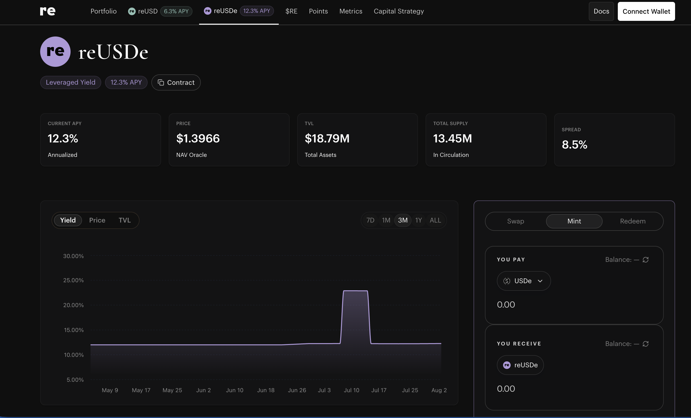

# Re（re.xyz）— reUSD / reUSDe 链上再保险

> **状态**：✅ 已确认接入（真实解析 7 个之一）
> **调研时间**：2026-07-31 ｜ **解析类型**：A（NAV 累积，链下 NAV 每日更新）
> **调研质量**：高（官方 docs 完整）

## 0. 一句话结论

Re 把稳定币变成**持牌再保险公司的合规抵押品**，用户赚的是真实保费；产品按**资本分层（senior / junior）** 发两个代币，reUSD 在上层（+250bps、可即时赎回）、reUSDe 在下层（+850bps、**季度赎回**）——季度赎回这一条是我们接入时最大的产品/前端问题。

## 1. 基础信息（Master CSV 口径）

| 字段 | 值 |
|------|-----|
| 协议 | Re |
| 链 | Ethereum（另有 Base，仅 reUSD） |
| Supply Coins | USDC（官方还接受 USDe / sUSDe） |
| Coins Integrated | reUSD / reUSDe |
| 池子 TVL | 20M（CSV 口径）｜ 第三方口径全协议 TVL 约 $465M（2026 年中） |
| 收益率 | 6% / 12%（对应 reUSD / reUSDe） |
| 类别 | Reinsurance ⚠️（后台枚举无此类，需映射） |
| 产品 | Junior & Senior |
| 池子类别 | 活期（Flexible）⚠️ **与官方「reUSDe 季度赎回」冲突，见 9.1** |
| 产品网页 | https://app.re.xyz/reusde |
| DD 文档 | `[W3E] re.xyz DD` |
| POC | Terry ｜ 执行：产品 + 预算 |

## 2. 协议背景

- **发行/运营主体**：与 **CoverRe（Cover Reinsurance SPC Ltd.）** 合作——开曼群岛 **Class B(iii) 持牌**豁免分隔投资组合公司（segregated portfolio company）。reUSD 由 **Resilience Foundation Cayman LLC** 发行。
- **业务本质**：再保险 = "保险公司的保险"。Re 承接原保险公司让渡出来的尾部/巨灾赔付风险，赚取让渡的保费。
- **资金流**：用户存入 → Insurance Capital Layer（ICL）智能合约 → 铸出 reUSD/reUSDe → 闲置资金放 **Fireblocks 多签金库**（余额每日推送 **Chainlink oracle**）→ 动用时以 **Surplus Note**（法律上劣后于投保人）借给再保险公司 → 资金进入美国境内 **§114 Trust Account**（美国持牌再保险人可认可的 admitted collateral）。
- **业绩/风控数据**：官方称自成立以来每个承保年度 combined ratio 均 <100%；压力测试下（combined ratio 135%）reUSD 本金受损概率约 **0.03%**。
- **融资**：获 **Coinbase Ventures** 战略投资。
- **组合性**：reUSD / reUSDe 已可在 Curve、Pendle、Morpho 等做抵押物。

## 3. 底层资产（Underlying）

- **主体**：完全抵押（fully collateralized）的再保险合约，标的是真实世界保险风险（财产巨灾 + 专业险种）
- **闲置资金**：未分配部分留在 **sUSDe**（吃 Ethena 的 staking 收益），链下部分吃 **SOFR**
- **资本结构（损失瀑布，从先亏到后亏）**：

| 层级 | 代币 | 亏损顺序 | 息差 | 流动性 |
|------|------|---------|------|-------|
| Equity | 再保险公司自有资本（2026-06 约 $77M） | 第 1 顺位吸损 | — | — |
| Junior / Mezz | **reUSDe** | 第 2 顺位（首个外部吸损层） | **+850 bps** | **季度赎回** |
| Senior | **reUSD** | 最后吸损 | **+250 bps** | 有额度即时赎回 |

> ⚠️ 术语注意：官方 reUSD 文档把再保险公司自有资本叫 junior、reUSDe 叫 mezzanine；reUSDe 文档又把 reUSDe 叫 junior。**写用户文案时统一用「Senior / Junior」并说明吸损顺序**，别纠缠 mezz。

## 4. 收益来源（Yield Source）

**reUSD（Basis-Plus）** = 基准利率 + 250bps
- 链下部分：SOFR + 250bps
- 链上部分：**sUSDe basis trade 7 日移动平均利率** + 250bps

**reUSDe（Insurance Alpha）** = 基准利率 + 850bps（用更劣后的位置换更高息差）

→ **数据含义**：收益率是**利差型（spread over benchmark）**，不是固定票息。基准（SOFR / sUSDe basis）会浮动，所以 APY 曲线本身有意义、必须接。

## 5. 链上机制与凭证代币

> ✅ **2026-08-02 已链上实测 + 产品页截图确认**，本节内容已从"文档推断"升级为"实测确认"。完整实测记录见 [../03-参考/已确认合约地址与链上实测.md](../03-参考/已确认合约地址与链上实测.md)

### 产品页截图（2026-08-02，reUSDe）

**截图上要看的点**：

| 位置 | 内容 | 意义 |
|------|------|------|
| 顶部导航 | reUSD **6.3% APY** ／ reUSDe **12.3% APY** | 两个代币独立 APY，需配成两个投资品 |
| reUSDe 标签 | 🔴 **"Leveraged Yield"（杠杆收益）** | 官方自己标的杠杆，Risk Tab 必须写 |
| PRICE | **$1.3966**，下方标注 🔴 **"NAV Oracle"** | **NAV 由外部预言机喂入，不在合约内计算** |
| TOTAL SUPPLY | **13.45M In Circulation** | ✅ 与链上实测 `totalSupply()` = 13,451,262.03 完全吻合 |
| TVL | **$18.79M** Total Assets | ✅ 对应 CSV 写的 20M（**指 reUSDe，不含 reUSD 的 155M**） |
| SPREAD | **8.5%** | ✅ 与官方文档 "+850bps" 完全吻合 |
| 图表区 | **Yield / Price / TVL** 三条曲线，范围 7D / 1M / 3M / 1Y / **ALL** | 🔴 **官方已有完整历史 NAV 曲线 → 历史数据存在，很可能有 API** |
| Yield 曲线形态 | 5–7 月平在 12%，**7 月 10 日附近尖峰冲到约 22.5% 后回落** | APY 会跳变，需确认是真实承保事件还是数据异常 |
| 右侧面板 | Swap / **Mint** / **Redeem** ｜ YOU PAY 默认 **USDe** | ⚠️ **CSV 写 USDC，页面默认 USDe**，From Token 需确认 |
| Redeem 面板 | ⚠️ **完全没有显示任何赎回周期信息** | 见 §9.1，已升级为信息披露风险 |
| 顶部还有 | Portfolio / $RE / **Points** / Metrics / Capital Strategy | 有 Points 体系 → 可能涉及 Campaign Bonus |

| 项 | reUSD（senior） | reUSDe（junior） |
|----|----------------|-----------------|
| **合约地址（Ethereum）** | ✅ `0x5086bf358635B81D8C47C66d1C8b9E567Db70c72` | ✅ `0xdDC0f880ff6e4e22E4B74632fBb43Ce4DF6cCC5a` |
| `name()` | "Re Protocol Deposit Token" | "Re Protocol reUSDe" |
| `decimals()` | 18 | 18 |
| `totalSupply()`（2026-08-02） | **155,167,762.66** | **13,451,262.03** |
| 产品页 NAV | 6.3% APY | **$1.3966**，12.3% APY，SPREAD 8.5% |
| 🔴 **是否 ERC-4626** | ❌ **不是** | ❌ **不是** |
| 4626 函数实测 | `asset()` / `totalAssets()` / `convertToAssets()` / `previewRedeem()` **全部 revert** | 同 |
| 🔴 **合约类型** | **EIP-1967 可升级代理**（bytecode 仅 133 字节） | **EIP-1967 可升级代理** |
| **实现合约** | `0xb5276c436f65913cd5332de745d04fedeb4a21d4` | **同一个** `0xb5276c…21d4` |

**三条关键修正 / 发现**：

1. 🔴 **NAV 不能从合约取** —— 我原先写"NAV 从 `convertToAssets` 取"**是错的**（按 A 类通用模式推断的）。实测四个 4626 函数全 revert。产品页 PRICE 栏明确标注 **"NAV Oracle"**，说明 NAV 由**外部预言机**喂入（与官方文档"Fireblocks 余额每日推送 Chainlink"一致）。
   → **必须向项目方索取 NAV Oracle 合约地址 + 读取方法**，这是 Re 接入的第一前置条件。
2. ✅ **两个代币共用同一实现合约** → **一套解析适配器能覆盖两个**，边际成本很低。
3. ⚠️ **可升级代理是新增风险** → 项目方可随时替换逻辑；建议中台**监控 proxy slot `0x360894a1…82bbc` 的变更并告警**。

| 其他 | 内容 |
|------|------|
| NAV 更新频率 | 官方文档：reUSD 链上价格**每日 00:00 UTC 重算** |
| 申购 | 官方文档：存 USDC / USDe / sUSDe 到 ICL 合约铸币 ⚠️ **产品页 Mint 面板默认 YOU PAY 是 `USDe`**（可下拉切换），**CSV 写的是 USDC**，需确认我们接哪个 From Token |
| **赎回** | 官方 docs：**reUSD 有额度时即时**；**reUSDe 季度处理** 🔴 **但产品页 Redeem 面板没有显示任何周期信息**，见 §9.1 |
| 前端历史数据 | ✅ 产品页有 **Yield / Price / TVL** 三条曲线，范围 7D / 1M / 3M / 1Y / **ALL** → **历史 NAV 数据存在，很可能有 API 可取** |
| 链 | Ethereum；Base 上仅 reUSD（接受 USDC） |

## 6. 数据接入要点（对齐 PRD）

### 6.1 六维度自评

| 维度 | 可行性 | 取数方式 | 备注 |
|------|:---:|---------|------|
| 实时解析 | ✅ | reUSD/reUSDe balance × 当日价格 | 已在真实解析清单内 |
| 交易历史解析 | ✅ | mint / redeem 事件 | reUSDe 赎回是**两段式**（申请→季度执行），事件要分开识别 |
| 池子自发现 | 🟡 | 产品数量少（2 个），建议硬编码 | |
| APY | ✅ | 官方 metrics 页 / 由价格差分自算 | 利差型，建议自算 + 标注基准 |
| NAV 历史 | ✅ | **每日 00:00 UTC 价格更新**，天然天级颗粒度 | 与我们「天级打点」需求天然对齐，最省事的一个协议 |
| PNL | ✅ | 天级快照差分 | 极端情况（保险赔付击穿）可能负值 |

### 6.2 关键取数口径

- 🔴 **NAV 走外部 Oracle，不是合约内部函数**（2026-08-02 实测确认）。取数入口待项目方提供
- **NAV 打点时间建议对齐 00:00 UTC**，避免和官方价格更新错位造成"同一天两个 NAV"
- reUSD 与 reUSDe 是**两个独立投资品**（不同 APY、不同赎回条款、不同风险层），后台必须配成两条，**不能合并成一个投资品的两个 From Token**
- ✅ **解析适配器可复用**：两个代币指向同一实现合约，写一套即可
- ⚠️ **监控实现合约变更**：可升级代理，proxy slot 变了说明逻辑被换过，解析可能失效
- 赎回中状态：若 reUSDe 确认是季度赎回，必须支持 request ID + 展示"下一个赎回窗口"
- ⚠️ **APY 曲线会跳变**：产品页 3M 图显示 5–7 月平在 12%，**7 月 10 日左右尖峰冲到约 22.5% 后回落**。需确认是真实承保事件还是数据异常

### 6.3 需向项目方索取

1. reUSD / reUSDe 合约地址（Ethereum + Base）
2. 每日价格的**链上取数入口**（是合约 view 函数还是 Chainlink feed 地址）
3. 历史每日价格数据（用于 NAV 曲线回溯）
4. reUSDe 赎回流程的链上事件定义（申请事件 / redemption token / 执行事件）
5. 季度赎回窗口日历（前端要展示）

## 7. 风险（Risk）

1. **保险承保风险（核心）**：巨灾/尾部事件导致赔付超过再保险公司自有资本时，**reUSDe 先吸损，reUSD 后吸损**，本金可能减记
2. **分层差异风险**：reUSDe 位于 reUSD 下方，同一事件下 reUSDe 亏损幅度显著更大
3. **赎回流动性风险**：reUSDe **仅季度赎回**；reUSD 即时赎回需"有额度"，压力情形下可能延迟
4. **交易对手风险**：再保险交易对手违约
5. **嵌套收益风险**：闲置资金放 sUSDe，因此叠加了 **Ethena delta 中性策略风险**（资金费率转负等）
6. **托管/预言机风险**：Fireblocks 多签 + Chainlink 每日推送，链上价格依赖链下报数。⚠️ 实测确认 NAV 确实**不在合约内计算**，完全依赖外部 Oracle —— 预言机失效或报错价，用户看到的净值就是错的
7. ⚠️ **合约可升级风险（2026-08-02 实测新增）**：reUSD 与 reUSDe 都是 **EIP-1967 可升级代理**，项目方可随时替换实现合约逻辑，用户无法阻止
8. ⚠️ **reUSDe 官方自标「Leveraged Yield」（杠杆收益）** —— 产品页上就是这个标签，Risk Tab 必须如实披露

## 8. 合规与准入（Compliance）

- 发行主体：Resilience Foundation Cayman LLC（reUSD）；承保主体 Cover Reinsurance SPC Ltd.（开曼 Class B(iii) 持牌）
- **仅向非美国人士（non-U.S. persons）在特定地区开放**
- 抵押品结构（Surplus Note + 美国 §114 Trust）为美国持牌再保险人可认可的合规抵押品
- ⚠️ 具体准入名单 / 是否需 KYC：以 `[W3E] re.xyz DD` 为准

## 9. 待确认清单

| # | 问题 | 问谁 / 怎么查 | 状态 |
|---|------|------------|------|
| 1 | 🔴 **reUSDe 赎回周期书面确认**：官方 docs 说季度，但**产品页 Redeem 面板完全没写周期**。 两种可能：① 机制已改成随时可赎（那 CSV 标"活期"是对的）② 机制没改、只是前端没提示 —— **后者更危险，连官方页面都不披露锁定期，用户完全无感** | Terry / 项目方（**最高优先**，已从"口径分歧"升级为**信息披露风险**） | 🟡 待答 |
| 2 | 🔴 **NAV Oracle 合约地址 + 读取方法** | 项目方 | 🟡 待答（**接入第一前置条件**） |
| 3 | ~~合约地址~~ | — | ✅ **2026-08-02 已实测确认**，见 §5 |
| 4 | **From Token 接 USDC 还是 USDe**（CSV 写 USDC，产品页 Mint 默认 USDe） | Terry | 🟡 待答 |
| 5 | reUSD / reUSDe 是否都要接，还是只接一个（**建议一期只接 reUSD**：即时赎回、无周期争议） | Terry | 🟡 待答 |
| 6 | 「Reinsurance」映射到后台哪个资产类型枚举（建议 Structured Products） | Marcus | 🟡 待答 |
| 7 | ~~CSV TVL 20M 的口径~~ | — | ✅ **已确认**：CSV 的 20M 指 **reUSDe**（实测 totalSupply 13.45M / 页面 TVL $18.79M）；**reUSD 是独立的 155M**，量级完全不同 |
| 8 | 7 月 10 日 APY 尖峰（12% → 22.5% → 回落）是真实事件还是数据异常 | 项目方 | 🟡 待答 |
| 9 | 历史 NAV 是否有 API（产品页已有 ALL 范围的 Price 曲线，说明数据存在） | 项目方 | 🟡 待答 |

## 10. 参考链接

- 官方文档：https://docs.re.xyz/
- reUSD 说明：https://docs.re.xyz/products/about-reusd
- reUSDe 说明：https://docs.re.xyz/insurance-capital-layers/what-is-reusde
- reUSDe FAQ（赎回频率）：https://docs.re.xyz/insurance-capital-layers/reusde-faq
- 协议机制：https://docs.re.xyz/protocol/how-the-re-protocol-works
- 产品页：https://app.re.xyz/reusde
- Coinbase Ventures 投资：https://www.reinsurancene.ws/onchain-protocol-re-secures-strategic-investment-from-coinbase-ventures/
- 第三方分析（TVL / 收益目标）：https://ourcryptotalk.com/blog/re-onchain-reinsurance-analysis
