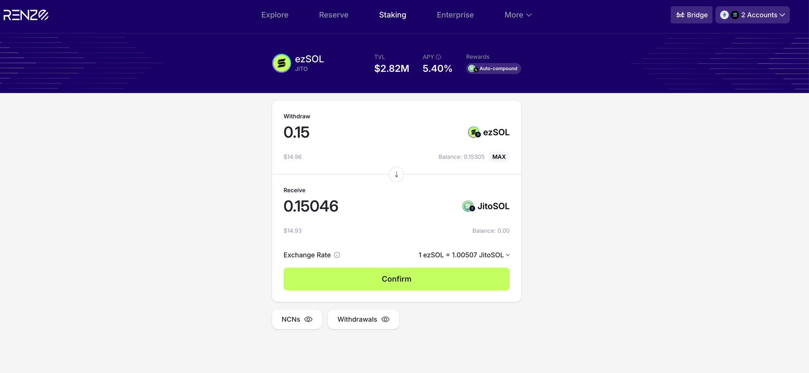
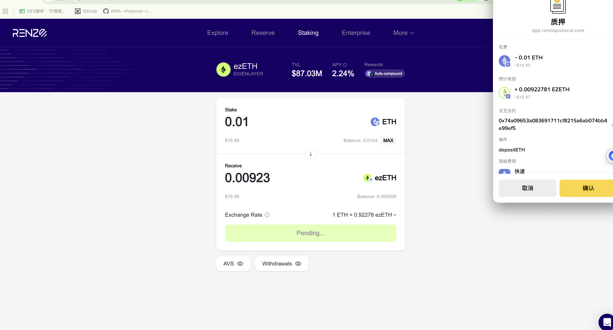

# Renzo —— ezUSDC1 Reserve ／ ezETH Restaking ／ ezSOL（Solana）

> ⚠️ **范围声明**：本协议**不属于**本仓库原本的 RWA 7 协议范围，来自 **DeX 行情接链项目**（协议表条目 `SOLRenzo`）。放在本目录是为了复用同一套调研模版与实测规范。
> **状态**：🟡 实测已完成（**含 Solana 侧 ezSOL**），协议背景调研未做
> **实测时间**：2026-08-10
> **测试钱包**：Ethereum `0x9da44afe5ba28aa42301c626155ea66eb544c33c` ｜ Solana `9Gu4W2YUYCRMXiZWrD5ExF77PAS6X3Mfa6kwSmc9MhgS`
> ✅ **`SOLRenzo` 的口径疑问已解决**：Renzo **确实有 Solana 产品 ezSOL**，且已实测赎回。见 §5.4
> **本页可信度**：链上部分为 `getTransaction` / Blockscout 逐笔实测；UI 部分为操作当时截图读取（原图未落盘，见文末）
> **解析类型**：A（NAV 累积，份额价格 > 1）

## 0. 一句话结论

Renzo 在同一个 App 下挂着**三条机制两两不同的产品线，横跨两条公链**：**Reserve**（ezUSDC1 收益金库，ERC-20 份额 + WithdrawQueue 排队赎回）、**Staking-ETH**（ezETH，即时铸造）、**Staking-Solana**（ezSOL，Jito Restaking，赎回走 **ticket PDA 托管**）。

实测最需要注意的两点：
1. **ezUSDC1 份额价格约 4.376 USDC、decimals 是 6** —— 按 1:1 或按 18 位处理都会错
2. 🔴 **ezSOL 赎回时份额被转进一个新建的 PDA，用户侧任何代币余额都读不到这笔待领取资产** —— 见 §5.4

## 1. 基础信息（实测口径）

| 字段 | 值 |
|------|-----|
| 协议 | Renzo（app.renzoprotocol.com） |
| 链 | **Ethereum**（ezUSDC1 / ezETH）+ **Solana**（ezSOL，见 §5.4） |
| 本次实测产品 | ① **USDC Yield / ezUSDC1**（Reserve, ETH）② **ezETH**（Staking, EigenLayer, ETH）③ **ezSOL**（Staking, Jito, Solana） |
| Supply Coins | ① USDC ② ETH（原生币，非 ERC-20）③ JitoSOL |
| Coins Integrated | ① ezUSDC1 ② ezETH ③ ezSOL |
| 池子 TVL | ① **$394.30** ② **$88.76M** ③ **$2.82M**（2026-08-10 UI 快照） |
| 收益率 | ① 30D APY 面板未展示数值 ② **2.33%** ③ **5.40%**，②③ 均标注 Auto-compound（2026-08-10 UI 快照） |
| 池子类别 | ① **排队赎回**（非活期）② 待补 ③ **排队赎回**（ticket 制，非活期） |
| 产品网页 | https://app.renzoprotocol.com/reserve/ezusdc1 ／ …/staking |
| 接入情况 | 待定（DeX 项目侧口径） |

## 2. 协议背景

⬜ **未做**。本页只承载链上实测结论，背景/团队/融资/审计需另行补齐（见 §9）。
已知：ezETH 产品页标注底层是 **EigenLayer**，Rewards 为 **Auto-compound**。

## 3. 底层资产

⬜ **未做**。ezUSDC1 产品页副标题原文：*"Allocates capital across lending markets to maximize net supply yield"* → **自述为跨借贷市场的净供给收益策略**，具体市场清单未取（页面有 **Strategy & Parameters** 入口，可再截一次图）。

## 4. 收益来源

| 产品 | 页面自述 |
|------|---------|
| ezUSDC1 | 跨 lending markets 分配资金，最大化 net supply yield |
| ezETH | EigenLayer restaking，Rewards **Auto-compound** |

⚠️ 均为页面自述，未做交叉验证。

## 5. 链上机制与合约（✅ 全部实测）

> ⚠️ **三条产品线的机制两两不同**：ezUSDC1 走 WithdrawQueue、ezETH 即时铸造、ezSOL 走 Jito ticket PDA。**不能共用一套适配器。**

### 5.1 合约清单

| 项 | 地址 | 实测确认 |
|----|------|---------|
| **ezUSDC1 金库 / 份额代币** | `0x877bbA4238EF1DCA9BF574561da633049de3A334` | BeaconProxy → 实现合约 **`LEZyVault`**<br>token name **"Renzo USDC Vault 1"**、symbol **ezUSDC1**<br>🔴 **decimals = 6**（跟随 USDC，不是 18）<br>totalSupply **90.323693**（2026-08-10 快照） |
| 🔴 **赎回队列** | `0x01D62CAE01b1df926c0a32EBe057374C4049C711` | BeaconProxy → 实现合约 **`WithdrawQueue`** |
| **ezETH 铸造入口** | `0x74a09653A083691711cF8215a6ab074BB4e99ef5` | TransparentUpgradeableProxy → 实现合约 **`RestakeManager`**<br>与 UI 授权弹窗显示的「交互合约」完全一致 ✅ |
| **ezETH 代币** | `0xbf5495Efe5DB9ce00f80364C8B423567e58d2110` | "Renzo Restaked ETH"，decimals 18，totalSupply 42,569.97（2026-08-10 快照） |
| USDC（申购币种） | `0xA0b86991c6218b36c1d19D4a2e9Eb0cE3606eB48` | decimals 6 |

### 5.2 🔴 份额价格不是 1:1

| 来源 | 数值 |
|------|------|
| UI Exchange Rate（正向） | 1 USDC = **0.22849** Vault Shares |
| UI Exchange Rate（反向） | 1 Vault Share = **4.37649** USDC |
| 链上实测反推 | 1.000000 USDC → **0.228495** ezUSDC1 → 隐含 **4.37646 USDC/share** |

**→ 三者吻合（差 0.0007%），NAV 反推口径可靠。**
🔴 **绝不能按 1 ezUSDC1 ≈ $1 处理**，也不能按 18 位小数解析。

### 5.3 申购 / 赎回路径（Ethereum 侧两条线机制不同）

```
【ezUSDC1 申购】approve(USDC) → deposit()          ← 2 笔交易，份额即时 mint（from=0x0）
【ezUSDC1 赎回】approve(ezUSDC1) → withdraw()      ← 2 笔交易，份额转给 WithdrawQueue，🔴 本笔不到账
【ezETH 质押】  depositETH()                        ← 1 笔交易（ETH 原生币无需 approve），ezETH 即时 mint
【ezSOL 赎回】  EnqueueWithdrawal()                 ← 1 笔交易（Solana），份额转入 ticket PDA，🔴 本笔不到账（见 §5.4）
```

🔴 **ezUSDC1 赎回是排队制**：`withdraw` 那笔链上只看到 **0.1 ezUSDC1 从用户转给 `0x01D62CAE…`（WithdrawQueue）**，**没有任何 USDC 回到用户**。与 Ember 的排队申购是镜像问题 —— 详见 §6.2。

### 5.4 ✅ Solana 侧：ezSOL（Jito Restaking）—— 赎回机制与 Fragmetric 完全不同

> **2026-08-10 13:17:27 UTC 实测** ｜ 测试钱包 `9Gu4W2YUYCRMXiZWrD5ExF77PAS6X3Mfa6kwSmc9MhgS`（Solflare）
> signature `4D5miJ2EKobo13nVMS556xuZrPT3m61fKigNHJoXxvXWSVqArKbDmRMLjjhALaiuzM37LVnNkPfHmWWHcvg61b8t`

#### 基础信息（2026-08-10 UI 快照）

| 项 | 值 |
|----|-----|
| 产品 | **ezSOL**，底层标注 **JITO** |
| TVL | **$2.82M** |
| APY | **5.40%**，Rewards **Auto-compound** |
| 🔴 赎回得到的资产 | **JitoSOL**（不是 SOL）→ **本身又是一个 LST，估值要多一层** |
| 汇率 | **1 ezSOL = 1.00507 JitoSOL** |
| ezSOL mint | `ezSoL6fY1PVdJcJsUpe5CM3xkfmy3zoVCABybm5WtiC`（decimals **9**，classic SPL Token）<br>链上实测总供应 **28,293.84 ezSOL** |
| 页面入口 | app.renzoprotocol.com **Staking** 页（⚠️ **需先连 Solana 钱包才会出现**，只连 EVM 钱包时该产品不显示） |
| UI 其他入口 | **NCNs** / **Withdrawals** 两个按钮 → 有 NCN 明细页和提现队列页 |

#### 🔴🔴 赎回是「份额转进票据账户」，不是销毁

实测指令序列：

```
CreateIdempotent ×2            ← 建 associated token account
Instruction: EnqueueWithdrawal  ← 🔴 入队，不是即时赎回
Program log: Initializing vault staker withdrawal ticket at address
             2TmT9mRER1gg6ayrZkbxFgUXG8hNcPNxFe9BVRsiFCN2
```

| 项 | 链上事实 |
|----|---------|
| 用户 ezSOL | **0.153050077 → 0.003050077**（−0.15） |
| 🔴 这 0.15 去哪了 | **转进了新建的 withdrawal ticket 账户 `2TmT9mRER1gg6ayrZkbxFgUXG8hNcPNxFe9BVRsiFCN2`** |
| 🔴 JitoSOL 到账 | **没有**（UI 显示 Receive 0.15046 JitoSOL，但本笔链上无任何 JitoSOL 转入） |
| 票据账户归属程序 | **`Vau1t6sLNxnzB7ZDsef8TLbPLfyZMYXH8WTNqUdm9g8`**（Jito Vault 程序），data 512 字节，租金 0.00356352 SOL |
| fee | 0.001232679 SOL |
| 第二签名者 | `3orFoZZsQxZncLpshH6kvozPu6jXwmEf9hdedpqBfUcV`（非用户，疑为代付/relayer —— 同 Orca 的 feePayer 坑） |

**🔴 和 Fragmetric 对比 —— 同样是 Solana restaking，赎回的链上表达完全相反**：

| | **Fragmetric**（fragSOL） | **Renzo ezSOL** |
|---|---|---|
| 指令 | `UserRequestWithdrawal` | `EnqueueWithdrawal` |
| 份额代币 | 🔴 **`Burn` 销毁** + `MintTo` 铸提现凭证 | 🔴 **不销毁**，转进 **ticket PDA 托管** |
| 用户余额怎么变 | 份额减少，同时拿到一个凭证代币 | 份额减少，**什么都没拿到** |
| 待领取金额怎么读 | 读提现凭证代币余额 | 🔴 **必须找到 ticket PDA 并解析其 512 字节数据** |
| 底层 | Jito Restaking | Jito Restaking（**同一个底层，机制却不同**） |

**→ 给解析同学的两条硬规格**：

1. 🔴 **ezSOL 的待领取赎回，从用户的任何代币余额里都读不出来。** 份额被转进一个新建的 PDA，用户侧只看到「余额少了、什么都没多」。**必须按 Jito Vault 程序 `Vau1t6sL…` 枚举该用户的 withdrawal ticket 账户**，否则用户在赎回等待期内会看到资产凭空少掉。
2. 🔴 **「同底层 = 同机制」的假设不成立。** Fragmetric 和 Renzo ezSOL 都跑在 Jito Restaking 上，但一个销毁+铸凭证、一个转入托管 PDA。**每个协议都得单独实测，不能按底层归类套用。**

⚠️ **一个未解释的数字差**：UI 汇率 1 ezSOL = 1.00507 JitoSOL，0.15 × 1.00507 = **0.150761**，但 UI 的 Receive 显示 **0.15046**（少 0.0003，约 0.2%）。**推断**是赎回费或滑点，**未证实** —— 需等 claim 到账后用实收金额反推。

## 6. 数据接入要点

### 6.1 ✅ 实测交易全集（2026-08-10 ~ 08-14，UTC）

| # | 时间 | 操作（UI 视角） | 交易类型 | tx hash | 链上结果 |
|:---:|------|---------------|---------|---------|---------|
| 1 | 08:09:23 | Deposit 第 1 步 | **approve(USDC)** | `0x6cff7c1ae02ac8dd4abc0180a513d1db26bbb806c53ad59e990cb1e9e40989b9` | 授权给金库 |
| 2 | 08:09:35 | Deposit 1 USDC | 🔴 **申购（即时 mint）** | `0x0aad5aa6b226c9a5f833cc52fa15337896b4a39fe9eba5e3b6b895639b11a3c9` | USDC **−1.000000**（用户→金库）<br>ezUSDC1 **+0.228495**（from `0x0`） |
| 3 | 08:10:47 | Withdraw 第 1 步 | **approve(ezUSDC1)** | `0x12acb97783a86f61774f27a001d4fbd49826ac539810e7afce517b35f6271cd5` | 额度 0 → **0.1**，授权对象 `0x01D62CAE…` ✅ 与 UI 弹窗一致 |
| 4 | 08:10:59 | Withdraw 0.1 份额 | 🔴 **赎回-提交（进队列）** | `0x0798eff3319f8be06efa061e450f7584b9d8410512589ba804ea2f38bee90c82` | ezUSDC1 **−0.1**（用户→WithdrawQueue）<br>🔴 **无 USDC 到账** |
| 5 | 08:11:59 | Stake 0.00001 ETH | **质押（即时 mint）** | `0xda2a5ba5045bdea792bde33261a1b713000292ca53170495a19a4878de6c0699` | 方法 **`depositETH`**<br>ezETH **+0.000009229160829871**（from `0x0`） |
| 6 | 13:17:27 | **Solana** Withdraw 0.15 ezSOL | 🔴 **赎回-入队（转入票据账户）** | `4D5miJ2EKobo13nVMS556xuZrPT3m61fKigNHJoXxvXWSVqArKbDmRMLjjhALaiuzM37LVnNkPfHmWWHcvg61b8t` | 指令 **`EnqueueWithdrawal`**<br>ezSOL 0.153050077 → 0.003050077<br>🔴 0.15 转入新建 ticket `2TmT9mRER…FCN2`<br>🔴 **无 JitoSOL 到账**｜详见 §5.4 |
| 7 | 2026-08-14 02:48:11 | Stake 0.01 ETH | **质押（即时 mint）** | `0xe344fa28d327dba03e1ef4530dfa3e4d4c54f3a6f97c29855f94bead5c6566d2` | to `0x74a09653…e99ef5`，value **0.01 ETH**<br>ezETH **+0.00922781358695485**（from `0x0`，decimals 18）<br>⚠️ 用户随附截图为 **Solana 侧 ezSOL Stake 页**（0.02 JitoSOL → 0.019607 ezSOL，见 §11）；**该哈希本身是 Ethereum 侧 ezETH 质押**，Solana 侧这笔 stake 未上链（截图连接钱包 `2NCfm72…YdYX` ≠ 08-10 测试钱包 `9Gu4W2…MhgS`，见 §9-1e） |
| 8 | 2026-08-14 03:29:41 | （Solana，无 UI 截图） | 🔴 **赎回-入队？（第 2 笔，转全部剩余）** | `2oFvBFwvZsjjq6EDC2nmEjFSTeyqm8UFnTB17DTzifFX8yny6Sj4ncn2AGVw1WuoSJTQ8JT7gD29n5iwz1cGSPtb` | CreateIdempotent（ezSOL ATA）+ `transfer` **0.003050077 ezSOL**（用户全部剩余余额 → 新账户 `EfCMyCyo…`）<br>⚠️ 类型按金额推断为赎回入队，待 UI 确认 |
| 9 | 2026-08-14 03:29:56 | （Solana，无 UI 截图） | ✅ **claim（赎回到账）** | `28fmyJUDVNS7Ep79EcUPMAKz2acn9yfqr2yBcMFVduqkLnmffd1mHJh9GcxrFHJPcny7roSUdS2quY4SNLbGRaUN` | `burn` **0.1497 ezSOL**（08-10 ticket）+ 用户实收 **0.150468116 JitoSOL**（= UI 预览 0.15046 ✅）+ fee **0.00015×2**（=0.0003 ≈ 0.2%，**§9-1d 差额即此**）+ closeAccount |

**交叉验证**：ezETH 实得 0.000009229160829871 ÷ 0.00001 ETH = **0.9229**；UI 报价 **1 ETH = 0.92292 ezETH**，UI 预估收到 **0.00000922 EZETH** ✅ 完全吻合。

### 6.2 🔴 给解析同学的三条规格

| # | 规格 | 说明 |
|:---:|------|------|
| **1** | **一次 UI 操作 = 2 笔链上交易** | 申购、赎回都是 `approve` + 主操作。**只认主操作会漏掉用户的授权成本；把 approve 当成申赎会重复计数** |
| **2** | 🔴 **赎回需要「赎回中」状态** | `withdraw` 只把份额挪进 WithdrawQueue，用户既没有份额也没有 USDC。若按「有持仓才展示」的规则，用户会看到**资金消失** —— 与 8/3 记录的 Ember 排队申购是**同一类坑的镜像**（申购中 / 赎回中两个状态都要有） |
| **3** | **份额价格 ≈ 4.376、decimals = 6** | 见 §5.2。ezUSDC1 与 ezETH 的 decimals 不同（6 vs 18），同一协议内不能共用一套换算 |

**识别规则（同 Re 的结论一致）**：申购 = 份额代币 `Transfer(from=0x0)`；赎回-提交 = 份额代币 `Transfer(to=WithdrawQueue)`。

### 6.3 六维度自评

| 维度 | 可行性 | 取数方式 | 备注 |
|------|:---:|---------|------|
| 实时解析 | 🟡 | ezUSDC1 balance × 份额价格 | 份额价格的**链上取数函数待确认**（是否 ERC-4626 `convertToAssets`，见 §9） |
| 交易历史解析 | ✅ | 见 §6.1 五类交易 | 已有全部样本，唯缺 claim |
| 池子自发现 | ⬜ | 未测 | Reserve 下有多个 vault，是否有工厂/注册表未查 |
| APY | 🟡 | UI 有 30D APY 面板 | ezUSDC1 当时未展示数值 |
| NAV 历史 | ⬜ | 未测 | |
| PNL | ⬜ | 未测 | 依赖份额价格历史 |

### 6.4 需向项目方索取

1. **ezUSDC1 份额价格的链上取数入口**（是否 `convertToAssets` / `pricePerShare`）
2. **WithdrawQueue 的领取（claim）流程**：排队多久、是否需要用户再发一笔、事件签名
3. Reserve 下全部 vault 清单 + 是否有工厂合约（池子自发现依赖）
4. ezUSDC1 的策略明细（页面 Strategy & Parameters 的内容）

## 7. 风险

⬜ **未做**。仅记录实测中直接观察到的两点：
1. **赎回不即时**：走 WithdrawQueue 排队，时长未知
2. **ezUSDC1 池子极小**：TVL $394.30、totalSupply 90.32 份额（2026-08-10）→ 属于**刚上线/测试量级**，与 ezETH 的 $88.76M 差 5 个数量级，不宜混为一谈

## 8. 合规与准入

⬜ **未做**。

## 9. 待确认清单

| # | 问题 | 问谁 / 怎么查 |
|---|------|------------|
| 1 | ~~协议表写 `SOLRenzo` 但实测是 Ethereum~~ → ✅ **已解决**：Renzo 确有 Solana 产品 **ezSOL**（Staking 页，需连 Solana 钱包才显示），2026-08-10 已实测赎回，见 §5.4。<br>⚠️ **仍需与需求方确认接入范围**：Renzo 一家有 **ezUSDC1（ETH 金库）/ ezETH（ETH 质押）/ ezSOL（Solana）** 三条机制各异的线，`SOLRenzo` 是否仅指 ezSOL | 提需求方 / DeX 项目侧 |
| 1b | 🔴 **ezSOL 的 withdrawal ticket PDA 枚举方式**（Jito Vault 程序 `Vau1t6sL…`，512 字节数据结构）—— **赎回等待期内读取用户资产的唯一入口** | 项目方 / Jito Vault 文档 |
| 1c | ~~🔴 **ezSOL claim（领取 JitoSOL）的样本与等待时长**~~ → ✅ **已解决**（2026-08-14 补）：claim 样本 `28fmyJUD…`，08-10 入队 → 08-14 claim，**等待约 4 天**；burn 0.1497 ezSOL → 实收 0.150468116 JitoSOL | 已实测 |
| 1d | ~~UI Receive 0.15046 与汇率反推 0.150761 差 0.2% 的原因~~ → ✅ **已解决**：差额 = **fee 0.00015×2 = 0.0003**（claim 链上两笔 fee 转账）；UI 预览 0.15046 = 实收 0.150468116 ✅ | 已实测 |
| 1e | ⚠️ **ezSOL stake（Solana 侧）的链上哈希仍缺**：08-14 补的 `0xe344…66d2` 经链上核实是 **Ethereum 侧 ezETH 质押**（0.01 ETH → 0.00922781358695485 ezETH）；截图那笔 0.02 JitoSOL stake 未上链（截图连接钱包 `2NCfm72…YdYX` 在 08-14 无签名记录）。如需 Solana 侧 stake 样本需补真实签名 | 用户 / Linnea 补真实签名 |
| 2 | 🔴 WithdrawQueue 的 claim 交易样本（Ethereum 侧 ezUSDC1，本次只做到提交，没等到到账） | Linnea 补做 |
| 3 | 份额价格链上取数函数 | Etherscan Read Contract / 项目方 |
| 4 | ezUSDC1 是否 ERC-4626 | 实测 `asset()` / `convertToAssets()` |
| 5 | 协议背景 / 底层 / 风险 / 合规四章 | 未做，需补 |
| 6 | Reserve 下其他 vault（ezBTC 等）是否同一套机制 | 浏览器确认 |

## 10. 参考链接

- ezUSDC1 产品页：https://app.renzoprotocol.com/reserve/ezusdc1
- Staking 页：https://app.renzoprotocol.com/staking
- ezSOL 页（需连 Solana 钱包）：https://app.renzoprotocol.com/staking

## 11. 实测截图

| 文件 | 内容 | 状态 |
|------|------|------|
|  | **ezSOL / JITO**：TVL $2.82M ｜ APY 5.40% ｜ Auto-compound ｜ Withdraw 0.15 ezSOL → Receive 0.15046 JitoSOL ｜ 汇率 1 ezSOL = 1.00507 JitoSOL ｜ 余额 0.15305 ｜ 底部 **NCNs / Withdrawals** 两个入口 | ✅ 已落盘 |
|  | **ezSOL / JITO**（Stake 页，网络 **Solana**，2026-08-14 10:48 截取）：TVL $2.82M ｜ APY 5.40% ｜ Auto-compound ｜ Stake **0.02 JitoSOL** → **0.019607 ezSOL** ｜ 汇率 1 ezSOL = 1.019998 JitoSOL ｜ 连接钱包 `2NCfm72…YdYX` | ✅ 已落盘 |
| ezUSDC1 deposit / withdraw 授权 / ezETH 质押（3 张） | Ethereum 侧操作截图 | ⚠️ **原图未落盘**（会话图片缓存已被系统清理）。UI 数值已逐项抄录进本页 §5.2 / §6.1，需要原图请重新截取 |

---

> **本页 UI 数据的原始来源**：2026-08-10 操作当时的 3 张截图（ezUSDC1 deposit pending / ezUSDC1 withdraw 授权弹窗 / ezETH 质押确认弹窗）。截图文件已随会话缓存清理丢失，但其中每一个数值都已与链上实测交叉验证并记录在案，见 §5.2「三者吻合」与 §6.1「交叉验证」。
