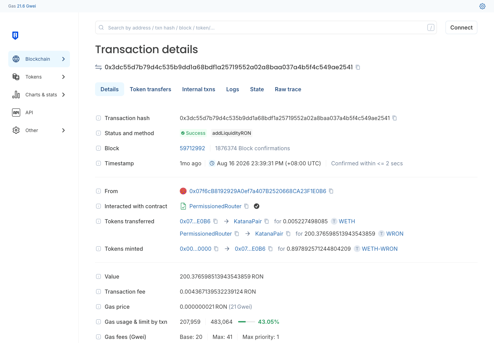
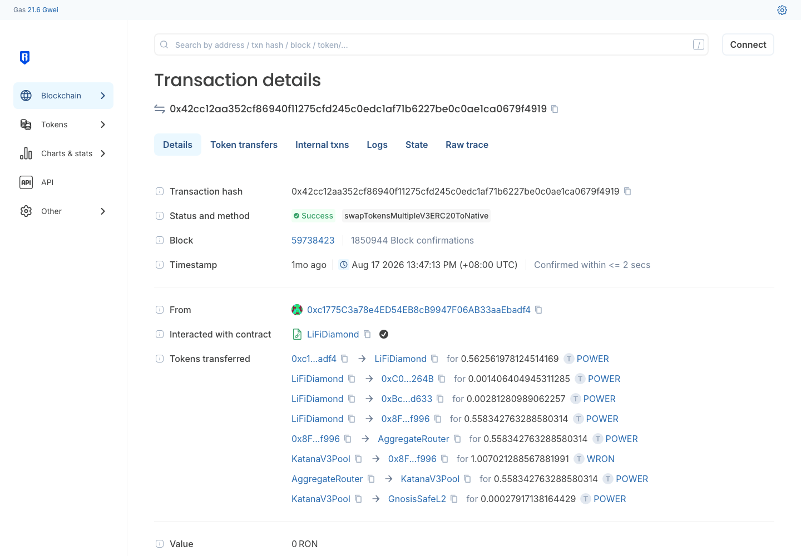
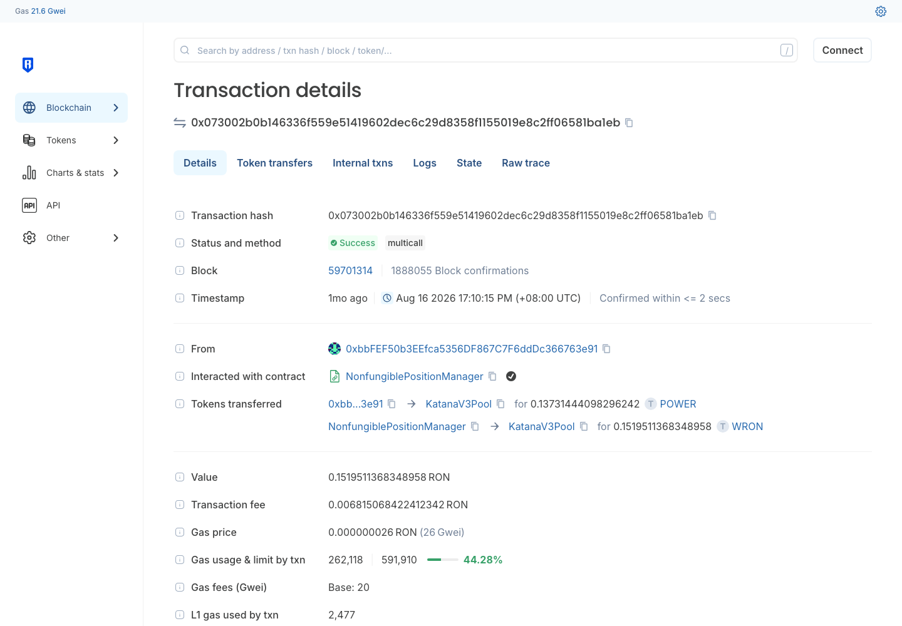
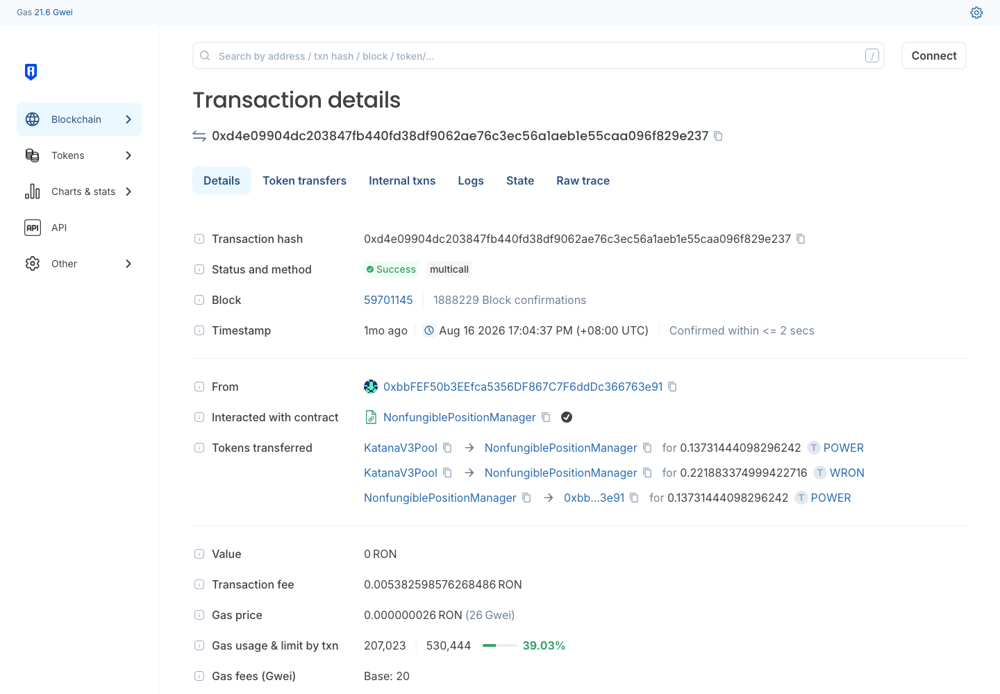

# Ronin DEX 协议汇总（Katana / Katana V3）

> **状态**：🟡 两个入选协议的 Swap / 加流动性 / 减流动性公开样本 hash 已齐（12 条，全部链上复核 status=1），浏览器交易页截图已齐；🔴 **前端被 Cloudflare 人机验证拦截，swap 页 / 流动性页截图 ⬜ 未拿到**；本人实测 ⬜ 未做
> **调研时间**：2026-09-29
> **交付口径**：覆盖页面可点击的交易类型 + 交易哈希 + 截图 + 背景信息；**不做链上深度解析（解析由解析同学做）**
> **链**：**Ronin**，chainId **2020**
> **样本来源**：⚠️ 全部 hash 来自**链上公开交易，非本人钱包**
> **来源**：Confluence「各链协议调研」Ronin 子页 pageId=**610323212**（hash 与覆盖率数据照搬该页）

## 0. 一句话结论

Ronin 链上只有 **2 个** DEX 协议，全部入选：**Katana**（V2 恒定乘积，交易量占比 67.1%）+ **Katana V3**（集中流动性，32.9%），入选交易量覆盖率 **100.0%**（Confluence 快照，GeckoTerminal 口径；⚠️ 子页未写快照日期，hash 采于 2026-08-15 ~ 08-17）。链级 **OKX 支持、Ave 支持**；协议级两者都是 **Ave 支持 = 是、OKX 支持 = 否**。两个版本共用同一个前端 `app.roninchain.com`（Ronin 官方 App 内置的 Katana）。

## 1. 链基础信息

| 字段 | 值 |
|------|-----|
| 链 | Ronin（Sky Mavis 为 Axie Infinity 生态打造的 EVM 链） |
| chainId | **2020** |
| 原生币 | **RON**（18 位）；包装币 WRON |
| 公共 RPC | `https://api.roninchain.com/rpc`（2026-09-29 实测 `eth_chainId`=0x7e4 ✅） |
| 区块浏览器 | https://app.roninchain.com （Confluence 链接用 `app.roninchain.com/tx/`）｜ 备用 https://explorer.roninchain.com |
| 链 TVL | **$11,865,395**（DefiLlama `/v2/chains`，2026-09-29 快照） |
| 链总日交易量 | $758,272（Confluence 快照） |
| DexScreener / GeckoTerminal | 是（slug=ronin）/ 是（slug=ronin） |
| OKX / Ave 链级支持 | 是 / 是 |

⚠️ `app.roninchain.com` 全站（含 `/tx/`、`/swap`）对自动化浏览器弹 Cloudflare「Verify you are human」，所以交易页截图改用 **explorer.roninchain.com/tx/**（内容一致，能正常渲染）。

### 1.1 协议覆盖率（照搬 Confluence）

| 协议 | 日交易量(USD) | 占比 | 累计 | 是否入选 | 理由 |
|------|------|------|------|:---:|------|
| Katana | 508,506.10 | 67.1% | 67.1% | ✅ | Ave 支持 + 交易量覆盖 |
| Katana V3 | 249,766.04 | 32.9% | 100.0% | ✅ | Ave 支持 + 交易量覆盖 |

---

## 2. Katana（V2）

### 2.1 基础信息

| 字段 | 值 |
|------|-----|
| 协议类型 | **V2**（恒定乘积 AMM，LP 凭证为 ERC-20，如 `WETH-WRON` LP） |
| 官网 | https://app.roninchain.com/swap |
| **操作入口** | https://app.roninchain.com/swap （DefiLlama 登记为 `https://app.roninchain.com/swap#/swap`）｜ 流动性页 ⚠️ 待查（Cloudflare 拦截，无法读导航） |
| 前端链 | 前端只服务 Ronin，不用切链 |
| Factory | `0xb255d6a720bb7c39fee173ce22113397119cb930`（示例池 `factory()` 链上读出） |
| Router（LP 交易的 to） | `0xc05afc8c9353c1dd5f872eccfacd60fd5a2a9ac7`（浏览器标签 **PermissionedRouter**，方法 `addLiquidityRON` / `removeLiquidityRON`） |
| 示例 pool | `0x2ecb08f87f075b5769fe543d0e52e40140575ea7`（WETH/WRON） |
| Ave / OKX | 是 / 否 |
| 交易量占比 | 67.1%（日量 $508,506.10 / 日交易 9,932 笔 / TVL $9,395,382.58，GeckoTerminal） |
| DefiLlama | slug `katana-dex`（父协议 `Katana Ronin Dex`），TVL **$9,989,786**（2026-09-29） |

### 2.2 协议背景

Katana 是 Ronin 链的原生 DEX，由 Axie Infinity 背后的 Sky Mavis 团队运营，DefiLlama 于 2021-11 收录，是 Ronin 上 AXS / SLP / RON / WETH 等游戏代币的主要交易场所。它不单独部署官网，直接集成在 Ronin 官方 App（`app.roninchain.com`）里。V2 与后来的 V3 并存，DefiLlama 把两者归在同一个父协议下。

### 2.3 操作清单（页面可点击）

| # | 交易类型 | 入口 |
|---|---------|------|
| 1 | **Swap** | https://app.roninchain.com/swap |
| 2 | **加流动性** | App 内 Liquidity / Pool 页（⚠️ 具体 URL 待查） |
| 3 | **减流动性** | 同上 → 我的仓位 → Remove |
| 4 | Farm / 激励 | ⚠️ 待查（前端打不开，无法确认是否有 farm 入口） |

### 2.4 公开样本交易（⚠️ 非本人钱包）

| 交易类型 | tx hash | 截图 |
|---------|---------|------|
| Swap | [0xc2f2919f389f384fc9d721dcccea39b27c89bd28b2d7d74ed116f062c265993b](https://app.roninchain.com/tx/0xc2f2919f389f384fc9d721dcccea39b27c89bd28b2d7d74ed116f062c265993b) | `Katana-Ronin-swap交易-20260929.png` |
| Swap | [0x15b9f72966e427a0e06db7f88090140107ff500affdb40832260f2c24d01ba8f](https://app.roninchain.com/tx/0x15b9f72966e427a0e06db7f88090140107ff500affdb40832260f2c24d01ba8f) | — |
| Swap | [0x79604df938bc65e333e11150a06fb30da725a37145b00724645575d2d28c96f2](https://app.roninchain.com/tx/0x79604df938bc65e333e11150a06fb30da725a37145b00724645575d2d28c96f2) | — |
| Swap | [0x079283290029bd028ac3f6ab15cf4023a2015aa938c8fbc8e7f364ca453e36a7](https://app.roninchain.com/tx/0x079283290029bd028ac3f6ab15cf4023a2015aa938c8fbc8e7f364ca453e36a7) | — |
| 加流动性 | [0x3dc55d7b79d4c535b9dd1a68bdf1a25719552a02a8baa037a4b5f4c549ae2541](https://app.roninchain.com/tx/0x3dc55d7b79d4c535b9dd1a68bdf1a25719552a02a8baa037a4b5f4c549ae2541) | `Katana-Ronin-加流动性交易-20260929.png` |
| 减流动性 | [0xd29e625f2549f594171763f435bf6f2b92ae8b21e24d974b247ac0c33fce9569](https://app.roninchain.com/tx/0xd29e625f2549f594171763f435bf6f2b92ae8b21e24d974b247ac0c33fce9569) | `Katana-Ronin-减流动性交易-20260929.png` |

📌 样本备注：Swap 样本 3 笔 `to` = `0x3b3adf14…3fe3`（浏览器标签 **MarketGateway**），1 笔 = `0x21a0a1c0…e0bc`；首条样本里还带一笔 Axie Consumable Item（NFT）转账，说明 Ronin 上不少 swap 是游戏 / 市场合约顺带发起的，不是用户直接点 Katana 前端。加 / 减流动性走 PermissionedRouter。

### 2.5 操作覆盖

| 交易类型 | 公开样本 hash | 截图 | 备注 |
|---------|--------------|:---:|------|
| Swap | ✅ 4 条 | 🟡 仅交易页；swap 页 ⬜ | 前端被 Cloudflare 拦截 |
| 加流动性 | ✅ 1 条 | 🟡 仅交易页；流动性页 ⬜ | 同上 |
| 减流动性 | ✅ 1 条 | ✅ 交易页 | |
| Farm / 激励 | ⬜ | ⬜ | ⚠️ 待确认页面是否有该类型 |

### 2.6 截图

| 文件 | 内容 |
|------|------|
|  | app.roninchain.com/swap 返回 Cloudflare 人机验证页（证明截图缺口原因） |
|  | 交易详情，Interacted with MarketGateway，WRON ⇄ WETH 经 KatanaPair |
|  | 方法 addLiquidityRON，PermissionedRouter，铸造 WETH-WRON LP |
|  | 方法 removeLiquidityRON，销毁 WETH-WRON LP |

---

## 3. Katana V3

### 3.1 基础信息

| 字段 | 值 |
|------|-----|
| 协议类型 | **V3 / CLMM**（集中流动性，示例池 `fee()`=3000；LP 凭证为 NFT，经 NonfungiblePositionManager） |
| 官网 | https://app.roninchain.com/swap |
| **操作入口** | https://app.roninchain.com/swap ｜ ⚠️ V3 与 V2 **共用同一前端，无独立 URL**；V3 池 / 仓位在前端哪个页面区分待查（Cloudflare 拦截） |
| Factory | `0x1f0b70d9a137e3caef0ceacd312bc5f81da0cc0c`（示例池 `factory()` 链上读出） |
| NonfungiblePositionManager（LP 交易的 to） | `0x7cf0fb64d72b733695d77d197c664e90d07cf45a`（浏览器标签 NonfungiblePositionManager，方法 `multicall`） |
| 示例 pool | `0xe8f17a4c9f9c5bef3b807e6e69801ead0be41e67`（POWER/WRON，0.3%） |
| Ave / OKX | 是 / 否 |
| 交易量占比 | 32.9%（日量 $249,766.04 / 日交易 10,369 笔 / TVL $2,479,766.10，GeckoTerminal） |
| DefiLlama | slug `katana-dex-v3`，TVL **$1,734,728**（2026-09-29），DefiLlama 于 2025-03 收录 |

### 3.2 协议背景

Katana V3 是 Katana 的集中流动性版本，DefiLlama 于 2025-03 收录，与 V2 同属 `Katana Ronin Dex` 父协议、共用 Ronin App 前端。LP 仓位是 NFT，按价格区间提供流动性。V3 交易笔数（日 10,369 笔）已超过 V2，但单笔金额较小，日交易量约为 V2 的一半。

### 3.3 操作清单（页面可点击）

| # | 交易类型 | 入口 |
|---|---------|------|
| 1 | **Swap** | https://app.roninchain.com/swap （路由自动选 V2 / V3 池） |
| 2 | **加流动性**（开 NFT 仓位） | App 内 Liquidity / Pool 页 → 新建 V3 仓位（⚠️ URL 待查） |
| 3 | **减流动性** | 仓位详情 → Remove |
| 4 | 收手续费（Collect） | 仓位详情（V3 常规功能，⚠️ 待确认） |

### 3.4 公开样本交易（⚠️ 非本人钱包）

| 交易类型 | tx hash | 截图 |
|---------|---------|------|
| Swap | [0x42cc12aa352cf86940f11275cfd245c0edc1af71b6227be0c0ae1ca0679f4919](https://app.roninchain.com/tx/0x42cc12aa352cf86940f11275cfd245c0edc1af71b6227be0c0ae1ca0679f4919) | `KatanaV3-Ronin-swap交易-20260929.png` |
| Swap | [0xe2eb39a1f25d63dee3c3ceeb23c253d7ff3215ef45792ba719fe856cd72dc10a](https://app.roninchain.com/tx/0xe2eb39a1f25d63dee3c3ceeb23c253d7ff3215ef45792ba719fe856cd72dc10a) | — |
| Swap | [0x18cde454076f73f4ddc1dcae59227477d0157e5908d9299c7371c7cb95ddfe9f](https://app.roninchain.com/tx/0x18cde454076f73f4ddc1dcae59227477d0157e5908d9299c7371c7cb95ddfe9f) | — |
| Swap | [0xc29c7306897f2ad91bb138750f17db6c400c57ab3b500ed5026714eef1f93b8c](https://app.roninchain.com/tx/0xc29c7306897f2ad91bb138750f17db6c400c57ab3b500ed5026714eef1f93b8c) | — |
| 加流动性 | [0x073002b0b146336f559e51419602dec6c29d8358f1155019e8c2ff06581ba1eb](https://app.roninchain.com/tx/0x073002b0b146336f559e51419602dec6c29d8358f1155019e8c2ff06581ba1eb) | `KatanaV3-Ronin-加流动性交易-20260929.png` |
| 减流动性 | [0xd4e09904dc203847fb440fd38df9062ae76c3ec56a1aeb1e55caa096f829e237](https://app.roninchain.com/tx/0xd4e09904dc203847fb440fd38df9062ae76c3ec56a1aeb1e55caa096f829e237) | `KatanaV3-Ronin-减流动性交易-20260929.png` |

📌 样本备注：首条 Swap 的 `to` = `0x452cf1b8…d8d1`（浏览器标签 **LiFiDiamond**，跨链聚合器，方法 `swapTokensMultipleV3ERC20ToNative`），第 2 笔同为该地址，另 2 笔分别是 `0x5191e003…1914`、`0x5f0acdd3…76bd`，都不是 Katana 自己的前端路由。加 / 减流动性由同一地址 `0xbbFEF50b…63e91` 在 2026-08-16 前后几分钟内完成。

### 3.5 操作覆盖

| 交易类型 | 公开样本 hash | 截图 | 备注 |
|---------|--------------|:---:|------|
| Swap | ✅ 4 条 | 🟡 仅交易页；swap 页 ⬜ | 前端被 Cloudflare 拦截 |
| 加流动性 | ✅ 1 条 | 🟡 仅交易页；流动性页 ⬜ | 同上 |
| 减流动性 | ✅ 1 条 | ✅ 交易页 | |
| Collect 手续费 | ⬜ | ⬜ | ⚠️ 待确认页面是否单独提供 |

### 3.6 截图

| 文件 | 内容 |
|------|------|
|  | 交易详情，LiFiDiamond 路由经 KatanaV3Pool（POWER → RON） |
|  | NonfungiblePositionManager `multicall`，POWER + WRON 进 KatanaV3Pool |
|  | NonfungiblePositionManager `multicall`，POWER + WRON 从池子取回 |

---

## 4. 待办 / 缺口

| # | 事项 | 说明 |
|---|------|------|
| 1 | 🔴 **前端 swap 页 / 流动性页截图（V2、V3 共 4 张）** | `app.roninchain.com` 对自动化浏览器弹 Cloudflare 人机验证，需要用户在本地浏览器手动截图 |
| 2 | 流动性页 URL、V3 仓位入口 | 同上，读不到前端导航，⚠️ 待用户打开页面确认后补进「操作入口」 |
| 3 | Farm / Collect 等其他交易类型 | 前端打不开，无法确认页面是否存在，待确认 |
| 4 | Confluence 子页没写快照日期 | 覆盖率数据的日期 ⚠️ 待查（hash 采集时间为 2026-08-15 ~ 08-17） |
| 5 | 本人实测 | 本页全是公开样本，本人钱包 ⬜ 未做 |
