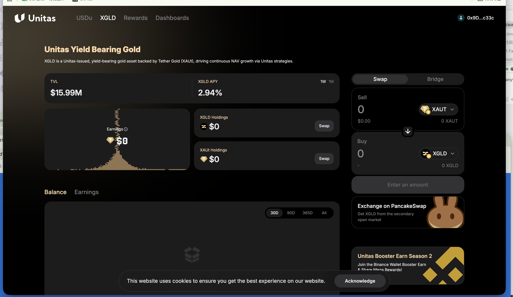

# Unitas — XGLD 收益型黄金

> **状态**：✅ 已确认接入（六维度中 4 项已完成）｜ 接入情况：Earn 已接
> **调研时间**：2026-07-31 ｜ **解析类型**：A（NAV 累积）
> **调研质量**：中高（有官方 docs + 多方媒体，但存在链部署口径冲突）

## 0. 一句话结论

XGLD = **拿 XAUt（Tether Gold）去做 delta 中性套利**的收益型黄金：用户存 XAUt 铸 XGLD，协议把 XAUt 作抵押**按最高 70% LTV 借出稳定币**去跑中性策略，收益体现在 XGLD 的 NAV 增长上——所以它是"**黄金价格敞口 + 杠杆借贷收益**"的组合，**70% LTV 偏激进是它最需要披露的风险**。

## 1. 基础信息（Master CSV 口径）

| 字段 | 值 |
|------|-----|
| 协议 | Unitas（Unitas Labs） |
| 链 | BNB Chain |
| Supply Coins | **XAUT**（注意：不是稳定币，是代币化黄金） |
| Coins Integrated | XGLD |
| 池子 TVL | 100k |
| 收益率 | 3% |
| 类别 | Gold |
| 产品 | Unitas Gold (XGLD) |
| 池子类别 | 活期 |
| 产品网页 | https://evm.unitas.so/xgld |
| DD 文档 | `黄金xGLD2026/06` |
| 预算 / POC | $300,000 / Cece ｜ 执行：预算 + 合约 |
| 接入情况 | **Earn 已接入** |
| 六维度现状 | 实时解析 ✅ ／交易历史 ✅ ／池子自发现 ✅ ／APY ✅ ／NAV 历史 ⬜ ／PNL ⬜ |

## 2. 协议背景

- **Unitas Labs** 自称"链上金融的收益基础设施协议"，核心是**一组 delta 中性策略**：资本部署在多个市场中性头寸上，从交易活动、资金费率、协议费里赚收益，**不承担方向性敞口**
- **前作**：团队先做了合成美元 **USDu** 和其收益版 **sUSDu**；XGLD 直接沿用这套架构（把标的从美元换成黄金）
- **部署时间线**：2026-02 底原生部署 BNB Chain → 2026-03-26 Tether Gold(XAUt) 登陆 BNB Chain → **2026-06-03 XGLD 在 BNB Chain 上线**
- **规划**：通过 LayerZero 扩到 Base（无确定时间表）
- ⚠️ **口径冲突**：有一篇报道称 XGLD 发行在 Ethereum，与 BNB Chain 上线的多方报道冲突。**以官方 docs.unitas.so 与 CSV（BNB）为准**

## 3. 底层资产（Underlying）

```
用户 XAUt（1 XAUt = 1 金衡盎司实物黄金，存于瑞士金库，Tether 发行）
  └─ 存入 Unitas → 铸 XGLD（1:1 全额抵押）
       └─ 协议以 XAUt 为抵押，按最高 70% LTV 借出稳定币
            └─ 稳定币投入 delta 中性策略赚收益 → 收益回流 XGLD 持有人
```

**关键点**：**协议不直接持有实物金块**，持有的是代币化黄金衍生品（XAUt）。用户实际承担 **Tether 的黄金托管信用 + Unitas 的策略风险** 两层。

## 4. 收益来源（Yield Source）

| 收益腿 | 说明 |
|--------|------|
| delta 中性套利（主） | 资金费率、交易活动、协议费；无方向性敞口 |
| 黄金价格 | 不是"收益"，但 XGLD 本身带黄金价格敞口，用户的美元计价 PNL 里包含金价涨跌 |

**分发方式**：官方两种表述都出现过——"收益体现在 XGLD 的 **NAV 增长**"与"收益**按比例定期分配**给持有人"。⚠️ 需确认是 NAV 累积还是定期派发（见 9.1），**这直接决定 PNL 公式**。

## 5. 链上机制与凭证代币

> ✅ **2026-08-02 产品页截图确认。完整记录见 [../03-参考/已确认合约地址与链上实测.md](../03-参考/已确认合约地址与链上实测.md)**

### 产品页截图（2026-08-02，XGLD）



**截图上要看的点**：

| 位置 | 内容 | 意义 |
|------|------|------|
| 页面副标题原文 | 🔴 "XGLD is a Unitas-issued, yield-bearing gold asset backed by Tether Gold (XAUt), driving **continuous NAV growth** via Unitas strategies" | ✅ **确认 NAV 累积型、无定期派发** —— 原疑点解决，PNL 用净值差公式 |
| **TVL** | 🔴 **$15.99M** | **CSV 写 100k，差约 160 倍** —— 主表严重过期，会误导排期优先级 |
| **XGLD APY** | **2.94%**（可切 1W / 1M） | CSV 写 3% ✅ |
| 右侧 Swap 面板 | **Sell `XAUT` → Buy `XGLD`** | ✅ 确认申购币种是 XAUT 不是稳定币，CSV 正确 |
| 🔴 PancakeSwap 卡片 | "Exchange on PancakeSwap — **Get XGLD from the secondary open market**" | ⚠️ 用户可能从二级买入 → **成本基准不能只看 mint 事件**，要用实际成交价 |
| 🔴 右下角 Banner | **"Unitas Booster Earn Season 2 — Join the Binance Wallet Booster Earn & Share Mega Rewards!"** | 🔴 **已与 Binance Wallet 有联合活动** → 这就是 PRD **Campaign Bonus** 字段的现实来源，需和运营对齐奖励数据来源 |
| 左侧 | Earnings 卡片 ｜ **Balance / Earnings** 两个 tab，范围 30D / 90D / 365D / All | 有历史数据，可能有 API |
| 顶部导航 | USDu / **XGLD** / Rewards / Dashboards ｜ 右侧面板有 **Bridge** | 有 Rewards 页；Bridge 说明未来可能扩链 |

**✅ 疑点已解决**

| 项 | 我原先的疑点 | 实际（产品页原文） |
|----|------------|-----------------|
| 收益是 NAV 累积还是定期派发 | ⚠️ 官方两种表述并存，**决定 PNL 公式** | ✅ **确认 NAV 累积**。页面原文："XGLD is a Unitas-issued, yield-bearing gold asset backed by Tether Gold (XAUt), driving **continuous NAV growth** via Unitas strategies" |

| 项 | 内容（2026-08-02 产品页） |
|----|------|
| 凭证代币 | XGLD（BNB Chain） |
| ✅ **合约地址（BNB Chain）** | **`0xe60106a5cAb7e7C64830919d36Ab20CaAf50Ac91`**（2026-08-03 BSC 实测 `symbol()`="XGLD"、`name()`="Unitas Gold"） |
| 🔴 **decimals** | **6**（不是 18） |
| 实测供应量 | **3,775.571480 XGLD** |
| 是否 ERC-4626 | ❌ **不是**（`asset()` / `convertToAssets()` revert）→ NAV 链上取数入口待确认 |
| 🎯 **交叉验证** | 3,775.57 XGLD ÷ 产品页 TVL $15.99M → 隐含单价 **≈$4,235** ≈ 一金衡盎司金价<br>→ **推断 1 XGLD ≈ 1 XAUt ≈ 1 盎司**（不像 XAUE 那样 1:1000 拆细）<br>→ 🔴 **价格源必须配黄金（XAU/XAUt），不能按 1 XGLD ≈ $1 处理** |
| ✅ **真实申购 hash** | `0x5a9c4bc2ad7215045daffe12990d2f0c88b37af1a93d587ffd028cff37677e30`（0.298432 XGLD）<br>`0xb31d83868885ce81582f509bb34ee85eee9cc08d5cd3976614bf714fc4e65e17`（0.510665 XGLD）<br>⚠️ 两笔接收方同为 `0x0a4db057…`，大概率是 router/做市商而非散户 |
| 铸造 | ✅ **Swap 面板：Sell XAUT → Buy XGLD**，确认申购币种是 XAUT 不是稳定币，CSV 正确 |
| 收益表达 | ✅ **continuous NAV growth**（A 类，无派发） |
| **XGLD APY** | **2.94%**（页面可切 1W / 1M）（CSV 写 3% ✅） |
| **TVL** | 🔴 **$15.99M** —— **CSV 写的是 100k，差约 160 倍**，CSV 严重过期 |
| ⚠️ **二级市场** | 页面直接推荐 **"Exchange on PancakeSwap — Get XGLD from the secondary open market"**<br>→ 用户可能从二级买入，**成本基准不能只从 mint 事件推**，要用实际成交价 |
| 🔴 **活动** | 页面挂着 **"Unitas Booster Earn Season 2 — Join the Binance Wallet Booster Earn & Share Mega Rewards!"**<br>→ **已经和 Binance Wallet 有联合活动**，这就是 PRD **Campaign Bonus** 字段的现实来源，需和运营对齐奖励数据从哪来 |
| 页面还有 | **Balance / Earnings** 两个 tab（30D/90D/365D/All）→ 有历史数据，可能有 API ｜ **Bridge** 功能（未来可能扩链）｜ USDu 产品线 ｜ Rewards 页 |
| 赎回 | 活期；⚠️ 时效仍待确认（需先解开借贷头寸，可能有延迟） |
| 抵押率 | **最高 70% LTV**（借稳定币） |

## 6. 数据接入要点（对齐 PRD）

### 6.1 六维度自评

| 维度 | 可行性 | 取数方式 | 备注 |
|------|:---:|---------|------|
| 实时解析 | ✅ **已完成** | XGLD balance × NAV | 已跑通 |
| 交易历史解析 | ✅ **已完成** | mint / redeem 事件 | 已跑通 |
| 池子自发现 | ✅ **已完成** | | 已跑通 |
| APY | ✅ **已完成** | | 已跑通 |
| NAV 历史 | ⬜ **待做** | 天级打点 | ⚠️ **注意双重计价问题，见 6.2** |
| PNL | ⬜ **待做** | 天级快照 | ⚠️ **本协议 PNL 最容易做错** |

### 6.2 关键取数口径（⚠️ 双计价单位问题）

XGLD 的价值有**两层**：

```
XGLD 的美元价值 = XGLD 数量 × (每 XGLD 对应的 XAUt 数量) × (XAUt 的美元价格)
                                └── 这才是"收益"(NAV 增长) ──┘   └── 金价波动 ──┘
```

- **PRD 明确「本期 PnL 仅展示 USD 本位收益，不展示币本位」** → 那么 XGLD 的 USD PNL 里会**混入金价涨跌**。金价跌 5%、策略赚 0.25%，用户看到的是**负收益**
- 这正是 PRD 4.4.4 里说的"NAV Growth 类产品，NAV 下跌时可能为负"的典型场景，**但归因不同**：这里的负值来自**金价**，不是策略亏损
- 🔴 **建议**：详情页对 XGLD（及其他黄金/非美元本位产品）**额外说明"收益以黄金计价，美元 PNL 含金价波动"**，否则客诉风险高
- **NAV 打点建议同时存**：① 每 XGLD 兑 XAUt 比率（真收益）② XAUt/USD 价格（金价）——分开存才能做归因

### 6.3 需向项目方索取

1. XGLD 合约地址 + NAV 取数函数
2. **收益是 NAV 累积还是定期派发**（决定 PNL 公式）
3. 赎回时效与是否需要解杠杆等待
4. 历史 NAV / 兑换比率数据（2026-06-03 上线起）
5. 当前实际 LTV 与清算管理机制（官方未公开披露）
6. Base 部署计划（是否需要提前准备多链解析）

## 7. 风险（Risk）

1. **金价风险**：XGLD 带完整黄金价格敞口，金价下跌时美元本位本金亏损
2. **杠杆清算风险**：**70% LTV 相对激进**（公开分析明确指出这点）。金价急跌时头寸可能更快接近清算线，而 **Unitas 未公开披露其跨策略清算风险管理方式**
3. **多层交易对手风险**（公开分析归纳的三层）：
   - 信任 Tether 维持 XAUt 的实物黄金背书
   - 信任 Unitas 合约不发生"损及锚定的清算"
   - 信任 delta 中性策略不亏到本金
4. **收益率低于风险**：3% 收益率对应 70% LTV 杠杆 + 中性策略风险，**风险收益比需在 DD 里重点看**
5. **规模小**：池子 TVL 仅 100k 量级
6. **策略不透明**："一组 delta 中性策略"具体构成未完全公开

## 8. 合规与准入（Compliance）

- ⚠️ 公开信息不足。协议为链上非托管，通常无 KYC
- 底层 XAUt 由 Tether 发行，实物黄金存瑞士金库
- 需以 `黄金xGLD2026/06` DD 为准

## 9. 待确认清单

| # | 问题 | 问谁 / 怎么查 |
|---|------|------------|
| 1 | ~~收益是 NAV 累积还是定期派发~~ → ✅ **2026-08-02 产品页确认：NAV 累积（continuous NAV growth）**，PNL 用净值差公式 | — |
| 1b | 🔴 **CSV 的 TVL 写 100k，实际 $15.99M（差 160 倍）** —— 主表数据需刷新；且这会影响优先级判断（看着 10 万 vs 实际 1600 万，结论完全不同） | Cece / Marcus（**新发现**） |
| 1c | **Binance Wallet Booster Earn Season 2 活动**的奖励数据从哪来（对应 PRD Campaign Bonus 字段） | 运营 + Marcus（**新发现**） |
| 1d | 用户可能从 **PancakeSwap 二级市场**买入 XGLD —— 成本基准怎么取（不能只看 mint 事件） | Scott/Linnea 内部定 + 报 Jackson |
| 2 | **USD 本位 PNL 会混入金价波动，前端是否需要额外说明或提供黄金本位视图** | Marcus（**优先**，客诉风险） |
| 3 | 实际 LTV 水位与清算机制 | 项目方 / DD |
| 4 | 链部署（BNB 确认；Ethereum 报道是否误传） | 项目方 |
| 5 | 「Gold」映射到后台哪个资产类型枚举（4 个枚举里没有商品类，建议 Structured Products 或申请新增） | Marcus |
| 6 | 赎回是否需解杠杆等待 | 项目方 |

## 10. 参考链接

- 官方文档：https://docs.unitas.so/
- 产品页：https://evm.unitas.so/xgld
- XGLD 上线 BNB Chain（机制 / 70% LTV / 风险分析）：https://cryptobriefing.com/unitas-labs-xgld-gold-bnb-chain/
- XGOLD 介绍（Tether Gold 背书）：https://bitcoinworld.co.in/unitas-labs-xgold-token-tether-gold/
- Unitas 协议综述（USDu / sUSDu 前作）：https://crypto-economy.com/unitas-protocol/
- 价格数据：https://www.coinbase.com/en-gb/price/unitas-gold
