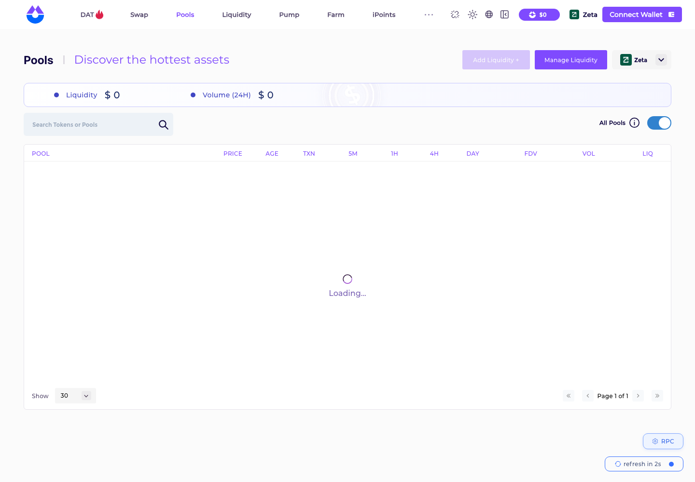

# ZetaChain 链 DEX 协议汇总（Zuno / EddyFinance / iZiSwap / DYORSwap / Zedaswap）

> **状态**：🟡 5 个协议 × 3 类核心交易（Swap / 加流动性 / 减流动性）公开样本已齐；🔴 前端可用性差：5 个协议里只有 iZiSwap 前端能打开并切到 Zeta，其余 4 个前端域名失效 / 被 Cloudflare 拦截 / 域名待售
> **调研时间**：2026-09-29
> **交付口径**：每个协议 = 需要调研的协议 + 页面操作截图 + 对应行为的交易 hash + 背景信息；**不做链上深度解析**（解析由解析同学做）
> **链**：**ZetaChain**（chainId **7000**）
> **样本来自链上公开交易，非本人钱包**（沿用 Confluence 已采 30 条，本次在 zetascan Blockscout 上逐条核验均为 `success`）
> **来源**：Confluence「各链协议调研」Zeta 子页 pageId **610323214**

## 0. 一句话结论

ZetaChain 入选 **5 / 12** 个协议，入选交易量覆盖率 **99.7%**（链总日交易量仅 **$5,458**，Confluence 子页数据，来源 GeckoTerminal）。链级 **OKX 支持 ✅ / Ave 支持 ✅**；协议级 5 个协议 **Ave 均不支持**，OKX 支持的是 EddyFinance、iZiSwap、DYORSwap、Zedaswap（Zuno 仅靠交易量入选，占 64.1%）。池型：**Zuno = Uniswap V3 分叉**，**iZiSwap = DL-AMM（离散流动性，自有合约体系）**，**EddyFinance / DYORSwap / Zedaswap = Uniswap V2 分叉**。

🔴 **本次发现**：
1. 前端大面积不可用（2026-09-29 实测）：Zuno `app.zunodex.xyz` 无 DNS 解析；EddyFinance `eddy.finance` 整个域名 NXDOMAIN；Zedaswap `zedaswap.xyz` 跳转 GoDaddy 域名待售页；DYORSwap `dyorswap.finance` 被 Cloudflare 人机验证拦截（非无头浏览器可能能进）。
2. 大部分 swap 样本的 `to` 是聚合器 / 套利合约（OKX DexRouter、Sushi RedSnwapper、MEV 合约等），不是协议自家 Router——**解析必须以 Pool 事件为准**。
3. ⚠️ 取数坑：iZiSwap / DYORSwap / Zedaswap 的 2024 年早期交易，blockpi / drpc / thirdweb 等公共 RPC 的 `eth_getTransactionReceipt` 返回 `null`（allthatnode archive 报 `LegacyTx` 解码错误），**只有 zetascan Blockscout API 能查到**。

## 1. 链基础信息

| 字段 | 值 |
|------|-----|
| 链 | **ZetaChain**（Cosmos SDK + EVM 的 Universal L1），chainId **7000** |
| 原生币 | **ZETA**（18 位）；wrapped 为 WZETA `0x5f0b1a82749cb4e2278ec87f8bf6b618dc71a8bf` |
| 公共 RPC | `https://zetachain-evm.blockpi.network/v1/rpc/public` ｜ 备用 `https://zeta-chain.drpc.org`（均实测可用，但早期 legacy 交易查不到，见 §0） |
| 区块浏览器 | **https://zetascan.com** （Blockscout；`zetachain.blockscout.com` 已 301 跳转到这里，API `https://zetascan.com/api/v2/` 可用） |
| 链 TVL | **$460,499**（DefiLlama `v2/chains`，2026-09-29） |
| Dexscreener / GeckoTerminal | 是（slug=zeta）/ 是（slug=zetachain） |
| 链级 OKX / Ave | ✅ / ✅（Confluence） |

### 协议覆盖率（照搬 Confluence 610323214）

选择规则：OKX 支持全收 + Ave 支持全收 + 按交易量降序累计覆盖 ≥90%。

| 协议 | 日交易量(USD) | 占比 | 累计占比 | 入选 | 入选理由 |
|------|------|------|------|------|------|
| Zuno | 3,496.78 | 64.1% | 64.1% | ✅ | 交易量覆盖 |
| EddyFinance | 1,842.83 | 33.8% | 97.8% | ✅ | OKX+交易量覆盖 |
| iZiSwap | 99.53 | 1.8% | 99.6% | ✅ | OKX |
| SushiSwap V3 / Beam / AbstraDEX / SushiSwap V2 | 合计 19.04 | 0.4% | 100.0% | — | — |
| DYORSwap | 0.11 | 0.0% | 100.0% | ✅ | OKX |
| Ball Exchange / Omnidrome / OcelotDex | ≈0 | 0.0% | 100.0% | — | — |
| Zedaswap | 0.00 | 0.0% | 100.0% | ✅ | OKX |

---

## 2. Zuno

### 2.1 基础信息

| 字段 | 值 |
|------|-----|
| 协议类型 | **Uniswap V3 分叉**（集中流动性），LP 凭证 ERC-721 `Uniswap V3 Positions NFT-V1` |
| 官网 | https://app.zunodex.xyz （Confluence 登记） |
| **操作入口** | ⚠️ 前端不可用：https://app.zunodex.xyz 与 https://zunodex.xyz 均**无 A 记录**（Cloudflare NS 在，但未解析，2026-09-29）；旧域名 https://app.zetaswap.com 302 跳转到 zunodex.xyz，同样打不开 |
| Factory | `UniswapV3Factory` `0x9f48ddad075e569cdc70d657d3ac171e23846009`（示例 pool 链上 `factory()` 读出） |
| NFT 仓位管理器 | `NonfungiblePositionManager` `0xaf2403dd44b3c589f12680e715a8bbeb5b4b8471` |
| 示例 pool | `0x999a3e9a2cb64f359f581afa0335bf4343622d1f`（USDC.ETH/WZETA，fee 0.3%，tickSpacing 60） |
| Router | ⚠️ 待查（前端打不开无法确认）；4 条 swap 样本均为套利合约 `0x00000000002587bccad62a248c27e892d1f1bcb3` 发起（同一笔里经 UniswapV3Pool + Uniswap V2 池互换） |
| Ave / OKX | 否 / 否 |
| 日交易量占比 | 64.1%（$3,496.78/日，TVL $58,505.93，GeckoTerminal） |
| DefiLlama | `zuno`，ZetaChain TVL 仅 **$52**（2026-09-29，与 GeckoTerminal 的 $58.5K 差异极大，⚠️ 待核）；收录 2025-08-22；Twitter @zuno_dex |

### 2.2 协议背景

Zuno 定位为 ZetaChain 的"原生流动性层 / Universal DEX"，宣传支持 AMM V2/V3、Curve 式、单边与私有 PMM 池，主打跨 Bitcoin / EVM / Solana 的原生资产互换。从 `app.zetaswap.com → zunodex.xyz` 的跳转看，疑为原 ZetaSwap（ZetaChain 上的 PMM 聚合 DEX）更名而来（⚠️ 未经官方确认）。

### 2.3 操作清单

| # | 操作 | 说明 |
|---|------|------|
| 1 | Swap | ⚠️ 前端打不开，无法确认页面入口 |
| 2 | 加流动性（V3 开仓） | 同上 |
| 3 | 减流动性 | 同上 |

### 2.4 公开样本交易

| 交易类型 | 时间 (UTC) | tx hash | 截图 |
|---------|-----------|---------|------|
| Swap | 2026-08-16 07:21 | [`0x27d0f04c26241d0d19843a95ff0bc6a5c8c55d0f18122e45a6bf687faa43754b`](https://zetascan.com/tx/0x27d0f04c26241d0d19843a95ff0bc6a5c8c55d0f18122e45a6bf687faa43754b) | `Zuno-Zeta-swap交易-20260929.png` |
| Swap | 2026-08-16 07:21 | [`0x6f12badd7457e71f3f54dde24aeb05b179214e2f243145824cfaa7a2adc658d7`](https://zetascan.com/tx/0x6f12badd7457e71f3f54dde24aeb05b179214e2f243145824cfaa7a2adc658d7) | — |
| Swap | 2026-08-16 07:21 | [`0xb2fcb6fa896c534f4346acc10ae8da6d7de1d3230202e48534b42a68d7c84d52`](https://zetascan.com/tx/0xb2fcb6fa896c534f4346acc10ae8da6d7de1d3230202e48534b42a68d7c84d52) | — |
| Swap | 2026-08-16 07:21 | [`0x32ea0172d6f54f540ab2147d701e1272ab68cf08c009047f442a021953523129`](https://zetascan.com/tx/0x32ea0172d6f54f540ab2147d701e1272ab68cf08c009047f442a021953523129) | — |
| 加流动性 | 2026-01-25 02:22 | [`0xef7be47db89166c819d47bef999861c1637a0cfd10fce858b793b2828d9a06a8`](https://zetascan.com/tx/0xef7be47db89166c819d47bef999861c1637a0cfd10fce858b793b2828d9a06a8) | `Zuno-Zeta-加流动性交易-20260929.png` |
| 减流动性 | 2026-06-02 14:09 | [`0x8445e13529fe14a12e92a88bd736b620f2e56cfe227f2c7389c8fe4b2e59fa83`](https://zetascan.com/tx/0x8445e13529fe14a12e92a88bd736b620f2e56cfe227f2c7389c8fe4b2e59fa83) | `Zuno-Zeta-减流动性交易-20260929.png` |

### 2.5 操作覆盖

| 交易类型 | 公开样本 hash | 截图 | 备注 |
|---------|--------------|:---:|------|
| Swap | `0x27d0f04c…` 等 4 条 | 🟡 交易详情 ✅ / 前端 ⬜ | 样本均为套利合约发起，非前端用户交易 |
| 加流动性 | `0xef7be47d…` | 🟡 交易详情 ✅ / 前端 ⬜ | NFT 管理器 `mint` |
| 减流动性 | `0x8445e135…` | ✅ 交易详情 | `multicall`：Burn 非零 + DecreaseLiquidity + Collect |

---

## 3. EddyFinance

### 3.1 基础信息

| 字段 | 值 |
|------|-----|
| 协议类型 | **Uniswap V2 分叉**（示例 pool 为 `UniswapV2Pair`）；DefiLlama 另登记 EddyFinance V3 与 StableSwap |
| 官网 | https://app.eddy.finance/swap （Confluence 登记）；文档 https://docs.eddy.finance |
| **操作入口** | ⚠️ 前端不可用：**`eddy.finance` 整个域名 NXDOMAIN**（app. / docs. 均无法解析，2026-09-29） |
| Factory | `UniswapV2Factory` `0x9fd96203f7b22bcf72d9dcb40ff98302376ce09c` |
| Router | `UniswapV2Router02` `0x2ca7d64a7efe2d62a725e2b35cf7230d6677ffee`（加/减流动性样本直连） |
| 示例 pool | `0x16ef1b018026e389fda93c1e993e987cf6e852e7`（WZETA/ETH.ETH） |
| Ave / OKX | 否 / 是 |
| 日交易量占比 | 33.8%（$1,842.83/日，TVL $9,086.25） |
| DefiLlama | `eddyfinance-amm` ZetaChain TVL **$101,923**；`eddyfinance-v3` $6,434；`eddyfinance-stableswap` $302（2026-09-29）；AMM 收录 2024-02-09；Twitter @eddy_protocol |

### 3.2 协议背景

EddyFinance 自称 ZetaChain 上"首个原生资产全链（Omnichain）DEX"，主打把 BTC 等原生资产通过 ZetaChain 直接互换、无需桥（ZetaChain 官方博客有专文介绍）。产品线包括 V2 AMM、V3、StableSwap。当前官网域名已失效，但链上池子仍有交易（swap 样本来自 2026-08）。

### 3.3 操作清单

| # | 操作 | 说明 |
|---|------|------|
| 1 | Swap | ⚠️ 前端不可用 |
| 2 | 加流动性 | ⚠️ 前端不可用 |
| 3 | 减流动性 | ⚠️ 前端不可用 |

### 3.4 公开样本交易

| 交易类型 | 时间 (UTC) | tx hash | 截图 |
|---------|-----------|---------|------|
| Swap | 2026-08-17 03:06 | [`0xd148d9b58599babb1911ad94da90e4882fef94734cbed8e9c90da474dcac9d20`](https://zetascan.com/tx/0xd148d9b58599babb1911ad94da90e4882fef94734cbed8e9c90da474dcac9d20) | `EddyFinance-Zeta-swap交易-20260929.png` |
| Swap | 2026-08-17 05:06 | [`0x48cab76b2f9cf93701c9bee9fb8cf242a2679122fdedb6422cabf80d79cd8a58`](https://zetascan.com/tx/0x48cab76b2f9cf93701c9bee9fb8cf242a2679122fdedb6422cabf80d79cd8a58) | — |
| Swap | 2026-08-17 05:16 | [`0x624344ada412a980b12eb9e87f7ba43ff3eedb05966ef0fed0b06be083a8b163`](https://zetascan.com/tx/0x624344ada412a980b12eb9e87f7ba43ff3eedb05966ef0fed0b06be083a8b163) | — |
| Swap | 2026-08-16 20:54 | [`0xe5ba85d248413bef3bed664cbffb6f7ca2bc583c13544bd502dd42be358e83a9`](https://zetascan.com/tx/0xe5ba85d248413bef3bed664cbffb6f7ca2bc583c13544bd502dd42be358e83a9) | — |
| 加流动性 | 2024-03-02 12:34 | [`0x87370cce497389b6c08b1f4658ebe81fa7d80929e2502027c0cf7c1971326759`](https://zetascan.com/tx/0x87370cce497389b6c08b1f4658ebe81fa7d80929e2502027c0cf7c1971326759) | `EddyFinance-Zeta-加流动性交易-20260929.png` |
| 减流动性 | 2026-08-17 03:43 | [`0xe6c2a69c3ddf6c92c42821c4096e586f883cbb90a861943e58626568328d53d8`](https://zetascan.com/tx/0xe6c2a69c3ddf6c92c42821c4096e586f883cbb90a861943e58626568328d53d8) | `EddyFinance-Zeta-减流动性交易-20260929.png` |

swap 样本入口：`0xd148…` 经 Sushi `RedSnwapper`（`snwapMultiple`），`0x48ca…` / `0x6243…` 经 OKX `DexRouter`（`unxswapTo`），`0xe5ba…` 经未验证合约 `0x9201cd65…5b07`——全是聚合器路由。

### 3.5 操作覆盖

| 交易类型 | 公开样本 hash | 截图 | 备注 |
|---------|--------------|:---:|------|
| Swap | `0xd148d9b5…` 等 4 条 | 🟡 交易详情 ✅ / 前端 ⬜ | 前端域名失效 |
| 加流动性 | `0x87370cce…` | 🟡 交易详情 ✅ / 前端 ⬜ | `addLiquidityETH` |
| 减流动性 | `0xe6c2a69c…` | ✅ 交易详情 | `removeLiquidity` |

---

## 4. iZiSwap

### 4.1 基础信息

| 字段 | 值 |
|------|-----|
| 协议类型 | **DL-AMM（Discretized-Liquidity AMM，离散集中流动性）**，iZUMi 自研，非 Uniswap 分叉；LP 凭证 ERC-721 `iZiSwap Liquidity NFT` |
| 官网 | https://izumi.finance |
| **操作入口** | **Swap**：https://izumi.finance/trade/swap ｜ **Pools（含 Add / Manage Liquidity）**：https://izumi.finance/trade/pools ｜ ⚠️ URL 参数无法指定链（`?chainId=7000`、`?chain=zetachain` 均无效，默认 Linea），需点右上链选择器 → 展开 → 选 **Zeta** |
| Factory | `0x8c7d3063579bdb0b90997e18a770eae32e1ebb08`（示例 pool 链上 `factory()` 读出，浏览器未命名） |
| Liquidity NFT（仓位管理） | `0x2db0afd0045f3518c77ec6591a542e326befd3d7` |
| Swap 路由 | `Swap` `0x34bc1b87f60e0a30c0e24fd7abada70436c71406`（样本 `0xf65d…` 直连） |
| 示例 pool | `0x244D9FA157FA84eE1aF3c10e279c42578a4B1a4a`（`iZiSwapPool`，fee 1%；tokenY = `0x8c9ae187…a925`，tokenX ⚠️ 待查——`tokenX()` 调用 revert） |
| Ave / OKX | — / 是 |
| 日交易量占比 | 1.8%（$99.53/日） |
| DefiLlama | `iziswap`，ZetaChain TVL **$281,902**（2026-09-29）；收录 2022-07-06；审计 2 份（docsend） |

### 4.2 协议背景

iZiSwap 是 iZUMi Finance 推出的 DEX，最早部署在 BNB Chain，采用 DL-AMM 模型（把流动性离散到价格点上，兼顾集中流动性与限价单），支持 Swap / Limit Order / Liquidity；已部署到 30+ 条链（含 ZetaChain、Mode）。前端还有 Pump、Farm、iPoints 等模块。

### 4.3 操作清单

| # | 操作 | 入口 |
|---|------|------|
| 1 | Swap | Swap 页 → Swap 页签 |
| 2 | 加流动性 | Pools → Add Liquidity（或 Liquidity 页） |
| 3 | 减流动性 | Pools → Manage Liquidity → 选仓位 Remove |
| 4 | 其他：Limit Order（限价单） | Swap 页 → Limit Order 页签（页面有，未取样） |

### 4.4 公开样本交易

| 交易类型 | 时间 (UTC) | tx hash | 截图 |
|---------|-----------|---------|------|
| Swap | 2024-02-03 10:26 | [`0x99268dbf3af1ea10ce48ced8657234908dd621521d156a6da78feb927bbc97e9`](https://zetascan.com/tx/0x99268dbf3af1ea10ce48ced8657234908dd621521d156a6da78feb927bbc97e9) | `iZiSwap-Zeta-swap交易-20260929.png` |
| Swap | 2024-02-03 10:26 | [`0xf65dd89d21b3bbef010745e44008be3259be9ca0d919c144f36fe7c8ab4e8441`](https://zetascan.com/tx/0xf65dd89d21b3bbef010745e44008be3259be9ca0d919c144f36fe7c8ab4e8441) | — |
| Swap | 2024-02-03 07:40 | [`0x7b0435cad73dfa10ad7b1d44b48dd01a8726dc53eb4223c7f71761c16c8ddb03`](https://zetascan.com/tx/0x7b0435cad73dfa10ad7b1d44b48dd01a8726dc53eb4223c7f71761c16c8ddb03) | — |
| Swap | 2024-02-03 07:40 | [`0xb6fe9ede6b219ac6476ab9ad847efe64cd9c86b8ac12fcab6f0e03a29a8b0c3d`](https://zetascan.com/tx/0xb6fe9ede6b219ac6476ab9ad847efe64cd9c86b8ac12fcab6f0e03a29a8b0c3d) | — |
| 加流动性 | 2024-02-03 04:48 | [`0xd41cdce49dc867c4cd55de8d84cfc6ea3a592263739d5c90f377883b62967c0e`](https://zetascan.com/tx/0xd41cdce49dc867c4cd55de8d84cfc6ea3a592263739d5c90f377883b62967c0e) | `iZiSwap-Zeta-加流动性交易-20260929.png` |
| 减流动性 | 2024-02-13 02:43 | [`0x4c71b13fc02cccebcc2c29afe38c27a62a0f842af8a9d896585d1fc9ffeb47ba`](https://zetascan.com/tx/0x4c71b13fc02cccebcc2c29afe38c27a62a0f842af8a9d896585d1fc9ffeb47ba) | `iZiSwap-Zeta-减流动性交易-20260929.png` |

### 4.5 操作覆盖

| 交易类型 | 公开样本 hash | 截图 | 备注 |
|---------|--------------|:---:|------|
| Swap | `0x99268dbf…` 等 4 条 | ✅ 前端 swap 页 + 交易详情 | 样本均为 2024-02，较旧 |
| 加流动性 | `0xd41cdce4…` | ✅ 前端 Pools 页 + 交易详情 | Liquidity NFT `multicall` |
| 减流动性 | `0x4c71b13f…` | ✅ 交易详情 | 事件为 iZi 自有的 `Burn` + `DecLiquidity` + `CollectLiquidity`（非 Uniswap 事件签名） |
| Limit Order | — | ⬜ | 页面有该类型，未取样 |

截图： （Pools 列表截图时仍在 Loading，页头链标识为 Zeta）

---

## 5. DYORSwap

### 5.1 基础信息

| 字段 | 值 |
|------|-----|
| 协议类型 | **Uniswap V2 分叉**（`DYORFactory` / `DYORRouter`，LP 代币名 `DYOR LPs`，ERC-20） |
| 官网 | https://dyorswap.finance |
| **操作入口** | https://dyorswap.finance/swap?chainId=7000 ｜ https://dyorswap.finance/liquidity?chainId=7000 （`chainId` 参数用于指定链，DefiLlama 登记的 Mode 入口即 `?chainId=34443`）｜ ⚠️ 2026-09-29 无头浏览器访问被 **Cloudflare 人机验证拦截**，页面内容未能确认 |
| Factory | `DYORFactory` `0xa1da7a7eb5a858da410de8fbc5092c2079b58413` |
| Router | `DYORRouter` `0xcf9dc9afb93bd3ef4fb3cc4df7843abc3c9e169a`（6 条样本全部直连） |
| 示例 pool | `0x8536CB49c858DCA1Dd9f7de434B6D63B524984D3`（$ZHIB/WZETA） |
| Ave / OKX | — / 是 |
| 日交易量占比 | 0.0%（$0.11/日） |
| DefiLlama | `dyorswap-amm`，ZetaChain TVL **$1,237**（2026-09-29）；多链部署（Mode、Blast、X Layer、Unichain 等 14 条链）；Twitter @DYORSWAPDEX |

### 5.2 协议背景

DYORSwap 是多链部署的 V2 AMM + Launchpad（DefiLlama 另登记 DyorSwap Launchpad），最早以 Mode 为主链，后扩展到 ZetaChain 等 14 条链。ZetaChain 上交易量极低（日均 $0.11），入选仅因 OKX 支持。

### 5.3 操作清单

| # | 操作 | 说明 |
|---|------|------|
| 1 | Swap | 链上样本确认；页面被 CF 拦截未确认 |
| 2 | 加流动性 | 同上 |
| 3 | 减流动性 | 同上 |

### 5.4 公开样本交易

| 交易类型 | 时间 (UTC) | tx hash | 截图 |
|---------|-----------|---------|------|
| Swap | 2026-02-26 15:13 | [`0x54f3d13ce5cf0bd401055e90f6bd6fddd8dad8639fafc45c43fc80d064091bfc`](https://zetascan.com/tx/0x54f3d13ce5cf0bd401055e90f6bd6fddd8dad8639fafc45c43fc80d064091bfc) | `DYORSwap-Zeta-swap交易-20260929.png` |
| Swap | 2024-03-02 05:06 | [`0x590210b68a2d186d45c7acc8ac01765035dd93a2fd3208129bdcc503e130a888`](https://zetascan.com/tx/0x590210b68a2d186d45c7acc8ac01765035dd93a2fd3208129bdcc503e130a888) | — |
| Swap | 2024-03-01 01:28 | [`0xb3e9ebf8f958d528224fa8e8a891404d3476a504fd07f0a49472c1a4d0dff210`](https://zetascan.com/tx/0xb3e9ebf8f958d528224fa8e8a891404d3476a504fd07f0a49472c1a4d0dff210) | — |
| Swap | 2024-02-24 17:12 | [`0x614fb9f6f8c95bd1d3340eebe0ddef3189788975f334140bb1c9bebe73c81ba6`](https://zetascan.com/tx/0x614fb9f6f8c95bd1d3340eebe0ddef3189788975f334140bb1c9bebe73c81ba6) | — |
| 加流动性 | 2024-06-10 02:31 | [`0xb4561cb05983fdc89707c93c7edab59e4b508e5d5fc56349b894b88ccdb52123`](https://zetascan.com/tx/0xb4561cb05983fdc89707c93c7edab59e4b508e5d5fc56349b894b88ccdb52123) | `DYORSwap-Zeta-加流动性交易-20260929.png` |
| 减流动性 | 2024-02-29 21:10 | [`0xa6cc25d1cf3109ddf3af7de9e600e5aa353b359beb9da9bc663ee324af5993ed`](https://zetascan.com/tx/0xa6cc25d1cf3109ddf3af7de9e600e5aa353b359beb9da9bc663ee324af5993ed) | `DYORSwap-Zeta-减流动性交易-20260929.png` |

### 5.5 操作覆盖

| 交易类型 | 公开样本 hash | 截图 | 备注 |
|---------|--------------|:---:|------|
| Swap | `0x54f3d13c…` 等 4 条 | 🟡 交易详情 ✅ / 前端 ⬜（CF 拦截，存证图 `DYORSwap-Zeta-前端CF拦截-20260929.png`） | `swapExactTokensForETHSupportingFeeOnTransferTokens` 等 |
| 加流动性 | `0xb4561cb0…` | 🟡 交易详情 ✅ / 前端 ⬜ | `addLiquidityETH` |
| 减流动性 | `0xa6cc25d1…` | ✅ 交易详情 | `removeLiquidityETHWithPermit` |

---

## 6. Zedaswap

### 6.1 基础信息

| 字段 | 值 |
|------|-----|
| 协议类型 | **Uniswap V2 分叉**（`ZedaFactory` / `ZedaRouter`，示例 pool 名 `Uniswap V2`，ERC-20 LP） |
| 官网 | https://zedaswap.xyz （DefiLlama / 搜索结果） |
| **操作入口** | ⚠️ 前端不可用：https://zedaswap.xyz 跳转 `/lander` → **GoDaddy 域名待售页**（2026-09-29），项目疑似停运 |
| Factory | `ZedaFactory` `0x61db4eecb460b88aa7dcbc9384152bfa2d24f306` |
| Router | `ZedaRouter` `0xb377769689f81b5c82be44a75c55bb50337c11a9` |
| 示例 pool | `0x0276d2322cb1bfef7a6a2176c15ba2cf051ab5dc`（WZETA/ZEDA） |
| Ave / OKX | — / 是 |
| 日交易量占比 | 0.0%（$0.00/日） |
| DefiLlama | `zedaswap`，ZetaChain TVL **$675**（2026-09-29）；收录 2024-02-02；描述 "Ultrafast Omnichain DEX, Lowest Fees, High Rewards"；Twitter @ZedaSwap |

### 6.2 协议背景

ZedaSwap 是 ZetaChain 生态早期（2024-02 上线）的 V2 AMM，自称"超快全链 DEX"。目前官网域名已被挂牌出售，日交易量为 0，仅因 OKX 支持入选；最新一笔样本 swap 为 2026-02-26。

### 6.3 操作清单

| # | 操作 | 说明 |
|---|------|------|
| 1 | Swap | ⚠️ 前端不可用（域名待售） |
| 2 | 加流动性 | 同上 |
| 3 | 减流动性 | 同上 |

### 6.4 公开样本交易

| 交易类型 | 时间 (UTC) | tx hash | 截图 |
|---------|-----------|---------|------|
| Swap | 2026-02-26 13:48 | [`0x43d891158b41c5174b7999f21d0e5d44fcd6b01377f227ebd80375f7959075c2`](https://zetascan.com/tx/0x43d891158b41c5174b7999f21d0e5d44fcd6b01377f227ebd80375f7959075c2) | `Zedaswap-Zeta-swap交易-20260929.png` |
| Swap | 2024-12-14 11:19 | [`0x11368cbbfc337b93d90492b96ff9fd02850aa6dd43e0f6ff43237d69772e51c5`](https://zetascan.com/tx/0x11368cbbfc337b93d90492b96ff9fd02850aa6dd43e0f6ff43237d69772e51c5) | — |
| Swap | 2024-11-11 13:11 | [`0x6841183cd594de1885435e48d62161fd4eb3b57a48523c7f5dfabaed56562b2a`](https://zetascan.com/tx/0x6841183cd594de1885435e48d62161fd4eb3b57a48523c7f5dfabaed56562b2a) | — |
| Swap | 2024-11-09 02:27 | [`0xd8bf10d50cd943974b4334298f2973ca4ae5834d52d6c783026e03c1944ac487`](https://zetascan.com/tx/0xd8bf10d50cd943974b4334298f2973ca4ae5834d52d6c783026e03c1944ac487) | — |
| 加流动性 | 2024-12-14 11:20 | [`0x24884ff6d702ceeb812028bd037201796cd35eaf3c868847680f3d665dd391b8`](https://zetascan.com/tx/0x24884ff6d702ceeb812028bd037201796cd35eaf3c868847680f3d665dd391b8) | `Zedaswap-Zeta-加流动性交易-20260929.png` |
| 减流动性 | 2024-02-02 08:40 | [`0x4463c42e9bb18d7c595eb9dbdffbee3691560ede166cc3f423bfb6120c18d860`](https://zetascan.com/tx/0x4463c42e9bb18d7c595eb9dbdffbee3691560ede166cc3f423bfb6120c18d860) | `Zedaswap-Zeta-减流动性交易-20260929.png` |

`0x6841…` / `0xd8bf…` 两条 swap 经 OKX DEX 代理合约 `0x0dab5a52…dbd1`（`unxswapByOrderId`），其余直连 ZedaRouter。

### 6.5 操作覆盖

| 交易类型 | 公开样本 hash | 截图 | 备注 |
|---------|--------------|:---:|------|
| Swap | `0x43d89115…` 等 4 条 | 🟡 交易详情 ✅ / 前端 ⬜（存证图 `Zedaswap-Zeta-域名待售-20260929.png`） | |
| 加流动性 | `0x24884ff6…` | 🟡 交易详情 ✅ / 前端 ⬜ | `addLiquidityETH` |
| 减流动性 | `0x4463c42e…` | ✅ 交易详情 | `removeLiquidityWithPermit` |

---

## 7. 截图清单（均在 `截图/`）

| 协议 | 前端 | 交易详情（zetascan） |
|------|------|------|
| Zuno | ⬜ 域名无解析，无法截 | `Zuno-Zeta-swap交易/加流动性交易/减流动性交易-20260929.png` |
| EddyFinance | ⬜ 域名 NXDOMAIN，无法截 | `EddyFinance-Zeta-swap交易/加流动性交易/减流动性交易-20260929.png` |
| iZiSwap | `iZiSwap-Zeta-swap页-20260929.png`、`iZiSwap-Zeta-流动性页-20260929.png` | `iZiSwap-Zeta-swap交易/加流动性交易/减流动性交易-20260929.png` |
| DYORSwap | `DYORSwap-Zeta-前端CF拦截-20260929.png`（存证） | `DYORSwap-Zeta-swap交易/加流动性交易/减流动性交易-20260929.png` |
| Zedaswap | `Zedaswap-Zeta-域名待售-20260929.png`（存证） | `Zedaswap-Zeta-swap交易/加流动性交易/减流动性交易-20260929.png` |

## 8. 待办 / 缺口

| # | 缺口 | 建议 |
|---|------|------|
| 1 | 🔴 Zuno（占 64%）前端 app.zunodex.xyz 无法解析，操作入口与 Router 无法确认 | 查 @zuno_dex 推特确认新域名后补 swap/流动性页截图 |
| 2 | 🔴 EddyFinance 域名 NXDOMAIN、Zedaswap 域名待售 | 两者疑似停运，建议与下游确认是否仍需接入 |
| 3 | DYORSwap 前端 CF 拦截 | 用真实浏览器手动打开 `?chainId=7000` 截图 |
| 4 | iZiSwap 前端不能用 URL 参数锁链 | 截图需手动切链；Pools 列表截图时仍在 Loading，可重截 |
| 5 | Zuno DefiLlama TVL $52 vs GeckoTerminal $58.5K 差异大 | ⚠️ 待核（可能 DefiLlama 适配器未覆盖其池子） |
| 6 | iZiSwap 示例 pool 的 tokenX 未读出（`tokenX()` revert） | ⚠️ 待查 |
| 7 | 各协议样本多为 2024 年旧交易 / 聚合器 / 套利合约发起 | 解析以 Pool 事件为准；如需前端直连的近期样本可按 Pool 事件补采 |
