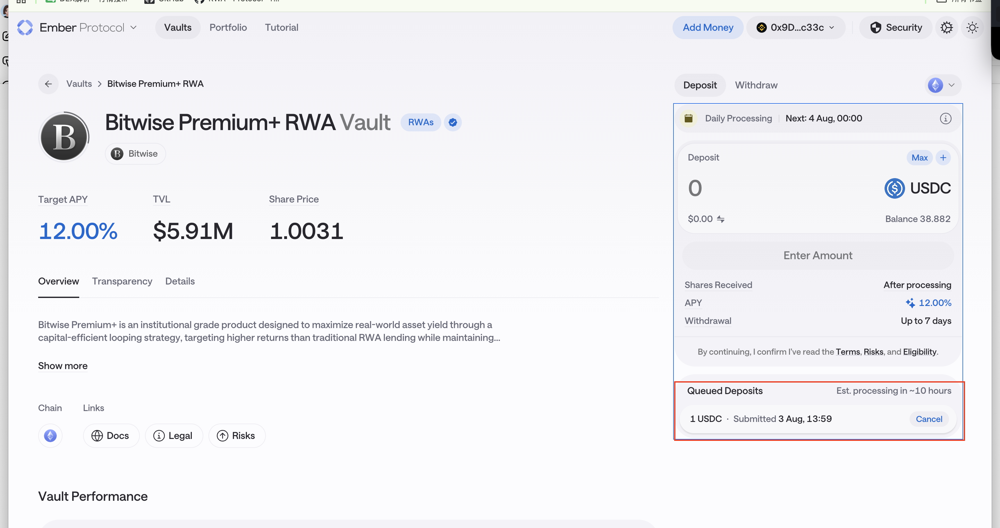

# 交付研发 · 2026-08-03 实测结果

> **本页是给解析同学的交付物。** 每条都是「PM 真实操作 + 链上逐笔验证」双确认，不是文档推断。
> **测试钱包**：Ethereum `0x9da44afe5ba28aa42301c626155ea66eb544c33c` ｜ Solana `BpexTtBqxhgvGWeipAE7SowyCp5KSihv8s5YZ91gXbFp`
> 操作人：Linnea ｜链上验证：eth_call / eth_getLogs / getTransaction

---

## 一、三个必须先看的结论

| # | 结论 | 影响 |
|---|------|------|
| **1** | 🔴 **Ember 申购是「排队制」，钱扣了但份额不铸** —— 已有链上 + UI 双证据 | **PRD 缺「申购中」状态**，现在只有「赎回中」。用户申购后持仓会显示 0 |
| **2** | 🔴 **Re 的 reUSDe 赎回窗口是关闭的**，页面原文 "Redeem is currently closed / No redemption window is open" | **CSV 标「活期」是错的**。且最低申购 **250 USDe**，用户在窗口外根本赎不出来 |
| **3** | 🔴 **Orca 一次"开仓"产生 3 笔交易**，且仓位 NFT 用的是 **Token-2022**（不是 classic SPL Token） | 只解析一笔会漏；只扫 classic Token 程序会**完全看不到仓位** |

---

## 二、Ember (Bitwise Premium+) —— 🔴 拿到了「申购排队」的完整证据

### 2.1 交易记录

| 操作 | 交易类型 | tx hash | 链 | 状态 |
|------|---------|---------|----|------|
| Deposit 1 USDC | **申购-提交（进队列）** | `0xf53c337104ff7bdd28af59ba757efe4be09b1afc7bacd01e5cfc511e12bfc94f` | Ethereum | ✅ 成功 |

### 2.2 🔴 链上事实（这是核心证据）

```
区块      : 25,672,431
from      : 0x9da44afe5ba28aa42301c626155ea66eb544c33c（用户）
to        : 0x626d3410450c0a716d721e6a3c6b75a36d00e913   ← 申购入口合约
方法      : 0x6e553f65 = deposit(uint256,address)（标准 ERC-4626 deposit 选择器）
状态      : 成功
日志      : 只有 2 条
  [0] USDC Transfer  用户 → 0x626d3410…   1.000000 USDC
  [1] 0x626d3410… 自定义事件 topic0 = 0x9cc70bb6a09a…
```

🔴 **注意第 2 条：整笔交易里没有任何份额代币的 mint。**
用户付了 1 USDC，**没有拿到任何凭证代币**。

### 2.3 UI 侧的对应证据



页面明确写着：

| UI 字段 | 内容 |
|---------|------|
| **Queued Deposits** | **1 USDC · Submitted 3 Aug, 13:59** ｜ **Est. processing in ~10 hours** ｜ 带 **Cancel** 按钮 |
| Daily Processing | **Next: 4 Aug, 00:00** |
| **Shares Received** | **After processing** |
| Withdrawal | Up to 7 days |
| Share Price | 1.0031 ｜ TVL $5.91M ｜ Target APY 12.00% |
| 钱包 USDC 余额 | 38.882 ← ✅ 与链上实测 `38.88204` 完全吻合 |

### 2.4 给解析同学的规格

**这个协议的申购是两段式，必须按两个事件处理：**

| 阶段 | 链上表现 | 用户看到 | 我们要提供 |
|------|---------|---------|-----------|
| **① 提交（已确认）** | 调 `deposit(uint256,address)`；USDC 转出；抛自定义事件 `0x9cc70bb6a09a…`；**无份额 mint** | 钱扣了、持仓 0 | 🔴 **「申购处理中」状态 + 排队金额 + 预计到账时间** |
| **② 批处理（待观测）** | 每日 00:00 由项目方批量处理，此时才铸份额 | 持仓出现 | 申购完成 + 实际份额 |

**🔴 如果不做阶段 ①**，用户申购后打开详情页会看到**空状态**（PRD 4.5.2 规则是"有持仓才展示"），会直接被当成资金丢失来投诉。

**还有一个没人枚举到的交易类型**：UI 上排队条目带 **Cancel** 按钮 → **「取消排队中的申购」也是一笔链上交易**，需要单独覆盖。

### 2.5 合约信息（实测）

| 项 | 值 |
|----|-----|
| 申购入口 | `0x626d3410450c0a716d721e6a3c6b75a36d00e913` |
| 合约类型 | **EIP-1967 可升级代理**（bytecode 170 字节）→ 实现合约 `0x1096a269128a291b658f9dca77da4356bf6c8b42` |
| ⚠️ 标准 4626 视图 | `name()` / `symbol()` / `decimals()` / `asset()` / `totalAssets()` / `balanceOf()` **全部 revert** |
| bytecode 里能反解出的函数 | `asset()`、`balanceOf(address)`、`deposit(uint256,address)`、`owner()` |

→ **推断**：`0x626d3410…` 是**申购网关 / 队列合约**，不是份额代币本体。**份额代币地址目前未知**。

→ ✅ **已闭环（2026-08-10 补）**：推断成立。份额代币是 **PPLUS「Bitwise Premium+」`0xbc5d3722376d44f3bC316C6EA61C9Bd553Be8CBe`（decimals 6）**；第二笔交易 hash **`0x8b9d5df2b28e22badba3958732eccc1cf1de0fb8db73800b702d01538e0aa84c`**（方法 `processDeposits`，2026-08-03 17:26:11 UTC，实际耗时 11h27m）。
🔴 **且发现一个大坑**：这笔的 `tx.from` 是项目方 operator **`0x71da2342b11AE27aF0a7E2507eCeF6CC89572738`**，不是用户 —— 按 `tx.from` 归集会 100% 漏掉「申购完成」。
**完整拆解见 [../02-协议调研/Ember.md](../02-协议调研/Ember.md) 的「✅ 2026-08-10 排队申购已闭环」一节。**

> ⚠️ 旧仓库里那条 Ember deposit hash `0x27408ed9…`（ePOLY vault）我在 7 条 EVM 链上都查不到，**且不在这个钱包名下**。疑为抄写有误，暂不可用。

---

## 三、Re（reUSD / reUSDe）—— 🔴 三个操作全部受阻，但每个都是有价值的发现

| 操作 | 结果 | 证据 |
|------|------|------|
| **Swap** | ❌ **交易被拒** | `execution reverted: 0xcea9e31d` |
| **Mint** | ❌ **门槛不够** | 页面：**Minimum Deposit 250 USDe** |
| **Redeem** | ❌ **功能关闭** | 页面：**"Redeem is currently closed"** |

### 3.1 Swap 被拒 —— 顺带确认了 Re 的 Swap 走聚合器

| 项 | 值 |
|----|-----|
| 交互合约 | `0x6a000f20005980200259b80c5102003040001068` |
| 🔴 **合约身份** | **ParaSwap Augustus V6.2**（实测 `version()` 返回 **"6.2.0"**，bytecode 24,562 字节，非代理） |
| 调用方法 | `swapExactAmountIn` |
| 报错 | `execution reverted: 0xcea9e31d`（自定义错误选择器） |
| 尝试内容 | 1 USDC → 0.721669 reUSDe |

**→ 给解析同学的结论**：**Re 页面的 Swap tab 不是协议自身操作，是走 ParaSwap 聚合器的二级市场兑换。**
**绝对不能算作申购。** 这也印证了之前那条负向用例（reUSD 走 Pendle/Uniswap V4 的 80 日志交易）。

> 失败原因推测：1 USDC 金额过小 / 池子流动性不足 / 滑点保护触发。**失败交易本身也是有用样本**（说明这条路径对小额不可用）。

### 3.2 🔴 Mint 最低 250 USDe —— PRD「最小质押额」的实测值

页面 Mint 面板：

| 字段 | 值 |
|------|-----|
| **Minimum Deposit** | **250 USDe** |
| **Exchange Rate** | **1 reUSDe = 1.3974 USDe** |
| 报错文案 | "Amount is below the minimum deposit of 250 USDe." |
| 按钮态 | "Below minimum deposit"（置灰） |

**→ 两个可直接填 PRD 的数字**：最小质押额 **250 USDe**、当前汇率 **1.3974**。
**→ 交叉验证**：页面 NAV Oracle 显示 **$1.3970**，Mint 汇率 **1.3974**，与我此前用真实交易反推的 **1.39694** 三者吻合 → **NAV 解析口径可靠**。

### 3.3 🔴🔴 Redeem 当前关闭 —— 这条推翻了 CSV 的「活期」

页面原文：

> **Redeem is currently closed**
> No redemption window is open. We announce upcoming windows in advance, please check back or subscribe for notifications.

**这直接证实了官方文档的「季度赎回」，而且比文档更严重**：

| CSV 写的 | 实际 |
|---------|------|
| 池子类别 = **活期（Flexible）** | **赎回窗口不定期开放，需等官方提前公告** |

**→ 必须处理的三件事**：
1. **池子类别不能标「活期」** —— 找 Marcus 改口径
2. **PRD 需要新增「赎回窗口」字段**（下一个窗口时间 / 当前是否开放），否则用户点 Redeem 只会看到一个死按钮
3. **上线前必须让用户在申购时就知道"不能随时赎回"** —— 否则是产品事故

> 📌 也解释了上次为什么"页面没显示赎回周期"：**窗口关闭时 UI 只显示"已关闭"，不显示周期规则**。信息披露确实不足。

### 3.4 已实测确认的 Re 合约信息（供解析）

| 代币 | 地址 | decimals | 申购币种 | 申购入口 |
|------|------|:---:|---------|---------|
| reUSD | `0x5086bf358635B81D8C47C66d1C8b9E567Db70c72` | 18 | USDC（**6 位**） | `0x4691c475be804fa85f91c2d6d0adf03114de3093` |
| reUSDe | `0xdDC0f880ff6e4e22E4B74632fBb43Ce4DF6cCC5a` | 18 | USDe（18 位） | `0xe1886be2ba8b2496c2044a77516f63a734193082` |

- 申购方法 `deposit(address,uint256,uint256)` = `0x0efe6a8b`
- 申购交易固定 3 条日志：付款 Transfer → 凭证 mint(from=0x0) → 入口自定义事件 `0x8752a472e5…`
- **识别规则**：申购 = 凭证代币 `Transfer(from=0x0)`；赎回 = `Transfer(to=0x0)`
- 代币合约是**纯可铸造 ERC-20**（无 4626、无取价函数）→ NAV 走外部 Oracle，**地址仍待项目方提供**
- 两个代币共用同一实现合约 `0xb5276c…21d4` → 一套适配器覆盖两个

**旁证 hash（别人的真实交易，可用于交叉验证解析结果）**：

| 动作 | hash |
|------|------|
| reUSD 申购 | `0xf252d674eacd3b3ba48449f71a28a202d1b71e0f46f8aa87e7cd5f6f92c9bdbc` |
| reUSDe 申购 | `0x38a21b691067a5de68f440123d6231ec8b6133fc0b24e1eecaed7efe8e83e76f` |
| reUSDe 赎回 | `0xb5ef00777bea1d3f8c34ac9cf071d25d4efcf1f634bc517c3f82420943056036` |
| **负向用例（不该识别为申赎）** | `0xa122e5a8826929a0ddb30917ac1912486ed6a4ed3e49090f13d6acc033d8f35a` |

---

## 四、Orca Whirlpools（Solana）—— 完整拆解

### 4.1 交易记录（PM 实测，已全部链上验证）

| # | 操作 | 交易类型 | signature | 时间(UTC) |
|:---:|------|---------|-----------|----------|
| 1 | Swap | **Swap（两跳）** | `B6Ago4ntzqmPgcPaYgDeavYPiFcnLSKj7agLHmypsEYC5WxwPP62qBCAfKDCBUsnDo6Nscbm8jvb6a7SQj9ShoK` | 07:33:57 |
| 2 | 开仓（自动换币腿） | **Autoswap（经聚合器）** | `danFLgRuT6EGrWUZesDuAqq1d1zcsuaL1ZT2LGZFQWs1x5Z2WGqXnt2jKuj8WRTKRTFodJxX2vYrALYaHXumvQ1` | 07:37:50 |
| 3 | 🔴 开仓（真正那笔） | **OpenPosition** | `54G7sZ99HHPsruwcdYNHCN7ztRm1Re6JZS1qp1JqzsoCydFxrpWPGPsKvFfgKTnSWbsxysatumwUEWg2FiG9ibWm` | 07:37:50 |
| 4 | 开仓（附带） | **优先费/Tip 转账** | `4ZnqM4G8eiw4iLDgCgDPq2k12ouxzoe5CUHiUe8bRcS61z8TKiLW4kr7LTyTJc1zLz4YXG5CLqJTbaGVW53vFdyG` | 07:37:50 |
| 5 | Withdraw | **移除流动性（未关仓）** | `a3JWN8bQ5pNeyVYMWifcvjhhxzBcyTWdvTL4chzToLH8ixnM28wBGYCrVUCM8gNBKNivyirgkPxH9T7FtKCE7Lj` | 07:38:57 |

### 4.1b 补充：2026-08-10 又跑了一轮（同一钱包）

| # | 时间(UTC) | 操作 | signature | 链上结果 |
|:---:|----------|------|-----------|---------|
| 6 | 08:26:02 | Swap（多跳，经聚合器） | `YqFcnc59pADQS3EJZvMf8PNAeb2x4g9c8DgQFuo9Ep5kfmT2MKeBnvdYmbVcLLafHHjgweyNDhmE6NbwxF8wCqx` | 指令 `SwapRouteV3` → `SwapV2` ×3 + `Swap`（含 Raydium CLMM 一跳）<br>ORCA 代币 **+0.036158** |
| 7 | 08:30:59 | 🔴 **再开一个仓** | `5TsstJEAxic62ZTp5KHNHAVjKUXTpoURZ86R4jHZ7Lga9mj23A4S4hqbpdWqqdfFjTLEG5ZPDf1zWZEw5XLuUUe8` | 指令 `OpenPositionWithTokenExtensions`<br>**新仓位 NFT `3WFkpgjciq2EpNZBNxNfMFd9sue59UQn3nfVnVF134De` 0 → 1**<br>USDC −0.016246 |
| 8 | 08:32:32 | 移除流动性（**推断**） | `3rKdXeMKETRdVzpcnN5PQpEYLKqr3fzD45GrynzBXTmENKVGFHxaUJvTPJYQapscPHMqVQuRAYn3fLRTULYFgbat` | 调 Whirlpools，池子转出两笔 token，用户 USDC **+0.015987**<br>⚠️ **该笔无 `Instruction:` 日志**（仅 `Program data`），指令名未解出；形态与第 5 笔（移除流动性）一致<br>✅ **仓位 NFT 未变化 → 不是关仓** |

**→ 两个结论**：
1. ✅ **8/3 的「开仓 = OpenPositionWithTokenExtensions + Token-2022 NFT」结论在 8/10 复现**，规格可靠
2. 🔴 **「关仓 ClosePosition」仍然没有样本** —— 本次两个仓位都还开着（8/3 那个 + 8/10 新开这个）。**该待补项未关闭**

### 4.2 🔴 一次「开仓」= 3 笔交易（同一秒）

原始记录里只给了 `danFLgRu…` 当作"开仓"。**实测它不是开仓**：

| signature | Anchor 指令 | 真实性质 |
|-----------|------------|---------|
| `danFLgRu…` | `MultiHopExactInSwap → SwapExactIn → TwoHopSwap`<br>经聚合器 `oBbXuJJbV6yhGFaCCFfFmf7ko1n7NNk9a2eh3iAGH3P` | 🔴 **是 Autoswap**（UI 上 "Autoswap / Trade via Titan" 那一步）<br>USDC −0.510447 换成 SOL |
| **`54G7sZ99…`** | **`OpenPositionWithTokenExtensions`** → InitializeMint2 → MintTo → SetAuthority | 🔴 **这才是开仓**<br>仓位 NFT `FLGBtfD9…` **0 → 1**；USDC 11.409527 → 10.932666 |
| `4ZnqM4G8…` | 无（仅 System transfer，CU 450） | 优先费 / tip |

**→ 解析规格**：UI 上一次「Create Position」操作，链上会产生 **1 笔 Autoswap + 1 笔 OpenPosition + 1 笔 tip**。
**只认 Autoswap 那笔会把开仓算成 swap；只认 OpenPosition 会漏掉用户实际付出的资金**（因为一部分资金是在 Autoswap 里换掉的）。

### 4.3 🔴 仓位 NFT 用的是 Token-2022，不是 classic SPL Token

| 项 | 实测值 |
|----|-------|
| 仓位 NFT mint | `FLGBtfD9HkQGrTuwnrWaEbWp4h3VyhkZVEteJ2x2uPN` |
| 🔴 **所属程序** | **`TokenzQdBNbLqP5VEhdkAS6EPFLC1PHnBqCXEpPxuEb`（Token-2022 / Token Extensions）** |
| decimals / supply | 0 / 1（标准 NFT） |
| mintAuthority | None（铸造后已回收） |
| 🔴 **启用的扩展** | `mintCloseAuthority`、`metadataPointer`、`tokenMetadata` |

**→ 如果解析器只扫 classic SPL Token 程序 `TokenkegQ…`，会完全看不到 Orca 仓位。**
Whirlpools 现在开仓走的是 `OpenPositionWithTokenExtensions`。

### 4.4 移除流动性 ≠ 关仓

`a3JWN8bQ…` 的实测结果：

```
Solscan 标签  : Liquidity: Remove ｜ Transfer ｜ MEV: Tip
用户收到      : USDC +0.000670
池子支出      : WSOL −0.00001、USDC −0.000670
池子账户      : Czfq3xZZDmsdGdUyrNLtRhGc47cXcZtLG4crryfu44zE（Solscan 标 "Orca (SOL-USDC) Market"）
🔴 仓位 NFT   : 1.0 → 1.0（没变）
```

**→ 仓位 NFT 还在，说明这只是移除流动性，仓位没关闭。**
**→ 「关仓 ClosePosition」是独立的第 4 类操作，目前还没有样本。**

### 4.5 三个容易踩的坑

| # | 坑 | 说明 |
|:---:|---|------|
| 1 | **WSOL 不是 SOL** | Orca 内部用 wrapped SOL，交易里会有 createAccount → initializeAccount → closeAccount 的包装/解包过程。解析要能把 WSOL 折算回 SOL |
| 2 | **Jito tip 混在里面** | withdraw 那笔有 0.000002607 SOL 转给 Jitotip（Solscan 标 "MEV: Tip"）。**不能算作仓位资金** |
| 3 | **feePayer 不是用户** | 三笔交易的第二签名者各不相同（`7SFu6ugr…` / `AX9TjbNb…` / `6ffeMkxH…`）→ Orca 用了代付/relayer（UI 上的 "⚡ Fast"）。**按 feePayer 归属用户会全错** |

### 4.6 🔴 关于「Orca V3」这个叫法

链上解出的 Whirlpools 指令：`Swap`、`SwapV2`、`Swap2`、`Deposit`、`Withdraw`、`OpenPositionWithTokenExtensions` —— **没有任何 "V3"**。
UI 顶部导航是 **Pools / Trade / Vaults / Portfolio / Stake / Wavebreak**，Solscan 标的是 **Whirlpools Program**。
唯一带 V3 的 `SwapRouteV3` 属于**外层聚合器**。

→ **建议向提需求方确认「Orca V3」指什么**，避免解析对象偏掉。

### 4.7 池子与程序地址

| 项 | 地址 |
|----|------|
| Whirlpools 程序 | `whirLbMiicVdio4qvUfM5KAg6Ct8VwpYzGff3uctyCc` |
| SOL/USDC 0.04% 池子账户 | `Czfq3xZZDmsdGdUyrNLtRhGc47cXcZtLG4crryfu44zE` |
| 用到的聚合器 | `oBbXuJJbV6yhGFaCCFfFmf7ko1n7NNk9a2eh3iAGH3P` |
| 仓位 NFT | `FLGBtfD9HkQGrTuwnrWaEbWp4h3VyhkZVEteJ2x2uPN` |

---

## 五、待补清单

| 优先 | 缺什么 | 谁 | 备注 |
|:---:|-------|----|------|
| ✅ | ~~**Ember 批处理后的第二笔交易 + 份额代币地址**~~ | Linnea | **2026-08-10 已闭环**：PPLUS `0xbc5d3722…`、hash `0x8b9d5df2…`。见 §2.5 |
| 🔴 | **Ember 取消排队申购**（UI 有 Cancel 按钮） | Linnea | 没人枚举到的交易类型 |
| 🔴 | **Orca 关仓 ClosePosition** | Linnea | 移除流动性 ≠ 关仓 |
| 🔴 | **Orca 收手续费 collect fees** | Linnea | CLMM 特有，需先有交易量 |
| 🟡 | **Re Mint 实测**（需 ≥250 USDe） | Linnea / 需预算 | 门槛较高，可考虑找项目方开测试额度 |
| 🟡 | **Re 赎回窗口开放时间** | 问项目方 | PRD 需要这个字段 |
| 🟡 | **Re 的 NAV Oracle 地址** | 问项目方 | Re 接入的唯一硬阻塞 |
| 🟡 | Ember 自定义事件 `0x9cc70bb6a09a…` 的签名 | Etherscan ABI | 可能含排队 ID |
| 🟡 | 把 Orca / Re 的 5 张截图存入 `03-参考/操作截图/` | Linnea | 目前只有 Ember 那张落盘了 |

---

## 六、附：截图清单

| 文件 | 内容 | 状态 |
|------|------|------|
| `Ember-deposit-queued-20260803.png` | Ember 排队申购（1 USDC / Est. ~10 hours / Cancel） | ✅ 已入库 |
| Orca Create Position 确认页 | SOL/USDC 0.04%、Autoswap via Titan、Refundable Fees $0.75 | ⬜ 待存盘 |
| Orca Solscan 移除流动性 | Liquidity: Remove / MEV: Tip / 两个签名者 | ⬜ 待存盘 |
| Re Swap 被拒 | ParaSwap 合约 + `execution reverted: 0xcea9e31d` | ⬜ 待存盘 |
| Re Mint 最低 250 USDe | Minimum Deposit 250 USDe / Exchange Rate 1.3974 | ⬜ 待存盘 |
| Re Redeem 关闭 | "Redeem is currently closed" | ⬜ 待存盘 |

> 建议命名：`Orca-openposition-confirm.png`、`Orca-removeliq-solscan.png`、`Re-swap-rejected.png`、`Re-mint-min250.png`、`Re-redeem-closed.png`
