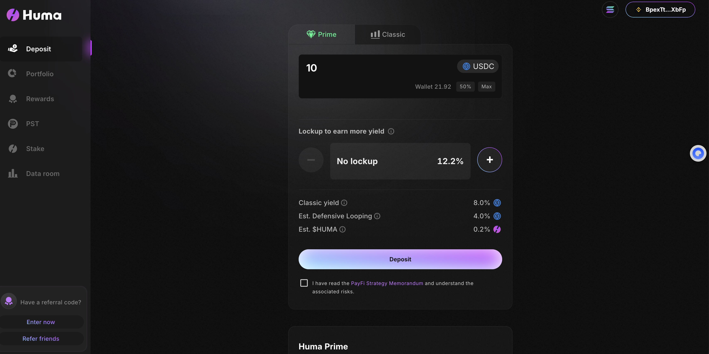
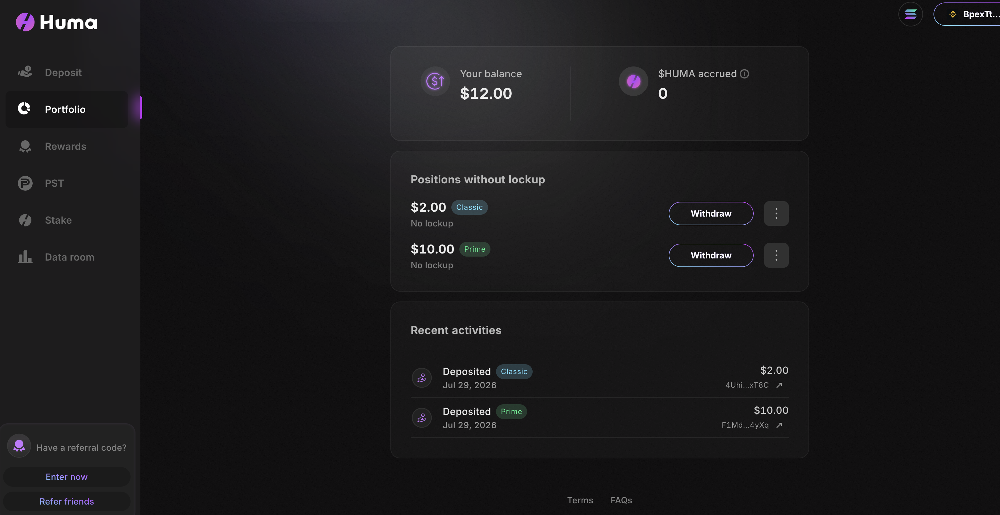
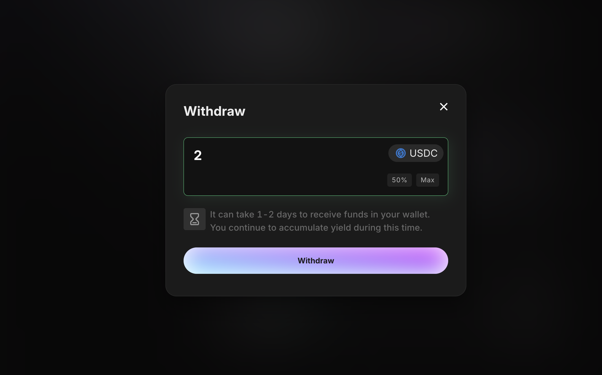
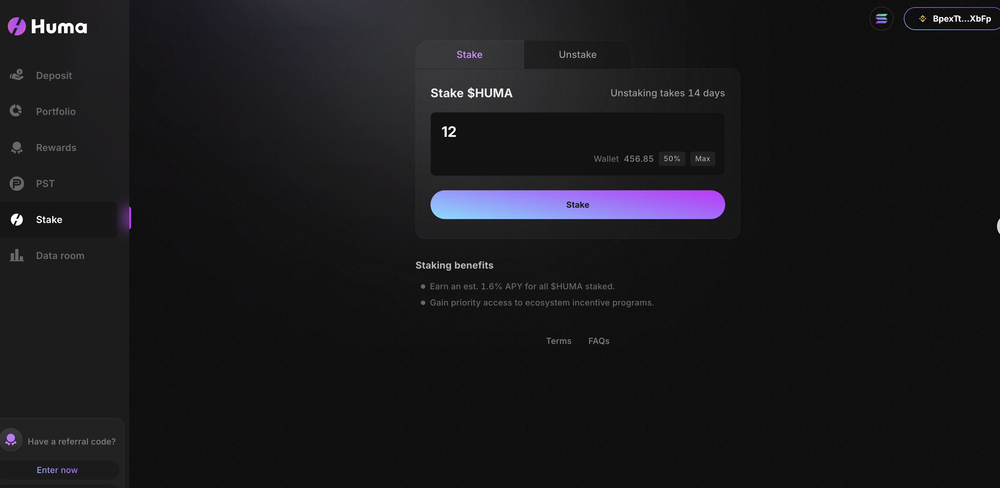
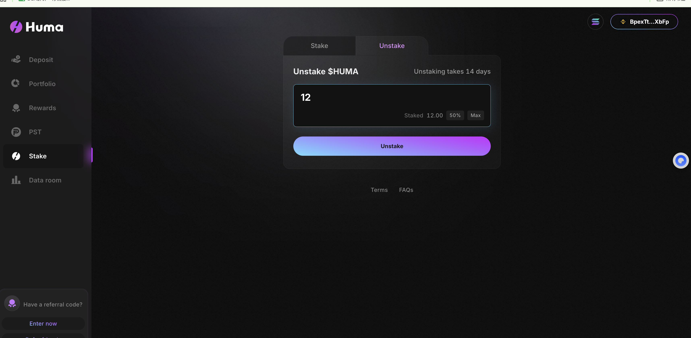
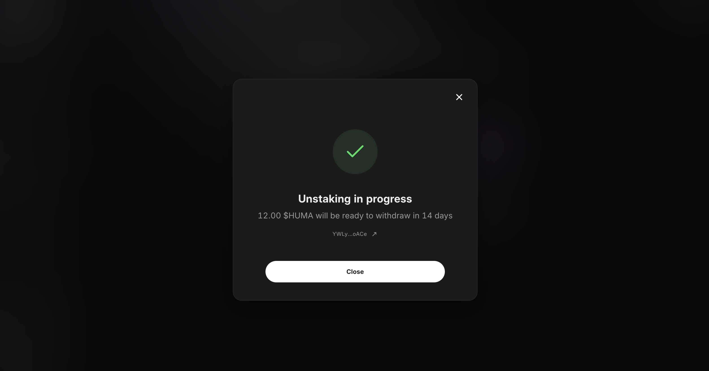
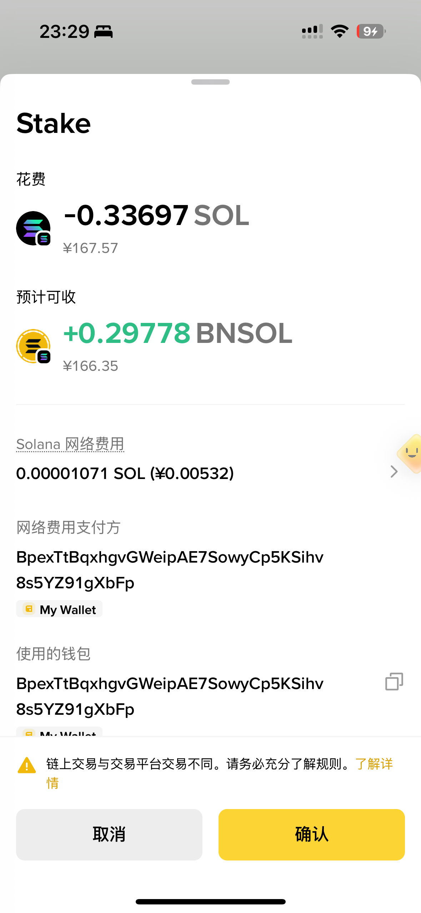
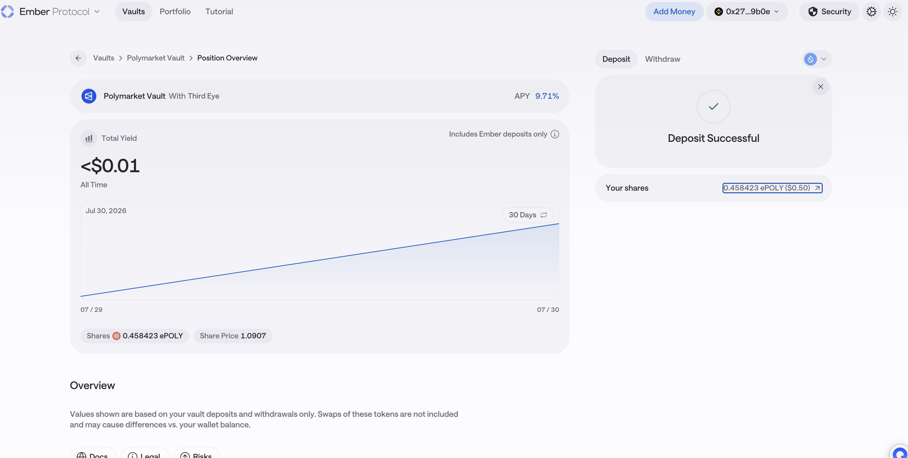
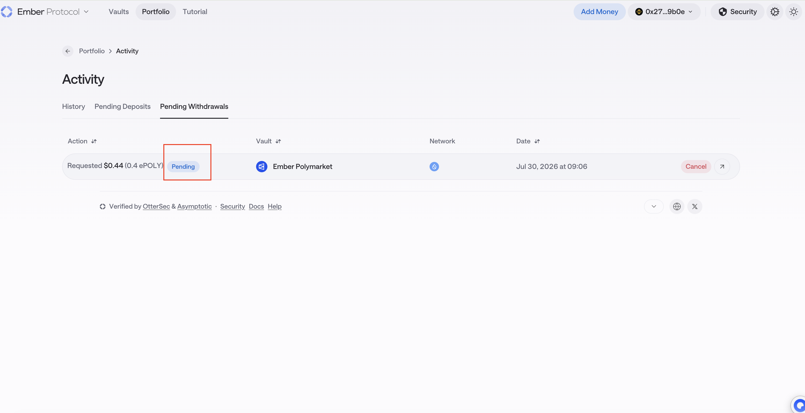

# 操作调研 · 全量汇总表

> **用途**：下游解析团队反馈部分协议操作未被解析到。本表穷举各协议「一个真实用户能点击执行的所有链上操作」，PM 侧逐笔发测试交易并记录 hash + 截图，供开发自检解析覆盖。
>
> **两个来源合并**：
> - `git.toolsfdg.net/linnea-l/DeFi-Protocol-Research/operation-research`（Linnea，2026-07-29）—— Huma / BNSOL / Ember
> - 本仓库（2026-08-03）—— 逐笔**链上验证** + Re / Orca / Nest / Unitas
>
> **测试钱包（Solana）**：`BpexTtBqxhgvGWeipAE7SowyCp5KSihv8s5YZ91gXbFp`
> **图例**：✅ 已完成 ｜ 🔶 待补 hash ｜ ⬜ 待操作 ｜ 📱 移动端 ｜ ⚠️ 有问题需处理

---

## 零、验证结论速览

我把原表里的每条 hash 都拉到链上跑了一遍，结果如下：

| 协议 | 原表结论 | 链上验证结果 | 处理 |
|------|---------|------------|------|
| **BNSOL 申购** | 「App 内操作，无独立 URL」 | ✅ 验证通过，**且发现是标准 SPL Stake Pool** → **链上有无许可入口** | 原结论需放宽，见 §2 |
| **BNSOL 赎回** | 「疑似赎回不了，一直失败」 | 未验证，但**机制上找到了可能原因** | 见 §2.3 |
| **Huma 解质押三连** | 「一次解质押 = 3 笔连续交易」 | 🔴 **三笔不是同一个动作**：tx1 是 Prime 赎回申请、tx2 是 **$HUMA 质押（不是解质押）** | **需更正，见 §1.2** |
| **Ember Deposit** | hash `0x27408ed9…` | ⚠️ **7 条主流 EVM 链上都查不到这笔交易** | 需重新核对，见 §3 |
| **Re** | — | ✅ 合约地址 / 入口 / 事件结构已实测（Linnea 正在补操作记录） | §4 |
| **Orca** | — | ✅ 程序已验证，指令名已解出（Linnea 正在补操作记录） | §5 |

📌 **顺带印证了 Scott 的担心**：Huma 那三笔就是典型的「hash 和操作对不上号」—— 原表把「$HUMA 质押」记成了「解质押」，还把 Prime 赎回申请混了进来。**这正是必须"边操作边记录"而不能事后拼凑的理由。**

---

## 一、Huma Finance（Solana）

- **协议主页**：https://app.huma.finance/
- **调研结论**：核心链上操作 6 个，全部可在 Web 端完成，无移动端专属操作。均需连接 Solana 钱包后触发。
- **代币 mint**：`HUMA1821qVDKta3u2ovmfDQeW2fSQouSKE8fkF44wvGw`（$HUMA）
- 🔴 **实测发现涉及两个不同程序**（原表只记了一个）：

| 程序 ID | 作用 |
|---------|------|
| `prm1azdDGzyqP76s3Hv2nuG3uLnBgR5u2d7pANwmmzC` | **Prime 存款 / 赎回**（`RequestRedemption` 等） |
| `vsRJM68m7i18PwzTFphgPYXTujCgxEi28knpUwSmg3q` | **$HUMA 治理质押**（voter-stake-registry 类，`CreateVoter` / `CreateDepositEntry` / `InternalTransferLocked`） |

> ⚠️ **解析团队必须同时覆盖这两个程序**，只盯 `HUMA1821…`（那是代币 mint，不是程序）会全部漏掉。

### 1.1 操作表

| # | 操作 | 入口路径 / 网址 | 哈希（交易签名） | 截图 | 状态 |
|---|------|--------------|----------------|:--:|:--:|
| 1 | 存款 Deposit（Prime） | Prime tab → 选锁定期 → 输入 → Deposit<br>app.huma.finance | `F1MdrX5dwq6MYraF7NYNnZMs65dCCiFbAaf8BRES1qQFBQa7dQAgQh8X4gvsfSH8eK4rrdQiG3GE6zoiGUz4yXq` | 图1 | ✅ |
| 2 | 存款 Deposit（Classic） | Classic tab → 输入 USDC → Deposit | ⚠️ 原表填的是 `4Uhi1v1u…`，**与第 4 行重复**，需重新确认 | — | 🔶 |
| 3 | 取款/赎回 Withdraw | Portfolio → Positions → Withdraw | `5Cd8aYPRGeLZh486a3VdXD2k7JXTL4J2J49rLpZRwFTi6gZtBN1vTkDA6qTxw3GH8DMgQdLorEyU2k8AquXVCd4R` | 图2、图3 | 🔶 |
| 4 | 质押 Stake $HUMA | Stake → Stake 子tab → 输入 → Stake | 🔴 **应为 `3j1E13TAKht5hRwV5GMgBWgyyMuFZxfdS8scN4YZSoaZab76bZ5NUjbEozdsfZQbhwoXV5K2nKyxxZhiYsd68iiM`**（实测该笔 $HUMA 余额 456.845 → 444.845，正好锁仓 12 个）<br>原表误填 `4Uhi1v1u…` | 图4 | ⚠️ **更正** |
| 5 | 解质押 Unstake $HUMA（14天解锁） | Stake → Unstake 子tab → Unstake | 见 §1.2 更正 | 图5、图6 | ⚠️ **更正** |
| 6 | 领取奖励 Claim（$HUMA/Feathers） | Rewards → Your rewards → Claim | — | — | ⬜ |
| 7 | **Prime 赎回申请**（原表未单列） | Prime → 赎回 | `LnpBYdHUbY8mjL8GzUBhPRexfmEZ5uLRXzLm4PUjd7oLijgwjPywdESD6FgtnFCVe2ZsVeZmiQGCLyhUF4Jn53K` | — | ✅ **新增** |

### 1.2 🔴 「三连交易」的更正

原表写：*「一次『解质押 12 $HUMA』在链上产生 3 笔交易」*。逐笔拉链上数据后，**实际是两个不同动作被记在了一起**：

| 原表顺序 | 签名 | 实测程序 | 实测 Anchor 指令 | **真实性质** |
|:---:|------|---------|----------------|------------|
| 1 | `LnpBYdHU…Jn53K` | `prm1azd…mmzC` | `CreateDepositorAccounts`, **`RequestRedemption`** | 🔴 **Prime 的赎回申请** —— 与 $HUMA 质押无关，是另一个动作 |
| 2 | `3j1E13TA…68iiM` | `vsRJM68m…mg3q` | `CreateVoter`, `CreateDepositEntry`, `Deposit` | 🔴 **$HUMA 质押（Stake）12 个**（余额 456.845 → 444.845）—— **是质押，不是解质押** |
| 3 | `YWLyFXCw…oACe` | `vsRJM68m…mg3q` | `CreateDepositEntry`, **`InternalTransferLocked`** | 锁仓条目内部转移（属质押流程的一部分） |

**修正后的理解**：

```
tx1  = Prime 赎回申请（独立动作，程序 prm1azd…）
tx2  = $HUMA 质押主交易（程序 vsRJM68m…，12 个 $HUMA 进锁仓）
tx3  = 质押的锁仓条目转移（同上程序）
```

→ **给解析团队的结论仍然成立、而且更重要**：
- **一次 $HUMA 质押会产生 2 笔交易**（tx2 + tx3），只解析其中一笔会漏
- **Prime 赎回和 $HUMA 质押是两个不同程序**，必须分别覆盖
- ⬜ **真正的「解质押 Unstake」还没有样本** —— 需要补测

> **两段式提醒**：$HUMA 锁仓 14 天（约 2026-08-12 到期），到期后实际 withdraw 提取会产生独立交易，需到期补测。

**备查（非本体链上操作）**：PST 页（`/pst`）4 个外链跳转第三方（Jupiter/Kamino），非 Huma 自身交易；Refer/Data room/Terms/FAQs 为链下操作。

### 📷 Huma 截图

**图1** — 存款 Deposit（Prime 模式）


**图2** — 取款 Withdraw（Portfolio 持仓页）


**图3** — 取款 Withdraw（赎回弹窗）


**图4** — 质押 Stake $HUMA


**图5** — 解质押 Unstake（操作页）


**图6** — 解质押 Unstake（成功页，12 $HUMA / 14 天）


---

## 二、Binance Staked SOL（Solana）

- **入口**：Binance App → 理财 → 协议 → 搜「Binance Staked SOL」
- **BNSOL mint**：`BNso1VUJnh4zcfpZa6986Ea66P6TCp59hvtNJ8b1X85`（decimals **9**，已链上验证）
- 🔴 **实测新发现：底层是标准 SPL Stake Pool**

| 项 | 实测值 |
|----|-------|
| **质押池程序** | **`SPoo1Ku8WFXoNDMHPsrGSTSG1Y47rzgn41SLUNakuHy`**（SPL Stake Pool 官方程序） |
| **申购指令** | **`DepositSol`** ← 解析就认这个 |
| 储备账户 | `9xcCvbbAAT9XSFsMAsCeR8CEbxutj15m5BfNr4DEMQKn` |
| 手续费账户 | `7vySDAJhfdaZa8RMV4EPL6zQtWJeAx5jjanm9AJahoFf` |

> **对原表结论的放宽**：原表写「App 内操作，无独立 URL」。实测它走的是**标准 SPL Stake Pool 程序**，意味着**链上有无许可的质押入口**（任何支持 stake pool 的前端都能操作），不是只能从 Binance App 走。

### 2.1 操作表

| # | 操作 | 入口路径 | 哈希 | 截图 | 状态 |
|---|------|---------|------|:--:|:--:|
| 1 | 申购 Subscribe（首笔） | 搜 Binance Staked SOL → 底部「申购」 | `4585cd0ee8c9329ae69501300d1c224c` `91a645b3a0e919cd868f82533db9b302` | — | ✅ 📱 |
| 2 | **申购（Stake SOL→BNSOL）** | 同上 → 输入金额 → 确认质押 | `33fXGtKbgxTe8d9MtqPiPncQ3jQUKysxPrU8fPfSYp5gGzoH6KuDogNCjYHMyzhU56PR1vWYRzbDVL6FWC7qUDhP` | 图7 | ✅ **已链上验证** |
| 3 | 赎回 Redeem | Binance Staked SOL → 赎回 | —（原表：疑似赎回不了，一直失败） | — | ⬜ 📱 |

> 第 1 行那两个 32 位十六进制**不是 Solana 签名**（Solana 签名是 base58、87–88 字符），是 Binance App 内部的订单号。留档可以，但**不能给解析团队当样本**。

### 2.2 ✅ 申购交易的完整拆解（实测）

```
签名 : 33fXGtKb…C7qUDhP
时间 : 2026-07-29 15:30:23 UTC（slot 435,973,030）｜状态：成功

指令 :
  [0] system              transfer
  [1] spl-associated-token-account   createIdempotent   ← 首次会建 ATA 账户
  [2] SPoo1Ku8…akuHy      DepositSol                    ← 🔴 核心：质押铸造

资金流 :
  钱包            −0.336986530 SOL   （含 gas 与手续费）
  储备账户        +0.334937250 SOL
  手续费账户      +0.002039280 SOL
  BNSOL 余额        0 → +0.297780892
```

**两个可以直接填进 PRD 的数字**：

| 指标 | 计算 | 值 |
|------|------|-----|
| **申购手续费率** | 0.002039280 ÷ 0.33697653 | **≈ 0.61%** |
| **BNSOL 兑 SOL 汇率** | 0.334937250 ÷ 0.297780892 | **≈ 1.1248 SOL / BNSOL** |

> 📌 **注意**：如果按「用户实付 ÷ 得到份额」算是 1.1316，按「实际入池 ÷ 份额」算是 1.1248，**差额就是那 0.61% 手续费**。解析 PNL 的成本基准要用哪一个，需要和 Jackson 对齐口径。

### 2.3 关于「赎回不了」的可能原因（推断，需验证）

SPL Stake Pool 有**两种**赎回路径，行为完全不同：

| 路径 | 指令 | 条件 | 到账 |
|------|------|------|------|
| **换回 SOL** | `WithdrawSol` | **储备账户里要有足够 SOL** | 即时 |
| **换回质押账户** | `WithdrawStake` | 总是可用 | 拿到一个 stake account，**需自行解激活，等一个 epoch（约 2–3 天）** |

→ **推断**：原表「疑似赎回不了」很可能是**储备 SOL 不足，`WithdrawSol` 走不通**，此时只能走 `WithdrawStake`，而这条路径在 App 界面上可能不暴露。
→ ⬜ **待验证**：赎回时记录报错文案 + 截图；如果能走 `WithdrawStake`，**那会是"两段式赎回"，直接对应 PRD 的「赎回中」状态**。

### 📷 BNSOL 截图

**图7** — 申购确认（Stake −0.33697 SOL → +0.29778 BNSOL）


---

## 三、Ember / Bitwise（ETH）

- **协议主页**：https://ember.so/earn
- **调研结论**：统一 vault 架构，所有 vault 详情页操作一致。产生链上 event 的操作 3 类：**Deposit、Withdraw/Redeem、Approve**。无独立 claim/stake。
- **⚠️ 重点**：**Approve** 会产生独立 Approval event，务必单独测一笔。

### 3.1 ⚠️ 原表的 Deposit hash 查不到

```
0x27408ed9752b653e009de0ce83608e7a3dd4bccc5362045978b4b38bb3159b0e
```

我在 **Ethereum / Polygon / Base / Arbitrum / BNB / Optimism / Avalanche** 七条链上都查过，**全部返回「无此交易」**。格式是合法的（0x + 64 位十六进制），所以不是格式问题。

**三种可能**：
1. **抄写有误**（少一位、多一位、或某位字符看错）—— 最可能
2. 在更冷门的 EVM 链上（Ember 也部署在 **Sui**，但 Sui 的交易摘要不是 `0x` + 64 位这个格式）
3. 交易被 drop 了（签名了但没上链）

→ ⚠️ **建议**：从**成功页的「查看交易」链接**或钱包交易历史里**重新复制一次**。这条目前不能给解析团队用。

### 3.2 操作表

| # | 操作 | 入口路径 / 网址 | 哈希 | 截图 | 状态 |
|---|------|--------------|------|:--:|:--:|
| 1 | 存款 Deposit | /earn → 选 vault → Deposit tab → 确认<br>ember.so/earn/ePOLY | ⚠️ `0x27408ed9…` **7 链查不到，需重取** | 图8 | ⚠️ |
| 2 | 取款/赎回 Withdraw | vault 详情页 → Withdraw tab → 确认 | -（withdraw 需 pending） | 图9 | 🔶 |
| 3 | 授权 Approve（前置） | Deposit 前额度不足时钱包内触发 | - | — | ⬜ |
| 4 | 🔴 **等每日批处理后份额到账** | 存入后持仓页（新增，见下） | - | — | ⬜ |

### 3.3 🔴 补充：Bitwise Premium+ 的「每日批处理」

本仓库调研的是 **`ember.so/earn/PPLUS` = Bitwise Premium+ RWA Vault**（原表测的是 **ePOLY**，是同平台的另一个 vault）。

PPLUS 页面明确写着 **Daily Processing** + **Shares Received: After processing**：

```
用户签完 Deposit → USDC 已扣 → 但 share 还没铸
                 → 等到下一个处理时点（每天 00:00）→ 才铸出 share
```

→ **这段真空期里持仓 balance = 0**，按现有解析逻辑用户持仓会显示为 0。
→ **PRD 只为「赎回中」设计了中间态，没有「申购中」**。这是需要拿去找 Marcus 的证据。
→ ⬜ **待测**：存入后立刻截持仓页（看是否显示 0）+ 过了 00:00 再截一次（看是否产生第二笔交易）。

> **各 vault 赎回周期不同**（原表记录）：Earn 3 天 / ACRED 季度 / 部分即时；PPLUS 为**最长 7 天**。均在 Withdraw tab 完成；收益为 share price 增长型（自动累积、赎回时实现），无 claim。
> **ETH 链 vault 清单**：Ember Earn(eEARN)、Ember ACRED(eACRED)、Crosschain USD、Tulipa Multi-RWA、Pharos RealFi、UDL、Y10k USD、Polymarket(ePOLY)、**Bitwise Premium+(PPLUS)**。入金多为 USDC。
> **备查**："More ways to earn" 跳转 AlphaLend/Pendle/Suilend 等外部协议，非 Ember 本体。

### 📷 Ember 截图

**图8** — 存款 Deposit


**图9** — 取款 Withdraw（pending 状态）


---

## 四、Re（Ethereum）—— Linnea 正在操作

- **协议主页**：https://app.re.xyz（顶部导航切 **reUSD** / **reUSDe**）
- **已实测确认的信息**（可直接核对钱包弹窗）：

| 代币 | 合约地址 | decimals | 申购币种 | 申购入口合约 |
|------|---------|:---:|---------|------------|
| **reUSD** | `0x5086bf358635B81D8C47C66d1C8b9E567Db70c72` | 18 | **USDC**（6 位） | `0x4691c475be804fa85f91c2d6d0adf03114de3093` |
| **reUSDe** | `0xdDC0f880ff6e4e22E4B74632fBb43Ce4DF6cCC5a` | 18 | **USDe**（18 位） | `0xe1886be2ba8b2496c2044a77516f63a734193082` |

- **申购方法**：`deposit(address,uint256,uint256)` = `0x0efe6a8b`（两个入口通用）
- **申购交易固定 3 条日志**：付款 Transfer → 凭证 mint(from 0x0) → 入口自定义事件 `0x8752a472e5…`
- **代币合约是纯可铸造 ERC-20**（无 4626、无取价函数）→ **NAV 走外部 Oracle，地址待项目方提供**
- **两个代币共用同一实现合约** `0xb5276c…21d4` → 一套解析适配器覆盖两个

### 操作表（待填）

| # | 操作 | 入口 | 哈希 | 截图 | 状态 |
|---|------|------|------|:--:|:--:|
| 1 | reUSD 授权 USDC | app.re.xyz → reUSD | | 16-Re-reUSD-approve | ⬜ |
| 2 | reUSD Mint 申购 | 同上 | | 17-Re-reUSD-mint | ⬜ |
| 3 | reUSD Redeem 赎回 | 同上 | | 18-Re-reUSD-redeem | ⬜ |
| 4 | reUSDe 授权 USDe | app.re.xyz → reUSDe | | 19-Re-reUSDe-approve | ⬜ |
| 5 | reUSDe Mint 申购（**最小额**） | 同上 | | 20-Re-reUSDe-mint | ⬜ |
| 6 | 🔴 **reUSDe Redeem 面板截图** | 同上 | — | 21-Re-reUSDe-redeem-panel | ⬜ |
| 7 | Swap tab 换币（**不算申购**） | 同上 | | 22-Re-swap | ⬜ |

> 🔴 **第 6 步最关键**：官方 docs 写 reUSDe 季度赎回，但产品页 Redeem 面板没显示任何周期。**如果确实没显示，就是「官方自己都不披露锁定期」的信息披露风险** —— 我们照抄"活期"会把盲区带进 Binance Wallet。这张截图就是证据。

**已捞到的旁证 hash**（别人的交易，用于交叉验证你的操作结果）：

| 动作 | hash |
|------|------|
| reUSD 申购 | `0xf252d674eacd3b3ba48449f71a28a202d1b71e0f46f8aa87e7cd5f6f92c9bdbc`（35,000 USDC → 32,032.1169 reUSD） |
| reUSDe 申购 | `0x38a21b691067a5de68f440123d6231ec8b6133fc0b24e1eecaed7efe8e83e76f`（24,994.5262 USDe → 17,892.7882 reUSDe） |
| reUSDe 赎回 | `0xb5ef00777bea1d3f8c34ac9cf071d25d4efcf1f634bc517c3f82420943056036` |
| **负向用例** | `0xa122e5a8826929a0ddb30917ac1912486ed6a4ed3e49090f13d6acc033d8f35a`（reUSD 走 Pendle，**不是申赎**，解析器不该产生记录） |

---

## 五、Orca（Solana）—— Linnea 正在操作

- **Swap**：https://www.orca.so ｜ **流动性**：https://www.orca.so/pools
- **Whirlpools 程序**：`whirLbMiicVdio4qvUfM5KAg6Ct8VwpYzGff3uctyCc`（已验证 `executable = true`）
- 🔴 **实测解出的指令名**：`Swap`、`SwapV2`、`Swap2`、`Deposit`、`Withdraw` —— **没有任何 "V3"**
  唯一带 V3 的是 `SwapRouteV3`，属于**外层聚合器**，不是 Orca 的
  → **需确认「Orca V3」指什么**：① Whirlpools/CLMM 的内部叫法 ② 把聚合器的 SwapRouteV3 误当版本号

### 操作表（待填）

| # | 操作 | 入口 | 签名 | 截图 | 状态 |
|---|------|------|------|:--:|:--:|
| 1 | Swap（最小额） | orca.so | | 04-Orca-swap | ⬜ |
| 2 | 开仓 / 加流动性 | orca.so/pools | | 05-Orca-addliq | ⬜ |
| 3 | **收手续费 collect fees** | 我的仓位页 | | 06-Orca-collectfee | ⬜ |
| 4 | 移除流动性 / 关仓 | 同上 | | 07-Orca-removeliq | ⬜ |
| 5 | 截页面版本说法 | 任意页 | — | 08-Orca-version | ⬜ |

> 📌 **CLMM 仓位是 NFT，不是 LP token** —— 持仓解析要读 position NFT + tick 范围才能算实际价值。这点务必提前告知解析团队，否则会按传统 AMM 做完再返工。
> ⚠️ **Orca 失败率极高**（我抽的 25 笔里只有 5 笔成功，多为套利机器人抢跑）—— 捞样本必须过滤 `err == null`。

**已捞到的旁证签名**：

| 类型 | signature |
|------|-----------|
| Swap（结构最干净） | `nBy9BhsNKK2GxQCyu4p3aqoRyP1WrFfLiuCaSv29kBGqawgWKyAZNzZLELysyLymwcgSUqBqvhsiudXiPNygH5a` |
| Swap + **Deposit/Withdraw** | `2VR4X5o5Na8XkUR9GPmo1FLzCsLTR56wUdLDN2iNGTP5CnQmZCEsReSoTG8qwUmTFJmeK96KLY8d4btRuXRwN9bG` |

---

## 六、Nest Credit / Unitas（BNB）—— 已有地址与旁证 hash

| 协议 | 合约地址（BNB） | decimals | 已捞 hash |
|------|---------------|:---:|----------|
| **nOPAL** | `0x119dd7daff816f29d7ee47596ae5e4bdc4299165`（**BNB=ETH=Plume 同址**） | **6** | 赎回 `0xd9f45ecb06b1b87d2b72daac161f1752bc1dd0cd5ff576cbf485781bd8f4d3b4` |
| **XGLD** | `0xe60106a5cAb7e7C64830919d36Ab20CaAf50Ac91` | **6** | 申购 `0x5a9c4bc2ad7215045daffe12990d2f0c88b37af1a93d587ffd028cff37677e30`<br>申购 `0xb31d83868885ce81582f509bb34ee85eee9cc08d5cd3976614bf714fc4e65e17` |

**Nest 特有的两种赎回**（页面确认）：Instant **0.15%** ／ Standard **0.015%** —— 后台单一「赎回费」字段装不下，需找 Marcus。
详见 [已确认合约地址与链上实测.md](已确认合约地址与链上实测.md)。

---

## 七、还缺的（按优先级）

| 优先 | 缺什么 | 谁做 |
|:---:|-------|------|
| 🔴 | **Re 的 7 步操作**（尤其第 6 步 reUSDe Redeem 面板截图） | Linnea（进行中） |
| 🔴 | **Orca 的 5 步操作**（尤其收手续费） | Linnea（进行中） |
| 🔴 | **Ember Deposit hash 重取**（7 链查不到） | Linnea |
| 🔴 | **Ember PPLUS 的批处理真空期截图**（2 张） | Linnea |
| 🟡 | **Huma 真正的 Unstake 样本**（现有三笔里没有） | Linnea |
| 🟡 | Huma Classic 存款 hash（原表与 Stake 重复）、Claim Rewards | Linnea |
| 🟡 | BNSOL 赎回（记录报错文案，验证是否 `WithdrawSol` 储备不足） | Linnea |
| 🟡 | $HUMA 锁仓到期提取（约 2026-08-12） | Linnea，到期后 |
| 🟡 | **Re 的 NAV Oracle 地址** | 问项目方 |
| ⚪️ | Ember PPLUS vault 合约地址（Details/Transparency tab） | Linnea 操作时顺手截 |

---

## 八、维护约定

- **原始表在** `git.toolsfdg.net/linnea-l/DeFi-Protocol-Research/operation-research`；本文是**合并版 + 链上验证版**。两边都改容易分叉，建议**以本文为准**，或反向同步回去。
- **更正项一律保留原值并标 🔴**（如 Huma 三连交易），不直接覆盖 —— 保留决策轨迹。
- 新增 hash 后我可以逐笔跑链上验证：拆事件结构、反推 NAV、核对 decimals、确认动作类型。
