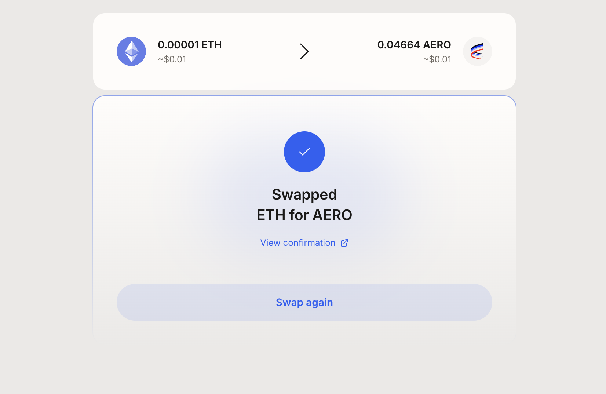
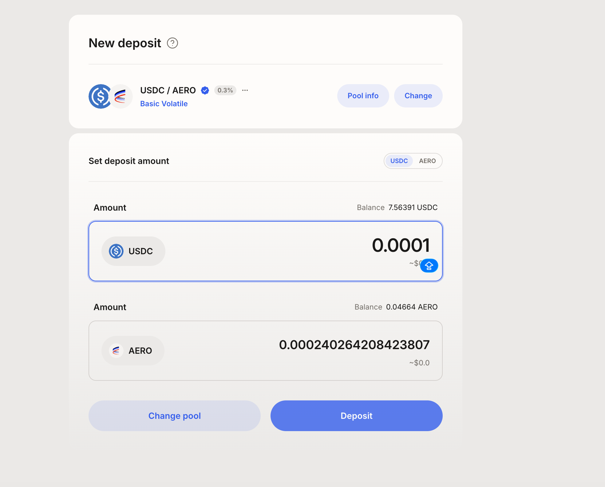

# Aerodrome —— Base 链 DEX（V2 恒定函数 AMM）

> ⚠️ **范围声明**：本协议属于 **DEX 调研**（`04-DEX调研/`），与 `02-协议调研/` 下的 RWA 协议分开存放。
> **状态**：🟡 首笔 V2 swap 已实测并链上验证（多跳路由 ETH→wBLT→AERO）；✅ add liquidity（做市）已实测并确认 LP 凭证为 ERC-20；remove liquidity / collect fees 待补
> **实测时间**：2026-08-12
> **测试钱包**：`0x9da44afe5ba28aa42301c626155ea66eb544c33c`（与 Morpho/Renzo ETH 测试同一钱包）
> **链上验证方式**：Base 链 Basescan + Base RPC（`eth_getTransactionReceipt`）
> **解析类型**：AMM 交易解析（V2 恒定函数，见 §6.3 六维度自评）

## 0. 一句话结论

Aerodrome 是 Base 链上的主流 DEX，V2 版本为恒定函数 AMM（含 stable / volatile 池型）。**首笔实测是多跳 swap（0.00001 ETH → 经 3 个 V2 池 → 0.0466 AERO），链上发现 Aerodrome Router（`0xcAF22ce3...`）会发 `UniversalRouterSwap` 聚合事件，而每个 V2 池发 `Swap(sender, to, amount0In, amount1In, amount0Out, amount1Out)`——解析侧必须按池级 Swap 事件逐跳追踪，不能只认 Router 的聚合事件。** 本报告承载链上实测结论与解析规格。

## 1. 基础信息（实测口径）

| 字段 | 值 |
|------|-----|
| 协议 | Aerodrome（app.aerodrome.finance） |
| 链 | **Base** |
| 版本 | **V2**（恒定函数 AMM，与 V3 集中流动性分开，见 [Aerodrome-V3.md](Aerodrome-V3.md)） |
| 池型 | 待补（stable / volatile） |
| 治理代币 | $AERO |
| TVL | 待补（YYYY-MM-DD UI 快照） |
| 24h Volume | 待补 |
| 产品网页 | https://aerodrome.finance |
| **操作入口** | **Swap**：https://aerodrome.finance/swap ｜ **Liquidity（做市）**：https://aerodrome.finance/liquidity ｜ **Pools 浏览**：https://aerodrome.finance/liquidity ｜ **Dashboard**：https://aerodrome.finance/dash |
| 文档 | https://aerodrome.finance/docs |
| 接入情况 | 待定 |

## 2. 协议背景

**上线时间**：2023-08-28，Base 链原生 DEX，无 VC 融资、无代币销售，以 fair launch 形式启动。

**谱系**：继承 Fantom 上 Solidly fork 谱系，采用 **ve(3,3) 模型**——同属 Velodrome Finance 生态。2026 年 Aerodrome 将与 Velodrome（Optimism Superchain DEX）合并为 **Aero**，运行在 MetaDEX03 上，成为以太坊统一流动性层。

**审计**：Spearbit + ChainSecurity 双重审计，运行在不可变智能合约上，无中心化服务器依赖。

**规模**（2026-04 快照）：累计交易量超 $185B，累计手续费超 $270M，已向 token operator 分发约 $450M+ 收入。2025 年 10,000 veAERO 按平均效率投票全年约赚 $2,470 奖励。

**GitHub**：`aerodrome-finance`（合约源码公开）｜ **Twitter**：`aerodromefi`

## 3. 底层资产

DEX 协议底层**不是生息资产**，而是流动性池（LP）里的 token 对。与 RWA 协议（底层是债券/质押收益）根本不同。

**池型**（Aerodrome V2）：
- **stable 池**：同类资产（如 USDC/USDT、WETH/sETH），用稳定曲线（类似 Curve），低滑点、低 fee
- **volatile 池**：不同类资产（如 WETH/USDC、AERO/WETH），用恒定乘积曲线（x*y=k，类似 Uni V2），更高 fee 补偿 IL 风险

⚠️ 池型差异影响解析：stable 和 volatile 的曲线公式不同，**swap 事件的 amountIn/amountOut 计算逻辑不能共用一套**。池型判定字段待实测确认（可能在 PoolFactory 事件或合约 ABI 里）。

**V3 差异**：V3 引入集中流动性（参考 Uniswap V3），LP 可选价格区间做市，资金效率更高但 IL 风险也更大。V3 的 tick/区间概念在 V2 里不存在。

## 4. 收益来源

| 收益腿 | 来源 |
|--------|------|
| ⬜ LP 交易手续费 | 待补（fee tier 与池型关系） |
| ⬜ $AERO 流动性激励 | 待补（gauge 机制、veAERO 投票导向） |

⚠️ DEX 协议的"收益"与 RWA 协议不同——这里是 LP 侧的手续费分成 + 代币激励，不是底层资产生息。**解析口径要和 RWA 协议区分开**。

## 5. 链上机制与凭证代币

⬜ **未做**。待补内容：
- **5.1 合约清单**：Router / PoolFactory / Gauge 等关键合约地址
- **5.2 池型机制**：stable vs volatile 的曲线差异、token 排序规则
- **5.3 LP 凭证**：LP token（ERC-20）还是 uniV3-style NFT？仓位如何表达
- **5.4 swap 路由**：单跳 / 多跳 / 跨池路由的链上事件结构

## 6. 数据接入要点

### 6.1 ✅ 实测交易全集

Linnea 在 Basescan / Aerodrome UI 做 swap / add liquidity / remove liquidity 操作后，把每笔的 tx hash + 时间 + 操作 + 链上结果填入下表：

| # | 时间 | 操作（UI 视角） | 交易类型 | tx hash | 链上结果 |
|:---:|------|---------------|---------|---------|---------|
| 1 | 2026-08-12 07:39:17 UTC | Swap 0.00001 ETH → AERO（多跳） | 🔴 **V2 多跳 swap（3 跳：ETH→WETH→wBLT→AERO）** | `0x12457f9bf19697daf7888e5b8f8ca64d5e2486792549540cab5af6cbd40c8e75` | Router `0xcAF22ce3...` 收 0.00001 ETH → 包裹 WETH → 经 3 个 V2 池逐跳兑换： ① 池 `0x1975dbe5...`：WETH→wBLT ② 池 `0x61907c8c...`：wBLT 中转 ③ 池 `0xa601c462...`：→ AERO 用户最终收到 **0.046644740996467356 AERO**（`0x940181a9...`） 每个池发 `Swap(sender=router, to=下一跳, amount0In/Out, amount1In/Out)`，Router 最后发 `UniversalRouterSwap` 聚合事件 gas 628,930 ｜ status SUCCESS ｜ block 49865505 |
| 2 | 2026-08-12 07:50:19 UTC | Add Liquidity（做市） | 🔴 **add liquidity（LP 凭证 mint，ERC-20）** | `0x81f502b3061dcc7f661cf68817db7b786ee65532957bb7fe613524d1bd167ad5` | Router `0xcf77a3ba...`（**与 swap Router 不同**） value = 0（无 ETH 原生币，用 ERC-20） 3 个 token 合约交互： ① AERO (`0x940181a9...`) 转出 240264208423807（~0.00024 AERO） ② WETH (`0x833589fc...`) 转出 100（wei） ③ 池合约 `0x6cdcb1c4...` 铸给用户 **2811695 LP token**（from `0x0` = mint） 🔴 **LP 凭证是 ERC-20（mint from 0x0），不是 NFT** —— 与 V3 的 NFT 凭证根本不同 gas 230,816 ｜ status SUCCESS ｜ block 49865836 ｜ 6 条 log |

### 6.2 🔴 给解析同学的规格

DEX 解析的关键坑（首笔实测已确认 + 预判待补）：

| # | 规格 | 说明 |
|:---:|------|------|
| **1** | 🔴 **sender 是 Router，不是用户** | 实测 tx 里所有 V2 池的 `Swap` 事件 `sender` 都是 `0xcAF22ce3...`（Router），用户 `0x9DA44Afe...` 只在最终 token Transfer 的 recipient 里出现。**按 sender 归属会全错**，必须读每个 Swap 事件的 `to` 字段逐跳追踪 |
| **2** | 🔴 **多跳路由要逐跳解析** | 一笔交易经过 3 个 V2 池（`0x1975dbe5...` → `0x61907c8c...` → `0xa601c462...`），中间 token（wBLT）在 Router 手里短暂持有。**只看最终到账 token 会漏掉中间跳**，影响金额归因和路由还原 |
| **3** | **Router 有聚合事件，别和池级 Swap 混** | Router 最后发 `UniversalRouterSwap(sender, recipient)`，这是聚合层事件，不含金额。**金额在池级 Swap 事件里**，不要用聚合事件算金额 |
| **4** | ✅ **LP 仓位是 ERC-20 不是 NFT** | 已实测 add liquidity：LP token 由池合约 `mint from 0x0` 铸造（ERC-20 标准），**不是 NFT**。与 V3 的 NFT 凭证根本不同。V2 LP 仓位按 `balanceOf(user)` 读取，V3 要按 tokenId 枚举 NFT |
| **5** | ⬜ **跨池路由的中间 token 追踪**（待实测） | 多跳已见雏形（WETH→wBLT→AERO），路径编码（amountIn/Out 传递）待系统化 |
| **6** | ⬜ **$AERO 激励发放的归属**（待实测） | gauge claim 事件与 LP 仓位关联，待补 |
| **7** | 🔴 **swap Router 和 liquidity Router 不是同一个** | 实测确认：swap 用 `0xcAF22ce3...`（selector `0x3593564c`），add liquidity 用 `0xcf77a3ba...`（selector `0x5a47ddc3`）。**解析侧要按 selector / Router 地址区分操作类型** |

### 6.3 六维度自评

| 维度 | 可行性 | 取数方式 | 备注 |
|------|:---:|---------|------|
| 实时解析 | ⬜ | 待测 | swap 余额 / LP 仓位实时读取 |
| 交易历史解析 | ⬜ | 待测 | swap / add / remove / claim 四类事件 |
| 池子自发现 | ⬜ | 待测 | PoolFactory 事件枚举 / gauge 注册表 |
| 成交量 / TVL | ⬜ | 待测 | DEX 核心指标，与 RWA 的 APY 不同维度 |
| 费率历史 | ⬜ | 待测 | swap event 里的 amountIn/amountOut 反推 |
| PNL | ⬜ | 待测 | LP 侧：手续费收益 − IL（无常损失） |

### 6.4 需向项目方 / 文档索取

1. Router 合约的 swap 事件 ABI（含路由中间步骤的字段）
2. PoolFactory 事件结构（如何枚举所有 pool）
3. Gauge 合约的激励发放机制与 claim 事件
4. stable / volatile 池型的判定字段

## 7. 风险

DEX 协议的核心风险（与 RWA 协议的风险维度完全不同）：

| 风险类型 | 说明 |
|---------|------|
| 🔴 **无常损失（Impermanent Loss, IL）** | LP 提供流动性后，若 token 对价格发生偏离，LP 的持仓价值会低于"不动"的情况。volatile 池 IL 风险远高于 stable 池。**V3 集中流动性会放大 IL**（资金集中在窄区间，价格偏离时损失更大） |
| 🔴 **$AERO 代币通胀** | 年化通胀约 10.9%（2026-04 快照），每周铸币分发给 LP。**LP 的 AERO 奖励是通胀币**，实际收益要扣掉 AERO 本身的贬值 |
| ⚠️ **路由合约升级** | Aerodrome 的 Router 合约可能升级（如从 V2 Router 到 V3 Router），解析侧要跟踪 Router 地址变更 |
| ⚠️ **veAERO 治理风险** | veAERO 锁仓后无法提前取出（类似 veCRV），锁仓期间 AERO 价格下跌会造成实际损失 |
| ⚠️ **智能合约风险** | 虽经 Spearbit + ChainSecurity 审计，但 DEX 合约是高价值攻击目标（历史上发生过类似协议被黑） |

**实测中观察到的具体风险**：暂无（仅 2 笔实测，未观察到异常）。后续 remove liquidity 实测时重点关注——remove 时收回的 token 数量是否与 add 时投入一致（IL 的直接体现）。

## 8. 合规与准入

DEX 协议通常无 KYC、非托管：

| 维度 | 说明 |
|------|------|
| KYC | ❌ 无 KYC 环节，任何人可直接通过合约交互 |
| 托管 | 非托管，资金在用户钱包和合约之间流转 |
| 地域限制 | 前端可能有地域拦截（需实测确认），但合约层无限制 |
| 合规姿态 | Aerodrome 强调"zero-leak economy"和去中心化，未做合规护栏 |
| 访问入口 | Swap: https://aerodrome.finance/swap ｜ Liquidity: https://aerodrome.finance/liquidity ｜ Dashboard: https://aerodrome.finance/dash |

⚠️ 前端拦截未实测——如果你在某些地区访问前端被拦，说明有地域限制。合约层（直接调 Router）应该不受限。

## 9. 待确认清单

| # | 问题 | 问谁 / 怎么查 |
|---|------|------------|
| 1 | ✅ **swap 交易里如何区分用户 vs router 的 sender** —— 已实测：sender 是 Router，用户在 `to` / recipient 字段 | Basescan 解码 swap 事件 |
| 2 | 🔴 **多跳路由的中间 token 如何在事件里逐跳追踪** —— 已见 3 跳雏形（WETH→wBLT→AERO），路径编码待系统化 | 实测更多多跳 swap 后归纳 |
| 3 | 🔴 **Router 的 `UniversalRouterSwap` 聚合事件 vs 池级 `Swap` 事件的口径区分** —— 聚合事件不含金额，金额在池级事件 | 已实测确认，待写入解析规格文档 |
| 4 | ✅ **LP 仓位是 ERC-20 还是 NFT** —— 已实测：是 ERC-20（mint from 0x0），不是 NFT | 实测 add liquidity tx `0x81f502b3...`，池合约 `0x6cdcb1c4...` mint 2811695 LP token 给用户 |
| 5 | 🔴 **多跳路由的中间 token 如何在事件里逐跳追踪** —— 已见 3 跳雏形（WETH→wBLT→AERO），路径编码待系统化 | 实测更多多跳 swap 后归纳 |
| 6 | V2 和 V3 是否共用同一个 Router | 读合约 / 文档（已实测 V2 Router `0xcAF22ce3...`，V3 待测） |
| 7 | 协议背景 / 风险 / 合规四章 | 未做，需补 |

## 10. 参考链接

- 产品页：https://aerodrome.finance
- 文档：待补
- Basescan：待补（合约地址实测后填）

## 11. 实测截图

⬜ **未落盘**。Linnea 实测后按 `references/screenshot-naming.md` 规范命名（`Aerodrome-<操作>-<YYYYMMDD>.png`），存入 `04-DEX调研/截图/`。

| 文件 | 内容 | 状态 |
|------|------|------|
|  | **Basescan tx 详情页**：tx `0x12457f9b...c8e75` ｜ From `0x9DA44Afe...c33c` → To（Router）`0xcAF22ce3...ad7c67` ｜ Value **0.00001 ETH** ｜ gas 628,930 ｜ status **Success** ｜ block 49865505 ｜ 18 条 log（3 个 V2 池级 Swap + 多个 Transfer + Router 的 UniversalRouterSwap 聚合事件） | ✅ 已落盘 |
|  | **Basescan tx 详情页**：tx `0x81f502b3...67ad5` ｜ From `0x9DA44Afe...c33c` → To（Liquidity Router）`0xcf77a3ba...4e43` ｜ Value **0**（无 ETH，用 ERC-20）｜ gas 230,816 ｜ status **Success** ｜ block 49865836 ｜ 6 条 log（AERO + WETH 转出 + LP token mint from 0x0）｜ 🔴 **LP 凭证为 ERC-20，不是 NFT** | ✅ 已落盘 |
